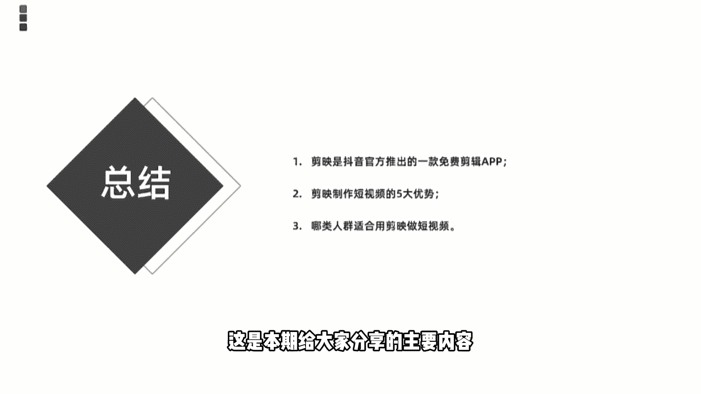

# 2024年做自媒体怎么快速起号？b站高口碑全自媒体运营课程，从0开始，转行做抖音自媒体从入门到精通，学习抖音短视频新媒体运营教程！ - P23：1快速认识剪映 - bi道德未央 - BV176sKeTE9R

那么从今天开始呢，我们就进入正式的零基础，快速学会刷爆朋友圈的抖音，爆款视频课程当中的正式讲解内容，我们今天要给大家讲的是第一小节，快速的认识剪映app，那么在正式讲解课程之前啊。

老师呢首先给大家提醒一下，我们接下来给大家讲的是，围绕剪映APP的剪辑未来讲解的，所以大家在学习课程之前呢，首先是打开自己的手机，进入我们手机的应用商店，然后下载下来剪映app，如果你是苹果的。

那你下载苹果版的，如果是安卓的话，需要下载安卓版本的剪映app好了，那么进入今天的正式课程讲解，我们今天要给大家讲的是，快速的了解剪映这款神器，那讲解知识，我们首先来了解一下我们的课程内容。

那本节课的学习目标呢一共是分为三个小点，首先是了解简易的前世今生，第二个的话是了解剪映制作视频的优势有哪些，第三个是了解适合用剪映做视频的人群特点，再来看一下我们的目录，目录呢也是分为三个部分。

第一个介绍的剪映是什么，第二剪映做短视频的优势有哪些，第三哪些人适合用剪映来做短视频好，我们首先来看第一个小点剪映是什么。

剪映是由抖音官方推出来，一款手机视频编辑工具，可用用我们手机短视频的一个剪辑制作和发布，它拥有一个非常全面和非常简洁的剪辑操作，功能啊，支持变速啊，滤镜呀，还有转场啊等等多种剪辑效果。

并且带有抖音官方的丰富的音乐素材资源，说起这个剪映啊，就不得不提制作和推出剪映神器这款公司，那这个制作和推出剪映app这个公司呢，它叫深圳联盟科技有限公司，联盟科技有限公司啊，如果说之前对视频剪辑。

尤其是手机视频剪辑这块比较感兴趣的小伙伴，应该了解联盟科技呢它是被字节跳动，也就是我们所谓的抖音公司呢是给收购过来的，那收购了之后呢，有联盟科技它本身也是个做贴纸这样一款公司，那么他在被抖音收购之后呢。

为了迎合抖音短视频的更好发展，或者说为了迎合头条系在抖音布局，短视频赛道上的更好发展，那推出了剪映app这款神器，它是在去年3月份的时候上线的，我们知道快手的话，快手在早期起步的时候呢。

也是以主打视频剪辑工具为主的，然后随着快手短视频的发展，那他可能剪辑操作这块，变得更加的娴熟和技术的更加丰富，随后呢快手也单独推出了自己的一个剪辑工具，叫什么叫快影，那抖音也是为了应对快手的发展。

或者说在短视频在市场里深耕领域，或者说更好地推动抖音的一个发展，辅助于它的一个后期的发展的话，他推出了剪映这款神器，啊这是剪映它的一个出发点，或者说剪映它由此得来的一个原因，OK那么我们了解了这个。

对于我们今后开始做剪映视频，或者说抖音视频的时候，那就为什么明白在抖音上，有很多所谓的爆款视频是由什么剪映发布的啊，因为他是获得了抖音官方的流量扶持和推荐的，这对我们想要进入抖音这个赛道上进行深耕。

发展的话是有非常大帮助的，OK那这一块的话是简单了解一下剪映app，如果各位小伙伴手机上还没有下载剪映的话，那么建议大家课程结束之后呢，赶紧去手机上下载自己的剪映app。

那么我们接下来讲解的剪映视频教程呢，都是围绕它来展开的。

好那么我们来小结一下剪映是什么，剪映是由抖音官方推出的，一款超级好用的免费的剪辑app，那这里也要强调一个点，就是我们过去在手机上可能下载了很多，比如说快剪辑呀，爱剪辑呀，video leap啊。

巧影啊等等，这是各位早期都能接触到的，比较熟悉的手机视频剪辑的app，但是这些视频剪辑工具有一个通用的特点，就是一般都是收费的，要求我们开通会员，那么剪映呢，它是一个完全免费的这样一个视频剪辑神器啊。

这一点是非常nice的，因为他不是以剪辑工具来给他赚钱的，而是靠什么剪映来推动抖音发展的，这样一个辅助类的工具，那所以它是有完全免费的，而且它非常好用，比我们前面讲到的爱剪辑快剪辑。

或者说video lip，它的一个操作的界面，或它的功能都是非常简洁上手的，对新手小白来说太友好了，我们拍摄完之后，或者我们剪辑完之后，直接可以一键上传，分享到我们的抖音平台。

OK那是这课会给大家分享的剪映是什么，那接下来的话要跟大家讲的是第二个小点，剪映做短视频的优势有哪些。

我们为什么要给大家讲剪映，在这一块的话，我们总结了一共是五点，关于简易做短视频的优势，简单来跟大家分享一下，第一个呢是简单好用，检验它是一个对零基础或小白来说，非常nice的这样一个神器。

就它的操作界面或它的操作功能非常简单，我们一学就会不用有很复杂的一个剪辑逻辑，在里面，非常简单，第二个的话是它是一个完全免费的剪辑神器，不需要我们开通会员啊，或者说我们花钱买什么样的一个素材呀等等。

完全是免费的，你像早期的时候video leap呀，巧影啊，还有爱剪辑呀，包括自说啊之类的，这些剪辑app，他们啊都是打着所谓的免费剪辑神器，这样一个噱头呢，吸引用户去下载。

但是呢我们想要制作出一些比较好的视频，或者是使用一些特效的时候呢，都会需要要让我们付费，所以这一块的话检验是非常不错的，完全免费，第三个呢是功能强大剪映，虽然它现在啊还只有2。7的版本。

但是呢他还在陆续的更新当中，简易目前拥有的功能是非常强大的，几乎可以说满足于我们在抖音上，做小视频的各类需求，好像文本呀，音频呀，贴纸呀，特效啊，包括最近刚刚上映的色图，包括最近刚刚上线上映的。

色度抠图啊，把我们一些绿幕素材呢放入到其中啊，通过画中画特特效功能，可以实现我们一个色度抠图，把我们绿幕素材植入其中啊，实现我们合成的那种所谓的特效视频啊，这是它的功能非常强大，第三个的话是海量素材。

第四个的话是海量素材，抖音上提供了大量的音视频素材库，那么我们在剪映当中剪辑视频的时候，可以直接拿过来这些视频的素材，或者说拿过来这些热门的BGM，然后呢剪辑到我们的视频当中，做出同款的热门视频啊。

除此之外呢，剪映本身也自带了大量抖音当中，经常用到的一些竖屏素材，那我们在剪辑的时候可以完全拿过来，非常的方便快捷，不用我们自己去寻找，对于小白或新手来说是非常好用的，一个这样的特点，那最后一个的话。

不得不强调和再次重新声明一下，就是官方推荐啊，抖音和剪映他是一个什么都是一个兄弟，他都属于字节跳动这个公司，那么我们通过剪映剪辑的视频，在发布到抖音的过程当中呢。

抖音默认情况下是给到流量推荐和流量扶持的，这是为什么我们在抖音上看到很多视频的下方，它带有小的字幕，标明剪映分享或者是剪映制作，他就是告诉我们是通过这个视频呢，是通过剪映制作完之后之后呢。

一键分享到抖音上的，那么我们想要在抖音这个频道，平台深耕发展的话，那么剪映就是一个非常好的推荐渠道和流量啊，因为官方是自动会给到我们流量的，OK那这一块的话是给大家总结的，关于剪映做短视频的五项优势。

好我们也拉一块来小结一下，使用剪映来制作短视频的五大优势，第一个简单好用，第二个呢完全免费，第三个功能非常强大，第四个呢海量素材，最后一个官方推荐，刚才呢给大家分享的是第二点，简易做短视频的优势有哪些。

那接下来的话给大家分享的是，我们最后一个小点，哪些人适合用剪映呢做短视频，我们归纳了三个小点，第一个呢是喜欢拍摄目节，要学剪映，或者说喜欢，剪辑视频，那这个第一个是其次，OK刚才呢跟大家讲的是第二小点。

剪映做短视频的优势有哪些，那接下来的话讲的是我们第三个小点，哪些人群呢适合用剪映做短视频，剪映，虽然说是一个入门级的这样一个视频剪辑神器，对于各位新手或者说小白来说，非常的nice，但是。

它并不适用于所有人，那我们只是提出来他对哪些人特别的友好，或者说特别适合哪些人用剪映来做短视频，我们归纳了三类，第一类呢是喜欢拍摄类的，各位网友或各位用户，那我们知道现在是一个什么移动互联网时代。

我们很多操作时特别是喜欢用手机来完成的，能不用电脑的就不用电脑，对于拍摄同样是我们知道，虽然拍摄神器或者是剪辑神器，传统的PRAE啊，或者说国产类的灰尘会影啊，哎爱心外星神箭手啊。

但是如果说我们外出的时候拿电脑来剪辑，是非常不方便的，严重影响我们的一个工作效率，而且用pr或AE剪辑的话，是对各位要求比较高的，那么我们知道他不光对电脑的硬件配置，还是对你的剪辑技术要求都是非常高的。

是一个专业的剪辑软件，但是呢我们通过剪映的话，可以非常快速的制作出这样一款视频啊，所以第一个是什么喜欢拍摄视频的这类用户，第二个的话是愿意分享，因为我们知道抖音也好，快手也好，这类短视频平台。

更多的是提倡各类用户呢，在平台上分享我们的日常生活，分享我们的日常点滴，分享我们的感悟，亲情，友情爱情等等，所以第二个要愿意分享，你有更多的故事愿意分享的时候呢，我们才愿意什么把我们的视频呀。

把我们的内容呢记录下来，然后呢在平台上发布，第三个的话是非常适合于短视频新手，对于那些想在短视频领域深耕，或者说想做短视频自媒体小白来说的话，剪映是一个非常nice的这样一个剪辑神器。

它不需要很多的一个什么剪辑技术，或者说它的一个操作度是非常简单的，对小白或新手来说，可以快速的上手，简单实用，OK我们同样来小结一下，哪些人适合做剪映短视频的三类人，第一个喜欢拍摄的人群。

第二个呢愿意分享的人群，第三个短视频的新手，好这是我们本节课程跟大家分享的内容，一共是总结下三个小点，第一个剪映是抖音官方推出来的一款，免费剪辑神器，第二剪映制作短视频的五大优势。

刚才也给大家分享了最后一个三类人群，适合用剪映做短视频，OK好好学好好看，这是本期给大家分享的主要内容。

