# 2024年做自媒体怎么快速起号？b站高口碑全自媒体运营课程，从0开始，转行做抖音自媒体从入门到精通，学习抖音短视频新媒体运营教程！ - P24：2剪映APP界面结构拆解 - bi道德未央 - BV176sKeTE9R

那今天呢要给大家分享的就是，剪映app的一个界面结构，我们要正式讲解剪映的时候呢，首先是给大家简单的介绍一下，解密的一个界面结构，有哪些功能和模块，每个功能和模块的具体含义是什么。

或者说具体的内容又包括哪些，好首先来看一下本节课的一个学习目标，了解剪映app的界面结构以及各个功能的，首先来了解一下剪映的app界面结构，以及各个模块的功能内容有哪些，好目录的话。

也是围绕剪映app的界面结构给大家展开来，进行拆分介绍，好接下来进入我们的课程，正式讲解，剪映app界面结构拆解，剪映app的界面啊其实非常的简洁，我们在上节课就给大家简单介绍他的界面，操作非常的简单。

主要包括哪四项模块，分别是呢，剪辑剪同款消息和我的那熟悉，这四个模块或功能是我们开启剪辑app，记录的正确打开是方式，是我们开启剪辑之路的正确打开方式啊。

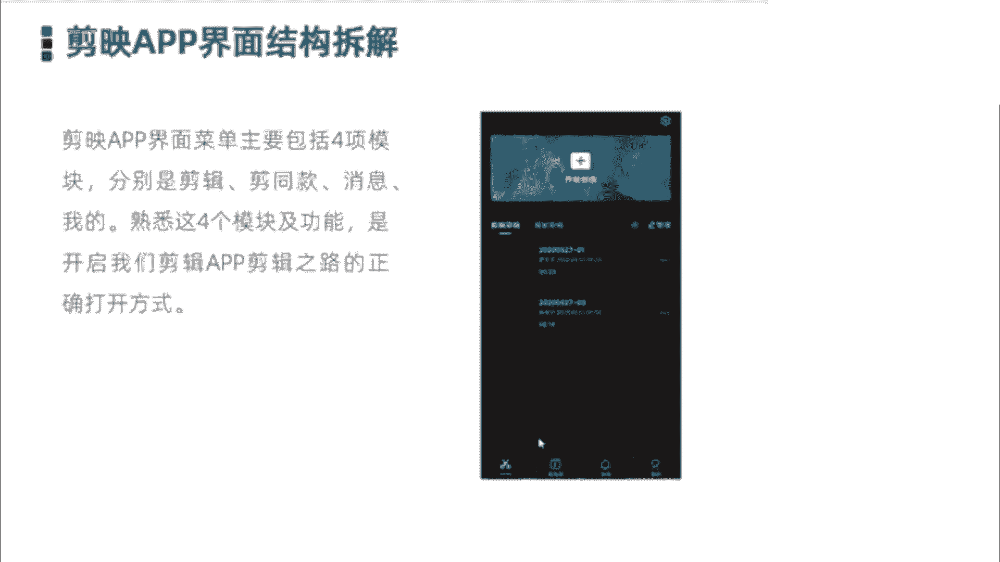

那接下来先简单的带领大家介绍一下，每个模块的功能和内容，那介绍完之后呢，我们再进入实际的一个剪映软件操作界面，给大家介绍好，首先我们看到的是第一部分剪辑，启动剪映app之后呢。

我们进入的首页就是剪辑页面，我们如果想要剪辑视频的话，需要点击顶部这一块开始创作，开始创建我们的短视频制作项目，然后把我们素材导入其中就开始剪辑了，这是我们第一部分啊，就是这个小剪刀这一块。

然后在首页的界面当中，也可以看到我们之前剪辑过的一些项目，包括我们的草稿箱等等，第二个叫减同款，剪同款的话是什么呢，剪映app啊，它自带了大量的短视频模板，对于新手或小白来说。

我们在抖音上看到很多爆款的视频，特别羡慕，也想做这样一款爆款的视频，但是呢又碍于自己的技术不会剪或不会做，那这种情况下，剪映推出了简同款，我们可以直接拿同款视频的一个模板过来。

把我们相关的视频素材填入到其中当中，就可以快速的一键制作相关的，或者是同款的这样爆款视频啊，大大方便了小白新手快速的制作出爆款视频，但这个剪同款的话，我们具体在实际的检验过程中，他是划分为很多类别的。

比如说卡点视频呀啊毕业季呀，比如说最近刚刚过去的六一儿童节等等，它是划分很多类别的，我们只需要相关选中一些类别模板之后呢，把一些素材按照要求填入到其中，设置好食品的视频的时长和片段就可以了。

第三个是消息剪映app啊，和抖音是直接打通的，可以直接授权登录我们的抖音账号，当我们的抖音账号内出现一些，比如官方发布的消息呀，有人给你点赞了呀，或者是有人给你留言的时候呢。

我们在自己的剪映app当中呢，同样也是可以看到消息的，这是第三个部分剪映的消息部分，最后一个呢是我的，也是我们个人信息页，刚才说了，剪映app目前是和抖音打通的，也就是我们账号是互通的。

我们一旦授权成功，自己的抖音账号登录检验之后的话，那么我们在我的这一块的话，是可以看到我们信息页的相关内容的，就是你的个人账号信息呀，比如说头像啊，名称呀，抖音号啊，粉丝量啊，点赞量啊等等啊。

是在这块可以看到的，而且可以直接跳转到我们什么抖音账号主页，这块的话是第四部分啊，我的OK，然后呢关于剪映app界面的四个部分，就基本上给大家介绍完了，然后呢我们接下来进入实操的一个环节。

进入剪映这个软件界面。

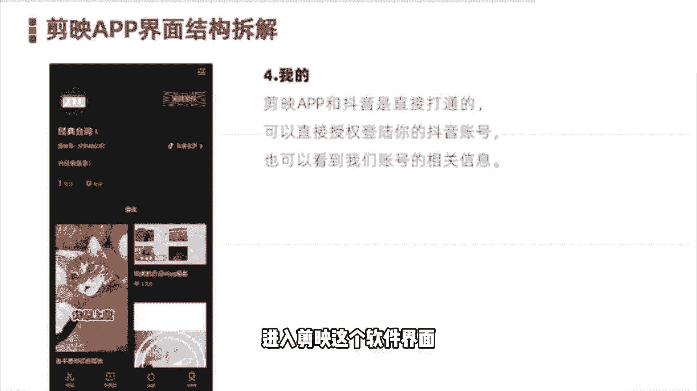

实际看一下它到底长什么样子，好我们首先呢是点击启动剪映，启动好之后呢，我们首先进入的这个界面的是简同款啊，可以看到在这块的话，剪映官方推出了大量的同款模板视频，比如说推荐类的，我们看到的是什么热门的。

那还有什么卡点的视频，以及什么跟拍呀，跟唱呀，创意玩法呀，旅行大片VLOG等等啊，这上面有很多，比如我们选一个VLOG看一下，独自旅行创意海报啊，我们来预览一下这个。

Hold on the ground by the futura fa fils，I was almost str lying in the sun to ride。

I tried dying in the sun by the su，we打的come to啊，我们可以看到这个视频呢，是一个旅行VLOG的这样一个模板，如果说我们小伙伴也喜欢拍这一样的，一个视频的话。

怎么办呢，可以直接按照它的提示要求导入相关素材啊，或者说我们直接点击右下角有一个简同款，然后比如说导入什么，导入八个片段啊，就可以制作这个视频了，然后我们点击剪同款，然后我们找四个素材。

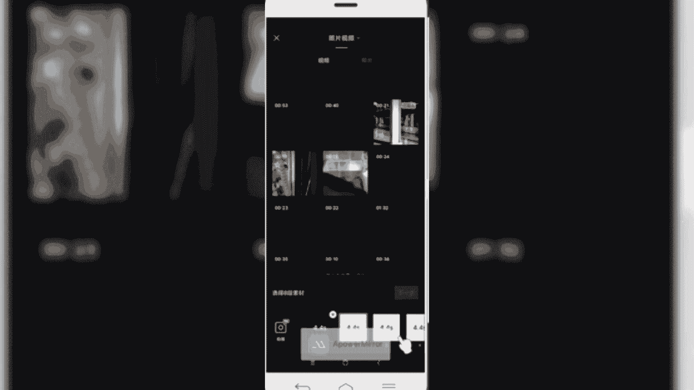

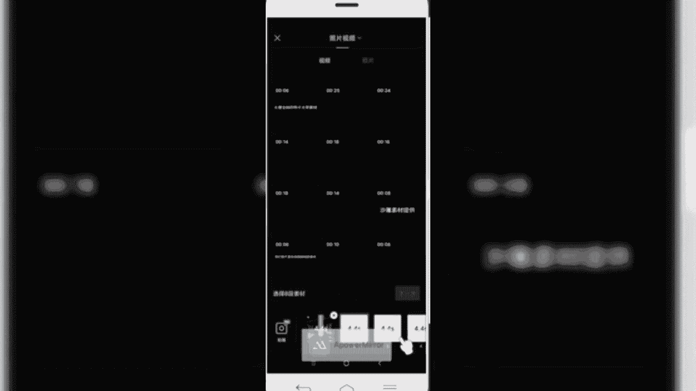

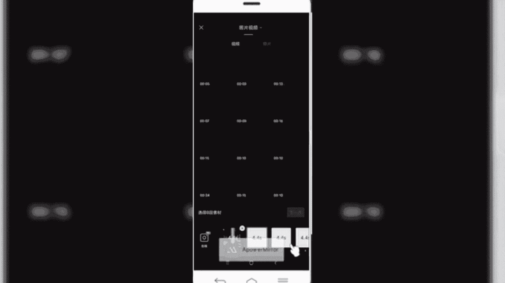

好导入，点击下一步。

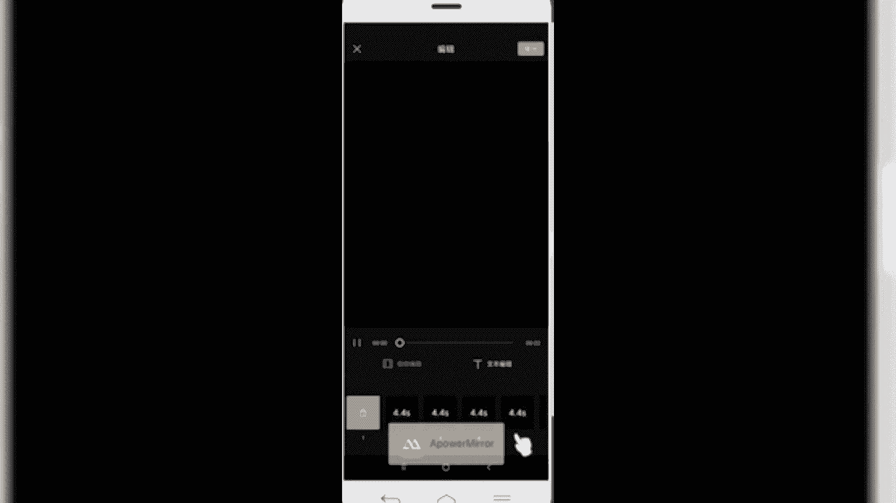

导入完之后呢，我们就可以直接预览啊，Turn about the filter was almost tried，Like in the sun to have a try my。

OK如果说我们导入到视频当中呢，我可以给视频呢进行一个简单的编辑，怎么编辑呢啊我们可以给它进行一个单独拍摄，或者说我们替换素材，甚至给这个视频素材呢片段进行一个裁切，第二个的话是什么呢，可以文本编辑啊。

我们看到这个视频模板当中啊，有不少的这样的文字，那这些文字呢我们同样也是可以编辑的啊，比如我们点击，然后呢可以对这两个字进行编辑，OK那么我们通过这样的话制作，就可以快速的制作出这样一款同款视频啊。

如果说我们制作的没有问题，预览一下，Turn around the fields，I was almost dry lin，The sunlight，如果预览没有问题的话，点击右上角的导出。

那么我们就完成成品了，导出的时候呢需要我们设置一下视频的分辨率，那目前来说啊，抖音官方，一般我们推荐的视频呢是1080P的好，然后呢我们直接导出，那视频片段呢比较稍微长一些。

所以我们需要稍稍微耐心的等待一下，它正在渲染导出，在导数的时候呢，注意请不要锁屏或者什么切换程序，我们只要稍微耐心等一下就可以，已经快结束了。

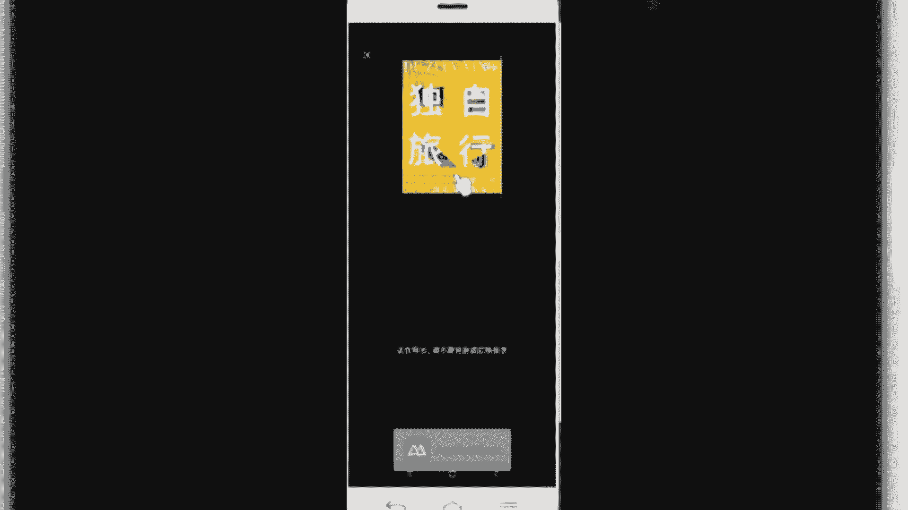

好完成，那么我们就可以通过什么简同款这种模式呢，快速的创作出这样一个同款的类似视频啊，这块是给大家分享的简同款功能，然后接着再再给大家讲的是。

我们第一个剪辑功能，回到首页，我们点击部分这块叫首页啊，我们在这块呢进行剪辑，如果说我们要剪辑视频的话。

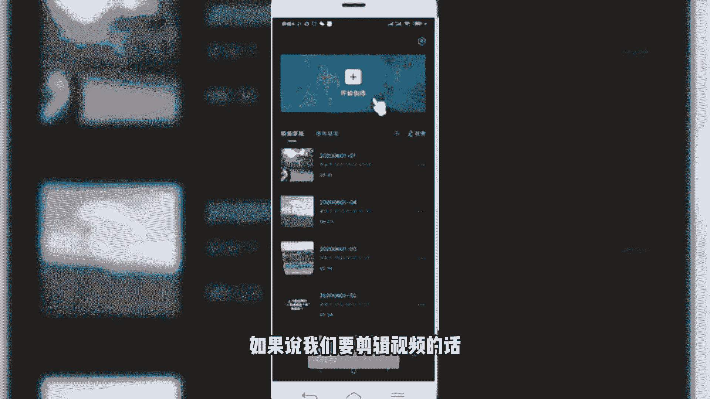

首先是点击顶部开始创作，然后呢把我们相应的素材呢导入到我们的什么，导入到我们的项目当中，然后点击添加到项目，OK那这样的话我们就首先创建出这样一个页面，然后简单给大家说一下。

在上面这部分呢是我们的视频预览窗口啊，这部分是我们的视频预览窗口，我们在这个地方呢可以预览视频，那这个部分呢，中间这个部分呢是我们的一个视频轨道，也叫我们的视频时间轴，所有的视频剪辑软件。

中间都会有这样一个视频剪辑轨道，因为我们知道视频它是按时间流线，不断的再往前推进的，其实如果我们把视频放慢拆分开之后的，可以看到他是什么，由连续的画面组成的，也就是我们静态的画变成动态的画组合起来的。

所以在这块有一个时间轴，那么我们在这个时间轴中间呢可以看到这条线，白线它是一定是站立在视频的正中间的，那这个线呢叫时间线啊。

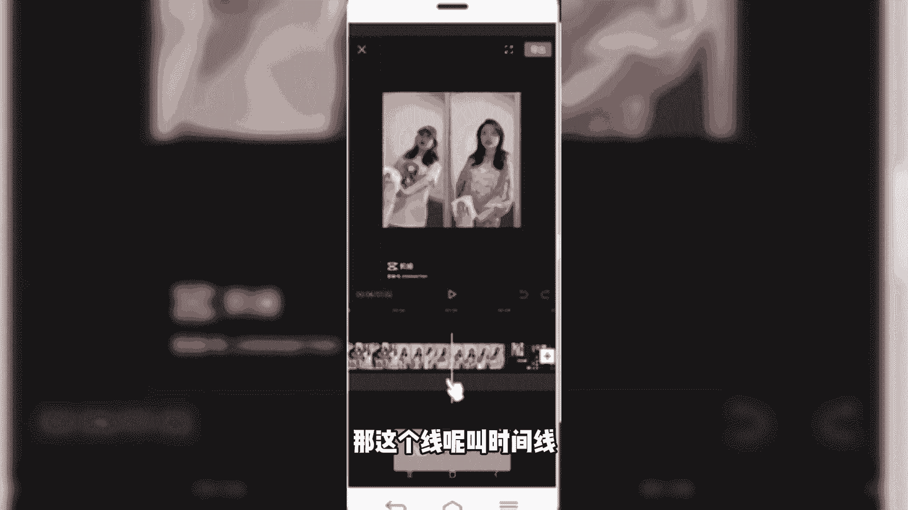

这个叫时间线，我们所有的操作的时候呢，可以把一些视频定位的点，都是以这个时间线为基准来进行一个拆分呀，或者是转场啊等等一系列，这叫时间线，然后接着再往下看的话，底部的话这一块叫什么呢。

底部的话叫我们的工具栏，我们首先看到的是一级工具栏，包括什么剪辑呀，音频呀，文字呀，还有什么画中画特效啊，滤镜比例调节等等，这都是我们一级菜单上看到的，那么我们如果想要对视频进行剪辑和操作的话。

就是围绕这些功能啊，比如选择分割呀，变速呀，动画啊，蒙版等等啊，我们就需要首先是选中这个素材，然后呢给他点击进行一个剪辑的操作。

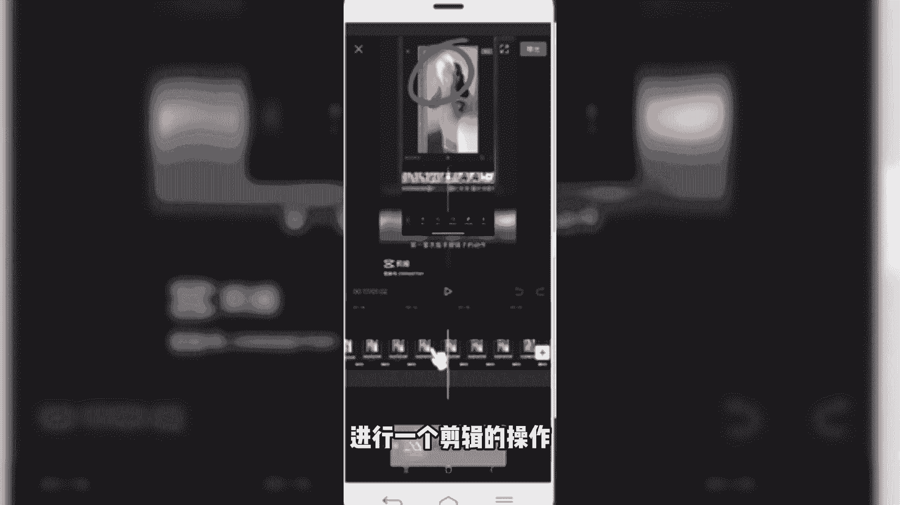

就是这块关于剪辑，然后我们返回第三个的话是消息，就是刚才给大家说的，我们在这块呢是可以看到抖音官方，或者说我们账号发布的一些评论呀，甚至账号粉丝量增长啊，点赞呀，在这块是可以直接看到的。

最后一个的话就是我的。

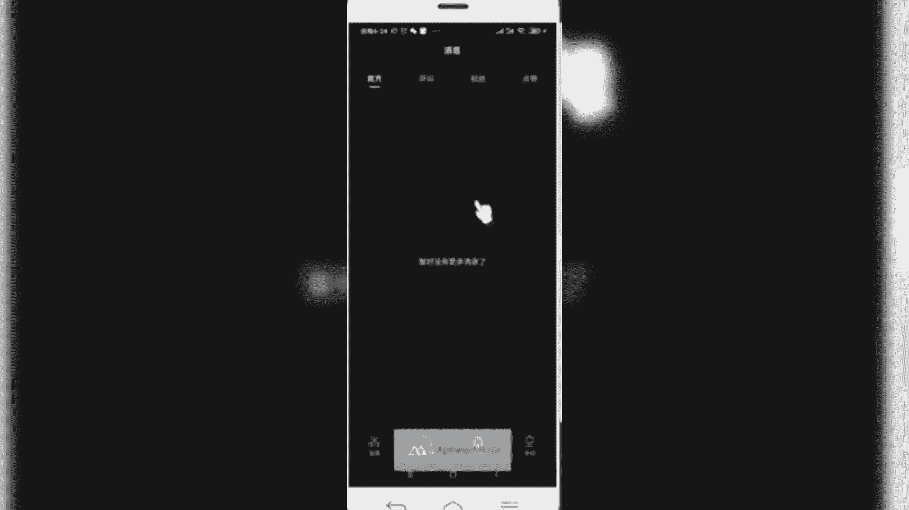

那我们在这个位置呢，可以看到我们账号的相关信息啊，你的账号名称啊，账号头像呀，还有我们的抖音主页这块也可以直接点击。

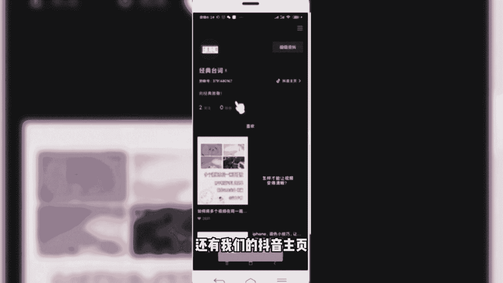

可以跳转到这个地方啊，那下面看到的这些。

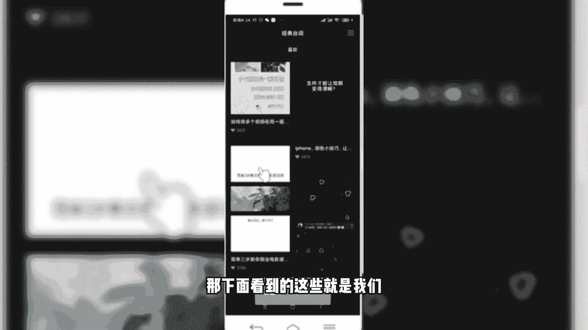

就是我们点赞收藏过的一些视频。

总体来说剪映app这是一款非常简洁方便的。

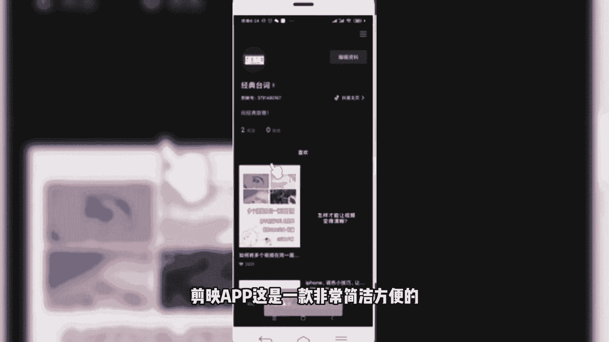

剪辑神器，对于各位新手小白，或者说对于翔all，做短视频的各位小伙伴来说的话，都是一款非常不错的剪辑神器。

那么我们一块了来总结一下，在本节课当中，我们主要是给大家讲解的是剪映app的一个界面，由剪辑剪同款消息和我的四项内容组成，对于我们创作者来说呢，主要使用的是剪辑和剪同款的功能，熟悉剪辑和剪通关。

这些功能是我们快速上手剪映app的一个前提，或者说给我们打下一个良好的基础，好了，本节课程内呢就给大家分享到这里。

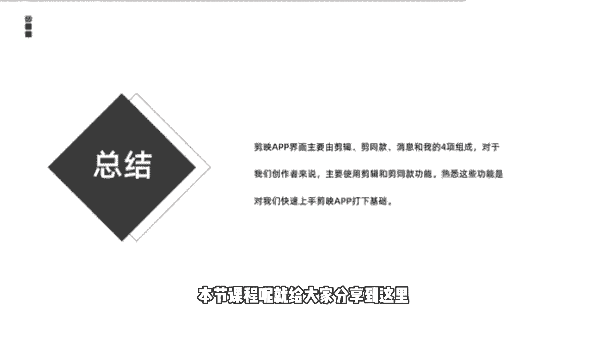