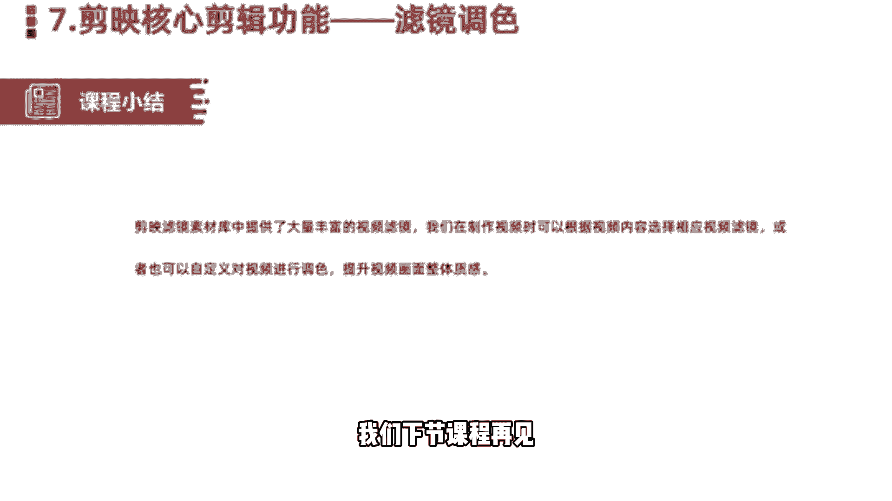

# 2024年做自媒体怎么快速起号？b站高口碑全自媒体运营课程，从0开始，转行做抖音自媒体从入门到精通，学习抖音短视频新媒体运营教程！ - P25：剪辑核心剪辑功能--滤镜调色 - bi道德未央 - BV176sKeTE9R

咱们今天呢今天给大家分享的是剪映，核心剪辑功能，滤镜调色啊，我们知道在拍摄视频过程当中啊，很多小伙伴有一个苦恼的，就是我们拍的视频啊色彩不够鲜亮，看起来呢视频看起来没有色彩或者是比较单调。

我们看到很多视频其实并不是拍摄很难，但是它的镜头感拍出来的视频的画面非常细腻，色彩呢非常鲜亮，那这些其实就是我们在剪辑过程当中呢，运用到了滤镜和调色的方法，那么今天这节课呢告诉大家。

应该如何借用剪映当中的滤镜和调色功能，对我们的视频进行一个调色，使我们的视频也变得鲜亮，富有色彩。

如何快速提升视频的一个质感，答案就是调色，过去传统的视频剪辑当中，我们比如说通过pr，在pr当中，可以通过调色的面板或者是调色的插件，给我们视频进行调色，还有我是专业的调色软件，比如达芬奇。

但是对于我们小白来说，这些东西我们都不会，那怎么办，在检验当中同样也提供了一些调色的功能啊，就是我们接下来给大家讲到的，滤镜和调色两个部分，先说滤镜，就是我们看到的已经调好的这个色块的模板。

那我们只需要套用相应的滤镜，就可以实，使我们的视频呢马上调现出这种视频风格，那调色呢就是我们单独的对视频呢进行一个，个性化的调整，比如说我想让视频啊天空变得更蓝一些，或者小草呢变得更绿一些。

那我们需要单独的对天空啊，小草啊，蓝色和绿色进行调整，OK那这块关于我们在剪映当中的一个滤镜，调色介绍就先到这块，然后接下来的话就是我们进入一个，实战的调整环节，给大家详细讲解如何使用滤镜和调色。

好同样我们首先呢是开始创作，导入一段素材，好这个呢是我们的原素材，我们简单看一下，啊我们看到原素材呢，这块看到的那些树木呢不够绿，然后呢天空呢不够蓝，那我们要调色的话需要怎么办呢，就是让天空变得更蓝。

小小树呢或者是花草呢变得更绿，那这样的话才符合我们看到的一些，比较鲜亮的色彩，OK那么我们了解了桥总需求之后呢，接下来进行一个滤镜的调整，那怎么样调整呢，首先我们可以选择剪映app自带的一些滤镜。

在右下角我们点击滤镜，可以选择它自带一些模板，比如说选择一个限量，是不是看一下是不是变的变化很大，比如原图我们再看一下啊，原图是这样的，然后我们点击限量，是不是天空比原来变得亮多了，啊这块有很多风格。

我们比如再换一个其他的啊，可以在这块测试一下，换一个其他的，这是我们看到的滤镜，它直接自带相应的效果，OK我们这块以限量为主啊，可以看到原视频和调色后的视频变化非常明显。

如果说我们觉得还有些地方调色不太满意，还需要进行调整的话，怎么办呢，我们可以使用啊个性化的调色啊，进行一个单独调整啊，比如说我们选择底部的新增调节，可以对我们视频的亮度，对比度，饱和度锐化。

高光阴影色温，色调褪色等等多个方面的进行调整，还是以这个视频为例，那我们现在要呢，首先是它的亮度已经够了，那我们需要给它稍微降一下亮度，好然后呢提升一下它的对比度，然后饱和度，那我们让色彩变得更丰富。

肯定让饱和度提升上来，饱和度加大，好锐化让视频呢更加丰富细腻，第五个高光，高光的话是我们的色彩呢看起来比较柔和一些，那这个需要我们微调，然后还有一个射温，啊色温的话也是需要给他简单调一下啊。

然后还有一个色调，好我们调整完之后呢，再来看一下前后的对比效果，这是我们第一次调整的，用鲜亮调色，这是原视频，然后我们再看一下后来调整之后的效果，是不是天空变得更蓝了啊，我们来预览一下。

我们看一下原视频效果，和我们调色后的视频效果，点击中间的播放按钮，是不是天空变得更蓝了，同学们，这是原视频对吧，我们再看一下调整后的视频，看天空和这个数目，是不是变了，天更蓝了，树更绿了。

啊这个呢就是跟大家分享到的，我们借用这个滤镜和调色，当然啊我们这块给大家分享的是调整，天空和小树苗是蓝色和绿色，当然我们有的情况下，可能调整的是什么人物画像，那这种话调整呢还有我们的美食产品。

那调整的颜色可能不一样，需要我们根据实际情况来进行调整，但是调整的方法呢就是刚才老师给大家分享，一个是选择滤镜，另外一个呢我们可以选择调节，通过对它的亮度啊，锐度啊，饱和度啊，高光啊，褪色啊，色温啊。

色调等等进行调整之后，实现我们想要的那个效果。

好我们一块来小结一下，那本节课呢主要跟大家分享的是，剪映的核心剪辑功能，滤镜调色在简易当中啊，滤镜库和我们的什么调色这块，提供了强大的一个调色的这样一个功能，那我们在制作视频的时候呢。

可以根据我们制作的一个视频的颜色，需要选择相应的滤镜模式，或者说我们通过调色来提升，我们整体的一个视频色彩敏感度和丰富度，那提升完之后呢，对我们视频的整体质量和质感来说，也是一个飞跃的发展。

OK那本节课程关于剪映的核心剪辑功能，就给大家分享到这里。

