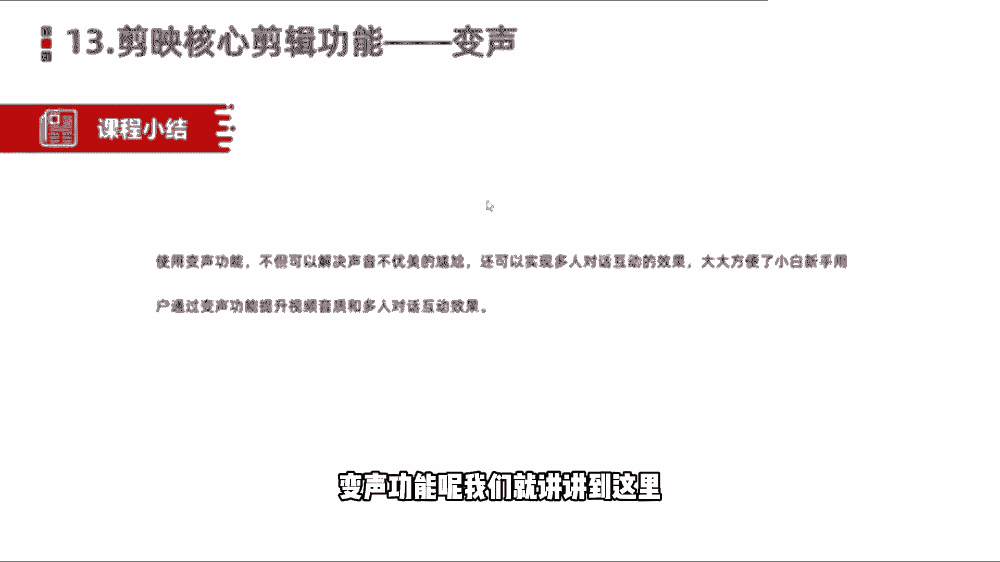

# 2024年做自媒体怎么快速起号？b站高口碑全自媒体运营课程，从0开始，转行做抖音自媒体从入门到精通，学习抖音短视频新媒体运营教程！ - P26：剪映核心剪辑功能——变声功能 - bi道德未央 - BV176sKeTE9R

各位小伙伴们大家好，欢迎呢来到我们的新媒体加短视频，运营的营销课堂，咱们今天呢接着给大家分享的是，简易的核心剪辑功能，第13个功能变声功能，很多小伙伴呢在刚开始做短视频的时候呢，很多人会苦恼自己的声音。

或者说配音呢不够理想，还有一些就是我们看到的视频对话，多人对话视频，那这个时候呢就会用到一些变声的处理，比如说把男生变成女生，女生变成男生，或者是变成大书生，萝莉生等等等等，那这个的话在我们剪映当中啊。

也是有啊，特别是我们看到一些搞笑，作梗的一些视频当中啊，经常会用到这个变声的功能，来实现多人对话的这样一个效果，或者什么一个搞笑的这样的效果，OK那么我们介绍的话就讲到这块，然后呢。

接下来的话同样是进入到我们的软件当中。

进行实操，好打开我们的剪映，然后呢我们导入一段视频素材。

好我们先来预览一下，这是李佳琦啊，在618直播间带货，双双方店铺价50ml，380，加起到五，超值380，买就送两瓶给好，这是我们看到的原声啊，他是个男生，但是我们如果想要使用变声功能怎么办呢。

那我们比如说在底部啊，先选中视频素材，然后在底部呢二级菜单底部有一个变声功能啊，然后我们选中变声，那这块会有自带的许多，比如大书生萝莉声，女生男生怪物啊，我们先选择一个比较个性的女生，啊就变成女生。

然后再试一下萝莉，380买就送两瓶一毫升的精纯面霜，再加入乔氏的舒缓化妆水，再加一个平毫升的舒缓好，是不是就变得特别有意思啊，那我们看到很多视频当中啊，视频的声音变声了，怎么变呢。

就是使用了这块一个变声功能啊，非常简单，我们直接在选中视频，然后呢在二级菜单底部会有一个变声功能啊，然后我们点击变声就可以了。

那么这块关于变声功能的话，我们简单的了解一下，使用变声功能的，不但可以解决声音不优美的尴尬，还可以实现呢多人对话的一个互动效果，比如说一个人可以派分分担多个角色，比如说可能是老爸老妈。

或者说什么儿子和妈妈啊，甚至什么男朋友，女朋友之间情侣对话等都是可以的啊，大大方便了什么小白新手用户，通过变声功能来提升我们视频的音频质感，和我们啊多人对话的这样一个互动效果，Ok。

那么本节课程呢给大家分享了关于简易的核心，简易功能，变声功能呢我们就讲讲到这里。

