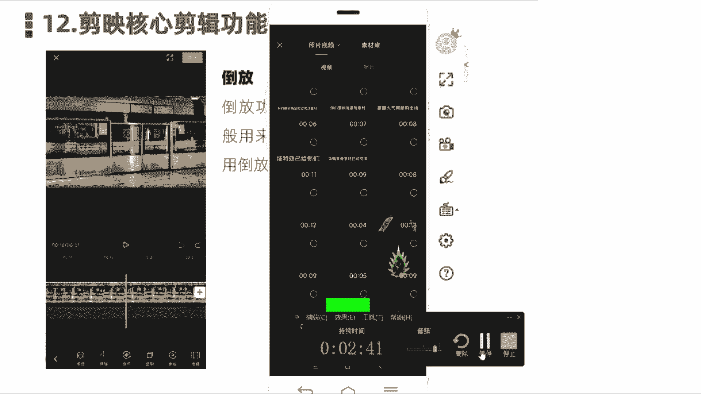
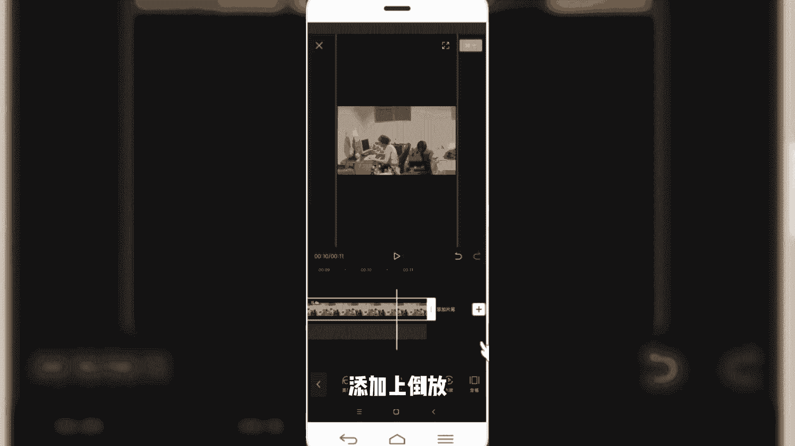
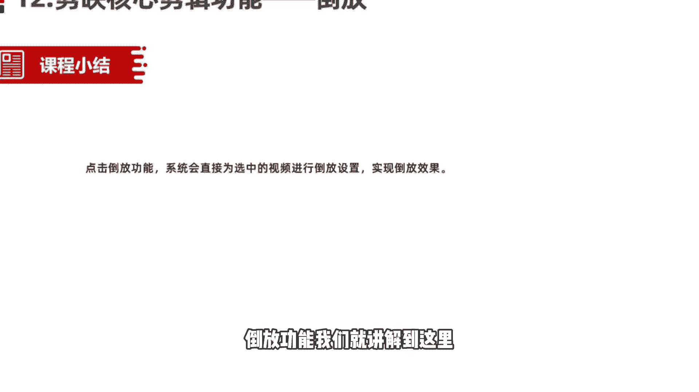

# 2024年做自媒体怎么快速起号？b站高口碑全自媒体运营课程，从0开始，转行做抖音自媒体从入门到精通，学习抖音短视频新媒体运营教程！ - P28：剪映核心剪辑功能——倒放功能 - bi道德未央 - BV176sKeTE9R

Hello，各位小伙伴，那我们今天呢接着给大家分享的是，剪映的核心剪辑功能，倒放功能，那倒放功能呢我们在视频当中啊使用的不多啊，在剪映式里面，我一般是用来制作一些特效的一些视频的时候。

或者搞笑的视频的时候呢，会用到一个倒放功能，倒放功能啊，顾名思义，我们正常看到的视频它是赠速，或者说按照我们时间线的时间来正向的播放，那倒放呢顾名思义，就是把我们的时间线呢颠倒过来，从后往前放。

那么如果大家没理解这个概念的话，我们看一个视频大家就明白了，好我们同样是打开一段素材，好我们先来预览一下这段素材，是不是看着特别的有意思啊，本来应该是正常，在没有到访之前呢，是这个女主角啊。

这个小姐姐在吃这个骨头，然后呢吃完之后扔给这个小狗，然后那个小狗吃，但是变成倒放之后，就是成为什么小狗现在吃这个骨头，然后呢倒放过来，成为这个小姐姐吃狗嘴里吐出来的骨头啊，这是我们用到的倒放功能。

非常简单，那这个视频是怎样制作的话，我们同样是啊再找一个案例，然后给大家讲一下如何使用导航功能制作，好我们点击开始创作，导入一段视频素材。

好我们导入这段素材呢，首先呢先来预览一下它的一个情况是什么样的，啊这是我们啊看到的正常情况下倒放之前啊，他在打电电，在玩电脑游戏，然后呢着急把电脑给砸了，把屋子给都砸了。

然后我们使用电剪映当中的倒放功能，首先是选中这段视频素材，然后在二级菜单底部向右滑动，在底部可以看到倒放功能，我们选中倒放好，然后视频完成倒放，那我们再来预览一下倒放之后的效果，啊是不是挺有意思的。

就这个人开始啊，回过头来，然后呢一步一步把这个屋子呢又收拾好了，然后呢重新坐到电脑上开始玩游戏啊，这是我们用的导航功能啊，非常简单，直接在底部二级菜单先选中视频，然后在二二级菜单选中导航功能。

即可以给我们这段视频素材呢添加上倒放啊。

OK我们一会来小结一下，点击倒放功能，那系统呢会直接为我们选中的这段视频素材呢，添加倒放啊，实现我们想要的导航效果啊，在剪音当中啊运用的不是很多，但是呢也是需要大家了解和掌握的一个技能。

OK本节课程呢关于剪映核心剪辑功能，倒放功能，我们就讲解到这里。

