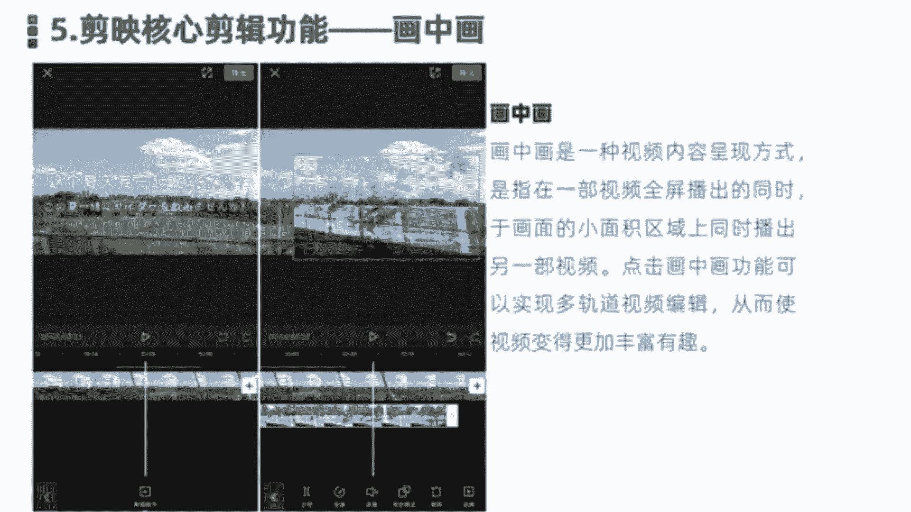
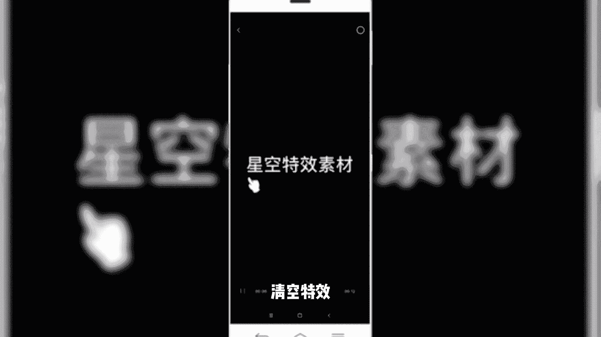
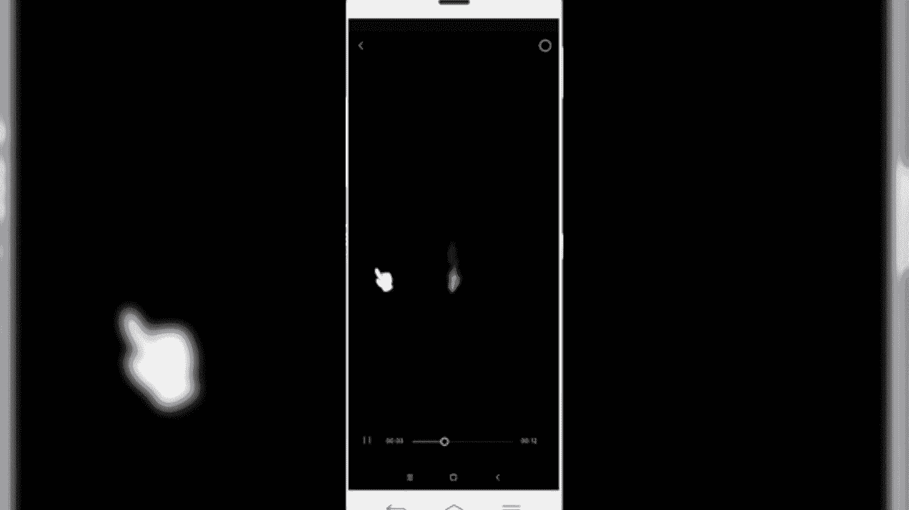
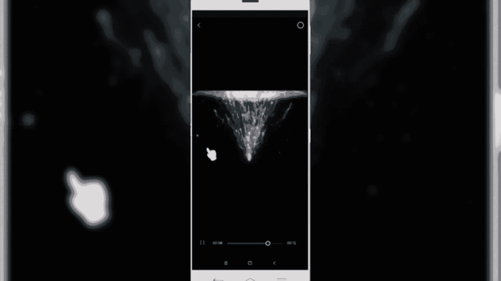
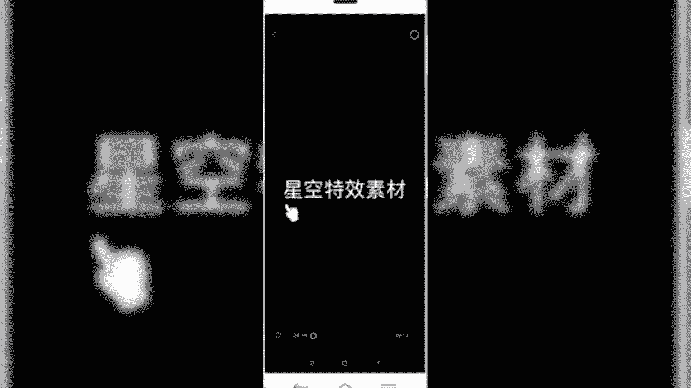
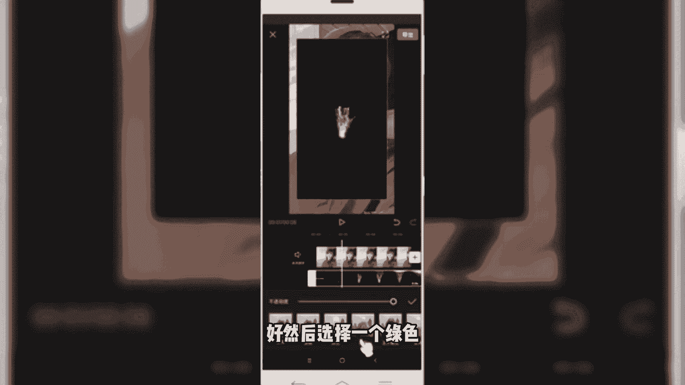
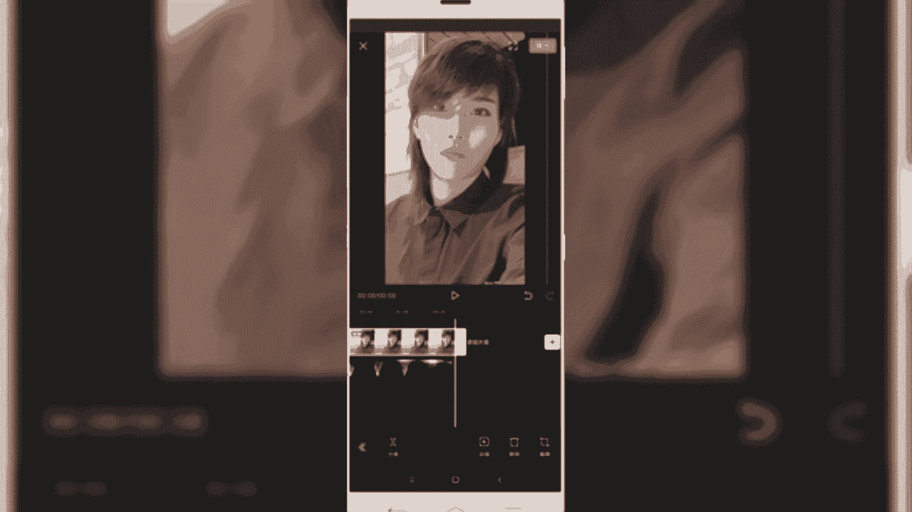

# 2024年做自媒体怎么快速起号？b站高口碑全自媒体运营课程，从0开始，转行做抖音自媒体从入门到精通，学习抖音短视频新媒体运营教程！ - P29：剪映核心剪辑功能讲解--画中画功能 - bi道德未央 - BV176sKeTE9R

咱们今天呢接着给大家分享的是，剪映的核心剪辑功能，第五个功能画中画，我们经常看到有些视频当中啊，会出现什么多个画面同时进行的，但是多个画面呢可能不是在同一个是吧，不是在同一个时间线上。

但是它它也会出现这种情景情景。

这是怎么造成的，就是使用了画中画，在剪映当中呢，啊我们看到有一些特效视频呢，也是它是借用了这种画中画的这个功能，然后呢，将两个视频或多个视频叠在同一个时间轨道上，然后呢同时呢进行播放。

那使用画中画它的一个非常重要的特点呢，就是使我们的视频呢内容呢变得更加的丰富，有趣好，那关于画中画这块介绍的就简单的到这块，然后呢我们接下来的话是带大家一块进行啊，画中画一个实操好了，回到我们的软件。

好同样我们首先开始创作。

导入一个照片素材。

好导入到照片素材之后呢，我们先对一个照片简单的调整一下，它的一个比例大小，选择比例，然后设置为九比16。

好先调整一下，然后呢我们再导入另外一个添加画中，画好拉长一下照片的时长，回到一级菜单，然后选择画中画。

点击新增画中画好，我们再添加一个其他粒子素材。

好我们找一个星空的特效，看一下清空特效。

星空特效素材已给你们安排。

好我们拿这个为例，清空特效素材，然后导入，导入之后，像前面部分多余的这些文字呢，我们不需要需要给它删除好，我们定位一下光标，给它删除多余的部分，好从这个地方算点击分割，然后把前面部分多余的给它删除掉好。

然后我们把后半部分再调整一下时间的位置，挪到前面部分。

好我们正常情况下看到的画中画，就是这两个视频画面的在同一个轨道上，多屏的一个互动效果，也是通过画中画可以实现的，好我们先简单看一下，那我们想要把这个粒子的效果呢，打在这个后面的照片起上面。

那么我们前面看到这个黑色背景，我们需要给它抠掉，那就我们这块怎么样处理呢，可以使用这个画中画当中的混合模式，点击我们画中画轨道，然后选择底部的混合模式好，然后选择一个绿色。

就把我们刚才看到黑色呢给它去掉了啊，然后呢我们再调整一下这个视频的位置，好再来播放看一下效果，拉长，然后调整一下我们的位置，好再来预览一下效果，好基本上这是我们通过添加画中画的形式。

给视频做了一个特特效啊，他就是通过一个照片形式做出来，我们再来预览一下效果，Ok，那这个呢就是通过画中画的形式来创作出来的。

好那么再接着再回到我们的课件，我们一块来小结一下，那本节课呢，主要给大家分享的是剪映当中的画中画功能，在剪映当中呢，我们点击画中画功能，可以直接在原视频轨道上，新增另外一个视频轨道。

实现一个多轨道的视频运行，让原本的一个视频画面呢变成两个视频画面，甚至多个视频画面的同步播放，从而丰富了我们视频的内容理解和掌握，划分化规功能呢，对于我们后期通过画中画做特效，视频有一定帮助。

就像我们刚才讲到的，案例操作是通过画中画，实现了一个这样一个特效的一个操作，我们后期再讲到一些三连画呀，或者说呃人影分身的这种技术的时候呢，都是借用了什么呢，画中画好了，本节内容呢就分享到这里。

