# 2024年做自媒体怎么快速起号？b站高口碑全自媒体运营课程，从0开始，转行做抖音自媒体从入门到精通，学习抖音短视频新媒体运营教程！ - P30：剪映核心剪辑功能讲解--音频功能 - bi道德未央 - BV176sKeTE9R

那么我们在上节课呢，给大家分享的是剪映的核心剪辑功能，文，那么我们在上节课呢，给大家分享的是简易的核心剪辑功能分割功能，那么今天呢接着还要是给大家讲解，剪映核心剪辑功能，音频功能。

我们知道一条完整的短视频，它不仅仅包括我们看到的视频画面，还要有一条比较火的，或者说比较热门的BGM，也就是我们所谓的音频，那音频这块应该是如何添加和制作的，所以今天给大家讲的是剪映的核心剪辑功能。

第二个音频功能。

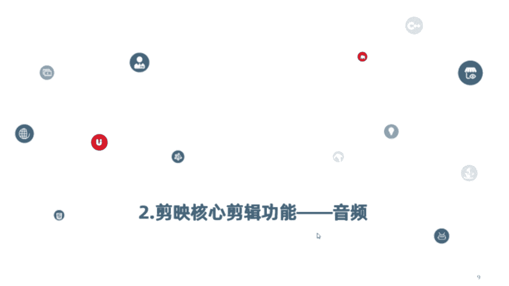

我们知道一条吸引人的爆款视频，他一定离不开一个什么，离开一个热门的BCM，在剪映当中呢，我们可以通过音频功能实现，为视频添加我们背景音乐或者音效，还可以通过提取音乐和抖音收藏的方式呢。

直接选取一些抖音上的热门BGM，最后还可以为我们的视频呢配色录音，那通过这些操作之后呢，可以大大提升我们视频的一个配音质量，和我们的配音效果，我们视频的一个画面氛围呢，或是视频的一个感觉。

可能用户在看起来时候会更好一些好，那这块的话音频功能先简单的介绍一下，介绍一下，然后接下来我们进入同样一个实操环节，音频的话同样是在我们的剪映当中的一级菜单，我们添加好视频之后呢。

我们在底部菜单栏点击音频，然后呢就进入音频的一个操作界面，那这块音频功能包括添加音乐，音效，提取音乐，抖音收藏和我们录音五个小的功能，然后我们接下来挨个给大家详细的讲解操作。

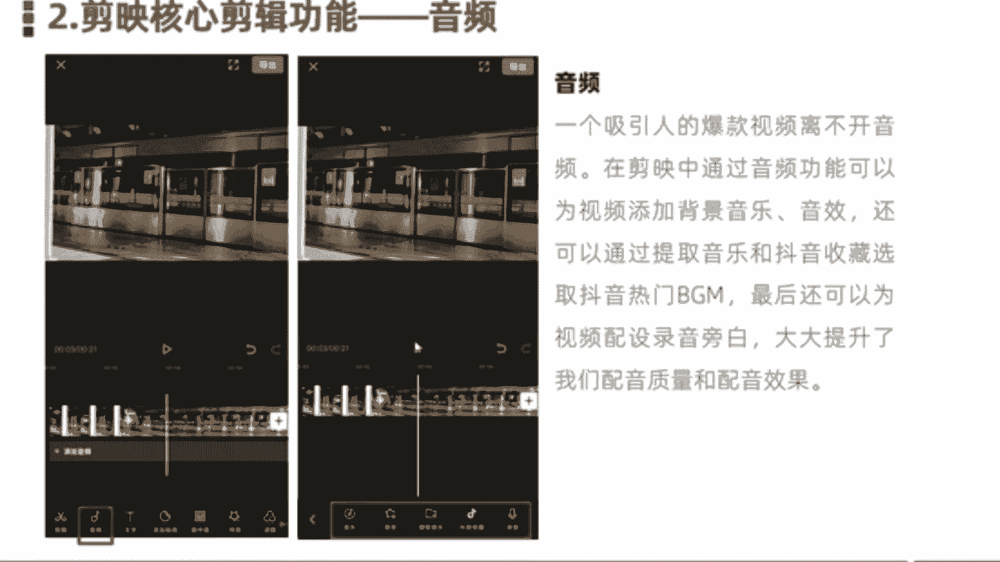

好回到我们的，简易当中，好我们同样是先导入一段视成视频素材。

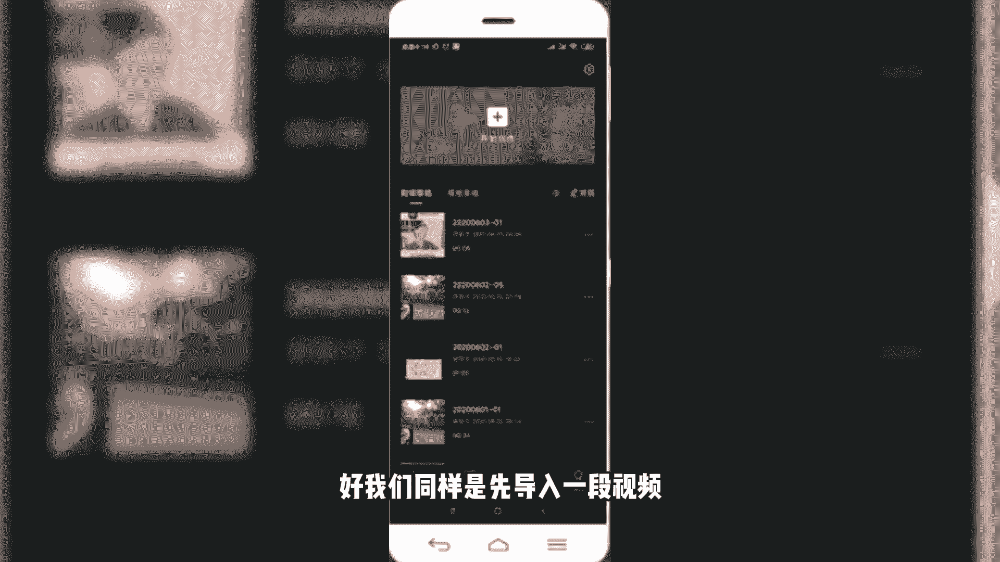

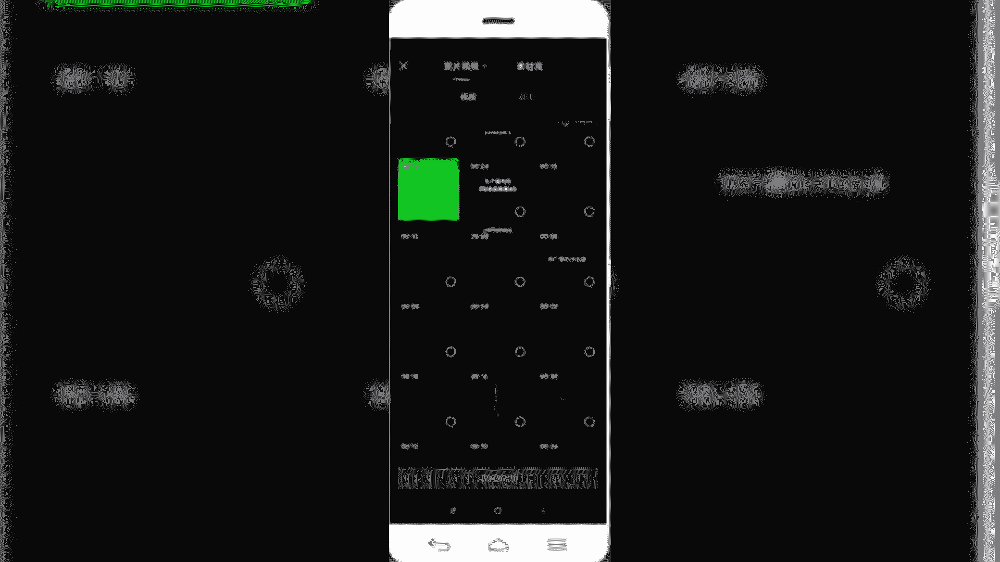

好我们可以首先呢先预览一下原素材的效果，啊可以看到原视频素材呢是只有刮风的声音，没有其他的，那么这种情况下我们发上去的话，其实他是很多用户在看的时候啊，看不出来我们想要表达的主题。

那我们可以通过添加一些音频，或者说热门的BGM，来提升我们视频所要传达的氛围和和思想主题，OK那怎么样添加音频呢，首先呢是选中我们的视频，然后呢，第一种方法是直接在视频轨道下方，有一个添加音频。

我们点击添加音频，然后就会进入添加音频的一个操作界面，可以添加音乐音效，提取音乐，抖音收藏和录音啊。

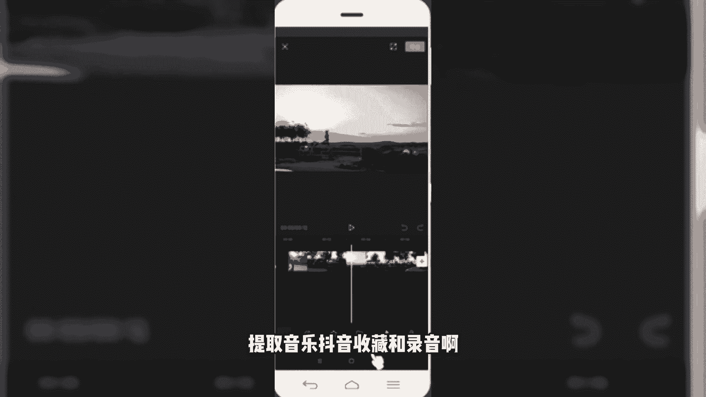

我们首先看第一个添加音乐，点击添加音乐。

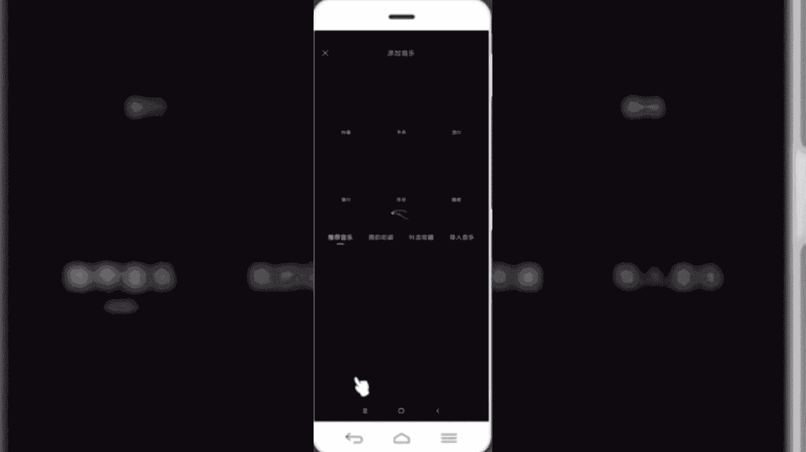

然后呢就会跳转到剪映音乐的一个素材库，那这块的音乐素材库呢或者叫音乐曲库呢，适合我们抖音短视频上看到的很多热门音乐，直接打通的，而且它上面划分为很多类别，比如说抖音的卡点类的，流行类的，旅行类的。

美食的，那还有什么VLOG的，浪漫的，清心的，伤感的，治愈的等等，我们可以根据视频的主题呢选择相应的，那另外一个呢是还有平台推荐的一些热门音乐。

也会在这个地方显示出来。

比如说我们选择夏天的风啊，现在是夏天了吗，点击可以预览，夏天的风，好我们就以这个音乐为例，然后呢点击使用。

那么这个视频就添加上了这个夏天的风，这个音频背景音乐，然后呢，我们需要把它的背景音乐的位置呢调整一下，调整的时候呢，首先是点击选中，然后呢我们用手摁住这个音频轨道往前拖，使它和前面的视频轨道呢对齐。

然后呢我们同样再来预览一下效果，那么我们在预览的时候发现啊，原声呢没有关闭，那么我们需要把视频的原声关闭，因为有原声的话，它会干扰用户或者听起来时候呢不那么清晰，所以我们把原声关闭，点击关闭原声。

然后我们重新再来预览一下，好我们啊视频到这个结尾的地方呢，音频还有呢怎么办呢，我们需要把它给裁切开啊，同样是需要裁切开，定位到我们视频的最后一秒钟，好，我们选中音频轨道，点击选中，然后选择底部分割。

同样把音频的裁切开，后面多余的部分呢我们不需要选中，然后给它删除，OK那么我们音频就给它添加完，添加完成了，添加完成之后呢，就是为了有时候我们做视频的时候啊，让那个音乐过渡的特别缓和。

不用那么就是硬的话，或者说特别明显强硬的话，那么我们需要把音乐变得柔和一些，怎么样变得柔和呢，我们同样是需要对音频，音频的出场和入场进行一个淡化处理，选择这块有个淡化，然后呢可以调整一下我们淡入的时长。

和我们淡出的时长，这样的话音乐他在入场和视频的结尾的时候呢，就会看起来比较柔和一些，然后我们调整一下时场，比如说一秒钟，然后弹出的话，同样给它来两秒钟，好我们调整完之后呢，可以保存好，再来预览一下效果。

好那我们通过添加这样一个淡化处理之后呢，可以看到啊，视频比原来就缓和很多了，OK那这一块的话是给大家讲的，第一种添加音乐，当然除了这个添加音乐之外，我们在音乐操作当中。

还可以给音乐的音量进行一个大小的调整，如果说我们发现添加的音频音乐特别小的话，可以通过音量给它调大，一般情况下我们在这个抖音曲库中的音乐啊，它是按100来算的，但是呢我们上传到抖音视频之后呢。

会发现视频的音频呀会缩小很多，是因为啊官方平台我们在上传视频的时候啊，进行一个视频压缩，所以导致了我们的音乐变小了，所以我们建议呢各位小伙伴在导入音频之后呢，把音频的音量呢适当调大一些。

然后另外一个踩点，那踩点的话我们后期会给大家讲到，我们制作卡点视频的时候，就会需要根据音乐的节奏来拆分视频的镜头，那这块就需要用到踩点功能，那这块关于踩点的话，我们后期会给大家讲。

然后还有一个是什么视频的变速，那变速的话就是我们有些音频或者有些内容呢，需要给它加快，这块就可以让它进行一个变速，最大的变成四倍，那最慢呢可以变到什么0。2倍，那比如说我们看到有些速慢的。

比如说我们放慢可以看一下效果，就特别慢了啊，当然有些镜头的话我们需要放快的话，就可以把它放快，OK那这块是给大家分享的这个变速，好返回到我们的一级菜单，可以看到刚才给大家讲的是音乐，那除了音乐之外。

还有一个音效，音效的话简单再说一下，我们在看到很多VLOG呀，或者是一些啊路人采访的节目当中啊，经常会看到有各种各样的这种特殊的音效，比如说我点一个大家肯定听过，是不是这些音乐我们在做视频的时候。

经看视频的时候，经常会看到别人的视频当中，会有这样的一个动作，或者有这样一个音频的，其实都是运用了剪映官方提取的，这些音效素材库，那我们自己在做相应的VLOG呀，美食呀或旅行等等。

路人访谈等等这些视频的时候，也可以借用这些素材库，然后呢把这些素材呢直接拿过来使用啊，里面有很多就不给大家一一展示了，可以有游戏的，还有什么魔法的，还有我们比如打斗的美食的动物啊，环境呀，乐器啊。

交通啊等等，有非常多啊，我们在做相应类目的视频的时候，可以从这块直接选取，好再说第三个提取音乐。

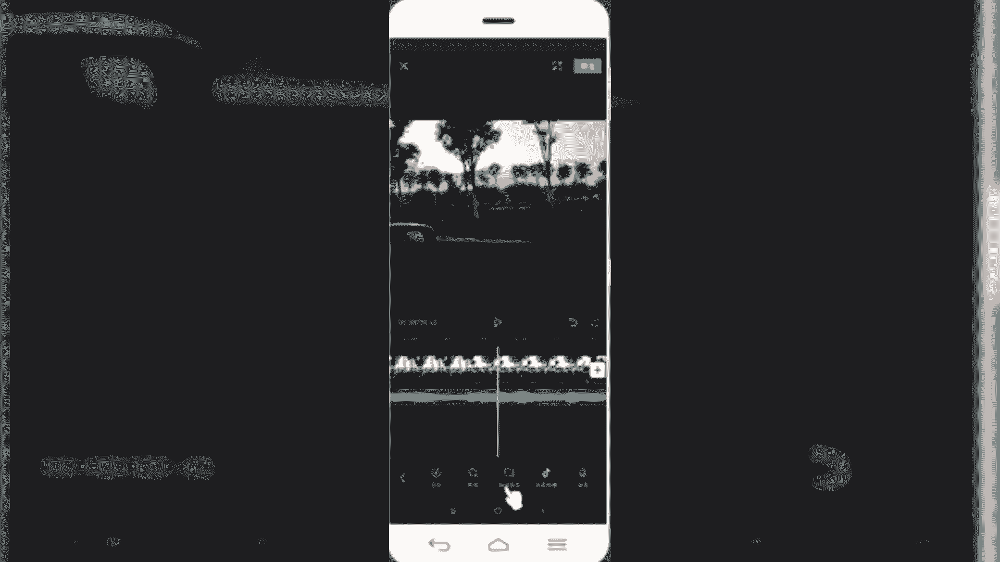

提取音乐的话是什么意思呢，就是把我们保存到手机相册当中的，一些视频当中，的音频内容的单独提取出来，然后呢直接植入到我们这个视频当中啊，然后同样我们拿一个例子为例给大家举一下。

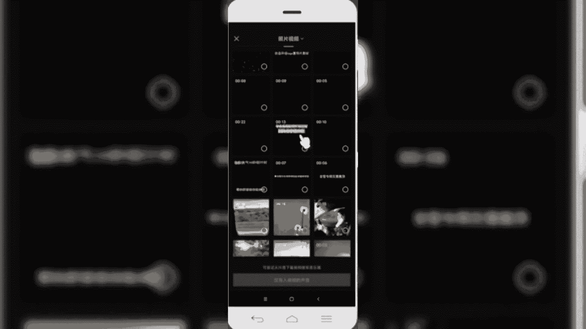

我们选取一个带音频的。

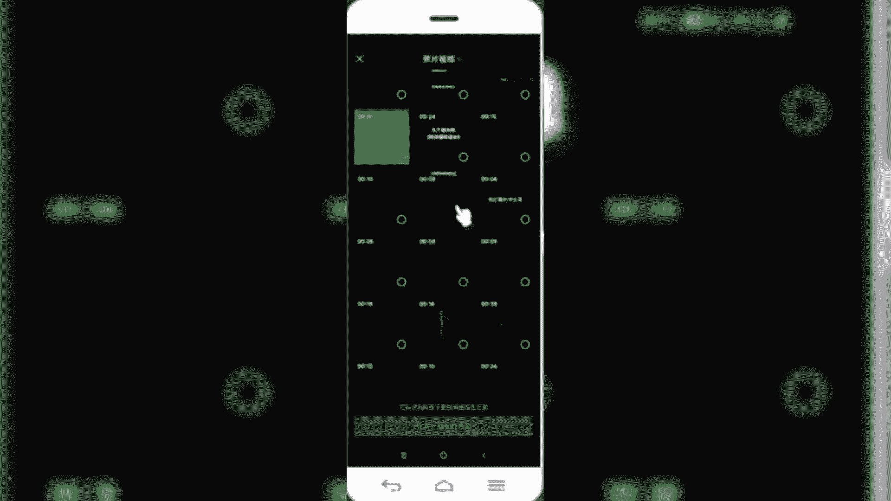

视频。

找一下。

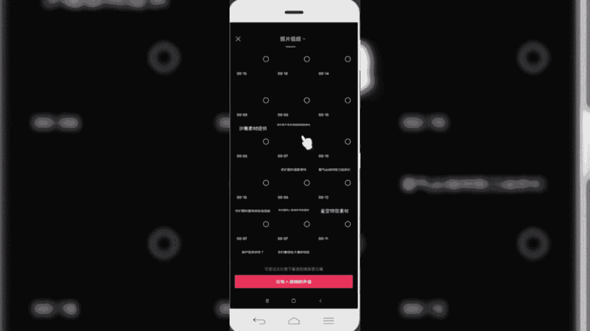

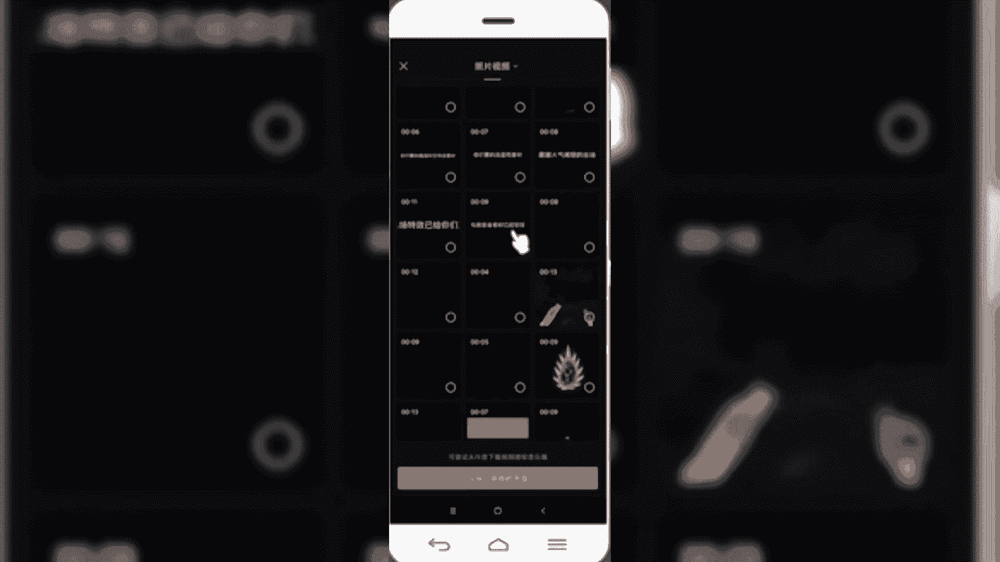

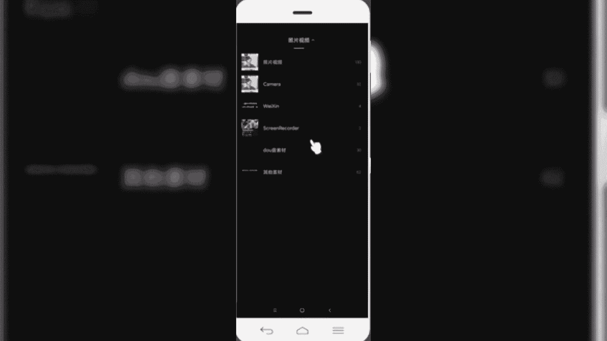

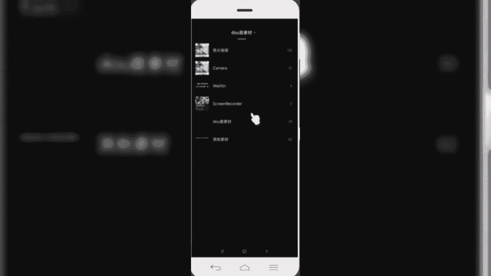

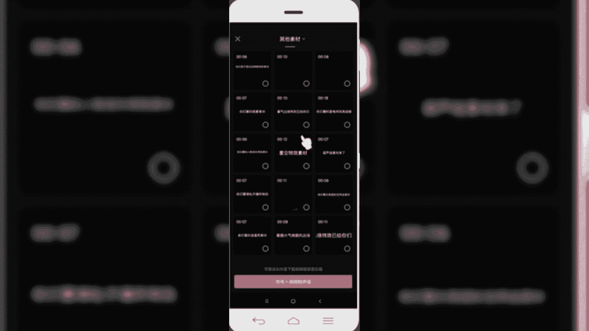

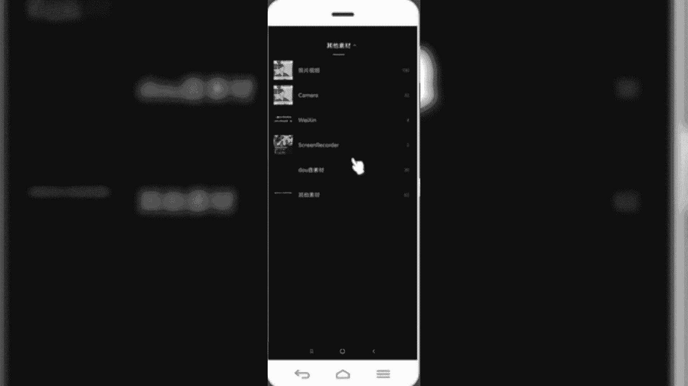

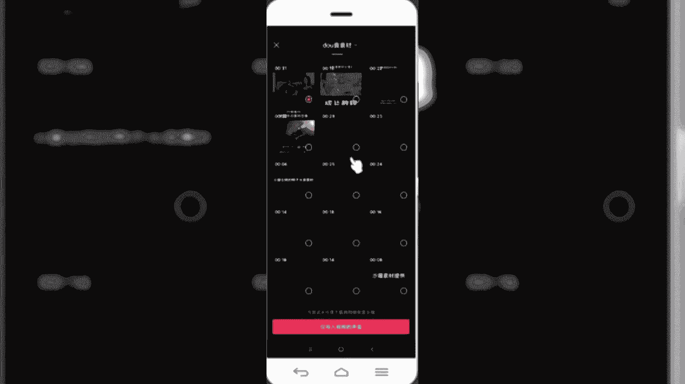

好那这个时候导入之后呢，我们可以看到，首先音频轨道这块呢变成了两个轨道，原来那是一个轨道，现在变成两个轨道，就是我们把刚才那另外一个视频当中的音频呢，提取出来，插入到我们这个视频当中。

那么我们可以看一下效果，把原来的这个音频呢给他删除，然后呢，调整一下刚刚插入的那个音频轨道的位置，好我们同样再来预览一下效果，Oh my god，ha ha ha ha好，我们可以看到这块。

把我们提取的视频当中的音乐给插入到了其中，这是讲到的第三个提取音乐，然后再看第四个叫抖音收藏，我们在抖音上有很多热门音乐，那如果说我们想要拍同款的话，怎么办呢，我们需要在抖音上。

把这个视频右下角的碟片当中的音频呢，给他收藏，然后呢我们在这块使用剪映剪辑的时候，直接把这个试音频呢可以选中，然后呢就可以拍同款视频了。

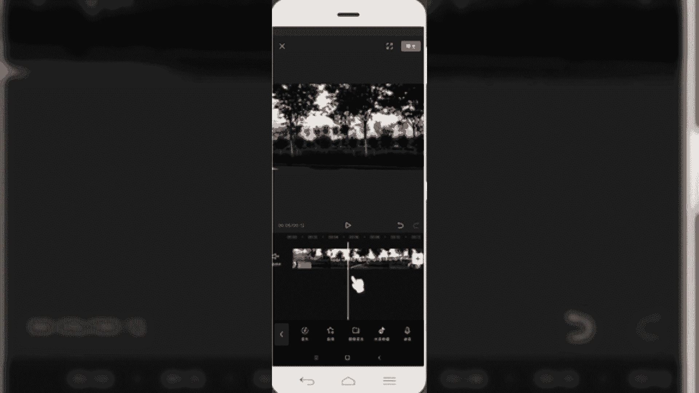

好我举个例子，把我们我们先退出剪影，然后呢打开抖音。

很多朋友问我这个飞天特效偷影子视频太火了，我教你拍，你也能火，嘶林酱，你看看这又是出库，又是入库的，你从来没有见过的，不懂教育的人，一定要看看这个老师，别看他其貌不扬，有粉丝问我呢。

出最近最有像这样的文字分割效，世界上有很多的东西，生不带来，死不带去，好打，比方我们拿这个视频的音频为例，那么我们需要想要拍同样这样一个音频的话，怎么办呢，我们可以点击右下角的碟片。

然后呢点击顶部有个收藏，然后呢，这个音乐呢我们就收藏到自己的抖音里边啊，收藏完之后呢，再回到我们的剪映。

好打开刚才的那条视频，然后呢我们选择添加音频，可以在这个视频轨道下方直接点击添加音频，也可以选择，在我们第一级菜单下面这块有一个音频，也可以在这个位置选择，然后呢选择抖音的收藏。

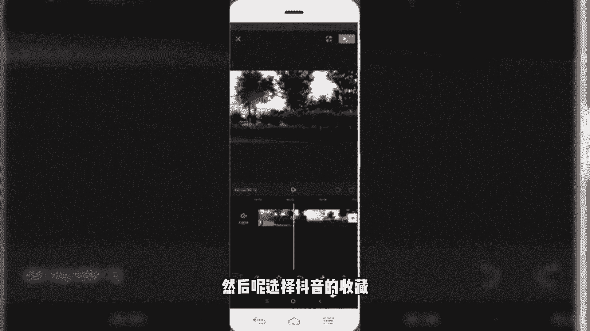

那这块可以看到有一个抖音收藏，我们就可以把刚才选中的那个音乐，把它导入进来，我们先试听一下，世界上有很多的东西不好。

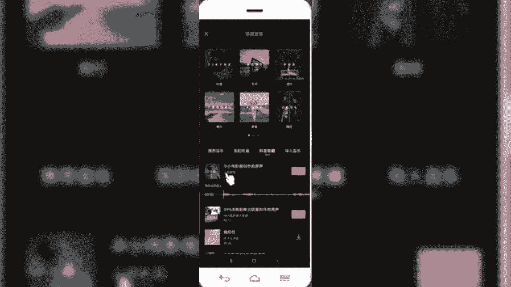

我们选择使用，那这个音乐呢就插入到我们视频当中，我们同样调整下位置，好再来看一下成片的效果，世界上有更多的空隙，生不带来死，你能带走的只有自己和自己的脾气好，这是我们讲到的第四个，通过抖音收藏添加音频。

那第五个的话是我们的录音，就是我们给一些视频添加一些画外音，或者说一些台词说明的时候，可以选择录音，直接在我们后期剪辑视频的时候给它配入，可能我们当时在现场拍摄的时候呢。

没有想到好的文案或者说好的一些台词，只是需要这个镜头的话，只是拍了镜头没有台词，那我们后期想要添加的话，可以通过这块录音，也可以很方便地植入到相应的文案，好我们举个例子，点击录音。

然后呢摁住这个红色区域开始录音，就相当于我们用微信语音发发送一样，好我们测试一段，很喜欢村上春树的一段话，不必纠结于当下，也不必纠结于未来，好我们试听一下世界上，你能带走的只，好我们保存保存完之后呢。

可以给我们的音频呢调整一下它的一个音量，悲伤很喜欢吃什么，然后呢把我们刚才植入的这个音频啊，它是本身带歌词的，一般情况下，这种我们建议呢选择是纯音乐这块给大家演示，然后呢我们同样把它的音量的降低。

人家很喜欢村上春树的一段话，不必纠结于当下，也不必，好，那这样的话，是不是就把我们想要表达的文案主题呢，更加凸显出来，那背景音乐就尽量给他弱化，或者是把声音缩小，OK那这块关于音频功能的五个部分呢。

就给大家讲解到这块，我们一块呢来总结一下好。

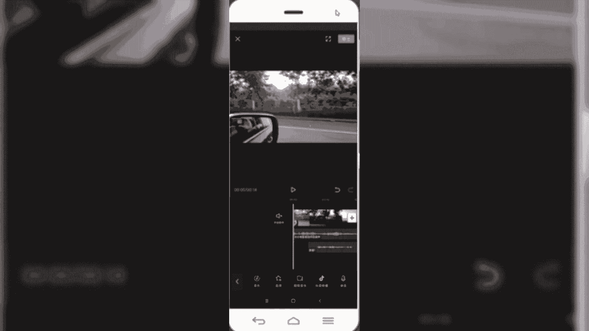

通过音频功能呢，可以快速的给视频添加上背景音乐和音效，那么在剪映app当中的添加音乐，我们可以直接从剪映提供的音乐曲库当中，选择抖音的相关音乐添加到其中，还可以选择相应的音效素材呢。

直接植入到我们的视频当中，那另外的话我们想要拍一些抖音，热门音乐的视频的时候呢，可以选择提取抖音热门视频，或者说我们选择抖音收藏的形式，把这个音乐呢植入到我们的视频当中，那最后的话是还可以选择录音。

为我们的视频配置画外音好，本节课程关于剪映的核心剪辑功能，音频功能就跟大家分享到这里。

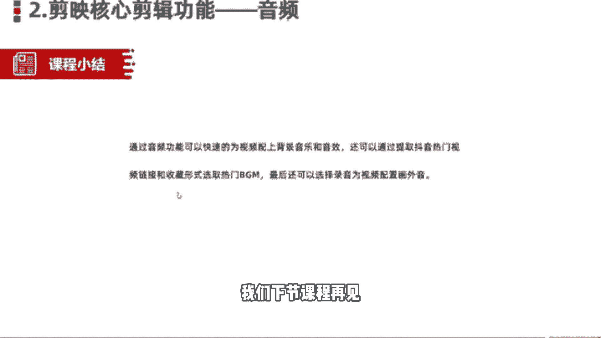