# 2024年做自媒体怎么快速起号？b站高口碑全自媒体运营课程，从0开始，转行做抖音自媒体从入门到精通，学习抖音短视频新媒体运营教程！ - P31：剪映核心剪辑功能——蒙版功能 - bi道德未央 - BV176sKeTE9R

各位小伙伴们，那么我们今天呢接着给大家讲的是，简易的核心剪辑功能，蒙版功能，蒙版呢就是我们在剪辑视频当中，经常用到的一种遮罩功能，或者说我们在处理视频过程当中，为了让视频看起来更加的精致。

视频当中有一些东西我们想让它遮挡出来，不让用户看到，那这个时候呢也是用到了一个叫遮罩功能啊，它其实是一个叫隐藏功能，把我们视频当中有些东西的给隐藏起来了，那么我们在剪映当中啊，就是运用蒙版功能。

借用蒙版功能可以干什么呢，就我们看到的一些啊转场的特效视频呢，其实大量的应用了就是蒙版，蒙版的功能来实现的好，我们同样是回到剪映当中啊，我们首先给大家看几个案例，好我们导入素材，好先看第一个案例啊。

然后点击这块的预览按钮，我说桥边姑娘这里，那么其实在这两个案例当中啊，我们看到的视频，在转场过程中出现这些绚丽的啊地方，比如说我们找一个地方，他在什么地方用到了这个蒙版功能好，我们看这个镜头。

在这个镜头当中，画面我们啊把他拉大，可以看的更仔细一些，可以在这块看到出现两个人影，双重人影的叠合在一块，那这种情况是怎么做的，他就是运用到了蒙版功能啊，然后呢把周边的范围值给他羽化掉。

那么我们就可以看到这种双重人影的一个，转场的效果，那再比如我们看到的另外这个视频当中，那他是看到我们一个五角星这样一个拼图，这样一个效果，那他是用了什么蒙版当中的什么呀，图形蒙版呢。

就我们可以让这个视频中画面以图形的形式，比如圆形啊，方形啊，五角形啊，三角形啊等等形式进行一个蒙版，也是做一个什么比较绚丽的这种转场，好，那么我们接下来的话同样是。

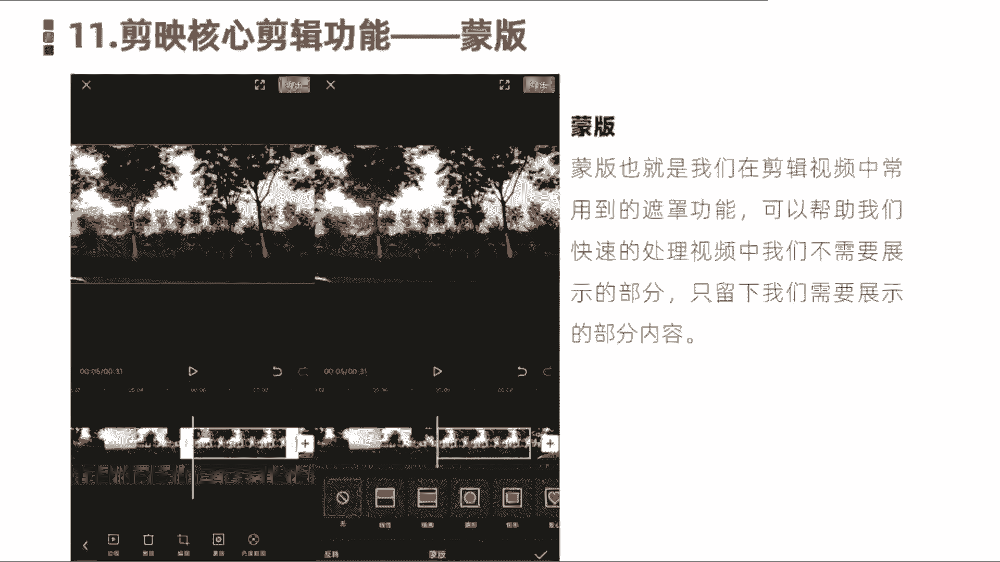

给大家展示下，如何在视频当中使用这个蒙版功能，好我们点击开始创作啊，然后呢我们找几张图片素材导入到，好我们随便打，导入几张，好那么我们导入之后，正常情况下，我们先来预览一下，它的一个这个转场时间比较长。

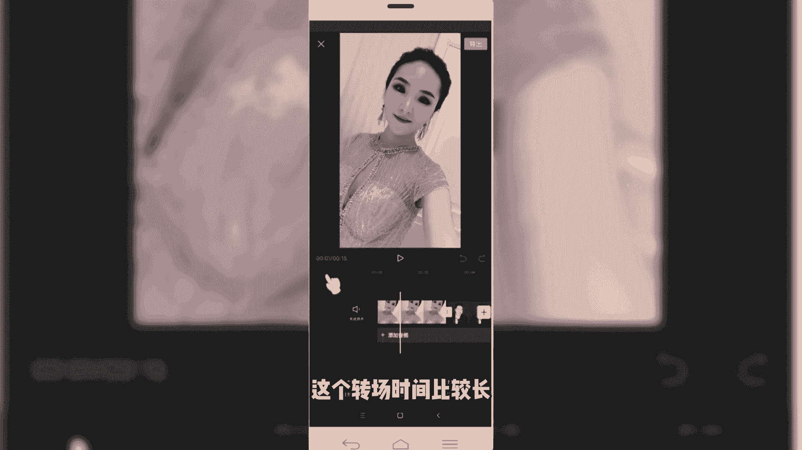

那我们把时间缩短一下。

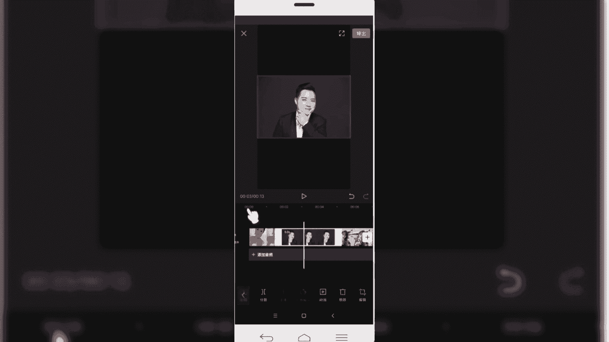

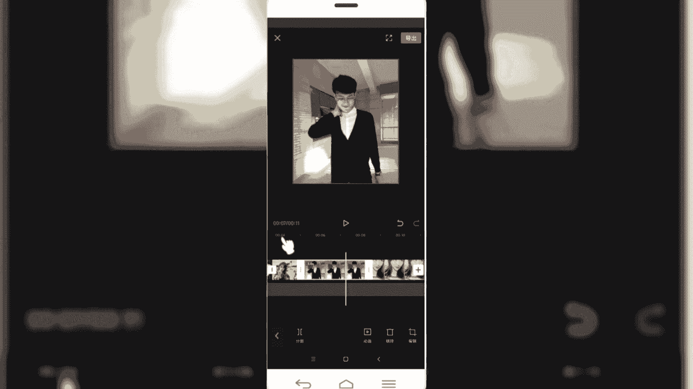

好。

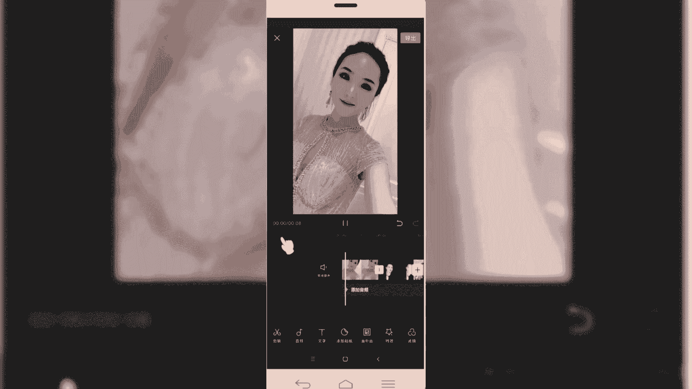

正常情况下它是这样一个静态的。

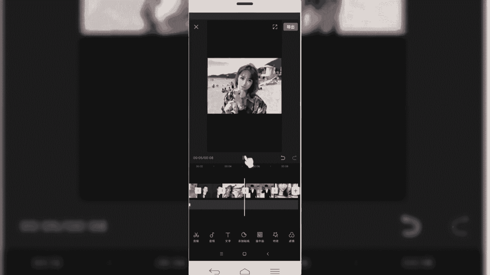

啊我就是我们看到他是一个就平铺直叙，这样一个转场，没有一个什么效果，那么我们像刚才看到那个视频画面当中啊，他是怎么样添加蒙版的啊，我们首先选中第一张图片啊，然后在二级菜单下面。

底部可以看到这块有一个蒙版啊，然后我们添加蒙版，然后呢在这一块的话就看到啊，他会默认情况下，比如说像线性的门板门板。

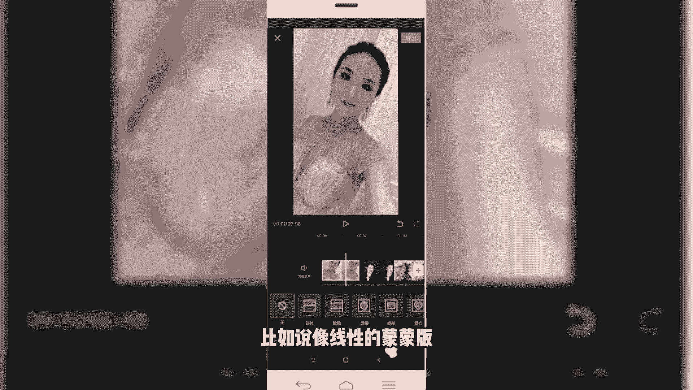

那就直接添加这样的内容，这是最常规的线性蒙版啊。

我们可以看到这个视频当中的画面，就变得比较啊，有深入浅出显示出来啊，比如说我们往上拉的越多，它遮盖的也越多。

那遮挡起来呢，下面隐藏起来这部分的并不是没有了，12是被隐藏起来的，视频展示的时候，只展示上面这部分啊，这是第一种线性蒙版，我们看到的，比如说前段时间比较火的，遇见当年和当年相见啊。

这种视频它就是用到了这个线性蒙版，将中间多余的部分擦除。

然后我们还有一种是什么镜像的蒙版，那镜像的话它是向两侧同时的话啊，进行一个羽化啊，我们可以看一下拉拉动这块有个箭头啊，我们拉动那个箭头的话，可以调整羽化的值和范围大小，我们可以看一下那效果，啊非常明显。

那还有比如说我们看到的圆形，和后面的什么星形五角形，同样的道理啊，他说是通过我们设置这个转场好，那我们比如说拉大，好同样是设置这个转场，可以出现这种圆形的这种转场的效果，好比如说我们刚才看到这种新型的。

那同样，好选中素材，点击星星。

好我们添加完之后呢，可以再来简单来看一下效果，我们添加完蒙版之后。

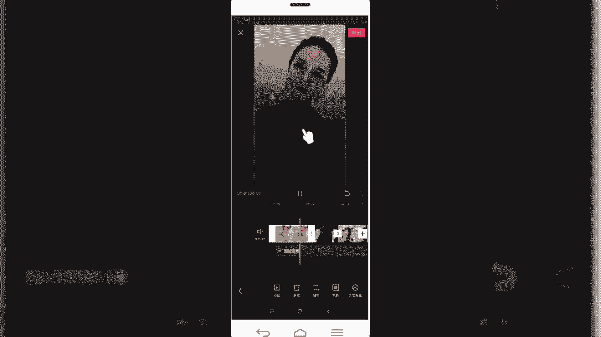

视频是不是就变成我们刚才要的这种效果了，那如果说你像老师，我们刚才看到他是动感的，那动感的话怎么办呢，我们可以给它添加转场特效啊。

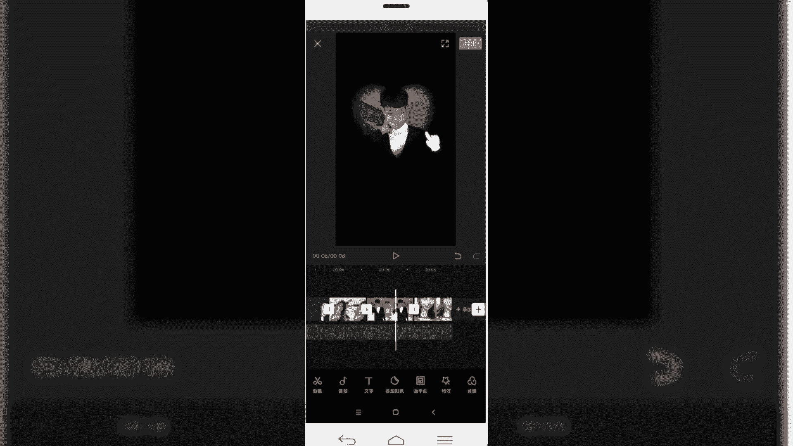

或者添加动画特效，那我们刚才看到了，他是运用了一个叫画中画啊，比如说我们就直接复制了，用这块做的话，就直接复制，然后选中，然后直接复制图层，添加画动画。

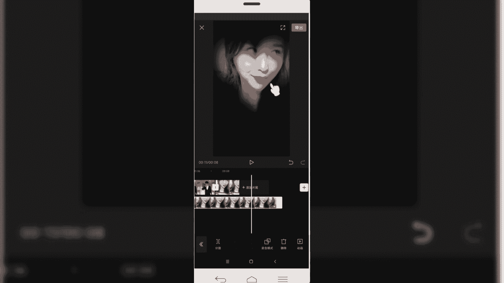

好重新导入。

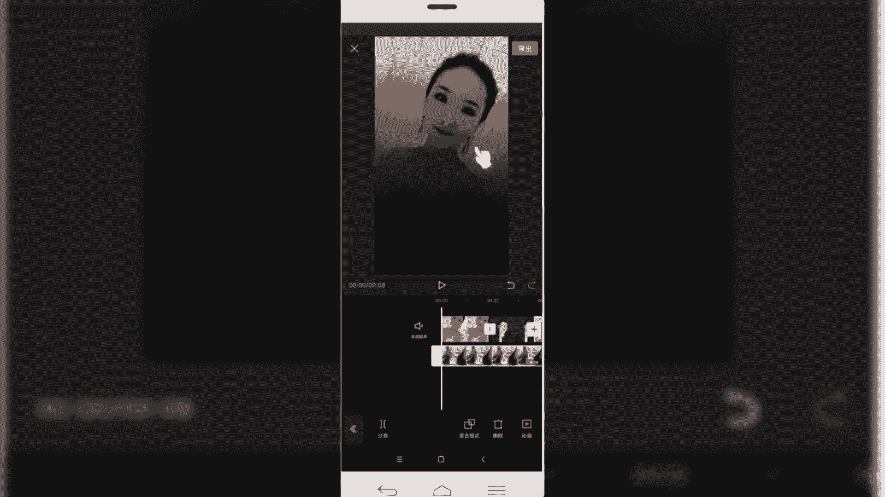

好我们已经给素材呢添加好这个画中画，那么我们想要出现刚才那种双重影的玄幻，绚丽效果的话，就是需要用到蒙版啊，我们选中要添加的画中画，然后呢选择这块有一个模板啊，我们找一下模板给他设置一下，在二级菜单啊。

然后点击底部的一个蒙版功能，然后我们可以给他选择不同的蒙版啊，比如说选择星形的蒙版啊，调整一下位置，然后设定下雨刮式雨花指，好那就可以看到这样一个心形的模板就出来了。

那同理，以下一个视频也是我们给它调整一下时间，啊设置个圆形的木板。

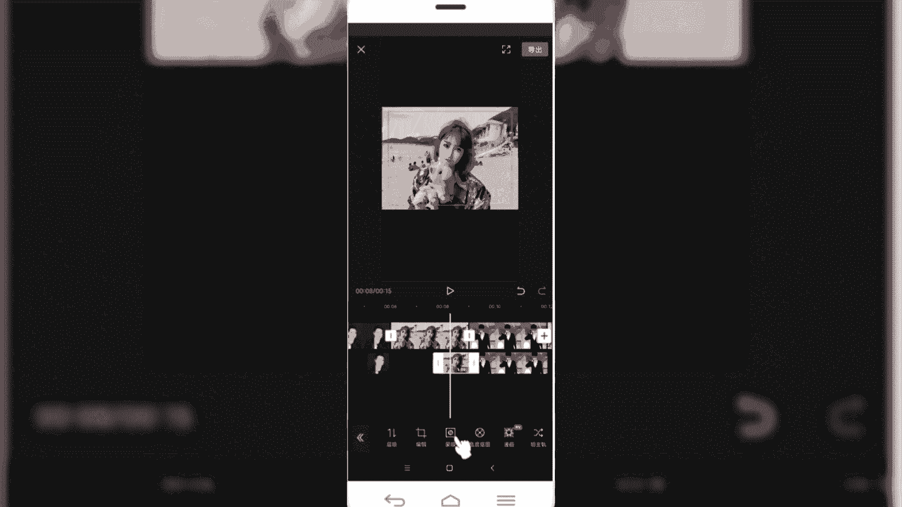

好视频比较多，我们就添加三个，然后呢添加完之后呢，可以给他给他加个动画，添加动画，啊比如说我们选择一个向右甩入。

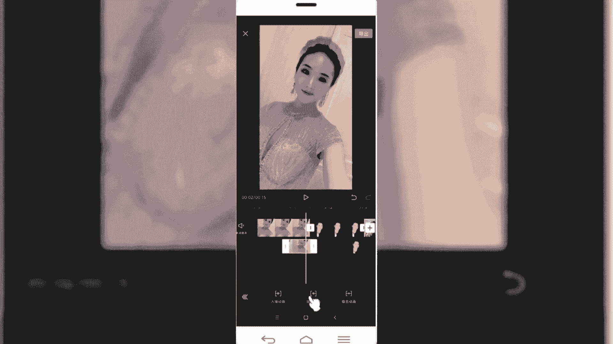

其他的话同样也是选择向右转入，好那我们添加完之后呢。

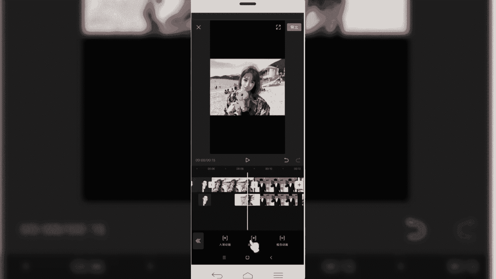

再一块来看一下，我们添加完这个蒙版之后的效果。

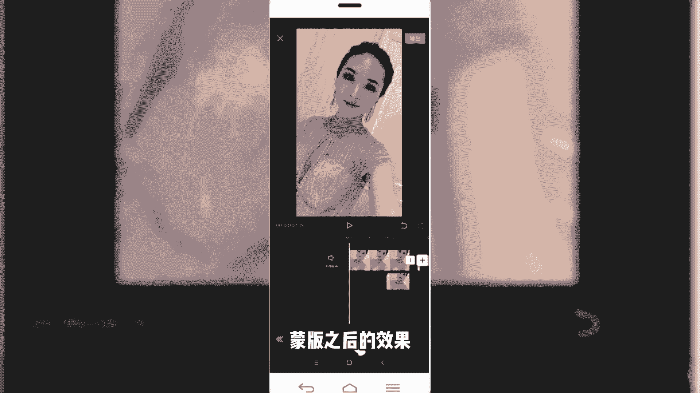

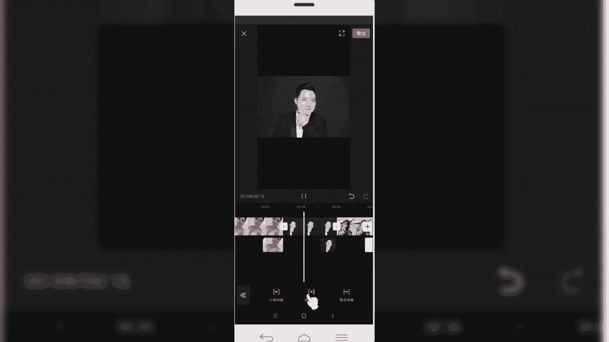

那是不是我们会出现这种双重叠影的效果呢，那这一块就给大家讲到了，我们用到的蒙版来制作这种转场特效。

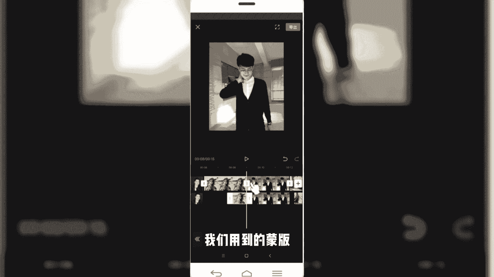

本节课程的内容，关于给大家分享的蒙版啊，就讲到这块。

