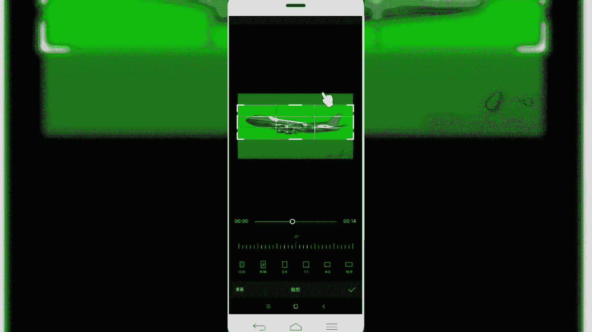

# 2024年做自媒体怎么快速起号？b站高口碑全自媒体运营课程，从0开始，转行做抖音自媒体从入门到精通，学习抖音短视频新媒体运营教程！ - P32：剪映核心剪辑功能——色度抠图功能 - bi道德未央 - BV176sKeTE9R

那么咱们今天呢接着给大家分享的是，剪映的核心剪辑功能，色度抠图，色度抠图呢，这个呢可以说是我们在手机剪辑当中啊，一个非常强大的功能，也是剪映app呢，在这个月刚刚添加了一项新的功能啊。

特别方便大家呢做一些特效类的视频啊，也是我们在过去pr或AE当中合成类运用最多的，比如说我们的绿幕扣图，把一些特效视频素材呢通过绿幕然后抠出来，添加到合成到我们的视频素材当中。

那我们在剪映里边添加这个色度抠图之后呢，也是方便了很多小伙伴呢，通过手机端呢就可以制作大量的，我们什么这种特效类的一个视频，将我们这个使用这个色度抠图，就可以把视频素材呢抠图抠出来。

然后呢添加到我们视频当中好，那么这一块呢简单的介绍这块，然后呢接下来同样是进入到我们的实操当中啊，简单的给大家演示一下，我们首先呢是先看一下好，我们寻找一段视频素材添加进去，大家看一下这个效果。

看看一差点连命都没有了，还好我有工资好，那这个视频素材呢就是很简单啊，左侧呢我们看到他就是添加了，这个是合成之后的这样一个效果，能看到完成之后的，那右侧呢就是我们用到的合成素材，就是它是一个在绿幕啊。

绿色的背景环境下制作的这样一个特效视频，那制作出来之后呢，和我们左侧的视频呢合成，把背景色绿色抠图之后呢，就会出现我们看到的效果啊，就是用到一个特效好，那么我们了解了之后呢。

同样是我们再来啊制作一个其他相关的视频，看一下，好我们点击开始创作，导入两段视频素材，好我们先导入第一段视频素材，然后呢，它是一段天空，我们要在天空中出现一个什么飞机飞过，怎么办呢，我们选择画中画。

然后呢导入我们第二段绿幕的shopping视频素材，好我们已经把素材导入进来了，然后我们现在没有给他扣图情况下，先来看一下效果是什么样的，大清要塞，啊他是这种情况。

就背景色是个绿幕，那么我们现在就是需要用色度抠图功能呢，把这个绿幕给他扣除掉好，那么接下来进入制作环节，怎么样制作呢，啊我们先选中这个素材，然后呢在底部啊找到这个色度抠图，但在我们蒙版旁边啊。

就有一个色度可口，然后我们选中，然后有一个取色器，那么就是需要选中我们的周围的绿色，把绿色给去掉，然后呢按住鼠标，然后拖动啊，按住这个是小手，选择一个绿色，然后我们啊给他点击一个强度。

开始慢慢慢慢慢慢的，把这一块这个绿幕呢给它去除掉，好我们可以看一下，那这块是不是已经已经给它去除掉了，当然还有一定啊，还有一点点，就是我们可以看到他那个周围，还有很多那个绿色的标。

我们可以再给他强化一下，啊可以给它添加一个阴影，这样的话看起来会比较柔和一些，然后像旁边的那个水印的话，我们可以给他直接裁切掉水印，好选中视频轨道，点击编辑。

啊直接把这个视频素材给它涂上去，把多余的部分给它裁剪掉。

好那么我们把多余部分裁切掉，然后呢我们再来看一下，他要听要塞，好那这块也还前前奏呢，他飞机是这种直斜方式的发飞过来的，那么我们还需要给他调整一下方位，好我们把前面多余的部分给它删除掉。

然后呢给他调整一下他的这个一个入场的动画，增加一个界限啊，然后呢前面的还有一个水印，然后我们同样给它去掉，选中，然后编辑，才浅。

好我们再来看一下效果，In order to maintain the，那视频就会出现这样一个视频，飞机飞过来啊，然后呢我们可以再给它调整一下，多余的素材删除掉，那视频呢飞机呢它是从右往左飞过去的。

那所以我们这块呢需要把它调整一下它的位置，啊往左移动一下，好我们再来看一下效果，这样是不是看起来就会柔和很多，这是我们用到的很常见的这种，通过添加视频素材素材当中一些特效，绿幕特效啊。

用这个色度抠图功能啊，可以给我们的视频当中进行绿幕抠图，那就实现这种合成类的特效视频。

OK那么我们这节课程给大家介绍的，试图扣图功能呢，就简单的介绍到这块，然后我们一块小结一下，使用呢色度抠图功能，可以很方便的将绿幕素材中的特效抠出来，然后呢合成使用我们画中画功能。

方便我们制作抖音当中的一些特效视频，这是我们在抖音当中，或者说我们在小视频当中经常看到的一些特效，视频，就是用到这个色度抠图功能来制作完成的，好了，本节课程给大家讲解的简易的核心剪辑功能。

第14个功能色图抠图，我们就讲解到这里。

