# 2024年做自媒体怎么快速起号？b站高口碑全自媒体运营课程，从0开始，转行做抖音自媒体从入门到精通，学习抖音短视频新媒体运营教程！ - P33：剪映核心剪辑功能--视频比例和背景设置 - bi道德未央 - BV176sKeTE9R

我们今天呢给大家分享的是，剪映的核心剪辑功能，视频比例和背景的设置，在抖音和我们看到的快手视频当中，我们应该有一个共同的认识，那就是我们看到的视频，几乎90%呢都是竖屏的，横屏的视频有吗，也有。

但比较少，那么我们在抖音或者是快手发布视频的时候呢，也是推荐大家以竖屏的为主，那么我们了解了这个需求之后，当我们在后期通过剪映制作，或者是说剪辑视频的时候呢，就需要把我们的视频比例和或者说格式呢。

调整为竖屏的，当然也有小伙伴会提问到，如果我拍的视频是横屏的，怎么办呢，老师啊，不要担心，那么我们今天的这个网课会告诉大家，关于视频比例和背景设置，这块的相关方法和技巧嗯。

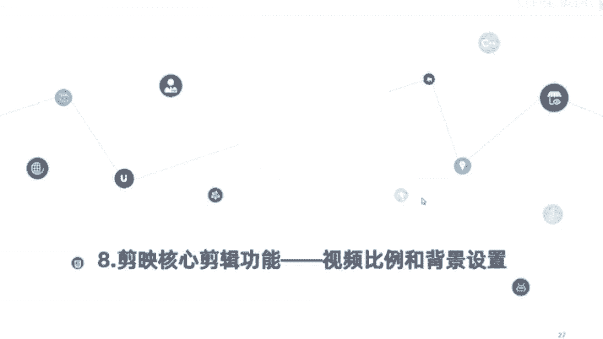

那视频的画幅比例和背景的调整呢，也是属于剪辑的一个基础，如果画幅的比例和背景的设置错误了，那后期会影响到我们的视频，一个推荐和播放效果，这是刚才给大家提到的，如果说你是拍VLOG视频的话。

那我我就建议大家拍什么横版的视频，然后呢上下黑边可以加上一个背景色，写上我们的标题或我们的相关核心关键词，那如果说我们拍摄情景剧，美食或者是旅行的话，那也建议大家呢拍成竖版的视频。

他的推荐效果可能会更好一些，那竖版的话也就是我们所谓的九比16，横版的话就是16比九，视频的分辨率一般是在1080P60帧，但是如果你有更高清的，也可以2K的或者4K的，简易的话，目前在导出视频这块。

它也是支持我们选择2K或者4K的，好了，那关于视频比例和背景色的调整这块呢，就先介绍到这个，那么接下来的话我们进入软件当中，详细给大家讲解如何呢，设置视频的比例和进行背景的一个调整。

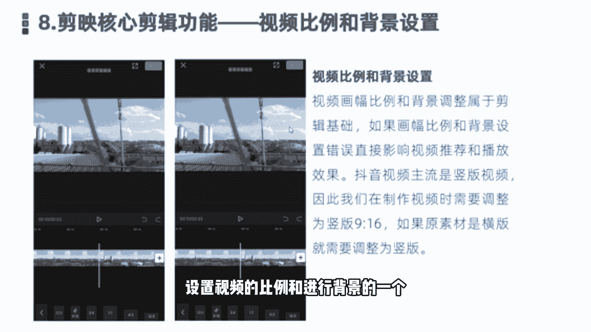

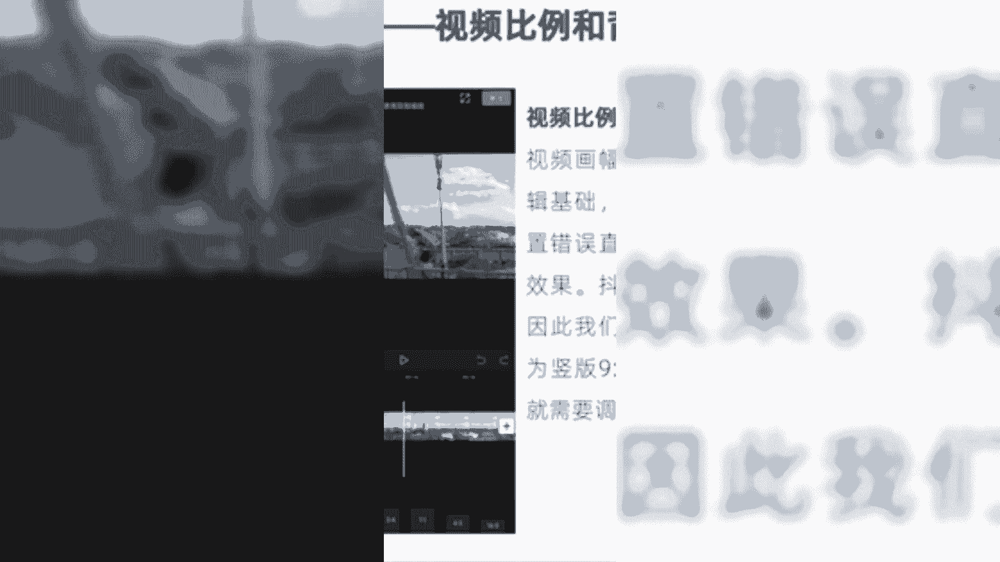

好，同样的，我们首先是，新建一个素材。

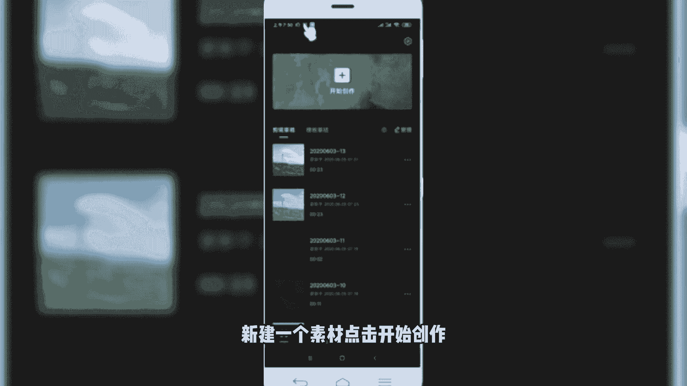

点击开始创作，然后呢导入一并一片素材，好我们导入素材，首先来预览一下，微微晨光点亮这喧嚣世界好，那这个呢我们看到的就是很典型的，他是一个什么横版的视频，那如果我们想要变成竖版的话，应该怎么样做呢。

啊这块就需要调整它的比例啊，我们给它调整怎么样选择呢，在一级菜单往右滑，底部可以看到有一个比例，还有一个背景啊，这两个是挨在一块进行设置，我们先选择比例。

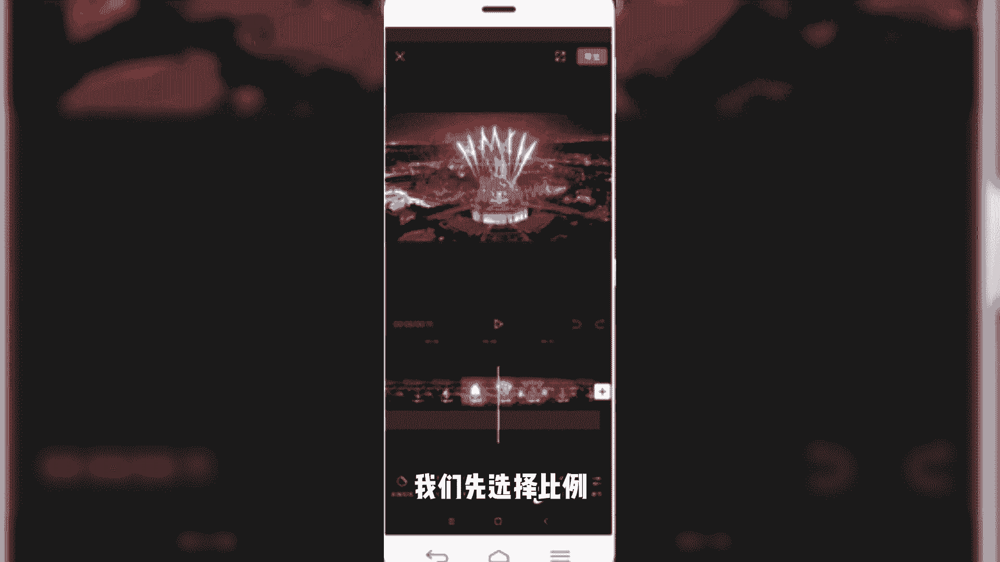

然后呢选择九比16，可以看到我们选择九比16呢，它就会变成这样一个竖版的一个界面，然后上下就变成了我们所谓的黑边，然后再来看一下效果啊，微微晨光点亮这喧嚣世界，微微温暖融化昨夜的冰雪。

就是我们看到的这种竖版的，九比16比例的视频，那么我们做出来之后可以发现啊，他的背景色呢是黑色的，看起来太过于单调，那我们想让它变得更加丰富多彩，怎么办呢，就需要给它的背景色进行调整设置。

同样返回到我们上一菜单，然后点击底部的背景，点击背景，然后会出现三个，一个是画布颜色，还有个画布样式，还有一个是模糊，画布模糊啊，我们挨个给大家讲一下，先说第一个画布颜色。

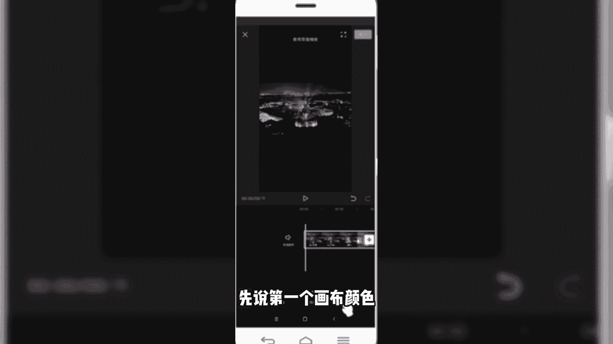

那我们可以给它添加一个相应的背景色啊，比如添加一个灰色，那背景色就变成灰色了，那添加红色的话，它的背景色就变成红色了，可能看起来更加的喜庆，微微晨光点亮啊，有很多颜色我们可以单独调整，只是画布颜色。

我们可以给它加一个纯色的背景，第二个呢是画布样式，我们除了添加纯色之外，还可以添加其他颜色的。

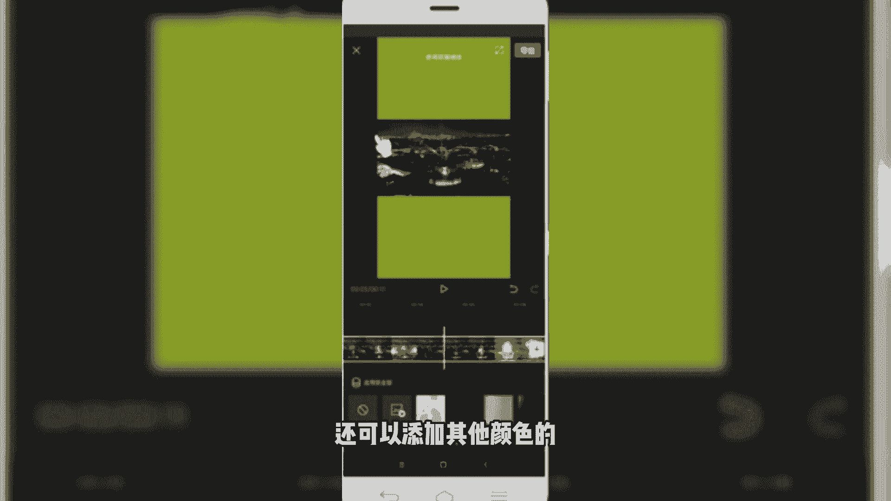

比如说我们给他换个其他的，变成这种，或者是变成这样的。

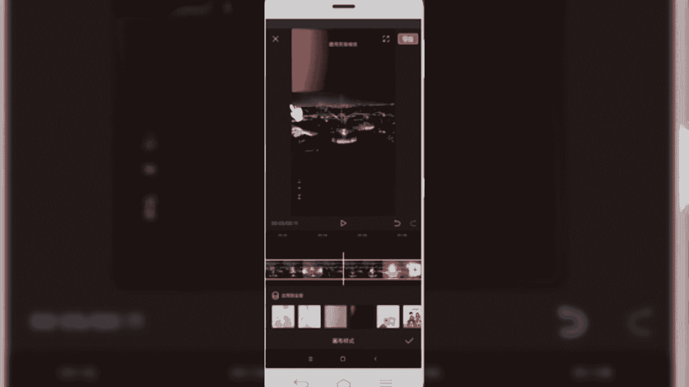

还可以变变成这种。

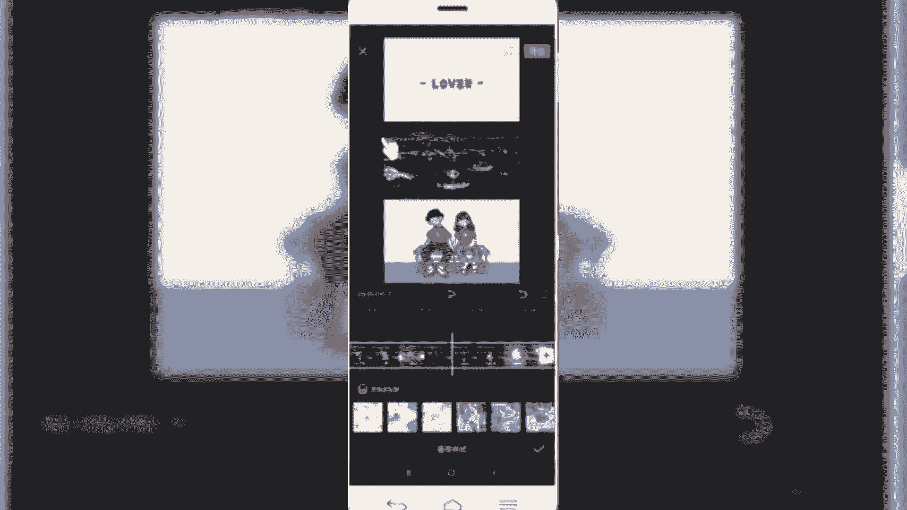

啊海报形式的背景创意，那这些呢都是抖音画布样式当中自带的啊。

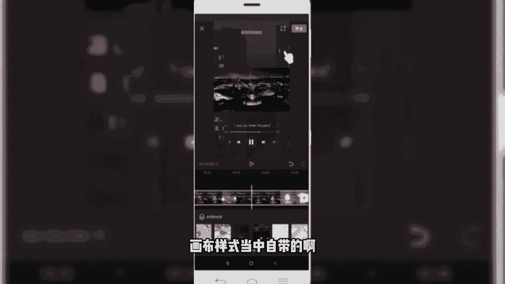

我们在剪映当中可以随意的选择，这些相应的画布，那第三个呢叫画布模糊，画不模糊的话，我们经常看到有些视频的，中间的视频播放呢是清晰的，然后呢上下两个边呢它是模糊的，这就是我们看到的画布模糊效果啊。

比如说我们选择一个滑步模糊，它有四种效果，从清晰到模糊，它的层级呢是强度也是逐渐递增啊，我们选我一般选择第二个。

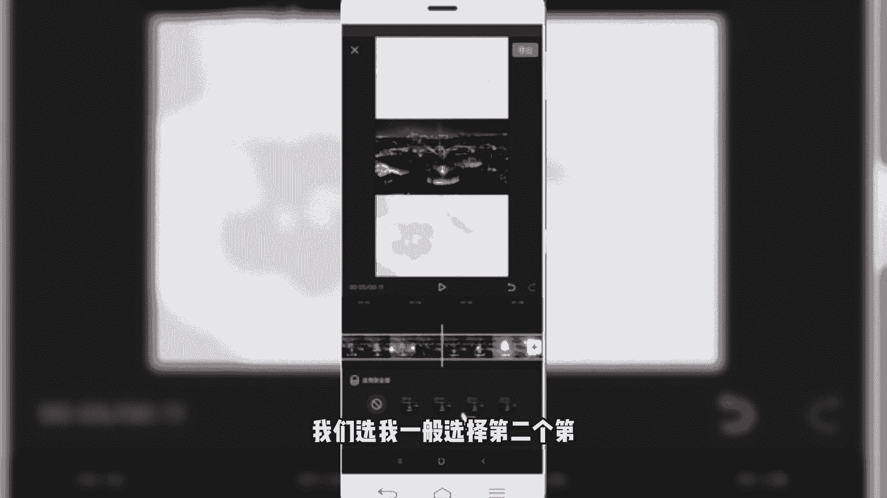

第三个就够了啊，我们选第二个，第三个的话模糊太厉害了，那第二个再来看一下视频，微微晨光点亮这喧嚣世界，微微温暖融化昨夜的冰雪好，我们应用，那么很快的，我们就给这个视频呢。

从刚才看到的横版的16比九的变成一个竖版，然后呢我们又给他的黑色纯色的一个背景色，给它添加上这样一个模糊的画布，那我们看到这个视频就变了，微微晨光点亮好，那这一块的话刚关于给大家分享的。

视频比例和我们的背景调整，这块呢就给大家分享这块，然后呢我们一块小结一下，我们主要讲的是抖音视频。

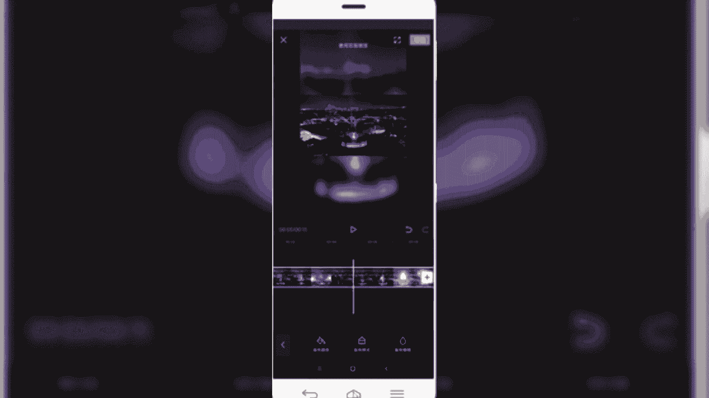

那抖音视频呢又以九比16的竖版视频为例，所以我们调整的视频画幅也好，视频的背景设置也罢，都是以围绕抖音短视频为主的，也是我们要以速版的视频为主，如果说我们拍的是横版呢。

那首先需要把我们的横版视频呢调整为竖版，把空出来的黑边边框呢，需要通过给他设置一下背景色来进行调整，那这样的话，我们视频可能看起来会更加的丰富多彩，提升我们一个视频的一个推荐量好了。

本节课程关于剪映的核心剪辑功能，视频比例和背景设置就给大家分享到这里。

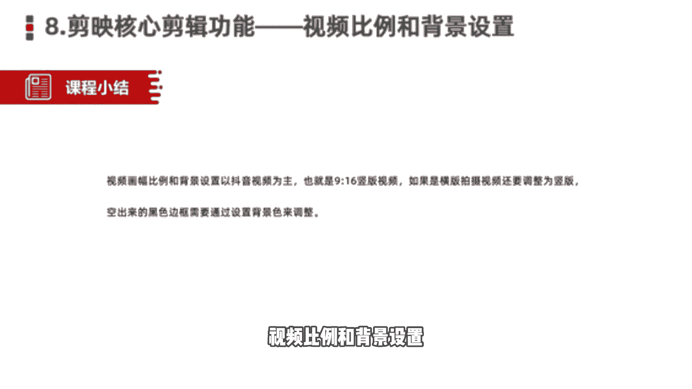