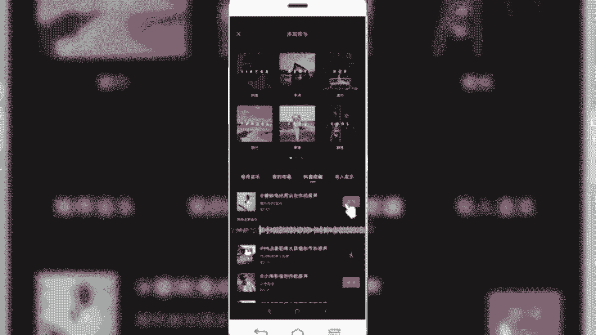
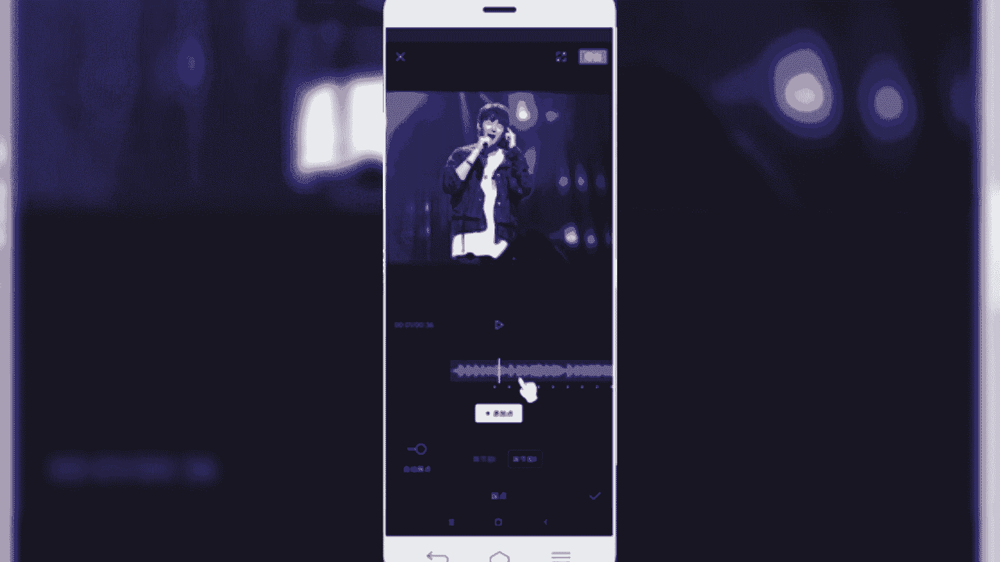

# 2024年做自媒体怎么快速起号？b站高口碑全自媒体运营课程，从0开始，转行做抖音自媒体从入门到精通，学习抖音短视频新媒体运营教程！ - P34：剪映核心剪辑功能——视频过渡转场 - bi道德未央 - BV176sKeTE9R

咱们今天呢接着跟大家分享的是，我们剪映的核心剪辑功能，视频的过渡转场，我们在观看短视频的时候，两个镜头之间衔接的过程当中，为了让两个镜头看起来没有那么的生，硬或者突兀，那我们在制作短视频的时候呢。

就需要运用到视频的过渡和转场的技巧，那么在我们短视频制作当中啊，有一个派别呢叫技术流派，那他们呢我们在短视频当中看到了很多，炫酷的运镜，炫酷的转场，那就是运用到了一些视频拍摄的转场技巧。

和视频拍摄的什么运镜技巧，那么我们今天要给大家分享的是，我们在剪辑过程当中，运用剪映当中给我们提供的一些转场功能，和视频过渡功能呢，来提升我们整个视频制作的效果，和我们视频制作的这个炫彩程度。

OK我们一块来看一下，那视频过渡转场是指的两个视频镜头之间，为了更好的衔接起来，而做的一些什么视频处理技巧，或者说视频剪辑方法，我们在抖音当中啊，看到很多爆款的卡点视频，相信各位小伙伴是在抖音当中。

经常刷到或经常看到的这些视频，都是借鉴了大量的转场技巧和视频过渡技巧，那么在剪映当中呢，我们如果说能够很好的巧妙地利用起来，这些转场和过渡的特效转场，那么我们那么也可以快速的制作出。

这样吸引人的卡点视频，或者说高逼格吸引眼球的那些运镜视频，OK那关于视频的过渡转场这块呢，就给大家介绍完了，然后呢，我们接下来的同样是进入我们的实操环节，给大家详细讲解一下，视频过渡和转场应该如何用。

好我们同样的是首先开始创建，然后呢我们以卡点视频为例，给大家做个简单的练习操作，如何使用视频的过渡转场，我们导入几张照片，好我们导入之后，然后导入之后，如果说我们要做一个卡点视频的话。

我们是不是要选择一个比较动感十足的，或者是抖音平台比较热门的BGM啊，好那么我们接下来首先给他选择一个音乐好，我们在这个音频当中选择抖音收藏。

把我们收藏好的音乐拿过来，我们先试听一下这个音乐，我想对决恋，啊明显可以看到他有什么动词打词，这种音乐节奏点，那对于我们做卡点视频来说是非常棒的音乐，那么我们可以把这个音乐为例，作为一个卡点类的视频。

好我们点击使用。

那音乐呢这块已经导入进来了，导入进来之后呢，我们接下来要做的是卡点，就是所谓的踩点，把我们的动词大使用节点呢拍着呢，节拍呢给大标注出来，然后呢我们接下来再做照片卡点视频的时候。

根据这个节点呢给大家设置转场和运镜，OK好，我们给音频设置一下踩点。

点击音频轨道，然后呢在底部呢选择踩点好，然后打开呢自动踩点，打开自动裁剪，可以看到他有两个节拍，一个是节拍一，一个是节拍二，节拍二的话它划分的裁分点呢会比较多一些，比较密集一些。

对我们做一些炫酷的卡点视频呢，看起来会更好一些，那节拍衣呢更适合做一些柔和型的，带有特效的那种卡点视频。

那么我们以节拍二为例，然后呢我们踩好点，然后可以看一下他听的音乐。

是不是在这个节节奏点上啊，可以明显听讲那种动词打次，动词打次，就是只要带有这种节骨谷子的节点的时候，他都多做一个标记，OK然后我们点击对号，那么再回到我们的视频剪辑轨道这一块呢。

可以看到在音频轨道上有这么多的小点，这是我们才分好的节点，也叫拍子，那么我们要做这样卡点视频的话，我们视频当中导入的这个照片呢，它在每个卡点上就会有一这样一个过渡，我们可以看到在导入的两张照片中间。

这些小方块，这都属于两个镜头之间的衔接点，那么我们就要在这两个衔接点之间呢，加上相应的什么转场和运镜的技巧。

如果说我们不加的话，我们正常浏览是什么样的效果呢，先来看一下。

啊算是没有一点动感和节奏感。

所以我们现在要调整带有动感和节奏感，那怎么调呢，首先啊我们需要调整照片的时长，按照我们采集分的点，第一个点在这个位置，然后我们调调整它的一个时长，选中第一个照片，然后呢拖动，然后和我们的时间线对齐。

然后第二个同样是点到第二个。

然后呢给它调整到我们的时间线，然后第三个同理也是那这块的话呃，为了我们演示的，我就不不等大家，我就赶紧加快操作了。

那么好，那么这块的话，关于我们照片之间的时长呢已经设置完了。

然后接下来的话我们需要给他添加转场，怎样添加呢，啊我们首先把鼠标拉大，把时间轨道轴上的两个视频。

之间的镜头呢给它拉长，然后呢我们可以放大，可以看的更清楚一些，然后我们点击中间转场地带的小方块点击，然后它会出现这些我们的技术转场，还有我们说运镜转场，幻灯片，特效遮罩类的等等有很多。

那我们选择一个运镜转场，然后呢选择一个比较炫酷的一些。

比如说推进的或者是拉远的，OK然后呢我们再设置第二个，刚才选的lion。

然后再选择一个推进，好那这块运镜转场的话，除了刚才讲的，还有很多其他的啊。

这些都可以尝试使用，那还有还有很多其他的，比如说我们看到的幻灯片形式的，还有特效类的转场，以及什么遮罩转场啊，有很多大家在制作的时候呢，可以尝试使用这这么多转场，好那这块我还是以运镜转场为例。

然后选择一个其他的。

我们每个视频之间呢都给它添加上这些转场。

好，那么这样的话，我们相当于后面的都给它添加完了。

好都添加完之后呢，我们再来预览一下，添加完转场之后的一个视频效果。

是不是添加完转场之后，看起来运镜的效果会更加绚丽呢。

但是如果说我们在做作卡点时候，还有一个就是照片的画幅。

我们可以看到明显的画幅呢有的是大，有的小呢，所以这一块的我同样也是需要给他调整一下画。

服务比例和我们的背景啊，选择九比16。

那我们可以调整一下它的大小。

这样的话看起来会更加的匀称一些，要不然图片比例不一样的话，可能看起来大小不一样。

我们选择把它调整一下，好我们都调整一下。

好调整完之后呢。

我们再来预览一下整体的效果怎么样，淡淡的人眼泪眼泪。

你爱定了，所以你要能再见。

是不是，比如看起来比原来要好很多了，如果说各位小伙伴在制作的时候呢。

如果说觉得只有运镜转场呢，看起来比较单调的话，怎么办呢，我们为了提升视频的一个绚丽程度呢，还可以添加一些特效，那我们在前面讲到一些特效呢，也可以添加到视频当中。

比如说第一个添加一个变清晰。

然后呢还可以添加一些其他的特效，比如说这个选择晶片吧，你也可以选择动感类的，也有很多。

选择一个抖动的也可以，好然后我们需要给它设置好，同样设置它的一个这个位置和时长。

好我们再来个原来效效果，是不是这样看起来的话会更加的绚丽多彩呢。

OK那这话关于给大家讲解的视频过渡，转场内容呢，我们就给大家分享到这里，然后呢我们一块来小结一下，那本节课呢主要给大家分享的是，在剪映当中的视频过渡和转场功能，点击视频轨道上两个视频之间的衔接。

中间的小方块或者衔接点呢就可以实现呢，给剪辑当中的视频添加转场效果，那简易尼亚也是提供了大量的，转场的素材和效果库，那我们可以看到有基础转场啊，运镜转场啊，幻灯片啊，遮罩转场啊等等。

有很多我们可以利用这些转场的方式，来提升我们视频制作的一个旋律，效果和丰富效果，对我们后期特别是做卡点类的视频来说，有很大的帮助，那么好今天呢关于分享剪映的剪辑核心。

