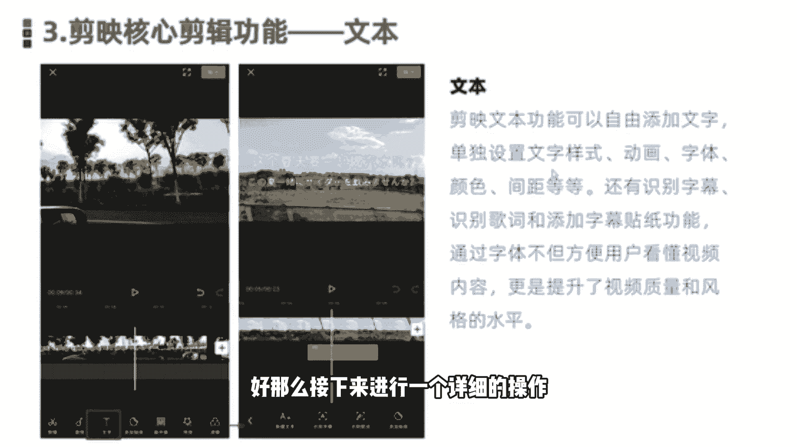
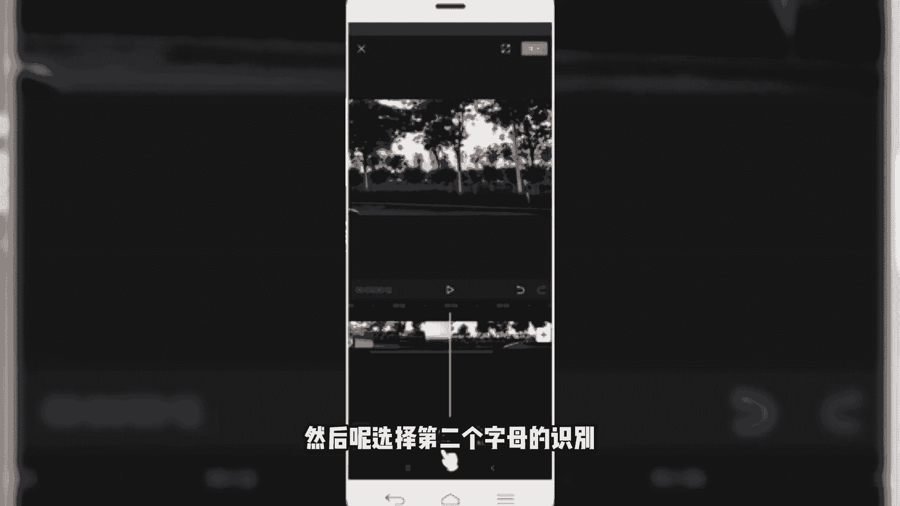
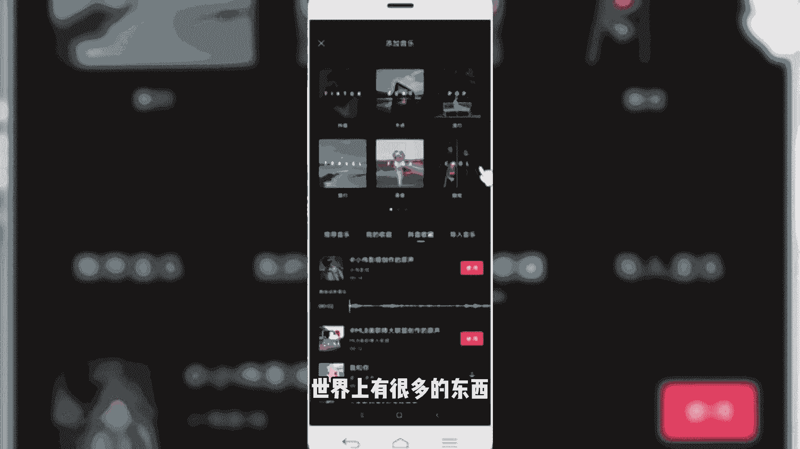

# 2024年做自媒体怎么快速起号？b站高口碑全自媒体运营课程，从0开始，转行做抖音自媒体从入门到精通，学习抖音短视频新媒体运营教程！ - P37：剪映核心剪辑功能--文本功能 - bi道德未央 - BV176sKeTE9R

咱们今天呢要给大家分享的是剪映的核心功能，第三部分文本功能，我们知道一条完整的视频，除了有视频的画面，背景音乐或者说音频，另外一个非常重要的元素呢就是文本，或者说叫我们的字幕。

那么我们可以通过添加文本或字幕的形式呢，更加准确地传递出我们视频想要表达的主，题和思想以及相关信息，用户在看的时候呢，可以更加的明确，或者更加快速的了解我们想要传达的内容好。

那么这节课呢就给大家讲解的是如何呢，通过剪映给我本视频输入相应的文本，或者说简易当中的文本功能使用方法和技巧。

在剪映当中啊，我们可以自由的通过文本功能呢，给我们视频植入相应的字幕，那植物的字幕呢还可以给它单独的设置，我们字幕的一个样式，包括字体呀，字号啊，颜色呀，间距呀，以及我们视频的字幕动画等等。

都可以添加当中，那另外需要额外给大家讲的是，在剪映当中有两个非常好的功能，是字幕的自动识别和歌词识别功能，我们添加了相应的文本信息，可以是手动的，还可以是什么，我们比如说添加好音频了。

已经配置好相应的话外音了，那这种情况下，可以通过使识别字幕或者是识别歌词的方式，一键给我们视频快速添加上相应的字幕，非常的快速，降低了我们什么操作的一个难度和时间的成本，最后一个就是在文本功能当中啊。

还有一个是可以添加贴纸，OK那这块关于文本功能的基本介绍，就给大家讲到这里，那接下来的话进入我们的一个功能，实操演练的环节，那文本功能呢同样是我们在添加完视频当中啊。

在一级菜单这一块就可以看到一个文字啊，我们点击文字功能，然后就会出现四个新建文本识别字幕，识别歌词和我们的贴纸好，那么接下来进行一个详细的操作。

好还是以刚才这条视频为例给大家进行演示，那么我们刚才已经给大家植入了音频，那音频当中呢可以看到啊，它是有歌词的，好我给他先删除，那么我们在这个视频当中首先植入字幕，怎么样植入字幕呢，回到一级菜单。

点击返回，好在底部菜单栏可以看到文字，我们点击文字，然后呢可以给他添加文本啊，我们直接在这块输入，那这块的话为了方便演示，我就不多说了，六个字剪映视频剪辑教程，那么我们输入完之后呢。

可以看到这块就会添加出来，这样一个文字的轨道，那么我们可以可以对文字的样式呢，进行一个简单的设置，我们点击底部的样式，然后可以看到对文字的字体呀，一个描边啊，或者是标签啊，阴影啊，字间距啊，对齐等等。

可以进行单独设置，我们比如说给他设置一个字体啊，新青年体目前在抖音上特别火，然后可以给他设置一个描边，啊，还可以选择描边的一个粗细度，或描边的一个颜色啊，红色的，灰色的啊，黄色的，你可以选择，蓝色的。

好描边粗细度也可以给它进行调整，那还可以选择什么抖音，官方推出的什么花字啊，我们在抖音上看到很多，比较有意思的一种字体啊，叫花字，那么我们可以直接选中，就一键编成这种花字，像做种草类的视频。

或者说做搞笑段子呀，还有那种路人采访的时候，有很多情况下用到的就是这种花字，啊我们可以直接拿过来使用，还有一些呢是我们看到这种综艺节目当中，或者VLOG当中经常用的，这种对话形式的这种气泡。

那同样在这个地方，我们也是可以植入相应的字幕的，啊比如说我们选中这个啊，直接就变成带气泡的这种文字字体，那第四个的话是我们的动画，可以给我们的文字呢加入相应的动画啊，比如说添加一个螺旋上升入场动画啊。

还可以设置一下入场动画的时间，啊看起来这样的话文字会更有灵魂，或者是更加的一个俏皮或者是有趣，也可以设置他的一个出场动画就结束的时候，这个出场动画，啊这也可以设置，好设置完保存。

那么我们再来预览看一下，那就看到我们刚才添加了个字幕啊，这是刚刚给大家分享的新建文本，手动输入的方式，那第二个叫识别字幕，就是我们看到有些视频当中啊，他是本身带有语音对话的，或者是带有文本的信息。

通过语音播出来的，那这种情况下我们可以通过识别字幕来添加啊，我们同样举个例子，找一段，那么我们可以通过刚才的音频呢录上一段话，好我们随便举个例子，剪映视频剪辑教程，好那这块的话我们添加了这样一段音频。

可以试听一下，好我们有了之后呢，保存回到我们的文本界面，点击文字，然后呢选择第二个字幕的识别。

然后点击开始识别，好那这块可以看到，同样是也是已经给我们添加出来，我们刚刚录制的这段话，在视频当中就会出现，然后我们预览一下剪映视频剪辑教程好，是不是就通过这种识别形式的。

一键给我们视频快速的添加上字幕了，这是我们讲到的第二个字幕的识别，那第三个歌词的识别的话同理，而我们添加上一些音音频呢是有歌词的，那这种情况下通过歌词识别的话，也是可以快速的给我们视频当中植入。

歌词的字幕，那我们把这个文字删除，然后呢添加一个歌曲。

好选择我们抖音收藏，还是以刚才那个音乐，那我们试听一下，世界上有很多的东西好。

它是有歌词的，我们把它导入对齐，然后回到文本的界面，选择文字。

然后歌词识别。

点击开始识别，好那同样情况下我们识别完成之后呢，也可以看到在我们的视频轨道下方，已经出现了这个文字的轨道，然后视频画面当中也出现了我们的歌词，然后我们同样预览一下效果，世界上有很多的东西，生不带来。

死不带去，你能带走的只有自己和自己的脾气好，是不是就可以快速的添加上我们的歌词啦，那我如果说我们想要提升意境的话，可以给我们的歌词的样式进行一个设置啊，比如说把那位置调整一下，然后呢选择一个，放大。

然后选择一个其他的字体，然后给他选择一个描边，好然后再给它加一个动画，好那么我们同样再来预览一下效果，时间长，有很多的东西生不带来，死不带去，你能带走的只有自己和自己的脾气好。

是不是这样会看起来更加好呢，如果说我们这块视频当中的文本信息，植入完成之后呢，那我们可以导出，那就视频制作完成了，可以看下成片的效果。

OK那这一块的话关于文本功能的内容了，就暂时介绍到这块。

我们一块来总结一下，文文当中的文本功能，可以快速的为视频呢添加上字幕，还可以呢对字幕的颜色，字体字号，动画间距等等呢进行一系列个性化的调整啊，通过添加字幕呢，可以大大提升我们的视频内容传达的信息。

和我们视频的内容质量好，那么今天这节课呢，关于剪映的核心解析功能就给大家分享到这里。

