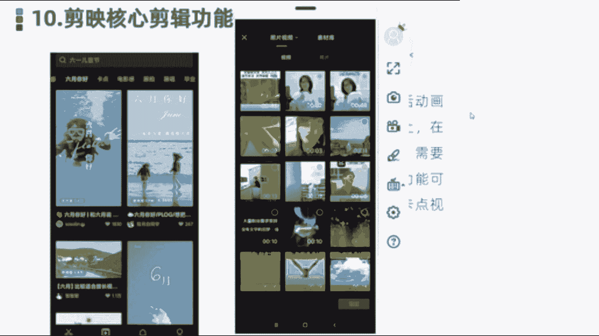
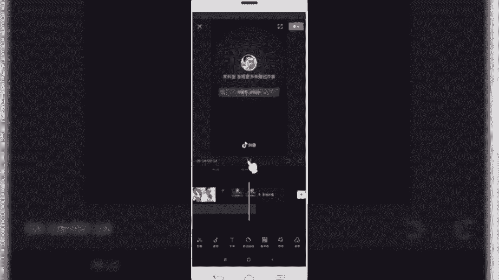
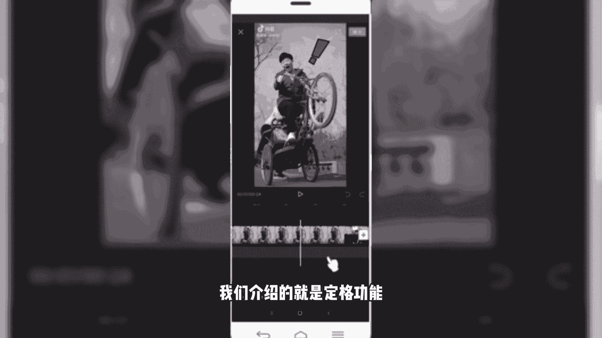
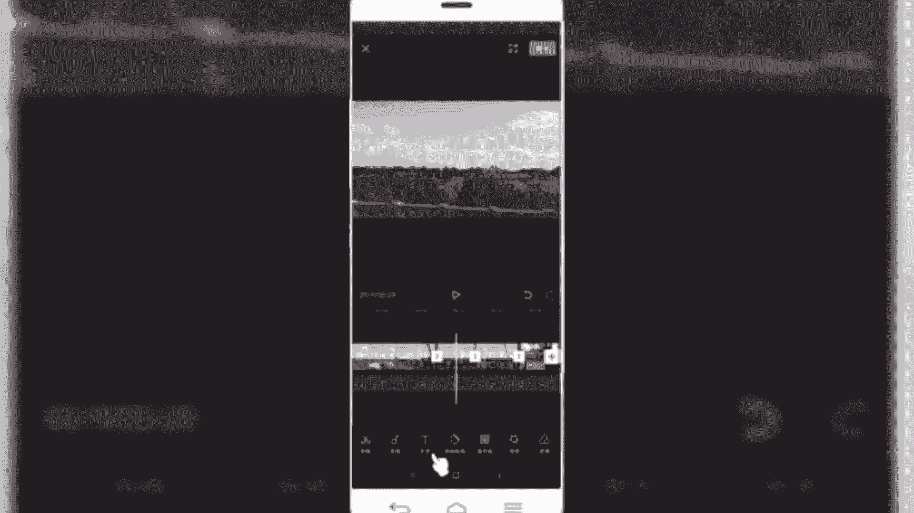
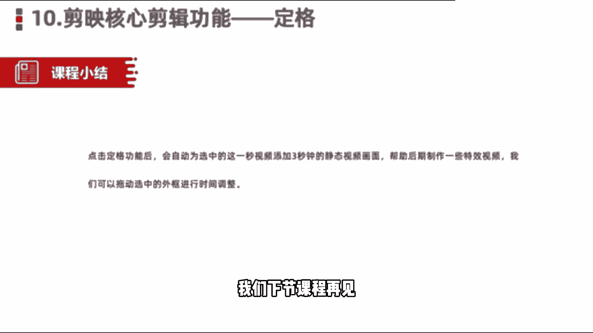

# 2024年做自媒体怎么快速起号？b站高口碑全自媒体运营课程，从0开始，转行做抖音自媒体从入门到精通，学习抖音短视频新媒体运营教程！ - P38：剪映核心剪辑功能——帧定格 - bi道德未央 - BV176sKeTE9R

好各位小伙伴们，我们今天呢今给大家分享的是，剪映的核心剪辑功能，定格功能，定格功能指的是啊，我们在电影电视剧的活动画面当中啊，突然停止在某一个镜头画面上，在制作一些特效视频的时候啊。

就需要接触到这些定格功能，使用定格功能呢也是可以方便我们在剪映里边，或者在手机上快速的制作出一些卡点类，比较绚丽的这种视频，那么我们讲这么多理论，可能很多小伙伴还是在理解，卡点功能和这个定格上。

有什么样一个这个表现或展示，那我们找几个案例可以看一下，或者我们找个视频，大家也可以来啊，看一下这个效果好，那么我们进入这个实操的环节，打开我们手机上的这个剪映，然后呢我们在顶部点击创作。

导入一些相关的一些素材，好我们找一段素材看一下。

好我们导入视频素材之后呢，接下来一块来预览一下，点击预览按钮，哦又等到响起了下课铃，已经约好在操场等你，夏天真的十分的可一，带你去吃草莓冰淇淋淋淋，如果你有一点坏吸引力，我为你弹肖邦圆舞曲。

听到这首轻松的旋律，好像吃了夹心巧克力，好我们在这块看到这个视频啊。

视频每一个镜头切换最后一帧，这一块其实就用到了一个定格功能啊，这也是在抖音上看到的，前段时间比较火的这样一个万有引力卡点视频，那这个视频就是我们看到的，使用了定格功能来创建的，那我们来简单看一下。

在镜头的最后一秒钟啊，我们把它拉大，先看第一个镜头啊，就是我们听到这个枪声，那个卡点通了一声之后呢，我们看到的视频镜头，他在下一个转场之间，就是把这个秒钟视频的静止，然后就是添加了定格功能。

然后添加到下一场，就是让用户看起来呢他有一个静止的这样画效，然后就特别的炫酷啊，就像拍两张照片一样，就是指最后那一秒钟，好，那像这种的话是使用了我们介绍的，就是定格功能。

怎么样做的话，我们同样是导一段是视频素材，然后导入那一段视频素材导入，好比如说我们导入这段视频素材，天空特别蓝啊，这个视频时间有点长啊，我给大家裁切一下，点击分割裁切，然后把前部分多余的删除掉。

那么我们想要给这个视频添加，卡点定格功能的话，怎么样添加呢，先选中这段素材，然后的话我们在二级菜单最后一个地方，点击倒格定格啊，那这个方有个定格，然后我们点击定格功能。

那默认情况下就会把我们视频这段素材，最后一个镜头给截出来，然后呢延长三秒钟，就相当于添加了这块，添加了一张静止的照片，那然后呢我们可以给这个视频呢，这个照片呢或者说我们的定格呢，给它进行一个编辑。

比如说我们给它添加一个特效或者滤镜，像刚才看到的，我们是用了一个牛皮纸或者黑白褪色的，能找一个两个褪色的，好他是用了一个牛皮纸，然后呢我们同样啊，再看一下这个效果，设置下这个时长，好我们预览一下啊。

啊看到没有，那这一段呢就变成了这样一个静态的，那他本来设计在火车上拍了一个动态的，然后到了这个镜头，那就变成了个静态的不动了，然后呢天空变色了，这是我们用的比较多的这种定格类的功能，好选中完之后呢。

我们同样还可以给它添加相应的滤镜啊，也可以给它删除。

OK那么关于剪映当中的定格功能，点击定格功能之后呢，会自动被选中的这一秒视频，添加三秒钟的什么静态视频画面，帮助我们后期做一些特效的卡点卡点视频啊，我们也可以在啊拖动选框外的这个时间轴呢。

给他设置下的选框的定格时间，除了三秒钟之外，我们可以可以单独给他设置，比如说一秒钟或者两秒钟，也可以单独给他设置，那么好，同学们，那么今天这节课呢给大家分享的，剪映的核心剪辑功能。

定格功能我们就分享到这里。

