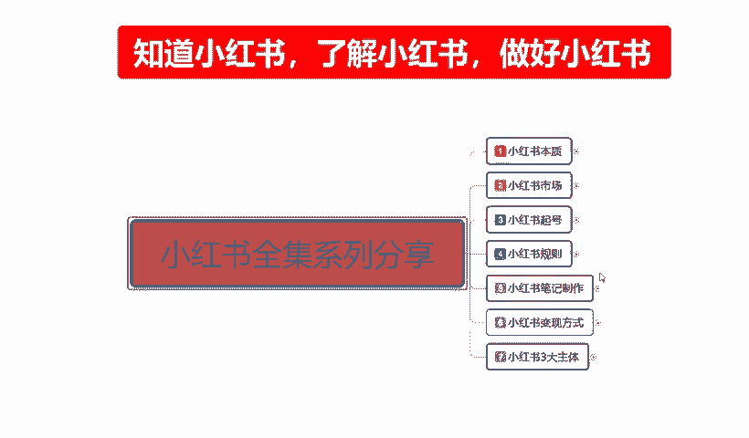
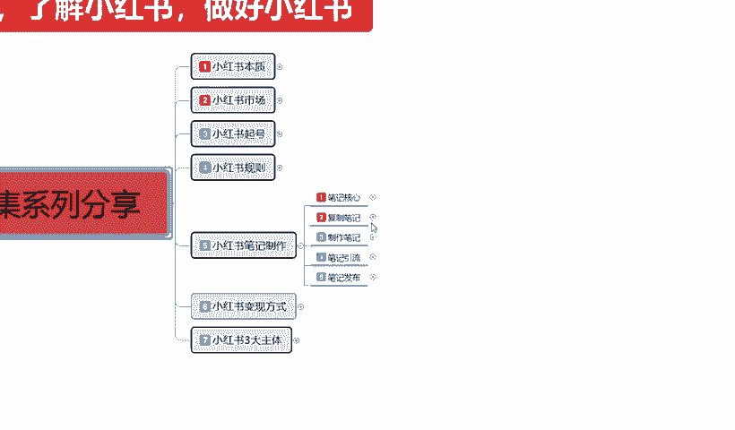
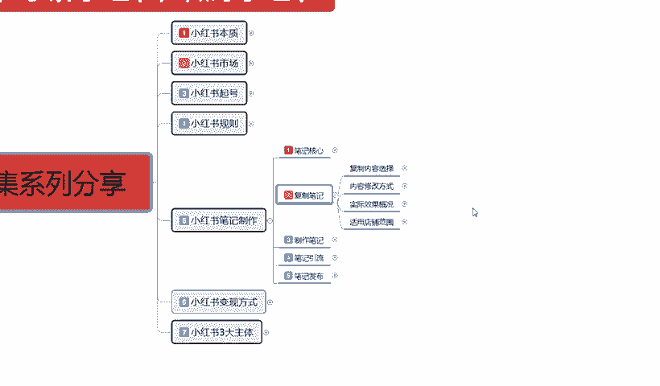
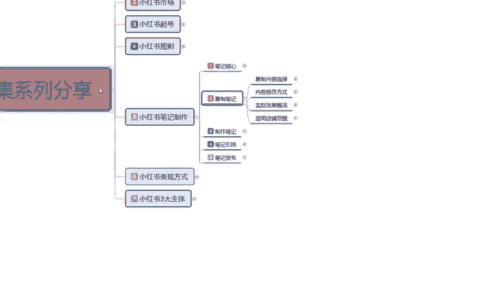
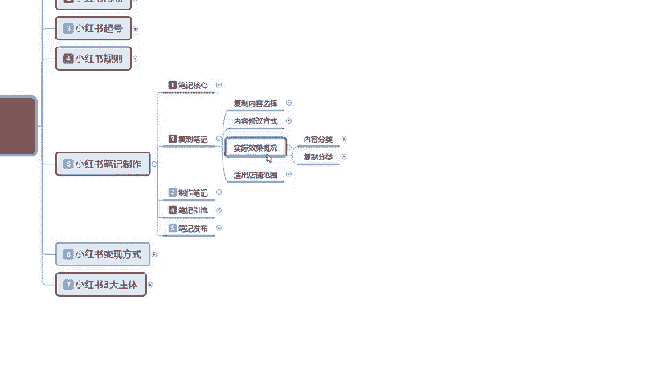
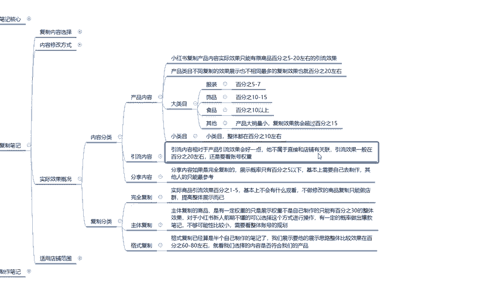
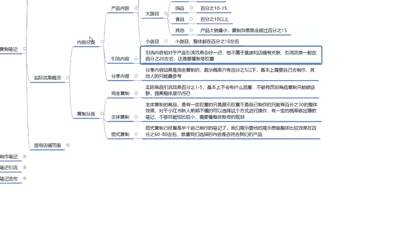
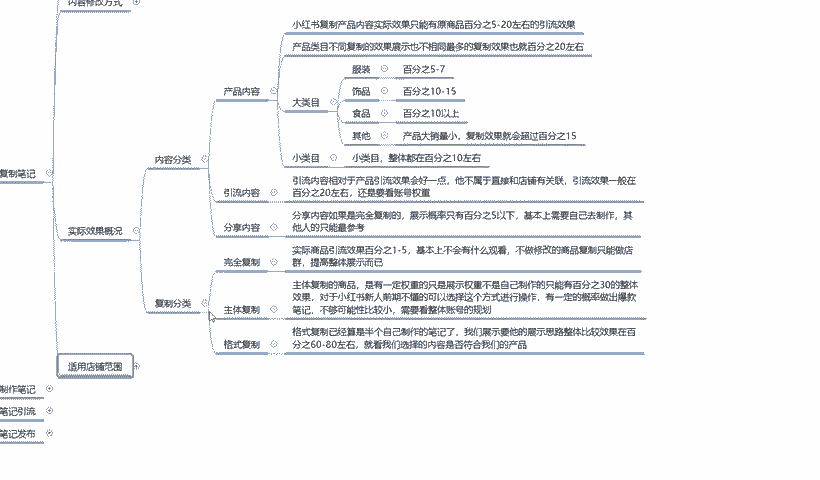
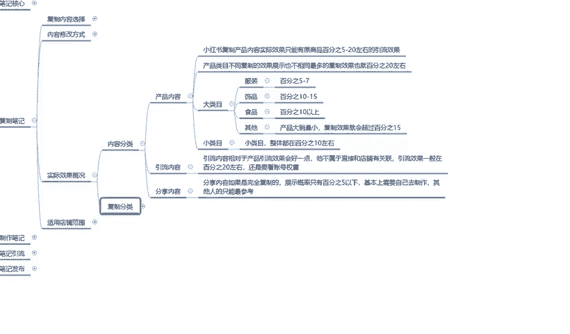

# 2024年全网最干货的小红书运营教程，小红书运营系统课(包含了剪辑／起号／小红书无货源各种玩法）小红书短视频零基础入门到精通，吊打一切付费课！ - P19：17、新手小红书运营-小红书复制笔记：复制内容分类 - 红书教程3 - BV1h1yNYXEvT

大家好，这节课后给大家分享的是小红书全集系列第五大课时的。第四小节。主要呢就是给大家讲解一下我们后续的一个内容啊。

复制笔记里面的一个实际效果概况，包括我们它的一个整体适用店铺范围。

这节课内容的话其实不是太多，但是他对我们前期的一个选择来说的话还是比较重要的。

嗯，首先我们来了解一下什么叫实际效果概括啊。就合我们上节课所讲的一个内容。

就说我把它整体分为了两大部分。一个是内容分类，第二个是复制分类，内容分类是产品内容引流内容和分享内容。小红书复制产品内容的话，实际效果只能源有商品的5%到20%的一个作用。引流效果就是说。嗯。

在小红书上面同类的一个笔记，你去复制同同类产品，别人的一个笔记效果。你把它复制过来的话，它整体的一个引流效果就是只能达到5%到20%。所以说我们在选择复制笔记的时候，选择的话。

基本上都是小眼睛在5000以，5000以上两一直到2万左右。如果说超过这个范围以上的话，我们再去复制那个别人会投诉的啊，第一个你的店铺会违规。就是说不要复制太过于爆款的一个呃文案和笔记。

你可以复制它的一个内容。但是超过2万以后的千万千万不要去那个。再去复责了，因为这里面的话其实有两点。第一点就是说容易被投诉，导致整体店铺降权。我们本来就是前期刚开始操作，你降降一下权的话。

你后续后续的话就不好操作。第二个就是他的小眼笔单个笔记，小眼睛经超过2万以后，它的整体流量你把它拉不过来，懂意思吧？你只能给他继续增加权重。就比方说他现在有2万，你然后拿他的一个笔记文案的一个效果。

然后你自己做了以后再进行发布，你可以从中蹭流量。我们正常的话应该是5%到20%的一个流量。然后拿1万计算，5%的话就是500个现在已。到20%的话，就是2000，这只是拿1万来计算。

就看我们自己选择一个比例效果。但如果说超过2万以后的话，我们整体效果的话，可能就是在5%左右，它不会超过太高了，基本上就固定在5%，就是超过2万以后只有5%，而且还面临一个投诉的风险。

同时你还给这个原笔记增加了全额。让很多小云红书肉的用户的话，他看到你的笔记，觉得你是作假的，对你的话呃信任度不那么高，他会直接跳转到他之前看过的这篇笔记去。懂意思吧？就是泰国网红爆款的内容。

不要你就不要去抄抄的话就是选择在5000到2万这个范围之内去做商品的一个。引流就行啊，这是内容部分的一个选项。产品内容。第二个就是产品内幕不同啊，它整体复制效果的话就是展示也不相同。

最多的话复制效果也就是20%左右。就比方说我们选择任何类目的一个产品，我们去负责它，不管怎么负责，它整体效果的话。都有一个局限性，正点的我也给大家列出来了，大类幕里面。

服装饰品、食品啊包括其他就是说嗯其他的话就是产品大销量小，产品大销量小，就相当于那种木质家具啊，定制类的这种啊，它的一个复制效果就会超过15%。其他类的话就说服装是5%到7%。

服装同类款同款类型的一个笔记复制量。别人怎么拍的，你把它弄过来，放到自己店里面，引流的效果只有5%到7%。也就是说你选择复制这个行业里面的一个类目量的话，就是嗯同款的爆款比。

别人有2000不有2万的一个展示量。那么到你手上可能就1001万的一个小影音展示量呃，1000。1万偏多了啊，有1万50%了，基本上只有5%到7%，就是1000到1200左右的一个相应业素量。

就是这种类似的一个产品，服装的话效果还算。嗯。一般。因为他的那个大众内部太多了啊。第个就是四品四品的话就是说它整体的话，因为四品它属于小件。而且省很多样式和款式，所以导致它整体的话，嗯，别人看见以后。

他会以为你的是新的。所以说它整体的一个笔级效果的话，引流量可以达到10%到15%。食品类的也是一样的道理，它的一个也是在10%以上。但是具体数额的话我们没办法确定。因为食品的话嗯它的。怎么说呢？

你要是做。嗯，居家的那种就是厨房我们自己能做的那种嗯类型的食品的话，它的。整体搜索量的话可能在15%往上走2025都有可能。但是概率不大。如果说我们做那种精致的小蛋糕啊。或者说是美食分享之类的。

这种的话就基本上只有10%左右啊，这就是大类目的一个范围。小类目的话整体都在10%左右啊。什么叫小类啊？就是搜索人比较小。你比方说那个什么发泡的鱼啊。啊，等等。就是说搜索目的很小。

整体这个比例在这量的话大概就在10%左右。就是原视频有2万，那么你可能的话就是2000。这是产品内容的一个选项。第二个就是引流内容。什么是引流内容呢？引流内容相对于产品的话，就是说因为这个是产品。

就是根据我们商品进行发放的选项，它所得到的一个比例。后面的引流内容的话，它相对于产品引流效果的话，它会好一点。它不属于直接和店铺有关联的引流效果的话一般都在20%左右。

但是还是要看我们账号整体的一个权重啊。你如果说是基础账号的话，你全重你复制复制类似的笔记的话，最多升到第二级，可能达到7天的一个引流效果。他的引流的量的话就是20%。你比方说你负责了1个1万的。

那么到你这儿的话，小眼睛可能达到1500到2000下。啊，就20%左右，效果还是不错。同样的别人也会增加权重的啊，因为同类型的一个笔记复制的越多，它的权重也就越高。呃，这个里面涉及到一个点。

就是小红书说矩阵的。

他有很多很多的小账号去帮他做这个举证，也有一定的效果。但是你要内容是精品的啊。但是我这一套真理整个一套课程说实话没有给大家讲举证。因为的话现在做举证的话，小同书说举证投入太大啊，不是一般人能做的。

所以说我在这里呢只是说给大家啊提醒一下大家有这方面的意思，了解什么是举证就行，好吧。然后呢，是分享内容，什么是分享内容呢？分享内容的话，嗯，如果说是完全负责展示概率的话，只有5%以下。

基本上就是这个的话，说实话就是需要去自己去自作的其他人的指纹做参考。就是别人怎么分享他的产品的一个介绍啊，特点啊之类的东西。这个东西说实话，那你复制过来也没用，基本上都是根据产品嗯。

本身店铺的一个产品也好，或者根据自身的一个属性和内容去。你说你网红博主，你不可能完全去复制，仿造别人模仿啊。你做模仿秀的话，现在虽然说很火，但是你没有一定的特长，你做不了。所以说整体的一个分享内容。

我们去做复制的话。效果不好，只有5%，最高的也只有5%。所以说这这个分享内容还是大家自己做比较好一点。这个呢就是内容分享里面产品引流。

三个点啊给大家进行了一个效果分析。就是说我们前期做的时候啊，你选的时候。让大家明白你自己的店铺不是做不起来啊，让大家明白你的店铺不是做不起来。只是说我们把别人的东西复制过来以后的话。

肯定是没有原创的一个属性高。懂意思吧？就是说我们不管怎么去弄，把别人的东西复制过来，它的属性的话，永远不可能有别人原创的高。偶尔有那么一两个复制的产品比原创的高，但是这种概率的话太小了。

不要去赌这个概率，千分之1万分之1的概率你去赌，你还不如去买彩票呢，对吧？这个就是整体的一个实际效果概况。呃，包括后面一部分的一个复责分类。那因为课程的一个时间原因，这一课呢就不给往大家往下面讲了。

大家这一部分的话主要是先了解一下我们的一个内容分类。下一节的话就给大家讲一下我们复字分类，还有我们最后复制笔记的一个内容适用的一个店铺范围。

那这节课呢就到这里。

