# 2024年全网最干货的小红书运营教程，小红书运营系统课(包含了剪辑／起号／小红书无货源各种玩法）小红书短视频零基础入门到精通，吊打一切付费课！ - P25：23、小红书【商品笔记】制作：爆款标题制作 - 红书教程3 - BV1h1yNYXEvT

大家好，这一节给大家分享的是小红书全集系列第五大课时的笔记制作内容。

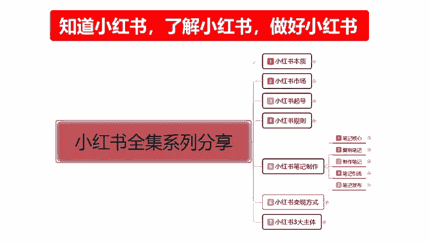

结合我们上节课啊已经给大家讲到了我们的一个用户互动。这节课的话主要是给大家讲解一下我们笔记制作里面第二大组点。标题的一个创作啊，之前给大家说过了，笔记的核心的话，其实就是两个主要点。

其他的话都是附带的一个影响。第一个主要点呢就是封面的一个设计。第二个的话就是标题的一个创作。这节课呢主要是给大家讲解一下我们的一个标题创作。标题创作其实的话看着其实很简单。但是我们选词选内容的话。

它方式方方式方法和多样性的话是非常重要的啊。首先标题的话应该演决明了适当的添加表情符号和颜色。因为小红书的标题的话，它没有那么多的一个限制啊，尤其是我们引流的一个标题。你商品标题的话不行。

商品品标题的话，它要靠关键词的。然后呢，他所用数字类的一个标题，针对特定的人群的一个标题，以增加冲击力度。懂意思吧？就是我们在创作标题的时候，你有时候的话，你在上面打个。一些连贯性的数字的话。

其实我们在内心里面的想法，对于这些数字游戏的话，我们了解是比较多的。比方说520521或者说是其他的呃148等等。这种的话，你下意识的就会把这种标题的数字内容的话，把它更改为对应的数字。

你不管是骂人的也好啊，赞美的也好，他这这个里面感性的也好，他在里面的话。就说我们对数字标题的话还是比较敏感，也有吸引力的啊。当然了，这种的话比较费脑筋的事情呃。怎么说呢？

就是吸引特定人群的话还是比较好用的。但是你整体去推广的话，对那种脑子笨的来说的话，看不懂。好吧，有有利也有弊啊。嗯，然后整个标题操作的话，其实在这里呢是给大家分了三个点。第一个是主题题突出。

第二个是内容明确。第三个是吸引力要强。这三个点的话，其实我们理解的话还是比较好理解的。这个内容有点大，先给他说一下。

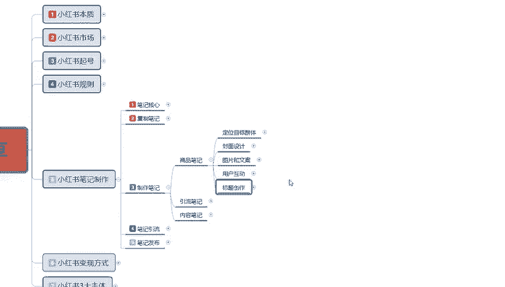

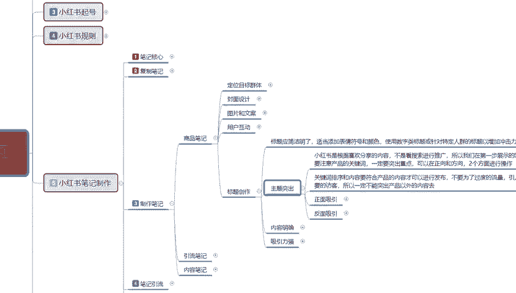

我们先了解一下啊，什么是主题突出。小红书的话，它是根据呃喜欢分享的一个内容啊，不要哦就说我们不要看搜索进行推广。所以我们。嗯，怎么说呢？就是小书的主题，它的一个整体标题创作的话，笔记的一个。标题也好。

你是商品笔记，搜索笔记引流笔记。它所有的一个标题。它显示的位置是不一样的啊，我们在操作的时候，你要根据针对你所发布的一个位置和范围进行推广。就是说不要看搜索进行推广啊，它是分类的。你的商品笔记的话。

它是在搜索里面的。你的引流笔记的话，它是在。嗯。引流笔记，它就是我们系统进去以后的话，就是推荐的一个流量。在这个里面的内容笔记，说实话你内容笔记它也有推荐流量，但主体来说的话，你基本上都是。吸引粉丝。

怎么说呢？就是吸引粉丝负带推荐流量啊，看你的主题够不够吸引力度。所以我们在第一步展示的时候，就要注意产品的一个关键词，一定要突出重点啊。可以在正向和反向两个方面进行操作。什么意思呢？

就是说呃关键词我们在操作的时候，它有正面介绍和反面介绍两个类型，正面介绍就是产品的好。在小红书上面的话，说实话它版面介绍用的稍微多一点，正面介绍的话反而没那么多。因为我们平常的话，在不管是男性也好。

女性也好，或者说其他的用户类型呀。我们所看的内容很多都是介绍正面的一个因素。但是小红书上面的话，说实话，他逆反心理的人占比35%以上。什么叫逆反心理？逆反心你的意思就是说，好的看多了，我现在想看点坏的。

啊，我对社会都不满，我对生活都不满。我想去了解这一方面的一个信息，或者说预防我以后上当受骗，去了解这方面的信息，避免产坑的一些反向吸引力度。这个他你大家如果说明白意思的话，就这么明白。不明白的话。

大家可以学习下啊，什么叫正面性？什么叫反面性。一样的道理的啊，待会儿的话我会给把给大家把正面性和反面性引的词汇给大家列举一下，大家可以去了解一下。当然这个词汇的话是网络上面，我给大家找的资料啊。

我就不一一去介绍了。然后关键词的排序和内容的话，它要符合整个产品的一个内容才可以进行发布啊。如果说我们发布商品的话，就是商品笔记。我们在发布的时候一定要符合产品的一个内容特征去发布。就是产品标题。

为什么我刚刚之前给大家说你的一个产品标题也好，引流标题也好，内容标题也好，他们都是不一样的。产品标题你要根据产品的实质情况去发布。内容。嗯。和你的产品。标题要相关，你不能说是我本来是卖女装的对吧？

我们连衣裙，你发个短袖的一个标题出去，那肯定是不行的。就以说你的标题要和你的产品匹配系统才会收录。你如果说你的标题和产品不匹配的话，系统无法收录的。你的数你的数据量是错的，别人给你展示，你没有展。

就是相当于是没有点击，你的后续数据做不起来的，你拿的门词拿其他的词汇去做主标题的话，搜索出来的结果也不好。所说我们要把主题突出这里面的两个重点给大家啊，详细的讲解一下，让大家整体明白一下。

然后这个正面性的一个词汇和反面性的词汇嗯，先展示给大家看一下吧。

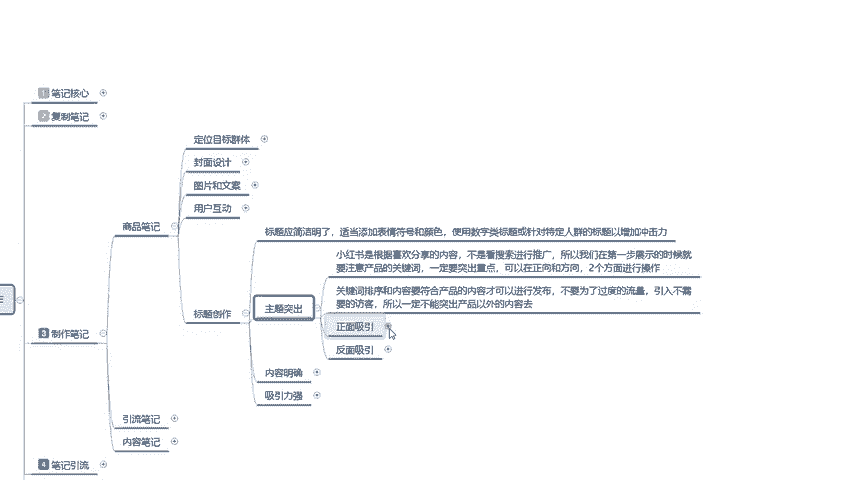

这两个词汇的内容是非常大的，都，而且这个。

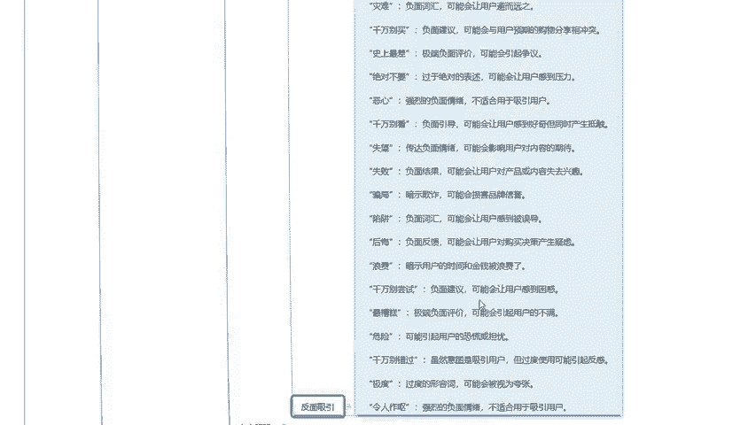

词汇的整体数据的话，它是小红书上面使用比较多的。

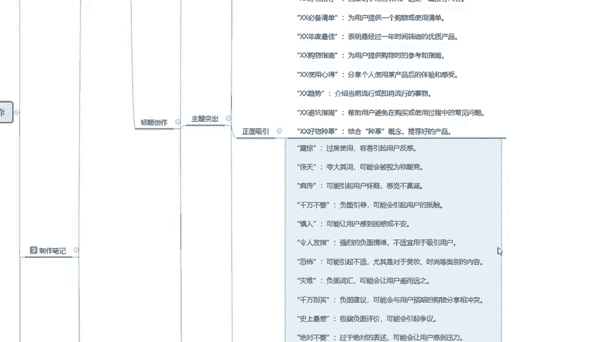

啊，这个是我通过网络数据给大家找到的一些呃词汇组合奏赏。

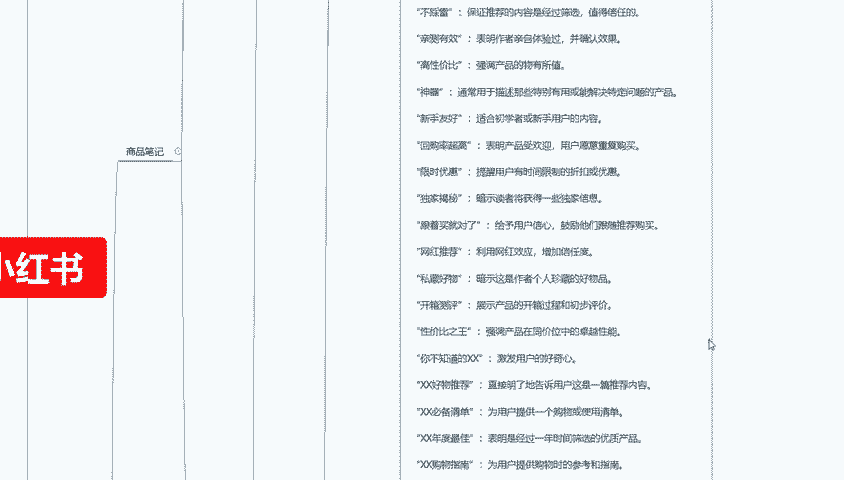

种草这个词我们对小红书有过一定了解的人，其实他并不陌生的。这个词语的话，在小红书上面是非常流行的啊，表示推荐某样东西给别人。但实际情况是什么呢？就是说我要去收割这个草类啊，草长好了，长粗了长大了。

我们才能去收割。这种词汇的话，说实话在小红书上面就相当。我们下意识的认为啊，因为以前的话我们听词汇听什么词汇听多了歌唱。什么叫割草呢？对不对？割有前人的草，割没是前人的草。我通过一个项目。

一个计划的话去进行割草。那割草的前提是你得有草。所以说它这个词汇里面是一个种草。但是很多人对这个词汇的话嗯，它还是比较敏感的。所以说现在的话这个词汇搜索词量和用词量比较大。但是说实话，我们做商品也好。

做网红也好，做其他的一个推广也好，做网红用的比较多，做流量博主用的比较多，做商品的话基本上不会用这个词。因为他的弊端太大了啊，听着就像有点。坑人的感觉。是吧所以说我们一定要把所有词汇的一个词语给了解到。

包括下面这个必备踩雷秘籍等等。我不光是给大家把主词汇列出来，同时呢也给大家介绍了一部分的意思啊。因为这个内容的话实在是太多，我单独给你们讲这些词汇的意思的话，说实话我不是语文老师，我。

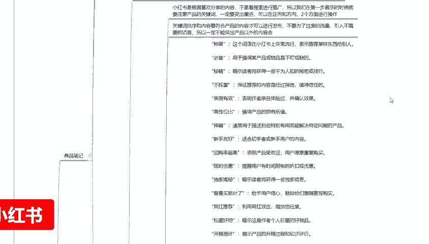

对吧给大家讲这些东西的话，大家也不愿意听。所以说我就给大家剪剪辑一下啊，这里面的内容呢，我就不给大家一个一个去进行。

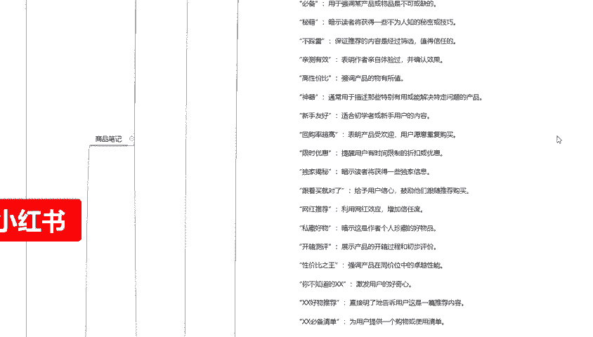

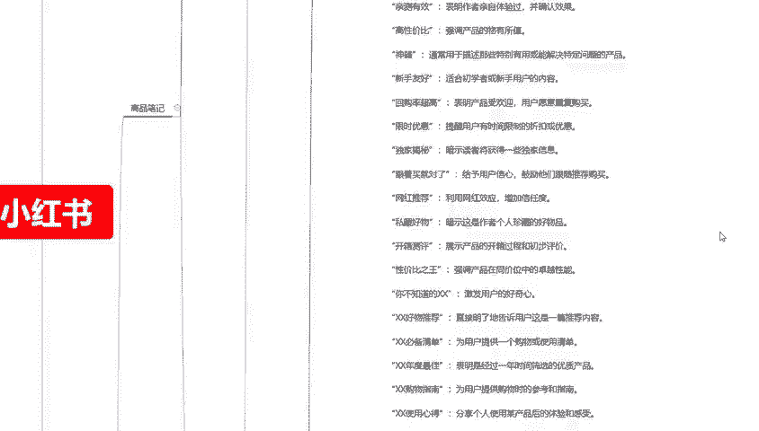

介绍了好吧，然后的话大家对这个里面的一个词汇内容比较感兴趣的话啊，你们截个图自己保留一下，或者说是有时间慢慢的看。我呢从头到尾给大家。从上面往下面拉一下这个整体的一个词汇用表。

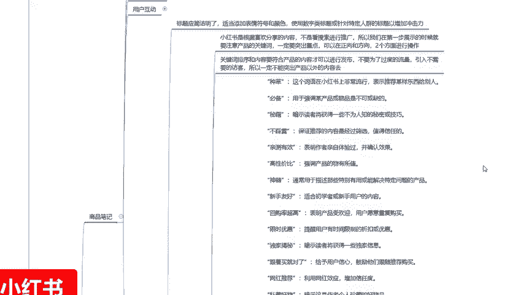

当然主要的话就是说了解一下这个词汇，我们在什么时候什么场合应该怎么去用，这个就靠我们大家自己去体会和体验了，好吧。嗯，给大家把主词练一下啊，种草必备密集，不必踩雷，亲测有效。这种的话它的一个词汇。

包括后面的整体效果。其实我这后面的话嗯大家听我这么讲了这么多节课，能听到这儿的啊，对这些东西的话都是或多或少有一定了解。

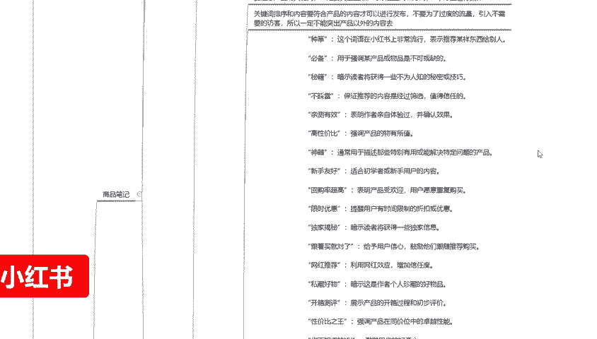

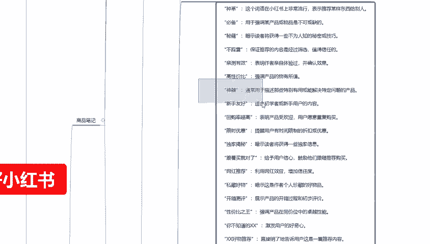

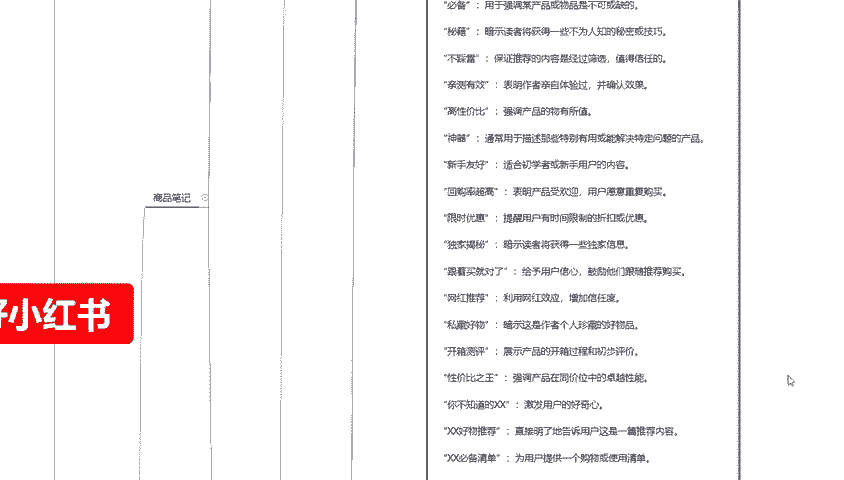

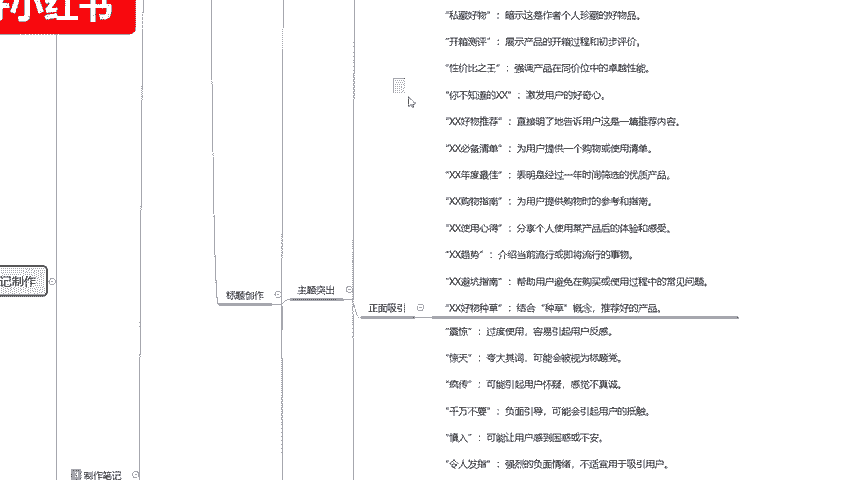

一直到趋势闭坑指南。毫无重吵。到这基本上就是正面词汇的一个结束啊，结束了，我就把它给答该结的也结完了啊，就给关掉了。

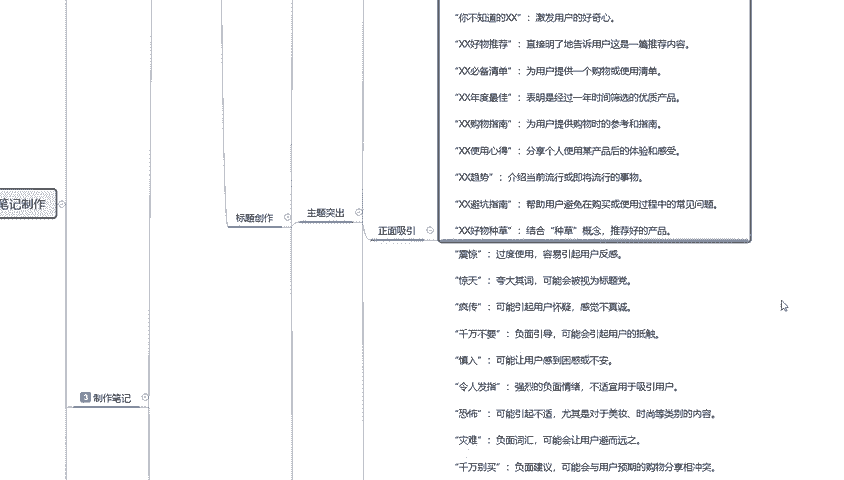

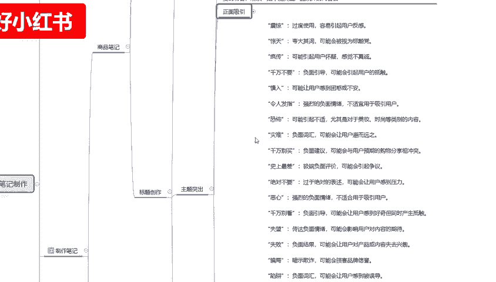

然后下面这些就是反面词汇，从正经开始，今天疯狂啊，一直往下面走。

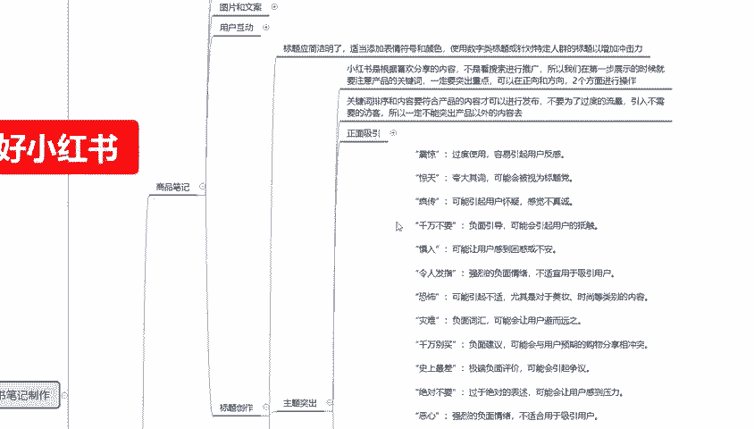

到令人作呕反编词汇给大家找的一个词组，具体有多少词组的话我也没具体计算哈。只是说给大家把这个词汇列出来，在这个地方让大家对小红书上面的一些组词啊。进行了一个了解。当然呢，这些说话说实话，这些组词只是说。

做引流也好，做标题也好，或者说做。商品笔记的一个内容吸引也好，他们只能说在里面用1到2个也不能用多，用多了以后不好用吧啊，其他的词汇还是要靠我们自己想办法去弄的。

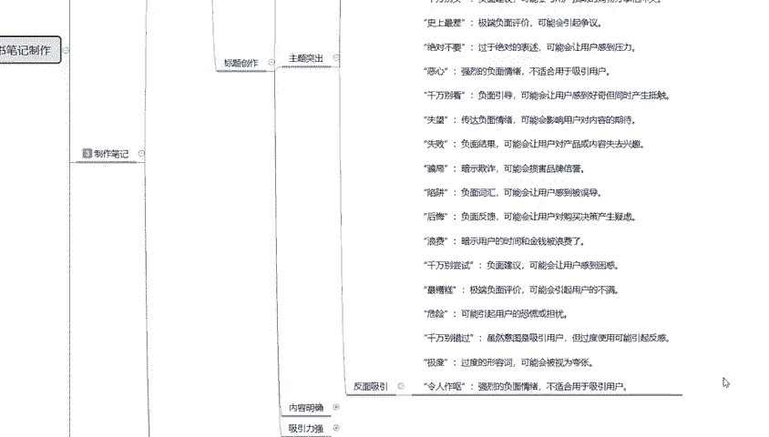

这个呢就是主题突出，我们要在里面的话添加一个到两个的一个正面性或者是反对性，让用户。

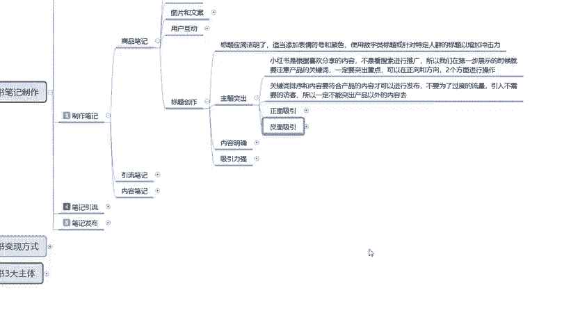

对标题产生浓厚的兴趣，然后进来观看我们的一个作品，也就是笔记。他现在还没到观看商品的时候，说实话，小红书上面你要成交，要把商品做起来的话，你要先把内容完做好了以后，你再去做商品成交才可以啊。

这些东西你做不出来的话，你想把它做爆难度非常大啊，那纯靠运气的啊，一点技术含量都没有，说实话不好做。这个就是整个标题的一个嗯主题突出。标题主突出以后的话，说实话在里面还有一个内容明确和一个吸引。

这两个的话就给大家做一个简单的介绍。主要的话就是说内容明确的话，就是对商品进行明确的一个介绍或者使用方法。呃，但是呢可以使用证。

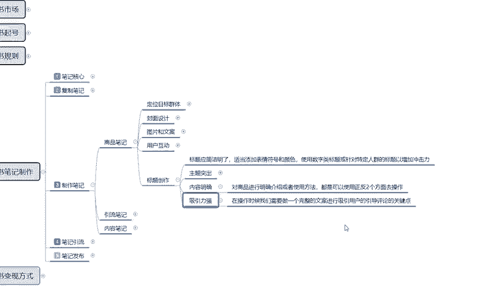

正面和反面两个方向去操作，主题突出选关键词啊，就说选我们的一个标题词汇的话，在正面和反面取消呃做吸引。内容明确，也可以用正面和反面，你就是看你自己怎么介绍啊，它都是可以通过正反两个面方面来吸引的。

说实话，反面的吸引效果在小红书上面的话占比35%不少了。而且这一帮人的话，他对反面吸引的效果呃和认可的话会比正面效果还好。看他要怎么去用，好吧。最后一点呢就是说在操作的时候。

我们需要一个完整的文字能文案进行吸引用户的一个引导评论的一个关键点。什么意思呢？就是说。也在标题上面挖坑。懂意思吧？你不能说是把标题上面所有的内容全部打上去，以后全部在标题上面显示，你要在标题上面挖坑。

让别人对你的标题感兴趣。我想知道后续你样看你样看小说。也好，或者是玩游戏也好，或者赶情做其他的也好，你做完一个项目，还有下一个项目，你还能吸引住人，对吧？那下一个项目是什么呢？我比较好奇。

我就需要点进去观看。这个就是标题的一个重点力，吸引力强。这整个标题的一个创作，我们把它了解清楚以后的话，就相当于说我们这整个的一个商品比例啊。

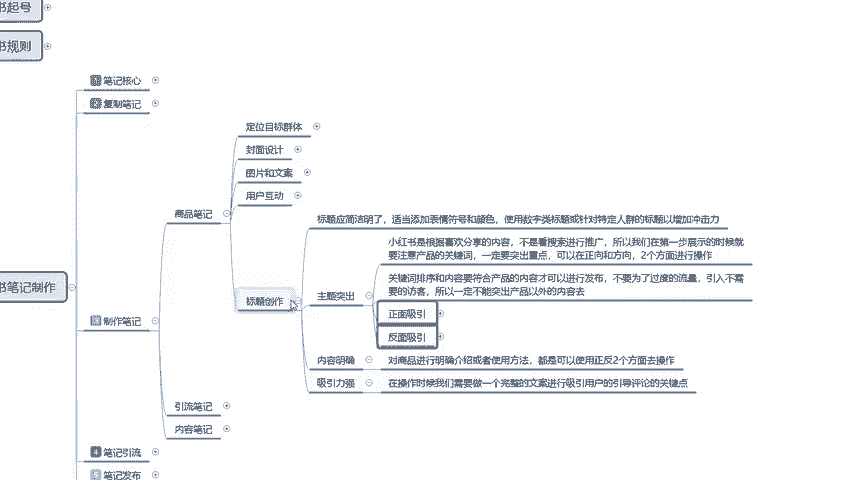

基础内容了解清楚了。啊，大家要弄清楚啊，制作笔记里面我们最个了解的只是商品笔记里面的一个基础内容。啊，定目标的形体封面的一个设计，图片和文案的一个设计。用户的一个互动标题的一个创作。这几个点做完以后。

你才知道什么叫商品笔记文案笔记。后续的一个内容的话，我会给大家讲解一下引牛笔记啊。说实话，我在给大家讲商品笔商品笔记的时候，其实已经附带了很多引流笔记的一个内容。因为它是通用。

我们后面的一个引流笔记也好，一个内容笔记也好，他们其实整体的话和。商品笔记差不多，只是说它定位的目标不一样，提供的价值不一样啊，标题的吸引力度吸引的方式方向不一样啊，让大家进行了一个整体的一个了解。

好吧，下节课我开始给大家讲笔记制作里面第二大主题，引流笔记的一个整体操作。

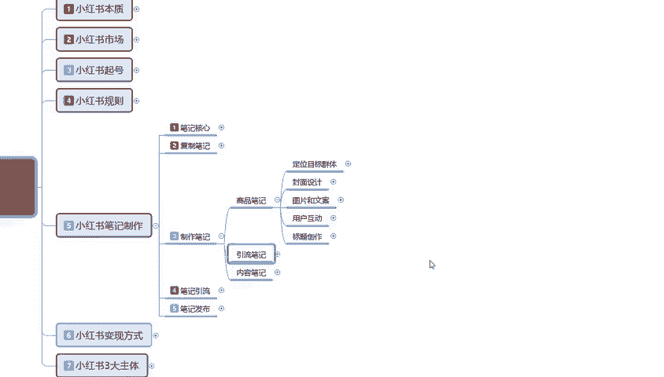

那这节课呢就给大家分享到这儿。