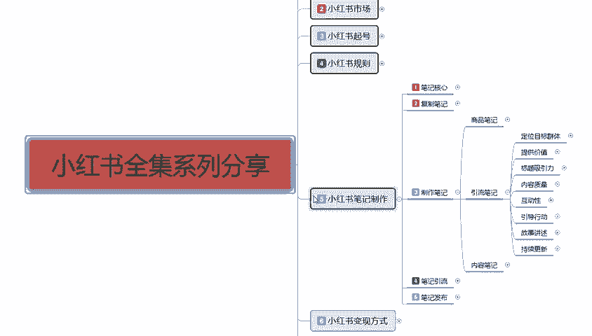
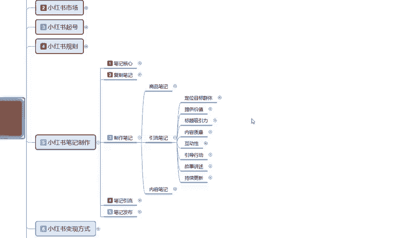
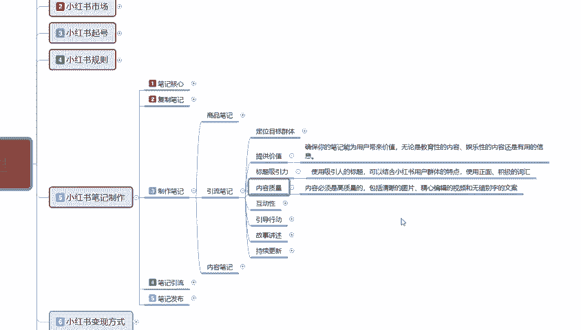
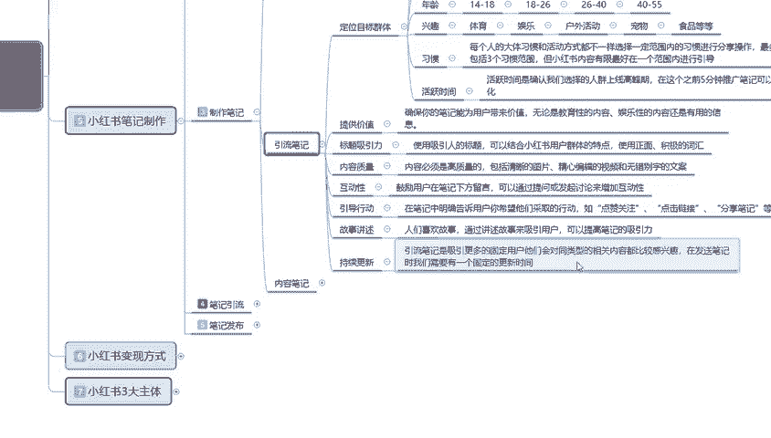
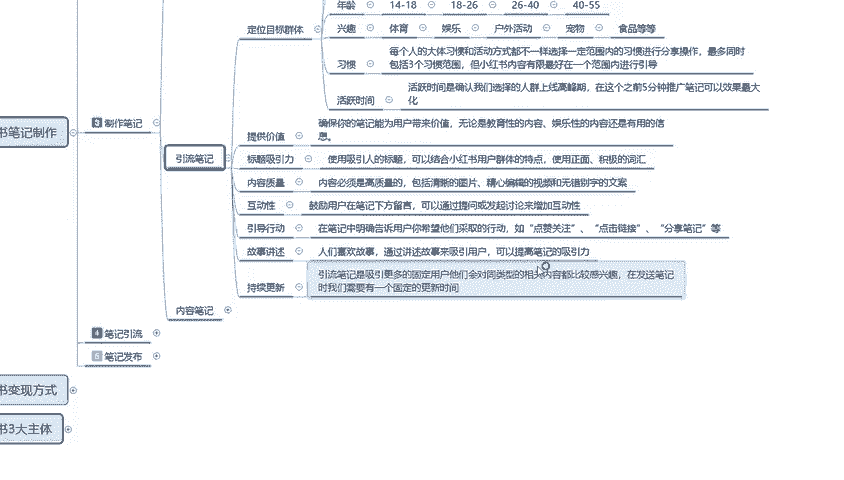
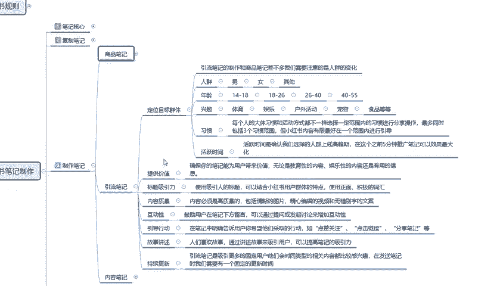
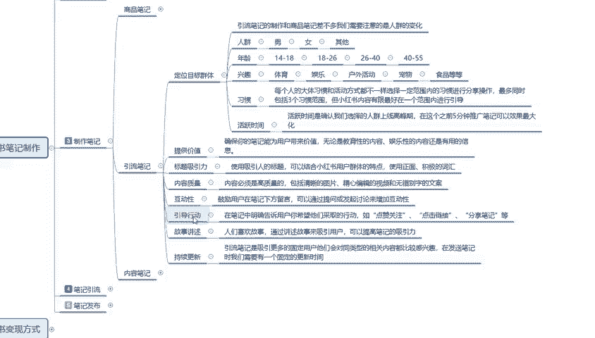
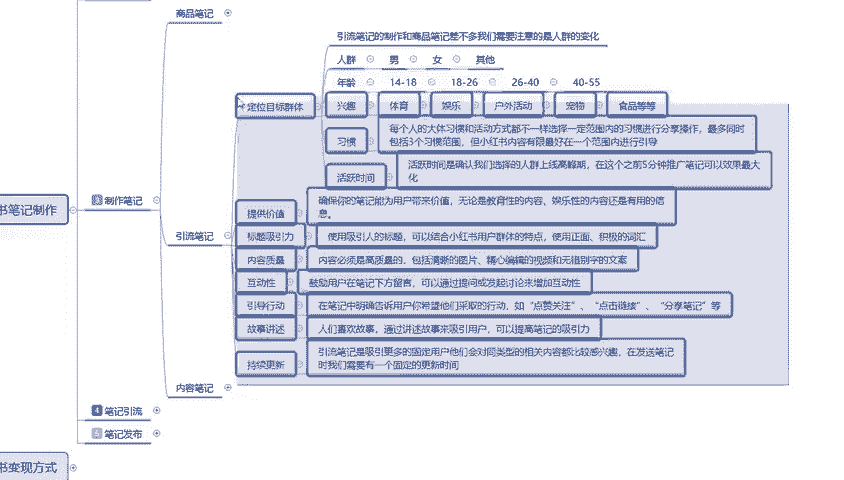
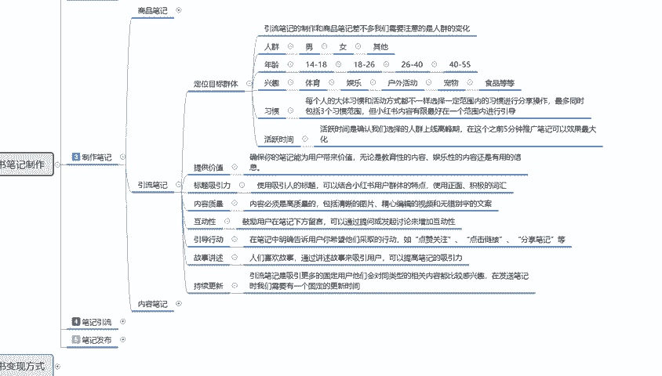

# 2024年全网最干货的小红书运营教程，小红书运营系统课(包含了剪辑／起号／小红书无货源各种玩法）小红书短视频零基础入门到精通，吊打一切付费课！ - P27：25、小红书【引流笔记】制作：优质笔记核心要点及注意事项 - 红书教程3 - BV1h1yNYXEvT

大家好，这一节给大家分享的是小红书全集系列第五大课是小红书笔记制作的引流笔记内容。第二小节课时。啊。

价值点的一个提供。

引流笔记里面第二点啊，提供整体的一个价值点是什么意思呢？确保你的笔记能用为用户带来价值。无论是教育性的内容也好，娱乐性的内容也好，还是有用的一个信息也好。什么意思呢？之前我给大家讲讲的时候。

它的内容其实是非常多的，但是它的整体归纳的话其实还是那么多。但是这一条提供价值内容在这个里面是要确保我们的笔记能用能为用户带来的价值。因为它本来就是做笔记的。

小红书笔记我们这个笔记它的主体效果是用来引流的。对不对？你只有把流量引入过来，你才能吸引粉丝。吸引粉丝以后的话，粉丝对这个同类的一个。笔记内容感兴趣，他会就去深究。你是做商品也好，做引流也好。

做内容也好，对吧？他会对你进行一个点赞关注。因为你有。你有实用性。啊。有教育性，有娱乐性。你是搞笑的也好，你是有价值的也好，你是对某件事物的一个分析解剖也好。你必须要有提供价值的一个实用性。

它整体才能给我们达到一个引流笔记的效果。如果说我们整体引流笔记没有这种实用性的话，嗯，你后续你所发布的内容的话，它只能保持在平淡无奇。你真想把这一个笔记做报，把你的账号做报，你达到多少的一个粉丝量也好。

用户量也好，整体后续的一些数据等等之类的也好，你必须要提供有那么一个价值观。这个价值观我们怎么去选择呢？就是说你无论是教育性的内容也好，娱乐性的内容也好，还是有用的一个信息也好。

啊这三个点其实就可以分开了。教育性的一个内容。你要做网络博。什么意思呢？我对食品进行一个拆分，这个视不对。嗯，不是不写不弃。对吧促进消化。这是食品类的，也属于教育类的一个。我给你补及的是科技知识。

科学知识对吧？吃什么样的水果？这个水果包含什么维生素ABCDE。都是一样的，娱乐性的是什么呢？比较流行的一个新词汇。网络上面呃什么提升定损呐对吧？等等这些娱乐性的一个词汇就看我们自己怎么去表达。

然后你配合什么样的一个图片文案去进行用户的一个吸引。这个叫娱乐性的，就是你给大家带来了欢乐，让大家了解到了实事，这个叫娱乐性的，你也可以跟国际形式。对不对？什么地方在打浪啊，什么地方过得也多火啊。

什么地方有什么奇文趣事？都可以。啊，比方说什么美国佛罗比亚洲这新出一个什么什么事界等等，他都是娱乐型类的内目学生。啊，你做博主做内容性质的都可以往这个方面去靠。你做引流的也可以往这个方面去靠。

只是说你的引流目的不一样。然后还有一个就是有用的一个信息，我们如果说要针对商品去做一这一部分的内容是什么？把整个菜品。拆开。啊，你比方说介绍服装，这个短袖通过什么什么设计，通过什么什么明师指导，对吧？

通风条件好透气。等等对吧？做内衣也好，做外套也好，你的口袋是什么设计的？你的服装是怎么设计的？这个设计达到了为了达到什么目的啊，这个领子对脖子有没有影响？对不对？你这个戒指戴手上好不好看？

对吧戴哪一个手上戴5只手指，每个手指头戴的戒指，位置不一样，显示的也不一样。你放个手上去，你戴个手环，对吧？男性戴手环，女性戴手环，他们显示的意识不一样。所以说这种方式方法，你给别人介绍的时候。

就是提供价值的一个信息。而且这个价值的话，要在别人的日常生活中也好，在别人的精神生活中也好。达到一定的价值，你才能在小红书上面有一个引流笔记的吸引力，你才能把得到用户的一个认可。对吧。黄色。

自驾游的颜色黄色代表什么？红色代表什么？灰色代表什么？对不对？戒指带大大拇指、无名指、小拇指。他们所区分的一个区别是什么，对不对？10个手指头在解字机代表什么？耳环代表什么，对吧？新型耳环代表什么？

它都是我们提供价值的一个产品介绍。就相当于我们把这个引流笔记的内容，你要把主题往这个方面靠，你要把内容往这个方面靠。你可以做产品，你可以做宣传，对不对？你靠标题也好，靠内容也好。

都要通过他后续的价值观来提升他用户的一个粘稠度。用户的粘稠度你做不到，你想去把小红书做好。基本上做不到。所以说整体的一个价值观的话，它是非常重要的。这个呢就是提供价值的一个信息啊。

他和我我之前给大家讲商品笔记的时候也好，讲其他的也好，我不会讲这么细致，为什么？因为他们其实是互通的，我只是说把我之前没有讲到的一个重点，通过其他的方式给大家进行一个宣传。也是这个道理。

通过什么样的模式来吸引对你。整体了解的一个用户啊。这个就是提供价值情绪。下面一个点是标题吸引力。标题吸引力的话，说实话啊和商品标题吸引力其实只大差不离。是用吸吸引人的一个标题。

结合小红书用户群体的一个特点。正使用正面积极的一个词汇。你做引流笔记啊，说实话用正面词汇稍微好一点，反面词汇有35%的概率的话，就是说你吸引反面向的一个人群。但是他们的思维和逆向的话。你把他们。

伺候好了，不舒服了。啊，效果非常好，你要把他们弄不好。说实话，哼你这账号说不定三五天就被他们整死了。啊。这个点大家还是要稍微注意一下啊。就是标题的整体吸引词汇的话，其实和商品笔记是差不多的。

我们整体的话就是说引流笔记的内容还是要靠提供价值观的一个整体后续的实际内容去进行整体了解才可以。然后内容质量啊。内容是必须提高质量的一个产品，你不能说是呃一篇笔记发上去了，就两个重点反复说。

那肯定肯定是不行的。意思就是相当于我。简单给大家打个比方，我再给大家进行分享的同时，我是不是会围绕一个点进行重复的一个讲解。肯定是不会的，对不对？你比方说我给大家说的什么呃人群也好。

或者说其他的等等都是一样的啊，我不会去过多的给大家讲述重复的一个内容。我只是说通过更好的一个方式，更高的一个吸引力。来增加用户的粘稠性，把我所知道的介绍给他。

大家也不要考虑说我这些东西我都给别人说了以后。他理解了以后，他不理我了怎么办？这就要看你自己的内容酷。是否从你是否有办法让用户一直喜欢你，你是否有更新的一个节奏，让用户一直跟着。

你觉得你这个很有人也很有意思。对吧会一直跟着下去。当然了，这个里面还有最重要的一个点，我给大家说一下啊。什么电灯？就相当于我给大家进行分享内容一样。说实话，你听一遍，你能听明白吗？我是了解过这些内容。

我自己说我可能会比较了解。说实话我给你们说，你们能了解吗？内容的理解不同，有人理解一一句话，一篇内容，一篇文章也好，一本小说也好，他看一遍有能理解。像我这种比较笨的手于，有时候你看一篇小说也好。

看一篇文章也好，看一个内容也好，我可能需要看两遍、三遍、四遍、五遍、六遍、七遍、八遍。那我看这一遍的时候就需要花多长时间呢，对不对？就要看我们的内容的一个长短。你只有了解了他了以后。

你才会去跳转跳转到其他的一个内容上面去。再次进行了解。这就相当于小猫钓鱼一样啊。1。1点来。你琢磨透了，你才会去琢磨下一条，你琢磨不透，实在是想不到了，你也去选下一条。但是这个中间它是有一个时间段的。

所以说内容质量非常重要。要么有生意，要么有连续性。整体的内容质量必须要高啊，这个就是引流笔记的一个质量。

包括后面的一个。互动性引导行动、故事讲述和持续更新。其实整体来说的话，引流笔记啊，我它整体内容我们来讲的话，它是比商品笔记还要大。只是我把商品笔记讲过的东西，我没有给大家再去进行讲解。

啊，在这里呢就是额外的把笔记引流我们没有讲到的和商品笔记有区别的东西给大家再进行了一个呃补充。这下面几个点其实都是差不多的啊。

互动性。引导行动故事的一个讲述，持续更新。其实就是我刚刚给大家说的这整体的一个部分内容。

我们做引流笔记。保证这几个点。不混乱就行。啊。有内容的，我也给大家打在这个地方，大家自己去了解实操。现在的话就是说你先了解再去做实操。啊，也就知道我给大家说的分享的这一部分内容有没有实际的一个效果。

你们大家如果说一遍想不通，多想几遍，多考虑考虑。啊，也是比较有用处的。好吧，那这一节课呢就给大家讲到这儿了。后面这几个点的话说说话。我就不给大家讲了啊，因为再讲的话。涉及到我刚刚说的那个点啊。

有些内容重复多了不好啊，还是要靠大家自己进行理解。那这节课呢就到这里。下一节给大家分享一下内容笔记的一个内容，还是老方式啊。讲过的这容我就不再给大家进行分享。

