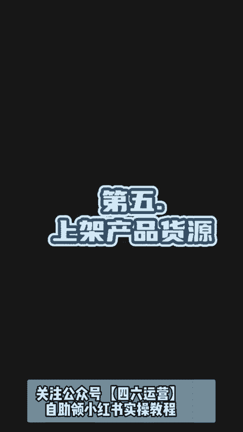

# 2024年全网最干货的小红书运营教程，小红书运营系统课(包含了剪辑／起号／小红书无货源各种玩法）小红书短视频零基础入门到精通，吊打一切付费课！ - P2：小红书开店从0到1 - 红书教程3 - BV1h1yNYXEvT

🎼启动资金10003个月回本5万，再加一个人，我是怎么做的？其实很简单。今天来给大家分享一下，我是如何用1000块钱把网店做起来的。开网店不需要露脸，不需要粉丝，不用囤货，真的不难。

难的是你要坚持新手朋友可以收藏反复观看。第一学习小红书推出了很多电商客。如果你是新手，那你一定要去看看搜索电商学习中心就能找到的。第二，开店，首先点左上角三条杠，来到创作中心，再点开通店铺。

现在0元0粉就可以开店，个人店是免费的保证金前期可以先不交，等你出单了之后再交。第三，选品就是想好你要做什么品，就一直接分析到你能不能做起来，能赚多少钱，很多选品软件是收费的。

我分享两个不花钱的选品方法。第一个是商机中心选品，可以选出想买的顾客多，卖的商家少的商品，打开小红书签翻，找到商机中心，在机会猎物这里筛选货源紧缺的类物，像这种超级紧。😊。

🎼并且成交高增速的产品就是潜力比较大的，更有机会搞到钱。另外个方法用季选品。我们可以围绕夏天来选品，比如防蚊防晒美白，我整理了一份季选品表，需要的宝子可以视频底部滴滴我。第四，找货源。

真心建议你不要一上来就囤货。我们可以先在网上找到低价一件代发的货源，让厂家帮我们发货，我们要找到真正的源头厂家。首先我们要选择带有超级工厂标志的厂家。😊。

🎼我们还要看综合服务有没有五颗星，再看好评率在95%以上回头率在30%以上的。我给大家整理了各类商品的原产地。按照这个思路，我们找货源的时候输入原厂地加产品名，这样我们找到的基本都是优质货源了。

最后对比下来，有利润空间就可以去问厂家这几个问题了。这里有一个注意点，找了厂家最好不要超过商家，不然前期地址太多，会很麻烦。第五上架产品货源网站一般都会支持一键铺货的，帮我们一键把商品上架，点一键上传。

选择我们做的平台，这里可以改标题，改商品描述，还能直接加价格选择，设置好后点提交就行了。新品上架后该如何去提升流量呢，确定好你要主推的产品，每天需要去给这个产品做成交，不能让这个产品挂零。

第一天破零做动销，把基础评价，基础销量做起来了，就能出单，别看我现在好像挺成功的。我刚做这一函的时候也是一窍不同。之前在电商公司上班还经常被骂，所以。😊。

🎼说大家都是从不会到位的，我也祝大家都能通过自己的努力过上梦想中的生活。😊。