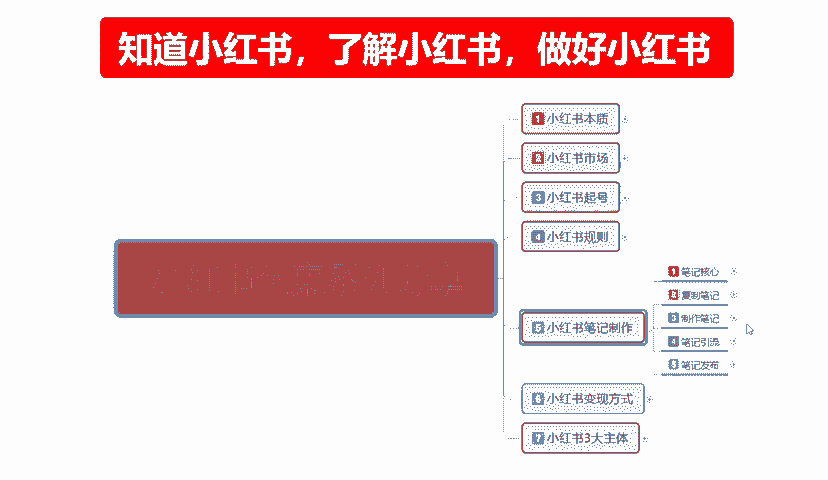

# 2024年全网最干货的小红书运营教程，小红书运营系统课(包含了剪辑／起号／小红书无货源各种玩法）小红书短视频零基础入门到精通，吊打一切付费课！ - P32：30、小红书笔记引流：平台流量层级 - 红书教程3 - BV1h1yNYXEvT

大家好，这一节给大家分享的是小红书全集系列。第五大课是这个小红书笔记制作啊。

第四个大点的一个内容。

笔记引流。

之前的课程呢已经给大家讲了笔记的一个效果，笔记的一个流量结构笔记的一个分发机制。这节课的话给大家讲一下流量成级。什么是流量成级？流量成级的话，这个第一个是涉及到我们账号的一个综合权重。

第二个的话就是说涉及到我们后续发布的笔记，它基础能给到我们多少一个流量和展示。它总共的话是分为8个成绩。我在这里呢已经给大家列出来了啊，第一成绩笔记浏览量大概是0到200，也就是基础曝光量。啊。

不应该说基础曝光量，这个是小眼睛的数量，大概的话就是0到200，它处于一个第一层级的一个阶段。第二层级的话是200到500啊，第三层级是500到2000，第四层级是2000到2万，第五层级是。

自然流量的上限。2万到10万，第六成绩是10万到100啊，第七第八大家可以自己看一下他们这个之间有什么区别呢？笔记浏览量0到200，不是曝光量啊。是用户进入你店铺的一个上线。什么意思呢？

前面给本来这个笔记效果的话是给了你呃1000的展示，你只用了400的展示，你做到了50%的一个点击收藏，点击观看量，那么你就会进入下一层级或者下下层级，就代表你的笔记效果很好。

因为它已经达到了我们流量分发机子里面的点击率啊，CE。CES综合评分。的排名。你的数据量可能就会暴增。但是如果说你的整体点击数据量的话，不超过50，那么你就在第一神级。有意思吧。这是成绩的一个区别啊。

它不是中不是基础曝光量啊，基础曝告量的话是跟进账号权重来的。当然了，你没有这些基础数据做支撑的话，你也就不会有基础曝光量。你一个刚进的账号，你的点击率达到了50%，你也要需要等到下一篇笔记。

你才能做这个它才会有200到500的一个小眼睛展示量啊，这个大家要弄清楚啊，不是你想发第一篇笔记，我想把它直接做爆，然后发了一篇非常完美的一个笔记出去。很多人看不可能。

小红猪他就不会给你那么多展示和流量啊。那这里我给大家介绍一下，我们达到成绩的一个基础。就如说在第一层级笔记浏览量在0到200的时候，只要笔记没有违规，不管任何内容啊，基本上都是有200左右的一个阅读量。

如果多篇笔记阅读维持在200。就需要去观察一下账号是否有违规。啊，如果没有，就说明我们的内容有问题。第二成级的话就也是相当于比简比较简单的，笔记浏览量大概是在稳。就是小眼睛的数量200在。

大概的话就是200到500之间，这种属于的话就是正常流量，大多数的账号流量都能达到第二层级。但如果长期稳定在这个略读区的话，就是需要我们自己去自己查一下啊。就是我每发一篇笔记内容其实也不差。

跟别人比也挺好啊。但是就只有200到500，这个的话就要去查垂直柱了，什么叫垂直座？原创的内容。是否吸引就是我们真综合的一个笔记内容。比较差，对别人的吸引力度不够。然后就是你造号的人群是否准确。

你的属性你的笔记内容没问题，那么就是对应的人群不准，知道吧？就是怎么说呢？我卖西瓜的，我卖水果的。票给我给我推推广了一帮看那个游戏的。人家能喜欢你吗？肯定不喜欢的呀，对吧？就是账号有问题。

账号的一些设置有问题需要去调整。但是基本上第二层级的一个基术流量比例的话还是非常容易达到的，只需要自审自查就行。第三阶段啊，笔记浏览浏览量在500到2000这个范围。

这个这种的话就说说明状账号的一个状态是正常的。笔及内容质量呢也还可以，但是互动率低。啊，就是之前给大家说的这个流量分发机制里面的一个互动率比较低。点击率的话相比也整体大盘的数据在略低。

流量的话就是说只能给你进入到第三阶段。如果说达到这一层级的话，其实就已经超过了80%的一个小红书内容账号，账号的一个内容质量了啊。你要想把它这个做到第四成级的话，你需要多互动。啊，图片再美观一点。

就是内部优化。之前的话是账号优化，你现在的话就是要根据笔记的一个方面去调整你整体的一个内部优化啊，这个的话就是第三层级。

500到2000。第四层级的话。笔记浏览总量的话大概是2000到2万啊，说明内容已经获得了我们就说我们整个推广内容已经获得了不错的一个数据，已已经有了小爆款的一个趋势啊，数据在持续爬升。

如果说用户反馈行为仍然增加的话，就是说平台它会继续给你流量。就是我们在第四层级的话。你这篇笔记已经超过2000了，还在往上增234000，慢慢的往上增，它会有一个持续时间段。

那么你就已经属于大型笔记的一个一个范围了啊，大型笔记的范围我之前也给大家说过啊。

7天左右一篇笔记的话，大概给你推留7天左右。一直达到2万封顶，2万超过2万以后的话，就是2万到10万，就已经是自然流量的一个极限了啊。好的笔记也就是大概是在这个范第五层级范围之内不会再多了啊。

刚刚说的是第四第五乘几啊。第五层级的流量词呢，它是自然流量的最后关。依然的话就是由用户互动啊，数据决定是否进入下一层级的流量，达到这个层级的笔记已经是比较出众的内容了。简单的说。

我要是把这笔记做到第五层级，每一个笔记发出去有2万到10万的一个点赞搜散量的话，那么观看人数就是展示人数可能已经破百万了。这个的意思大家要懂吧？就是我如果说达到了10万的一个浏览数据的话。

那么我展示的数据量就是小红书。整个平台给我账号。推广的这篇流量。曝光量最少在70万左右。大家了解这一点啊。当然了，这个的话就是也是我们自然流量最后一关。往后走的话，第六层级、第七层级和第八层级的话。

说实话啊，你要花钱，不花钱的话，你做不上去。第六层级笔记浏览量是10万到100万，已经进入了一个热门笔记的一个门槛。达到这个阶段的一个笔记，已经具备了一定的稀缺性。什么意思呢？

就是说你的内容吸引力是非常高的，你有自己的特色和特点、风格。就是有自己的粉丝群体了，也就是从这一层绩开始啊。测试更多的一个用户后台的一个数据端，就是拿你去做对比。你就是标杆啊。

再做这再有人发同类的一个笔记，就要拿同类的笔记跟你的笔记做对比，他能不能超过你？对吧它的综合数据怎么说呢？就是第一篇笔记的质量跟你第一篇笔记的质量做对比啊，你的点击率15%，他这边点击率17%。

那么系统的话就会多给他一部分的流量，拿你的数据去做对比。你就是开头人了啊，达到这个的时候。包括第七层级，第八层级也是同样的道理，只是678，他们需要。付费推广啊，你需要和平台去合作。

平台他会自己去找你的。你到达这个时候，平台会自己去找你的进进一步的一个合作。你然后的话相当于类似网红签合同，基本上都已经在达到这个成绩。你包括带货啊，做什么都可以了。啊。

第七成级和第八成级我就不给大家讲了，因为基本上和第六成级是一个道理，只是规模更大啊，平台给你的权重属性的话会更高。然后根据你的一个内容输出的一个持续性，再进行你的一个嗯。类似于待遇优化的一个调整啊。

什么意思什么意思呢？就是你到达这层级以后的话，平台他给你推流。第六层级、第七层级、第八层级他们是三个阶段。第六层级的话可能给你个100万。第七层级的话可能会给你平台流量30%。第八层级的话。

你基本上就是。平台前二子啊，平台没你不可。但是能做到这种话。不毛领讲，傻子个傻。啊，所以说我们还是现实一点，我们先达到我们自然层级的一个流量顶峰，第五层级再做。

这个就是笔记流里面最后一点流量的一个成绩啊。这整个小红书的一个笔记引流的话是给大家介绍一下啊。小红书它整个运行系统，我之前开始的时候，从笔记效果的时候，我就跟大家说过了啊，这整个一个课程的内容的话。

主要是给大家介绍啊，它没有实质性的一个内容，但全市是干货。为什么这么说？他不教你们怎么去做对。他教你们了解整个小红书笔记流量的一个规则。啊，让我们更清楚的认识到自己可以做到什么层层次。好吧。

那么这一期这一节的分享呢就到这，下一节呢给大家讲解一下。小红书笔记制作最后一课啊，笔记发布。

