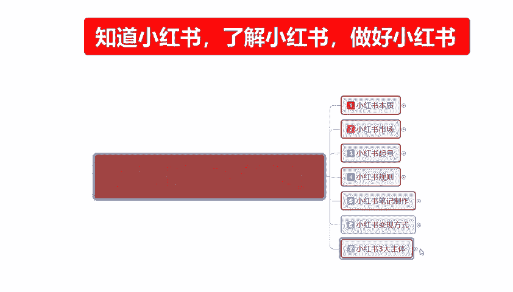
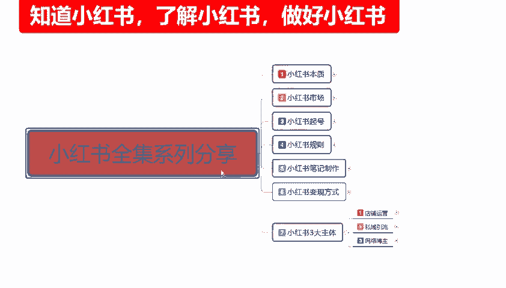
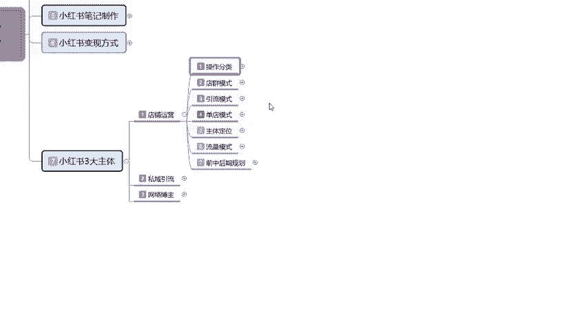
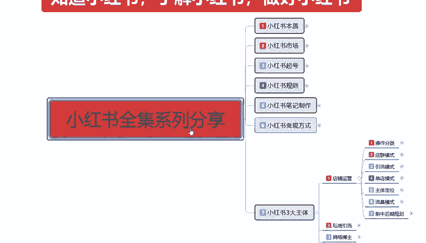
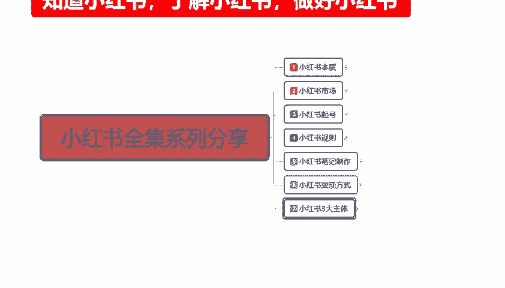

# 2024年全网最干货的小红书运营教程，小红书运营系统课(包含了剪辑／起号／小红书无货源各种玩法）小红书短视频零基础入门到精通，吊打一切付费课！ - P36：34、新手小红书运营-小红书店铺运营 - 红书教程3 - BV1h1yNYXEvT

大家好，今天给大家分享的是小红书全集系列的最后一大课时。第七大课时啊。小红书的三大主体，这一个课时的话内容也是比较偏多的。因为主要的话是讲解讲解分析我们整个小红书账号里面的一个三大主体。

第三大主体是哪三个主体呢？

第一个是店铺运营，第二个是私域引流。第三个是网络博主，就是我们要做网红的啊，可以考虑。第三个私域引流就是我们有自己的产品，有自己的一个销售销售渠道。然后的话我们只是说想做私域。

然后在某一个特定的范围内进行宣传。啊，可以去做私域引流。店铺运营呢就是说我们这边的话啊想在某小红书上面啊尝试运营一下店铺啊，去卖一些产品之类的啊，都是可以的。这个呢就是小红书三大主体。

为什么叫它三大主体呢？因为小红书的话正常的一个运营模式。你只要想在小红书上面。赚钱或者是了解这个行当，那么你都要去操作三三个模式，你面选择一个去操作。那这。😡，这一节的话主要是给大家讲解一下。

我们从第一课开始啊，店铺的一个整体运营开始。

小红书整体店铺运营的话，其实可以把它分为。7个步骤。对七个步骤的话是7个大节的一个课时，而不是小节的课时。当然了，这一节课呢也是最多的一个内容。整个店铺运营的话，可以把它分为操作分类啊，店铺的一个。

电群模式和单电模式和呃多电模式的一个操作，然后是引流模式，单电模式主体。定位流量模式和前中后期的一个规划。这个的话是全部是。店铺运营的一个内容啊，这个不是其他内容，这个里面的话全部是店铺运营的一个内容。

我们去操作的话，就是说我们。做小红书。你不管是做私域引流也好，做网络博主也好，你都要有一个店铺。只是说它的一个店铺整体的话。你的权重做到什么样啊，能给你的店给你的账号带来什么样的一个加权。

你做私域做私域引流，其实你也要去开一个店。因为的话小红书你在上面的话，你去开一个店了以后的话，你交了保证金，你的账号本来就有一定的权重。懂意思吧？你然后在后后续的话，你去挂自己的一个链接。

或者挂自己的一个介绍之类的，都可以在店铺里面去挂啊，让用户去了解你的一个结构属性。是比较方便的。好吧，废话不多说，直接开出我们今天的一个正题。店铺运营第一课操作的一个分类。什么是超出分类呢？😡，小红书。

我们在上面做店铺运营的时候，它的一个操作分类是有电驱模式、引流模式、单电模式和真。整合分类的一个情况。首先是电群模式。电群模式的话其实呃它还是比较简单的。

先让大家了解一下什什么是小红书的一个操作分类的一个电讯模式。就是说我们在小红书里面，我是准备做店群，我是准备做引流，还是做单店？还说我想把它整合分类，然后再去呃。判断我自己做什么，首先是电驱模式啊。

它的优点是什么呢？操作简单，请效快可随时变更的一个信息，缺点就是说投入太大。呃，但是这个投入太大的话，它是可以回收的。就比方说我们开10个店开20个店，30个店，每个店铺需要000的保证金。

这个保证金我们是可以回收的。啊，整体来说的话，只是说前期的一个投入大，后期的话其实还好。嗯，但是他整体的话一个收益是比较一般的。怎么说呢？就是现在你去操作小红输出电池的话，它收益基本上。

不比你打龙强多少。而且还费劲。而收益是非常一般的。操作时间的话，就是说你如果说真的想在小红书上面做店群的话，你就没有其他时间做别的东西了啊，你每天光那几十个店铺来回导，在上面上传数据，下架数据。

然后更新你的动态，做笔记发布。你每天花在这个上面的时间，至少都要达到6个小时以上。它是比较麻烦的一个模式。但是。可以赚点钱，但是赚的不多啊。😡，现在的话，你要是搁一两年前我们去做电驱模式的话。

电池模式还可以做。你哥现在去做电池模式的话，说实话。效果不好。这个呢就是电池模式，第二个就是引流模式。引流模式是什么意思呢？就是。引导用户去微信、微博、QQ这种地方做成交的。怎么说呢？引流模式的话。

我们只是说在小红书上面挂一个店铺在上面就可以了啊，就是我的整个账号里面，我其实有店铺有产品去卖的，卖不卖的出去实那时候。但是我有这些东西，那么有这些东西了以后的话，我的整个账号权重就偏高。

那么我发放的发送的笔迹的话，小红书它会给我一定的扶持。第一个是扶持。第二个我完成任务以后的话，有额外的一个展示收入。为什么叫反展示收入呢？因为你做引流的本来就是。要做到看的人越多，对你的产品越了解。

对你的宣传也有好处，就是你本来就是要来做推广产品的，对不对？你在这个里面做引流模式的话，你无非就是把想法数据扩大。你以前可能是100个人知道你你在小红书上面做的话。

你可能你想达到10万、20万、50万这种嗯知道你这个产品的一个人，知道你是做什么的一个人。😡，对吧那你做引流模式的话，其实还是可以的。它优点的话就是说投入一半。嗯，你在上面的话只需要多创建几个号。

然后的话分担发送你所发送的，把自己的产品，把自己的文案做成笔记去发送就可以了。投入一半啊，投入。不会太多，就是看自己想怎么做。大体的投入的话，它是不会太多的。因为它不需要你去做数据。

你只需要在里面无限的发发出你的一个。笔记内容就行。然后的话把基础的权重做起来，然后把笔记优化一下啊，商品之类的，你后续包括销量之类什么都不用管啊，收入高，后期的一个维护简单。但是缺点的话也是比较明显的。

你在小红书上面去做引流模式的话，人群范围小，有一定的规模限制。因为你的账号初期的话，你本来是没有权重的。我们去操作的话。你需要多个账号同时使用。啊，而且成效比较慢，他唯一的缺点说实话就是成效比较慢。

你想把它做大做强的话，你需要坚持，最少3个月到半年以上，你才能慢慢的看见成效。这个就是引流模式。第三个的话就是单店模式。单店模式的话嗯，这个就是我们想把真的想在小红书上面去开店卖产品，对吧？

我不管我们的产品是从什么地方来的，我自己有产品也好，没有产品也好，在1688上面找的也好，在其他地方找的也好，其实在这上面都可以做。啊，单电模式的话呃整体来说的话，它的综合能力比较高。

对比上里面两个模式的话就是没有那么极端啊。你比方说电池模式投入大，收益一般而，操作时间非常长。你引流模式的话，说实话投入一般，收入是高，但是它的一个成效确实是太慢了啊。

你最少都要3个月到半年的时间才能慢慢的看见成效。你后续的一个维护啊，或者说是时间的一个变革。对你来说的话。嗯。你是集体，你还能承受，你是个人的话，那你真的是非常需要有耐心，你才能去做那个引流模式的。

单店模式的话，就是说综合能力对比上面两个的话，就是没那么极端嘛。第一个就是投入低。但是呢啊它相对炒，相对的它的一个整体操作的话是比较复杂的啊。因为我在单独给大家讲的这一个整个店铺运营。

就全部是针对单店模式。来给大家进行的一个讲解和分析。呃，当然了，他的收益也是比较高的，同时他的持续时间比较长。你像做电池模式的话，你可能做个两三个月，你就又得换电。或者换换其他的一些东西来做。

你做引流模式的话，说实话它的一个成效特别慢啊。就是在定模式相对来说的话还是比较好的。就整整合这个几个模式的一个情况下的话，你也也要根据我们个人资本来看的啊。第一个就是电去模式的话，适合的话。

就比方说怎么说呢？你自己初始阶段有一部分资金。然后的话自己就闲的蛋疼的啊，没事干的，想看看网络上面到底啊就是你想熟悉一下这种模式，想去了解。因为电池模式的话，说实话你要做电池模式。

你在里面有很多东西可以去学啊，就看你后期学的怎么样。学完以后你再去做单店的话，你也有自己的一个思路。为什么？因为电池模式的话，它有的号可以起来，有的号它是起不来的。你开10个店，20个点。

30个店里面总有一个店到两个店可以起来。他就是概率学的一个问题，只是说别人做的是单店，你做的是店群而已啊，而且店群的话花费的时间太长。他就比较适合有一定的资金，然后的话自己真的想在网络上面做好啊。

有一定了解，对网络这个运营营销都有一定了解，可以去做一做。第二个就是引流模式啊，它比较适合的话是。有经验和产品的一个用户。什么叫意思呢？就是说你自己真的是想往网红方网红方面靠，你可以去做引流模式。

你有自己的产品也可以去做引流模式。你想给给给用户分享你自己的一个呃社会的一个经验，一个历练啊，你也可以去做引流模式。这个的话就是比较适合网红这种呃你做博主啊，做网红啊，呃做搞笑宣传。这种的话。

比较适合做引流模式。难点模式的话。说实在的啊，它比较适合的话就是新人的一个操作。它整体的话就是需要耐心和执行力。因为它。怎么说呢？😡，自己没有一技之长，你做不了引流模式，你自己又没有一个稳定的资金投入。

你也做不了店群，那你就只能做单链模式。它就比较适合刚步入社会的一个新人阶段比较操作，或者说是你有网络运营经验，或者说我线线下有产品之类的，也可以去做单电模式。因为单电模式的话，说实话它投入是非常小的。

这个的话就是操作分类，看你们自己选自己往哪个方面去靠啊。这个就是整个店铺运营的一个操作分类。好吧，因为时间的原因呢啊这一节呢就给大家分享到这。下一节呢给大家讲解一下电群模式它是怎么运行，怎么去操作的。

然后的话呃往后就是引流模式怎么操作，单电模式怎么操作，主体定位啊，流量模式，还有我们后面的前后中期的一个整体规划。

那今天的分享呢就到这里。

