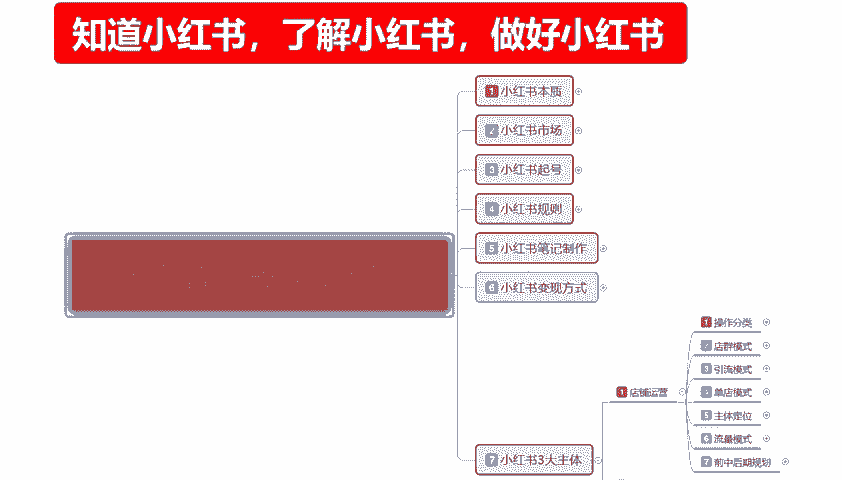
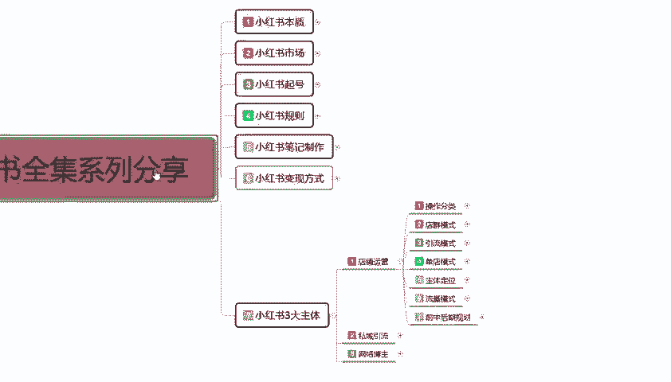
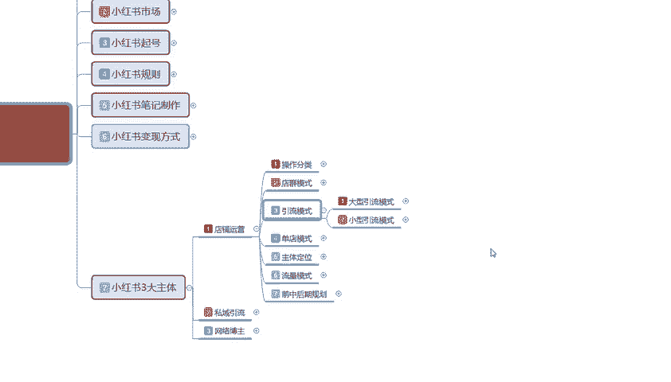
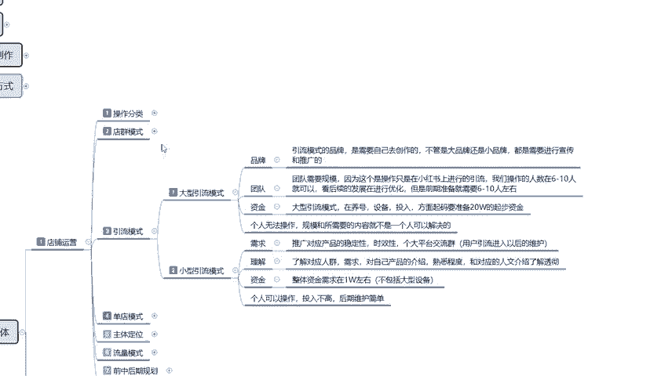
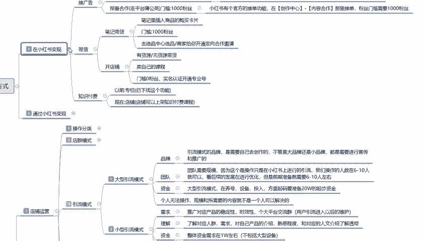
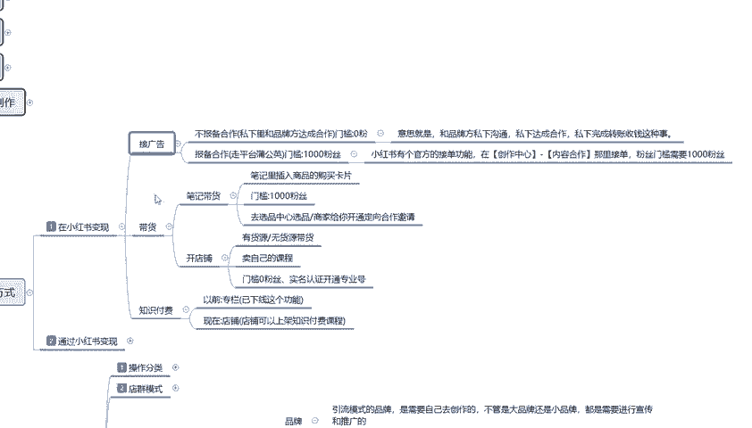
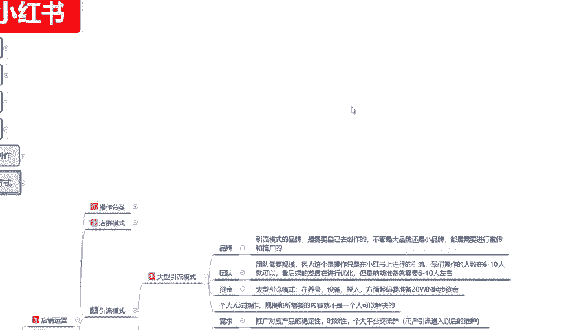
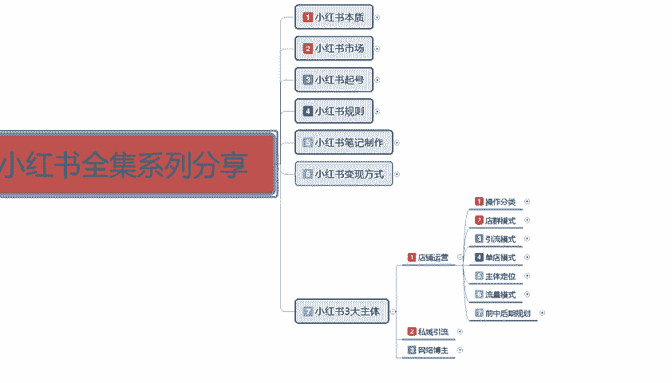

# 2024年全网最干货的小红书运营教程，小红书运营系统课(包含了剪辑／起号／小红书无货源各种玩法）小红书短视频零基础入门到精通，吊打一切付费课！ - P38：36、新手小红书运营-小红书引流模式 - 红书教程3 - BV1h1yNYXEvT

大家好，今天给大家分享的是小红书全集系列第七大课时小红书三大主体的一个店铺运营内容啊。这节课主要给大家讲解一下引流模式的一个内容。上节课给大家讲解是电群。电群的话说实话他们因为有内容，但是我不愿意去讲。

因为现在的话他已经快他不多快过时了。你现在要去操作的话，嗯，只能说保证自己不亏本，但是赚不了多少钱啊。

引流模式在这个地方的话，我是给大家做了两个的两个点来进行介绍的。第一个是大型引流模式，第二个是小型目引流模式啊。这两个模式的话说实话。

他整体来看的话，其实没有太大区别。他只是说对我们个人有一定的嗯怎么说，就是对个人的资质和你个人的一个。思路有一定的。限制啊大型牛模式啊，什么意思呢？品牌团队资金。你们大家看这三个点就知道了啊。

他整个内容的话是个人无法操作规模和所需要的内容就不是一个人可以解决的。就是说你要做大型的引流模式的话，你没有品牌，没有团队，没有资金，你这个你考都不用考虑。个人的话。

你就只能考虑小学小型的一个引流模式啊。小型的引流模式的话，你你了解一下需求理解和资金。这个里面的话个人是可以操作的，投入不高。而且后期维护的话是比较简单的。那首先了解一下大型牛模式品牌是什么意思呢？

引流模式的一个品牌是需要自己去创作的。不管是大品牌还是小品牌，都需要进行宣传。什么意思呢？就是说你自己本来在自己家的小地方，然后的话这个产品还算可以啊，有一定的市场，但是他没有人帮你去做宣传。

我想在小红书上面去进行宣传，那么你就是有品牌的。这个品牌不管它是大的也好，小的也好，大的李宁啊，阿里天猫的这种都算大品牌。那小的是什么，你听都没听过的，只在某一特定区域进行划分的一个小品牌。这个叫品牌。

只要说你有商品注册的一个标签，它都算品牌。说你这个品牌出名和不出名而已，在某一地区出名，你也只能辐射到这一个范围，这就是品牌。品牌的话，说实话你能把这一个品牌做起来，你投入个十来个不成问题。

对吧但是做大型引流的基础模式，你在小红书上面的话投入十来个。也差不多。啊。团队团队什么意思呢？就说你没有品牌，你本来就是一帮人一帮朋友。或者说我以前是做什么的啊，然后现在想转赞小红书。我有自己的团队。

我有自己的网红。比方说我以前在抖音上面做的，但是抖音我做不起来，对吧？我以前在拼多多上面做的，但是那个我有商品，但是不好做。对吧我以前在淘宝上面做的，我也不好做。在京东之类的都一样，知道吧？就是有团队。

你有自己的规模，你有自己的部署。团队的话它就是需要规模。因为这个的话操作只是说在小红上进行引流。我们操作的团队的人数的话，基本上都是在6到10个人左右，可以基本支撑作为团队了。你两三个人那叫小团体啊。

不叫团队啊哈，那那叫兴趣同流的一个呃朋友之间啊，共同来了解小红书。你真要是讲团队的话，它的分工是非常明确的啊，操作人数的话基本上都是要在6到10个人，为什么？6到10个人。

他主要是看后续的一个发展再进行优化。但是正常的话，前期准备就需要6到10个人，什么意思呢？主账号、副账号、网留网红号、引流号、推广号、小号啊，评论号，你官众号你都得十几个。就是你没有这种团队的话。

你把它做不起来，知道吧？专业专业的摄影拍摄，专业的一个网络运营，专业的一个文案文案笔记撰写，对吧？你店铺运营什么时候发发什么内容，几点发，它都是需要人去策划，就是你需要有一个整个的策划团队，把你的产品。

或者是把个人包装起来，你才能称之为团队，你两三个人到一起的比较统的，那叫小团体。然后呢资金。大型引流模式的话，它在养号设备投入方面的话，起码要准备啊。我刚刚给大家说的那个品牌，就是你最少在抖音上面。

你起码要投入十几二十来个啊。比如说你想把它做成大型的一个引流模式，就是我准备大规模推广我推广我这个产品，你最少准备得准备20个W起步。所以说这个的这个大型年模式为什么说是个人无法操作啊？

它规模和所需要的内容就不是一个人可以解决的。就算你有钱，你说你觉得你我有50个，对吧？我就是弄得好玩，我想一个人去试试。你都不好做，你没有专业的团队，你刚组建的，你去招人，一个月花个七八千块钱。

花五六千块钱请运营一群美工，对吧？做不起来，你到时候亏的血本无归。你要先了解清楚小红书整个运营的一个体系，你再来做这个东西就好做了。然后是小型引流模式啊，小型引流模式的话，它的需求就没那么高了啊。嗯。

怎么说呢？他的或需求的话就是推广对应产品的一个稳定性、时效性。各大平台的一个交流群用户引入以后的话进行维护就行。嗯，怎么说呢？就是你要想办法融入到小红书整个账号的一个群体里。有自己的产品。

你的产品还要稳定，它的时效性的话，你还要在应季的时候去操作。你不能说我是卖水果的，我卖3月份、4月份、5月份的水果，我卖苹果，我在10月份去把小红书说起来去推苹果，你吞明年的苹果谁来卖啊？对不对？

所以说你要有实效性啊，一样的道理。最后的一个方式就是把用户引入到你的微信也好，QQ也好，交流群也行，都是可以的。他的后期维护的话还是比较简单的。就是说你你需求的话，这是对我们个人的一个需求。

你有自己的产品就可以做。你自己没有产品，那你就只能做网红，做网红的话，你就去找文案找内容啊，同样的道理，你做小型旅游模式的话还是比较好方便。然后理解是什么呢？对应产品的一个人群。对应产品人群的需求。

对自己产品的一个介绍，熟悉程度和对应的一个人文介绍。你要了解透彻了，你才能去做啊。你不了解的话，你说半调子，我边弄边学可不可以也可以，但是节奏太慢，我怕你自己撑不住，自己就放弃了。然后就是资金。

人力资金的话，就说你做小型运营模式的话，个人你在小红书上面投入的话大概大概的话就是1万左右。啊，当然了这个不包不包含大型的一个设备啊，大型设备是什么？你不能说是你买个新新款的手机，我拿来做小红书。

也把这个钱算你啊，那不行的，你买个相机，那个相机动不动，几千块钱，上万块钱好一点的几万块钱都有，对不对？你不能把这种设备算进去，那。不是一个级别的，好吧。就说小红书的话嗯这种小型引流模式的话。

个人是可以操作的。它整体投入不高，后期的维护的话也是比较简单的。就是你只需要认识到自己有什么优点，你在小红书吧它放大，你就可以去做。啊，它的一个变现方式也是比较简单的。之前给大家上嗯讲解的时候。

小红书变现这个里面的一个引流模式啊，小红书的一个引流模式。你其实嗯。

能理解为接广告就行，知道吧？有一定的粉丝数来以后，你有自己的技能去接广告也行啊，这个就是讲这个就是小红书的一个引流模式。

它只是变相的叫做引流模式啊，你不往外面引，你往自己的这边引也行啊。

那这一节分享呢就给大家讲解到这，这是小红书的一个整体的一个引流模式。

