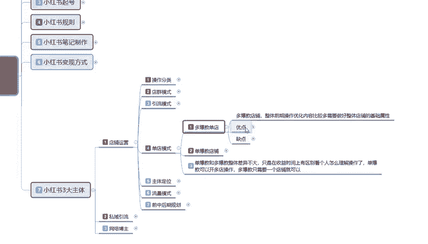

# 2024年全网最干货的小红书运营教程，小红书运营系统课(包含了剪辑／起号／小红书无货源各种玩法）小红书短视频零基础入门到精通，吊打一切付费课！ - P39：37、新手小红书运营-小红书单店模式 - 红书教程3 - BV1h1yNYXEvT

大家好，今天给大家分享的是小红书全集系列。第七大课时啊，小红书三大主体的一个内容。这节课的话主要是给大家讲解一下我们店铺运营里面的一个单店模式。嗯，首先了解一下什么是单店模式啊。

单店模式的话其实是和电群模式和引流模式，它们不一样啊。

单店模式的话，我们可以把它分为多款多爆款的一个单店模式，或者说是单爆款的一个店铺。它们两个的一个区别的话，就是说单爆款和多爆款整体差异的话，它是不大的，只是在收益和时间上面有区别。

看个人怎么理解和操作了。单爆款的话可以。怎么说呢？就是我做单爆款店铺的话，就是我可以开多个店铺，这个店铺报一个，那个店铺报一个啊，按概率学。我后续的话店铺就算说是流量下滑，流量不好做了以后的话。

我第二个店铺还在。第三个店铺还在，我还可以开第四个。第五个啊，你只要把模式了解清楚就可继续做啊，多爆款的话，就是说我们全心全意去做一个店铺。我想把这个店铺打造成。类似于大品牌的一种模式。

那你可以就可以去这么做。你就是你要有很多的自己出厂的一个产品才可以啊。单爆款的话，说实话你可以。怎么说呢？就是你自己没获得能做单保款，多爆款的话肯定不一讲啊，多爆款你必须要有自己要货源才好做。😡。

这就是两个店铺的一个区别。首先我们了解一下什么是多爆款单店。

多个款单店的话就是说整体它的一个前期操操作优化内容的话比较多，需要整理好店铺的一个技术属性。他就是当天模式，我们整体去操作的话，它的复杂程度是非常高的。为什么这么说？😡，因为你就这一个店铺。

一个店铺你们要做好几个爆款出来，那你首先是不是得先起一个爆款，同时第二个爆款也要上架开始做它的一个数据。第三个爆款也要准备好。正常一个多爆款的店铺的话，店铺里面最少有4到5款爆款产品。那么也就是你的。

后台你个人。所联系的卖家也好，自己做的也好，你整个店铺里面的产品。你最少要提供6款不同类型的一个产品上去才可以。他们基本上虽然说不是一次性运运行。

你是爆款报第一个报第二个报第三个报第四个报第五个报第六个，它是按顺序报完第一个连带提升第二个的一个权重。但是他们的一个数据量都是要操作的。啊。那他的优点是什么？

收益高。效果稳定，投入少。为什么说投入少？因为单店的一个多爆款的话，它的数据的话就是不需要从头再来。你第一款产品报出来以后，第二款产品的话，70%的概率可能在就做包。第二款产品做好以后。

第三款产品有30%的概率。第四款产品有10%的概率，就是你连续多爆款的话，你不需要再额外的一个在前期做数据准备的时候，你给他做呃销量，做排名，做关键词等等，这些你就会减少很多麻烦。啊。

就说它的一个效果是非常稳定的，收入也比较高，投入少缺点就是什么需要一定的资源。为什么这么说？我刚刚给大家说过了，你做多包五盘店的话，你最少自己要有厂家。😡，啊，稳定的厂家给你提供6款货。

提供5到6款的一个稳定货源，你才能去做。产品不稳定，你这个多爆款店的话，你都不好做，你卖着卖着没货了，你这个店你基基本上就直接嗝屁了。知道吧？这个就是最多爆款的一个单店。就是整个店铺的话。

说实话它的一个投入是非常少。但是他对我们的一个需求量要求就就比较高了。

那什么是担保款店铺啊？😡，单爆款店铺的话就比较适合用新人来新人去操作了，可以带来一定的收入。同时学习整体店铺的一个操作。什么意思呢？就是说嗯。

单爆款店铺啊，我们前期在操作的时候，它和多爆款店铺一样，而且它投入的话也是和多爆款店其实差不多，只是多爆款店，它唯一的一个需求呢就是产品要稳定。我们后续的会源要跟得上，单爆款店就不一要了。

我前期本来就这个店铺，我自己又没有会源，我去其他地方找到会员，然后来这个地方卖，能卖多少能赚多少是多少，我做完一批，我就换第二个店铺，我再去操作。他就通过这种方式来保证自己的就是说。保证自己不会亏。

对吧赚多少是一回事，但是肯定不会亏。然后它优点就是什么？呢收益高啊，效果稳定，投入少和多爆款店是一样的，只是操作稍微要简单一点，而且对个人需求就没那么高。他们两个的优点和缺点是一样的。

只是说多包款店的话，他对于个人的需求会偏高一点啊。但是他持续时间长一点。这个是实话啊，多爆款店的话一般的话都可以存在在3年以上。你单爆款店铺的话，说实话你就是季节性店铺。也能做个。七八个月。

这个店铺不倒就已经非常不错了，你基本上就要去做第二个店铺了。正常的话，你从第三个月开始，你就开第二个店。因为第一个店的话基本上就已经开始慢慢的起来了。第二个店你才就要开始步入行动了。

基本上3个月到半年左右。第二个店，第三个店，后续你就要陆续陆续一个一个开店。因为你第一个店的持续时间的话，可能就快结束了。这个呢就是单爆款店和多爆款店的一个整体区别。嗯，也是单店模式下面。

所讲的一个内容，就是说。结合上面啊店群也好，引流也好，等点模式也好。

你新人要做的话，说实话你新人如果说不了解你做网红就去了解引流模式。你做店铺就了解这个单店模式。店群的话，你说实话。想了解店群的人。你必须要有。网络运营基础才去做这个。没有的话，建议不要去做了。

那这这节呢分享就给大家讲到这。下节的话就是给大家讲解一下我们单店模式。后面这几个的话基本上都是单店模式的一个整体内容啊，主体的一个定位流量的一个小红书整体流量的一个模式，包括前中期。

还保和后期的一个整体规划啊，就是小红书店铺，你怎么做运营嘛，你要有自己的一个规划思路，后期都往哪个方面去靠。好吧，那今天的分享呢就到这。

