# 2024年全网最干货的小红书运营教程，小红书运营系统课(包含了剪辑／起号／小红书无货源各种玩法）小红书短视频零基础入门到精通，吊打一切付费课！ - P46：44、小新手小红书运营-红书私域引流 - 红书教程3 - BV1h1yNYXEvT

大家好，今天给大家分享的是小红书全集系列的三大主题啊第二大课时。

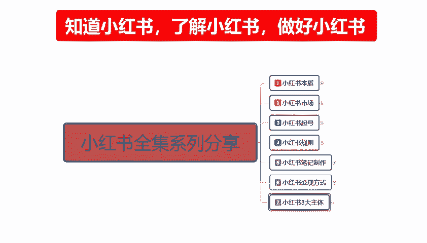

水위引流。我上一节给大家讲的是店铺运营的一个整体思路啊，当然了后续的一些太具体的东西我没给大家进行分享。后续的话会单独做一些这个店铺运营的课给大家。嗯，思域引流的话，它相对于店铺运营的话。

说实话它的模式是比较简单的啊，模式是比较简单的。但是它所操作的重点的话，嗯，怎么说呢？

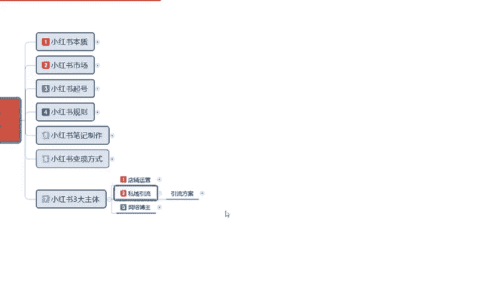

其实和店铺差不多，只是说他的一个整体方式，我们需要详细的了解一下啊。这里我的话我把它分为了呃。

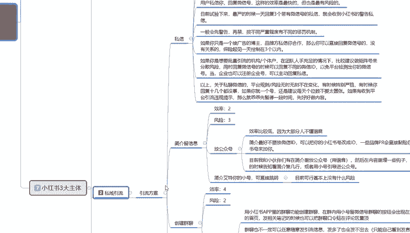

四个点这四个点的话，就如我们在把账号做起来以后，店铺权重做起来以后的话，我们引流到思域的一个方案和方式。大家可以了解一下。首先第一个。

私信。这个呢是私域引流的一个方案啊，大家可以了解一下啊，它的一个效率的话就是说风险也是我们拿些123455个等级来划分的话，效率风险为什么效率搞风险也大。你做完以后的话，基本上账号就废了啊。

但是建议的话，就说你做短期的那种呃只做账户权重的，你把账户权重做起来以后，按照这种私域引流的方式去负制十来个店。做这个方式也可以，但是。还是要大家自己考虑一下啊。什么意思呢？用户私信你啊，回复微信号。

这样的一个效率虽然说是最快的啊，但是也是最有风险的。目前的话就说我们四年下来的话，最严的时候，一天回复三个带有微信号的私信，就会受到小红书的一个私信警告。意思就是。你在小红书跟别人私聊的时候。

发三条微信的话，基本上就会被警告了。你再发的话就要封号了啊，所以说。效率快，但是。风险也大啊，你做短期的可以做长期的话，这种方式肯定不行。一般呢先会警告，然后再进按不同的严重程度的话。

有不同的一个惩罚机制。这个的话你做了你就知道了啊，就在这儿就不给大家做那个过多的一个解释了。然后如果你只有你只是一个接广告的一个博主的话，就是说品牌方私信和你合作，那么你可以直接回复微信号的。

这个没有什么关系啊。保险体见的话，一天的话还是说就说我们一个引流账号的话，一天还是控制在三个私信引流好，比较好啊。超过3个的话，被警告冷了不划算，没必要啊。如果说你是想批量引流的一个机构。

或者说是个体户的话，在团队人手充足的情况下。因为你做私域的话，你有团队才好做。你没团队的话，个人做的话，就说实话你只能慢慢做做引导，私信这种方式的话就不适合你了啊。团队的话因为账号比较多啊。

他可以做这种方式。建议的话就说做矩阵号。来操作的话会好一点。矩阵号的话，因为你本来有团队，你就是。嗯，做私信号，这个号做完浪费，然后把它那个。注销换号再重新来。你通过这种方式，你需要人员去操作。

所以说做举证号的话会比较好一点。你在评论区里面艾特某个私信，然后用这个号直接去给人家说发私信发微信号之类的。他对主账号的话是没有太大的一个权重影响啊，你也可以把账号的一个数据量给导过去。

这个就是私信的一个你。后面呢我就不跟大家说了，大家看一下就行。

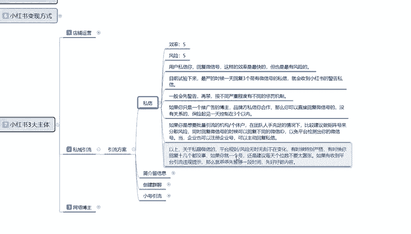

然后是简介有简介留言啊，效率的话比较低啊，风险一般。

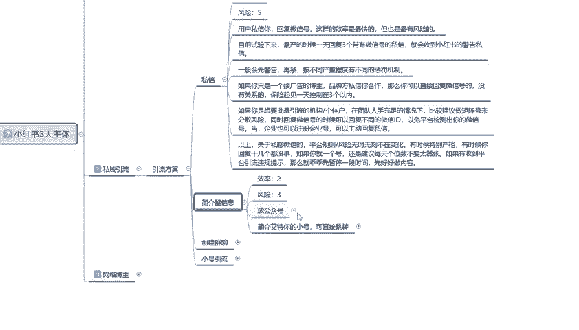

什么意思呢？简介留言。它的整体效率的话比较低，因为大部分人的话他不懂得谐音，就是我们在我们自己账号的留言面板上面，用符号用笔用其他的一些东西。然后的话简介留言。

流畅我们自己的一个微信号、QQ号或者其他的一个微博啊之类的等等一些信息。用特殊符号代表的话，系统它也会分辨，但是它分辨的话就没有那么清晰。

简介的话就是说最好不要放微信ID可以把小红书的号改成ID一些品牌的PR会直接粘贴复制你的一个小红书号来加你啊。就是别人要找你联系，要你要帮我推广广告，他会想方设法的联联系你。

而且这种放公众号的一个形式的话，说实话他也只有大的一个项目啊，他才或者说对小红书非常了解。对整个网络非常了解的人，他才会去想方设法的找到你的账号去进行联络。所以说他的效率是一般的啊。

对特定的人群中对主账号的话，说实话。不是太好用啊，就说目前我们的话就是呃小伙伴在简介里面放公众号，用谐音，然后在内容里面放一些钩子啊，在私信的时候呃。

看简介第几行或者用小号引导进行公众号这种方式的话还是比较安全。啊。点击艾特你的小号的话，可以直接跳转。目前的话基本上是。风险比较小，但是效率的话不是不高。

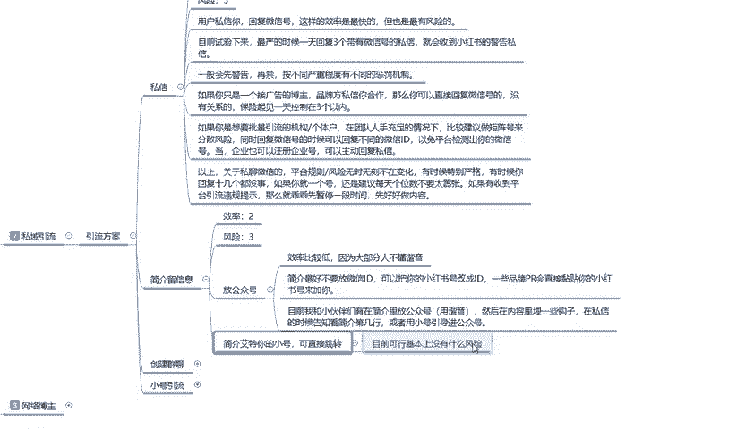

然后就是创建群聊和小号引流。

创建协调2效率4风险2。用小红书小红书里面它有一个群聊系统啊，APP里面的群聊功能的话创建群聊在群内用小号啊，留微信号，小号被封了无所谓，知道吧？小号的话被封了以后的话，我们再删除，再重新注册就行啊。

注销一下，然后再重新注册就行。在小号用小号留微信号，群聊的按钮会出现在主页的一个首面。首页发布相关的一个笔记的时候，也会把群聊的一个口令。评论在评论区，然后我们用组号把它置顶就可以了。懂意思吧？

这个就是我们整个的一个思域引流的一个方案。当然了，群聊也不一定可以任意发布引流信息啊，发多了也会发不出去的，只能看自己。只能自己看到发言，就是说他会被系统屏蔽掉啊，你微信这种东西发多了以后的话。

一个账号你发个发个几次就会被屏蔽掉啊。但具体的一个边界的话，没有，就是说我们也没没有测出来它的一个明确的具体数量是多少啊。还是要看我们自己根据账号不同的一个测试，我们自己测试一下去操作比较好。

就说如果不是每次有人进来以后，你一遍一遍的发微信的话，你可以在群管理设置里面啊开启对新城。新程序用户的一个展示历史消息。你把这个打开以后的话，新人进来以后的话，你让他往上面看就行啊。

可以看我们之前发送的一些消息。比如说你避免啊。账号频频繁的频繁的更换新号的这个方式啊。就是让新进来的用户也能看到我们上面发送的一个消息就可以。怎么维护就看我们自己了啊。

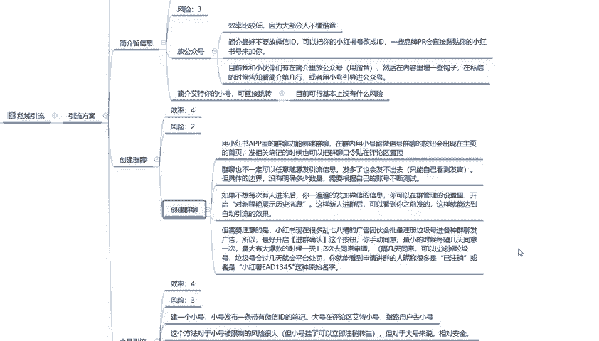

注要注意的啊，就是小红书现在很多乱七八糟的一个广告团伙会批量注册垃圾号进行各种的一个群聊发广告。所以最好开启确进行确认这个按钮啊，你要手动同意最小的时候没。就说你不是长时间在小红书上面的话。

最好的话就是说每隔几天同意一次量大的时候大爆款的话，有个1到2天同意一次，或者是一天同意两次这种隔几天同意，可以过滤掉很多的一个垃圾账号，跑到你的群里面给你发广告，懂意思吧？就是我们在操作的时候。

你也要避免同行的一个竞争啊。这里面的话就是说垃圾号的话，他过几天的平台就会处罚了。因为它的不光在你那推广，但到其他地方也是做推广的。你就能看到就申请进群的人，你就是把这部分人把它避免掉的话啊。

避免竞争的话，进群的人称你会有很多是已注销或者说是小红书EAD12345这种名字，就是原始名字，他没有改名字的那种啊，你把它直接删掉屏蔽掉就行了，不让他进来就行。这个就是小红书创建群聊。群聊以后的话。

我们再去引流到其他方地方的一个方式。然后是小红引流。

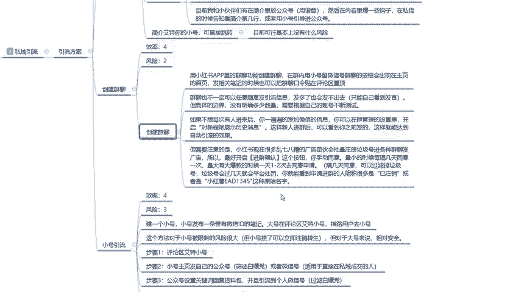

小号引流的话效率是比较高的，风险也还行。建议一个小号小号发布一条带有微信的ID的一个笔记，大号在评论区艾特小号啊，指路拥庸指路就是去找他啊，加我微信私聊。通过这种方式去做这个方法的话。

对于小号被限制的风险很大。就说小号挂了，我们可以立即注册再换，然后再发笔记就行。对大号来说的话，相对安全一点。嗯，就是步骤就是评论区艾特小号，步骤2，小号发主页，发自己的公众号筛选，不要。

白嫖档或者说是微信号啊，用于直接在微信私域成交的。步骤三就是公众号设置关键词回复资料包，并且呢引流到各种微信。公众号的话需要沉淀一下我们个人品牌和故事啊，就是公众号里面你要把它做好了，你才能去做引流。

你公众号做不好的话，你做引流，你上面这几个方式都不行。

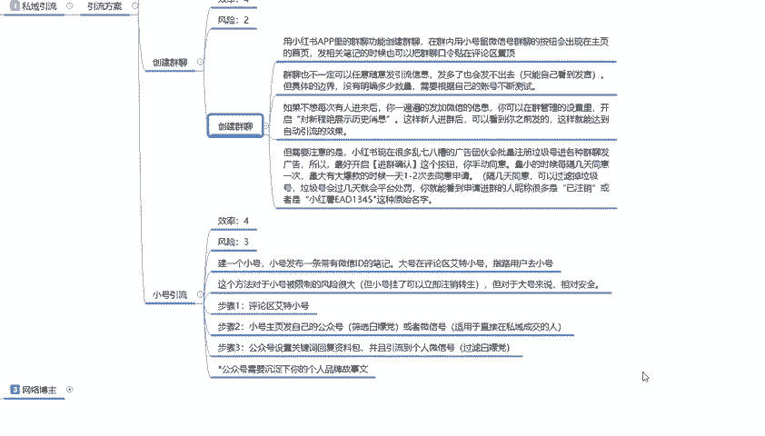

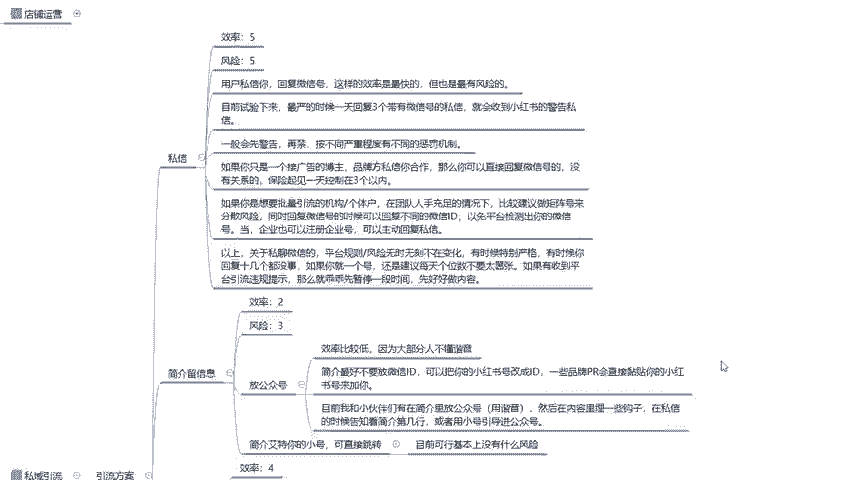

懂意思吧？你没做好的前提下都不行。😡，啊，后面也包括小号引流啊，小号引导之类的，就看我们自己怎么去配置了啊。你做这种呃思域引流的，说实话，你按照这个方式这几个步骤去做的话，你只要账号没有什么太大的毛病。

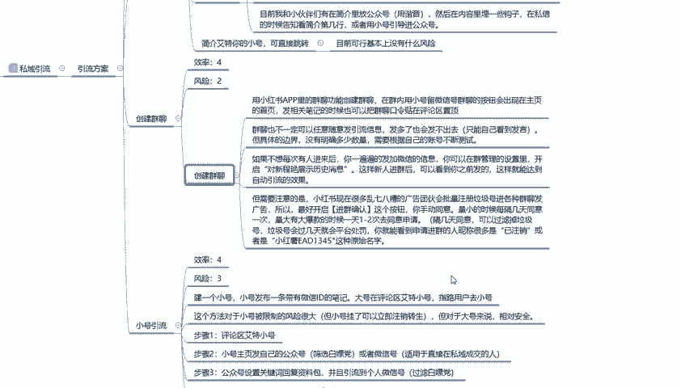

都比较好做。这个呢就是整个的一个思域引流的一个方案。好吧。呃，下一节呢就是我们本系列最后一节课网络博主，我们应该怎么去操作。本来呢是有好几个方案的，在这里的话，我就只给大家列了一个重点的一个方案。

让大家了解一下啊，整体的大致规划和思路的话，基本上都是一样的。只是说我们选择的一个方向的话，它不同。好吧，我们主要是进行一下了解。

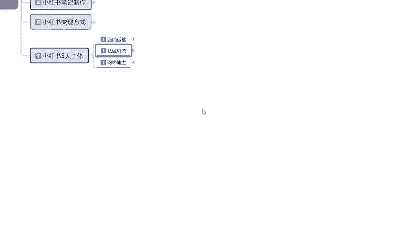

那今天的分享呢就到这里。

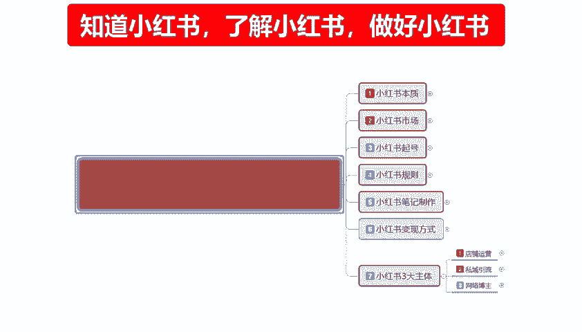