# 2024年全网最干货的小红书运营教程，小红书运营系统课(包含了剪辑／起号／小红书无货源各种玩法）小红书短视频零基础入门到精通，吊打一切付费课！ - P48：P2小红书的用户结构 - 红书教程3 - BV1h1yNYXEvT

接下来呢我们看一下小红书这样一个平台，它的整体的一个用户结构。

我们根据这个数据呢，可以看出来啊，在小红书整体的用户结构当中呢，是女多男少。

那么这个呢也肯定。啊，大家也能看出来，也能感受到，平时呢喜欢逛这些购物平台，或者经常泡在这样一些购物APP上的呢，多多是女性为主。😮。

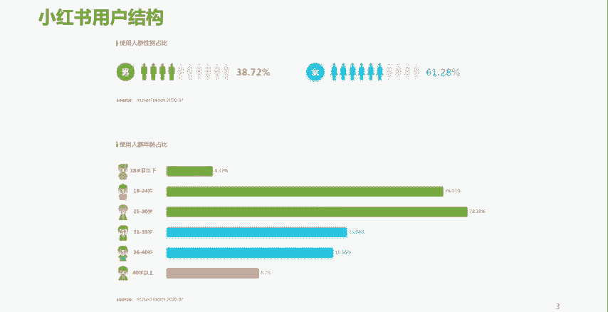

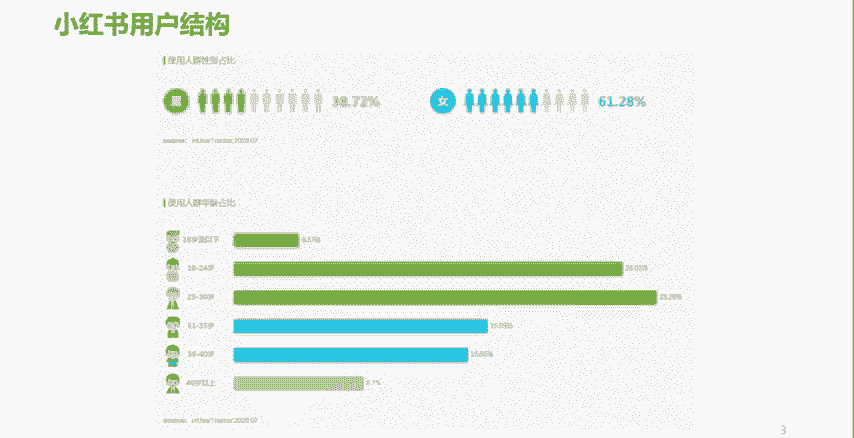

对吧那么并且女性呢。或者说年轻的女性呢，她是占据了我们整个消费市场，可以说是一个相对来讲是一个主导性的这样一个地位。

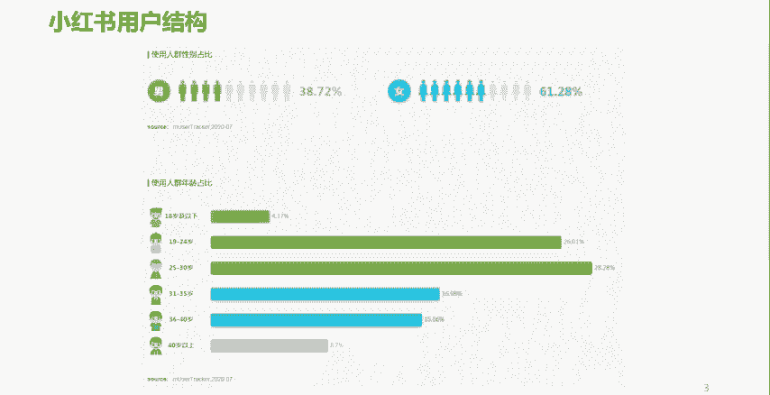

所以呢现在呢我们也经常说一个词叫做他经济。

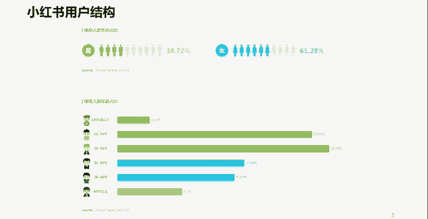

这个她呢是女字旁的那个她啊，她经济时代啊，所以说这个女性呢是小红书的主流用户。

所以大家呢就要去考虑一下，将来如果做小红书的时候呢，就要去考虑一下我生产的这样一个小红书的内容。我做的这样一个内容。

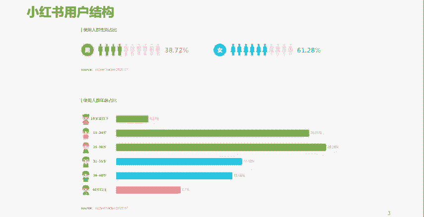

是否。符合小红书小红书这样一个主流用户的一个喜欢呢。

是吧好，接下来看一下他的年龄结构。

小红书的年龄结构呢是19岁到30岁，或者我们可以这样理解，20岁到30岁的用户为核心，相对来讲呢是偏年轻一些。

啊，相对来讲呢偏年轻一些。而且呢是以女性为主。

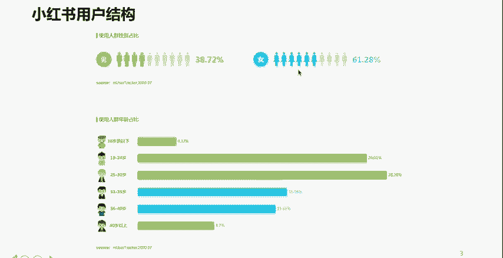

那么大家就知道了，如果你公司的目标客群正好匹配。

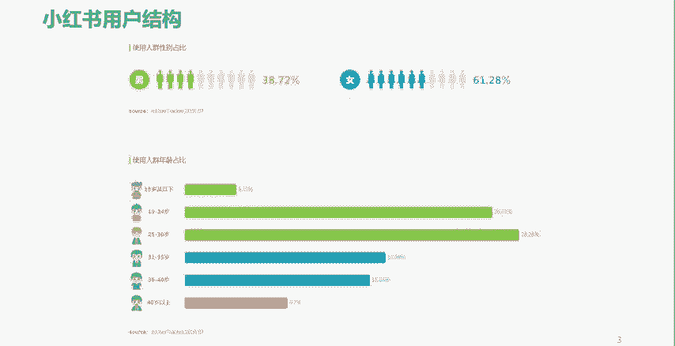

啊，小红书的这样一个用户特征。

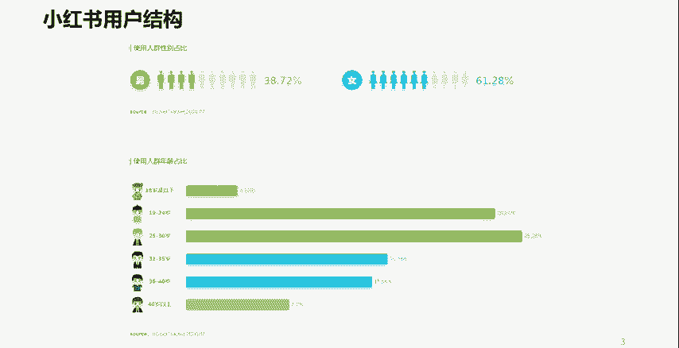

那么小红书肯定也会成为你的公司的不二之选。

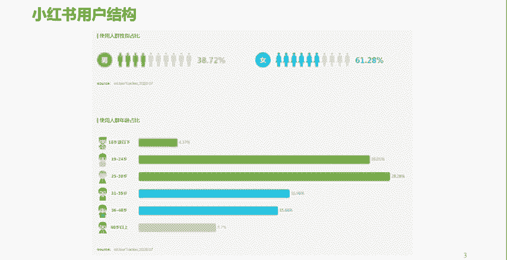

啊，或者是一个重要的一个选择。

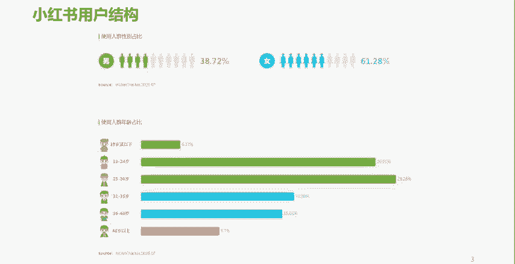

但是如果你公司啊这个产品针对的目标客群。

跟小红书的主要用户大象径庭。

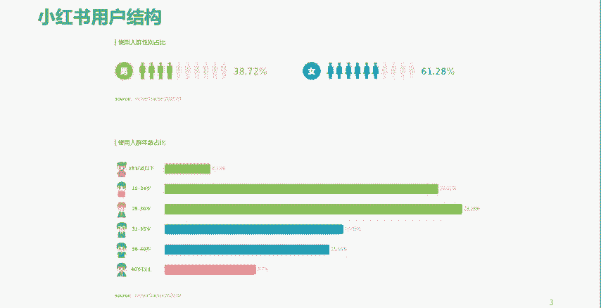

啊，很不吻合。那你在这上面你就要去考虑一下是否。

要去将小红书作为你的一个主要阵理。所以我们了解这些数据呢，最主要的目的呢就是能够让我们将来在做小红书运营的时候，不管是是否选择小红书。

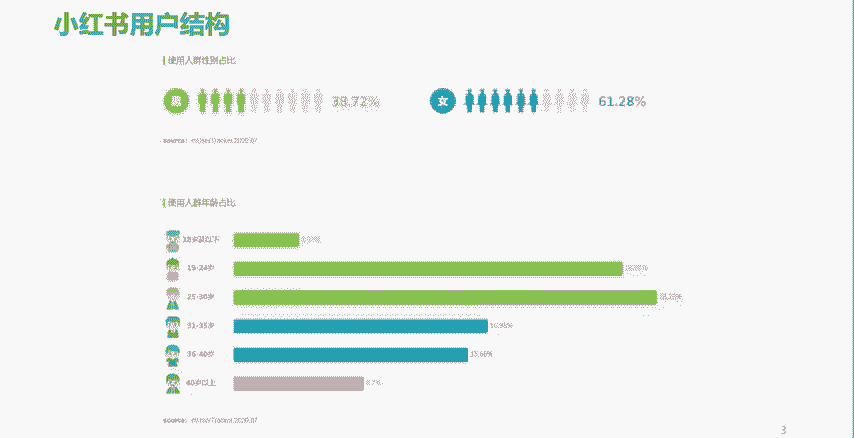

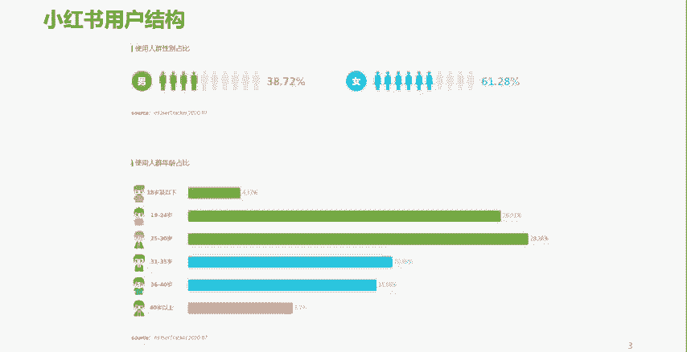

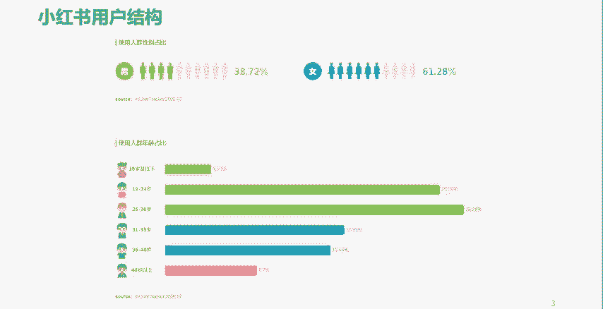

啊，是否将小红书作为一个主要的一个平台或者阵地？

在小红书上面生产一些内容。应该符合什么样的人的一些阅读习惯，或者一些内容的一些胃口。😮。

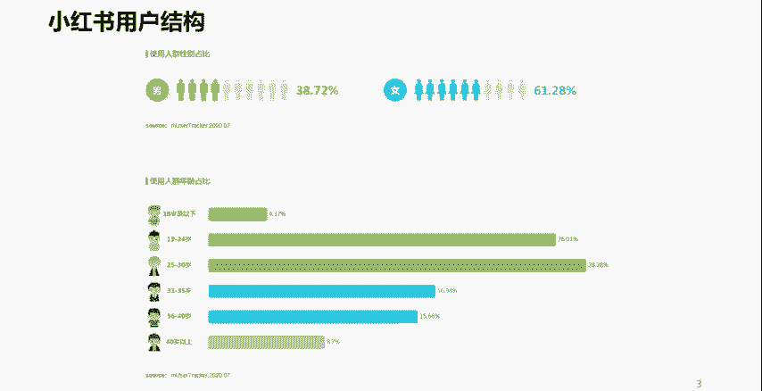

啊，我们呢就有了一个大概的一个什么呢？

图谱那有了一个大概的一个参照。那么这个呢就是小红书的一个用户结构。

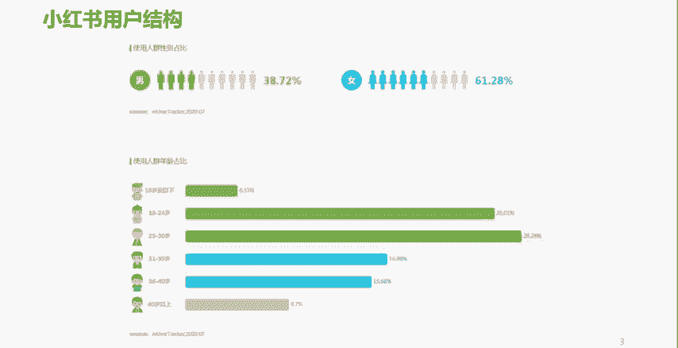