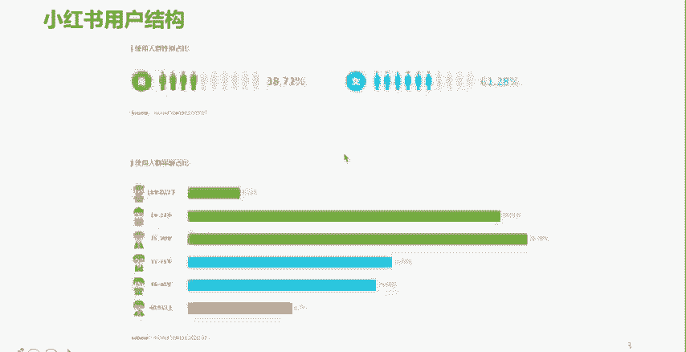
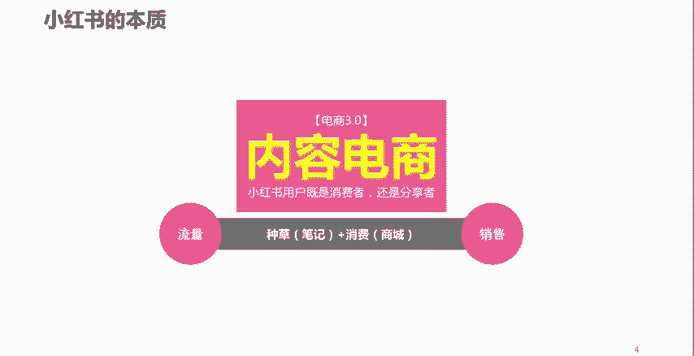

# 2024年全网最干货的小红书运营教程，小红书运营系统课(包含了剪辑／起号／小红书无货源各种玩法）小红书短视频零基础入门到精通，吊打一切付费课！ - P49：P3小红书的电商本质 - 红书教程3 - BV1h1yNYXEvT

好，接下来呢我们说一下，刚才我们也提了，说小红书呢，它事实上它是一个电商平台。那么从本质上来讲呢，小红书呢是属于一个内容电商。啊，那么说到电商呢，我们也跟大家讲一下。😮，就是纯粹意义上这个电商啊。

电子商务就是通过一个网络渠道啊去进行一些什么呢？商品的推广销售。那么呢，在这个领域当中呢啊业内呢也有的人呢把它归结为了三个发展阶段。第一个发展阶段呢，业内的人呢叫做电商1。0时代。也叫做综合电商时代。

综合电商。什么叫综合电商呢？大家想想。😡，从0几年啊，就是05年那个时候，05年左右。啊，那个时候呢，就已经有很多。电商平台呢逐渐慢了冒了出来。你比如说那个时候淘宝。这个平台啊。

我们在上面呢哎各行各业各种商品，各种类型的东西，我们基本呢都能买得到。而且各种各样的卖价。是吧有企业有个人啊，有生产商是吧，还有经销商是吧，等等。所以呢他上面的商品类目呢五花八门。

那么这个呢就叫做电商一点0时代。那么综合电商当时候呢，我们都知道，很多时候我们想要把一个店铺的流量做起来是吧？我们都要去靠一些什么呢？哎，比如说呃花钱。找点人。是吧要么呢就是花钱。去做这个钻展。

去做直通车。是吧或者是通过一些什么呢？其他的一些付费推广。来为我们的店铺呢进行引流。那么发展到后来的时候，呢，我们发现。这个综合类的电商呢成为了一种什么呢？强者愈强的平台。啊，大家呢也可以做一个尝试。

比如说在座的各位啊，各位听课的朋友们，我相信你们都是淘宝的买家。你们呢如果感兴趣呢，可以把我是买家呢变更为我是卖家。当然这中间呢可能会涉及到一些呃执照方面的一些资质的认证。啊，你比如说变成我是卖家了。

你做一个新的一个卖家，新的一个什么呢？商家。😡，哎，你可以比如说把你们公司的商品上货到你的店铺。或者是什么呢？去这个呃一些，比如说像什么1688啊，这样一个平台上面呢。

去找一些那种一件代发的商品上架到你的店铺。啊，那么你呢就会发现你的店铺做的好好的是吧？包括店铺也起了个好听的名字，也做了店铺装修。啊，商品类目也划分的挺好。然后呢，你可以找一个朋友。通过他的账号呢。

在平台上呢搜索你的店铺。你会发现。很大概率上是搜不到你的店铺的。为什么呢？因为在这里头呢，他有一个临界值。啊，有一个临界值，就综合类的这种传统电商，它有个临界值。

如果你的店铺的各项指标啊突破不了那个临界值的话，你的店铺是很难有访客量，或者就是说很难有流量的。所以呢这就需要你的店铺呢投入大量的这样一个费用啊，人力去进行一个什么呢？推广，所以呢他花费了很多的经费啊。

所以说很多企业呢也是对这方面呢也是痛之已久。那么再到后来呢，电商2。0时代就来了。电商2。0时代呢就是垂直电商时代。我记得之前呢一位互联网大咖呢说过这样一句话，说互联网家的出现。让360行。

变成了3600行。各行各业都在垂直细分。那么电商也会出现。是吧比如说卖药品的有电药品的电商平台。卖家居的有家居类的电商平台。是吧哎，卖这个。母婴用品的有母婴类的电商平台。

卖这个女性类时尚类的这样些用品的，有这方面的垂直平台。哎，卖美妆类的，有美妆类的垂直的电商平台，他开始走这种垂直化发展。但是呢垂直化发展呢，这又一个问题来了。就是用户的价值最大化很难做到。因为你想啊。

比如说一个举举个例子，一个做美妆的一个电商平台，他虽然很垂直。😡，但是来到这个平台上买美妆的用户，他除了买美妆之外，难道他就没有其他的消费需求吗？是吧所以用户的价值最大化呢很难做到很好。

所以呢对于辛辛苦苦做了很多工作，来了一个流量，发现这个流量的价值很难做到最大化，很难做到理想化。所以呢垂直电商呢也遇到了一些发展中的一些什么呢问题，尤其是不管是传统的综合电商还是垂直电商。

都面临着一个最最最共性的一个关键问题，就是流量的获取问题。对吧那么很多公司做电商做流量靠什么呢？靠砸钱。所以呢也是时代的产物就出来了一个什么呢？电商3。0的一个阶段。那么电商3。0呢。

就是我们现在所讲的内容电商。那么内容电商呢，大家可以从中间呢给他。分开来理解一下内容是什么，内容是做流量的，电商是什么？电商是做销量的。所以说内容电商呢它很好的解决了流量怎么来销量怎么产生这样一个问题。

那么我相信大家呢啊这几年来呢，尤其是近几年呢，大家也可能发现了，不管是你的淘宝APP呀，京东APP啊，还是其他的一些电商型的平台，也发现了有这种类似于种草啦，或者是什么呢？

分享的这样一些内容的一些频道或者是板块。对吧所以说呢像以前一些传统性综考的电商平台呢，也开始逐渐意识到了什么呢？内容的一个必要性和内容的一个价值性。那么比如说像我们平时看的短视频带货。

直播带货严格意义上讲呢，这些呢也可以理解成是通过内容带来流量，把流量转化为销量。其实呢跟内容电商呢如出一辙。所以说小红书的本质呢就是通过内容。啊，通过内容，然后呢，我们解决好这个流量。然后呢。

我们再通过平台上的什么呢？店铺解决好这个销量。所以说呢小红书呢其实呢它就是通过这样一个。帮助企业呢解决了流量的一个困扰，同时呢又能够带来销售增量或者是销售转化的这样一个平台。

所以呢小红书的本质呢其实就是内容电商啊，或者说呢我们用一个比较。新潮一点的词内容这一方面，我们可以理解成是自媒体板块。电商这方面可以理解成是自商业板块。所以呢小红书呢也可以理解成是自媒体加自电商。啊。

就是。通过小红书这个平台呢，我们可以实现流量的获取啊，销售量的促进啊，或者是展转化啊。

