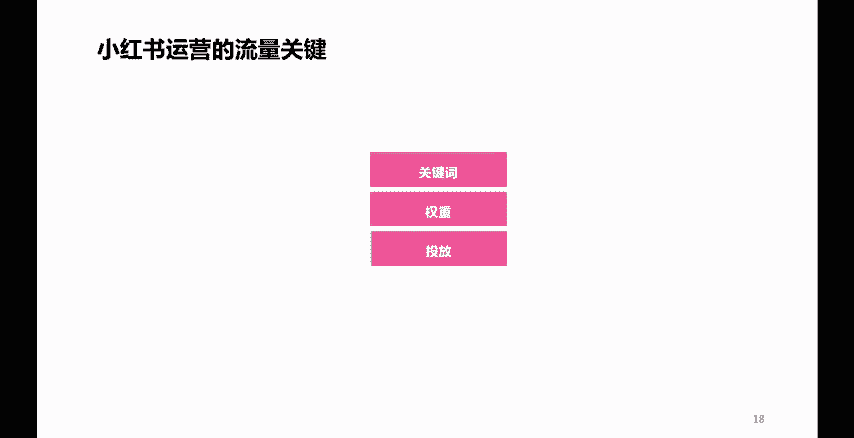
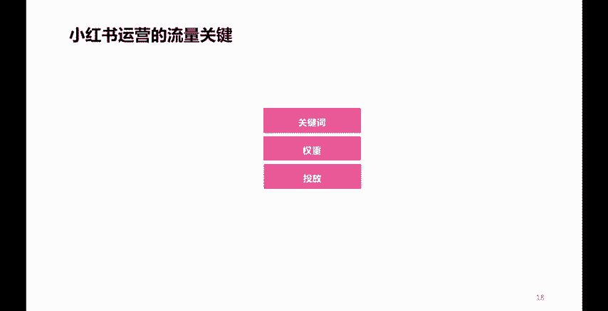
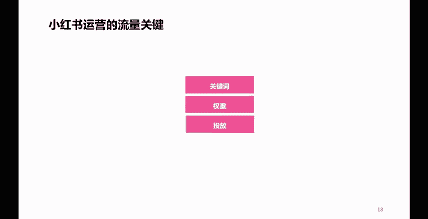

# 2024年全网最干货的小红书运营教程，小红书运营系统课(包含了剪辑／起号／小红书无货源各种玩法）小红书短视频零基础入门到精通，吊打一切付费课！ - P61：P15小红书高效引流的方法 - 红书教程3 - BV1h1yNYXEvT

我们下看，那么说到底。影响小红书以及内容的一个流量关键点在哪儿呢？

啊，或者说。提升流量。还有什么样的一些技巧呢？啊，就是这三个点。第一个。关键词。

我们在写小红书内容笔记标题的时候。

或者是笔记内容的时候，或者是做图片，做视频的时候是否清晰。清晰匹配的体现了我们账号的垂直定位，清晰的体现了相关的一些关键词。这个非常重要。第二个是权重。虽然呢有些人说这些账号呢不存在权重这一说。

但是呢我告诉大家。

权重指的是什么呢？指的是你账号的一个活跃度。你要记住我刚才说的一句话，任何一个平台都喜欢活跃用户。所以你经常活跃。

啊。有规律的去进行内容的更新发布，一定程度上呢是有利于你这个效果的一个什么呢提升的。

第三个点是投放。啊，大家都知道小红书呢笔记呢有一个投放的一个渠道呢，叫做薯条。他呢是可以通过付费。

啊，通过付费一定程度上呢可以提高你一个笔记的效果的对吧？这个功能叫薯条，大家呢打开小红书啊，笔记啊，在笔记浏览那个界面右上角有三个点，点开之后呢，就可以看到啊，下面底部呢有一个薯条功能。

它呢是可以付费啊，进行把笔记流量或者是点赞评论这些啊，做到一个更好的一个提升的。

啊。那么这三个点呢，也可以为我们小红书的笔记内容带来一个比较哎来说比较是更好的一个效果啊，获得更好的一些流量啊，更多的一些流量啊，所以。

这三个点呢，大家呢也可以去使用一下啊。

