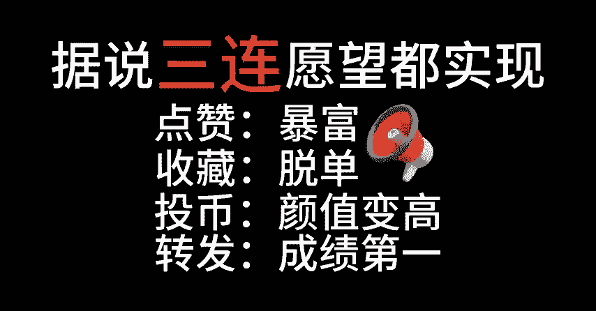
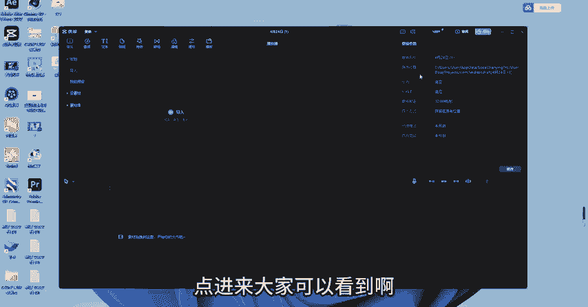
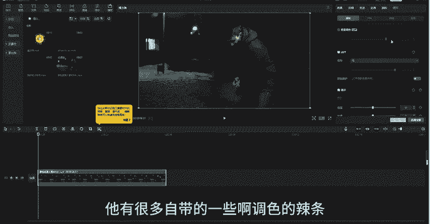

# 2024年全网最干货的小红书运营教程，小红书运营系统课(包含了剪辑／起号／小红书无货源各种玩法）小红书短视频零基础入门到精通，吊打一切付费课！ - P64：【剪映教程】软件及界面介绍 - 红书教程3 - BV1h1yNYXEvT

이가。

hello大家好，我是阿七老师。啊，听到很多同学跟我说能不能出一点剪映的教程啊。其实我平时上课的话，我确实会针对PR比较多一点。但是影视后期这一块的话呢，它并不局限于某一个软件。

如果你感觉有的软件它制作起来确实更方便的话，那么也可以比如说剪映的话，其实它有的功能啊，有的效果比我们自己纯粹的用PR去做的话，确实要方便很多。因为我们使用的是别人的一些模板，对吧？

如果说在一些比较紧急的情况下，你确实可以去使用它。像PR的话，它的一个可创作性确实是比较大的。那么像剪映这个软件的话，它是分有两个版本的啊，一个是我们的PC版本，就是我们的电脑端。

另外一个一个的话呢是我们的手机版本，其实功能使用的话都是差不多的。在这个地方我们可以点击开始创作。那点进来大家可以看到啊，这个面板的话，看起来还是比较的清晰简洁的，对不对啊，包括我们可以看到剪映它最大。

😊。

的一个特点就是它自己自带的一个素材库呢还是比较丰富的。像这里会有一些云素材啊，你们可以使用你们自己的抖音去登录一下。这样的话，你自己在抖音里面收藏的一些效果是可以同步在剪映里面去使用的。

这个我觉得还是非常的方便，包括你们有平时使用到一些转场一些搞笑的这个素材的话，在这里面也全部都是自带的对吧？它的一个后台还是比较大的，那手机版本的话，大家可以看一下啊，呃，它也是一样的。

我们直接在中间点击进去的话，有一个开始创作，那像剪映的话，它其实拥有的AI要更多的一点。因为它有一个一键成片，你直接把这个素材选中，然后给它一键生成片子就OK了。但是大家要注意到这个一键成片的功能呢。

它不是很智能，就是它做出来的项目啊，不是很好看，毕竟AI嘛，对吧？它只能够说给我们去进行一个最简单的操作啊。但是如果说你想让它给你剪出一条非常。😊，有创意的片子的话，这个是很困难的。那么在这个地方。

我简单的给大家说一下它的每一个部分的功能。好吧，首先在这一块啊，是我们导入素材的一个区域，在P2里面是一个素材区，对吧？那么它的操作区呢也是一样的，在最下面其实它这里每一个都有提示的。

大家跟着它去做就很简单了。然后中间这里是它的一个预览区。嗯，那我们在这里演示一下吧。随便的放一个，好吧。😊，比如说我在这里选中这么两个素材，然后我随机的选一段给它放下来。这样子的话。

你们就可以随意的去排列。而且我觉得剪映它最大的一个功能就是它可以去识别你们的这个音频去给你们加字幕，并且它现在加字幕的这个功能还是蛮蛮智能的，它可以去把你一些无所谓的语气词啊，全部给它剪掉，对吧？

你们也看到这里会有一个提示，然后这些功能的话其实大差不差。你们每一个去点的话，它的操作还是比较简单的那这个呢呃是我们的一个基础界面。右边的话呢就是我们PR里面的一些调整区啊。

或者说我们可以去加效果的一些区域啊，对吧？大家都可以看得到啊，它有很多自带的一些呃调色的lo，然后一些呃跟踪转场的效果，这些都有。你们可以自己去试一下。然后接下来的教程呢。

我会给大家演示几个如何用剪映去制作一些比较炫酷的案例。当然我演示的话呢，会给大家用手机版本的。

去演示。因为你们大多数人可能平时用手机去剪辑，要更加的方便一点。如果说你们要用电脑去剪辑的话，它的操作也是差不多的，好吧。

