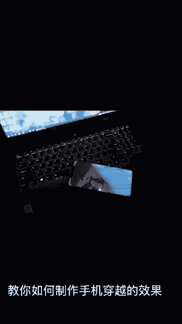
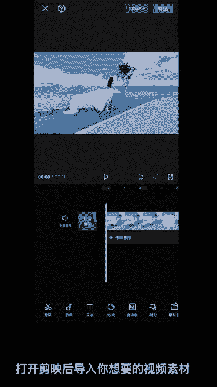
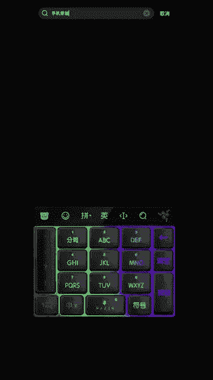
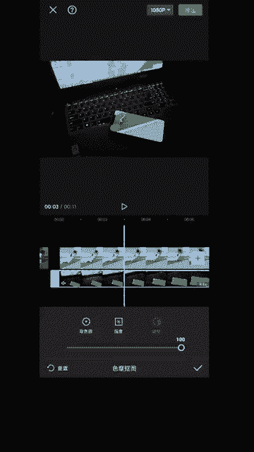
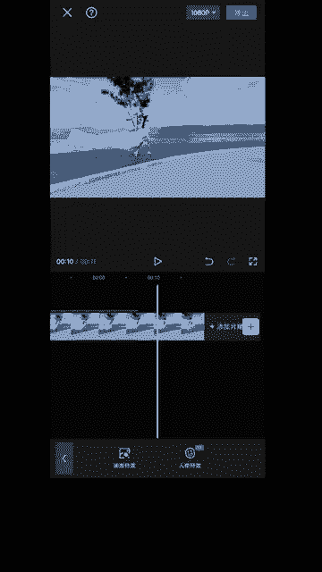

# 2024年全网最干货的小红书运营教程，小红书运营系统课(包含了剪辑／起号／小红书无货源各种玩法）小红书短视频零基础入门到精通，吊打一切付费课！ - P65：2.手机穿越效果 - 红书教程3 - BV1h1yNYXEvT

🎼教你如何制作手机穿越的效果。

🎼打开剪映后导入你想要的视频素材，点击画众画，点击新建画众画，点击素材库，搜索手机穿越。😊。

把第一个添加进来。然后把画中画放大覆盖住。把话中话音量关闭。找到色度抠图。把光圈移动到手机位置，强度拉满。伊拉曼。

最后在视频结尾加上特效就完成了。😊，让我们看一下成品。

