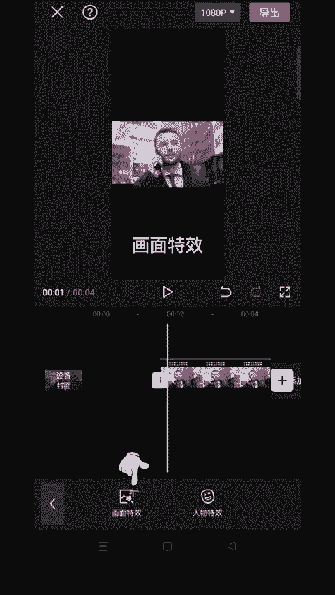

# 2024年全网最干货的小红书运营教程，小红书运营系统课(包含了剪辑／起号／小红书无货源各种玩法）小红书短视频零基础入门到精通，吊打一切付费课！ - P66：3.人物分离屏幕 - 红书教程3 - BV1h1yNYXEvT

🎼教你制作这种人物处理屏幕的效果。首先导入一段人物视频。🎼时间轴移动到末尾，点击定格，选中视频，点击复制。🎼点击切画中画，然后与上面视频对齐。🎼给画中画图层选择智能空像。🎼在开头的位置打一个关键针。

往前移动一点时间线，双举把视频放大。🎼再给画中画图重复制一遍，同样拖下来对齐。🎼点击特效画面特效。

🎼选择基础里的动漫模糊，按黑里白养液。😊。

🎼再选择一个荧光线描的特效。🎼作用对象选择画中画。🎼调到混合模式，选择绿色，这样黑色背景就去掉了。最后加入抖音收藏的音乐，一起来看看效果吧。😊。

🎼Oh， I got break。

