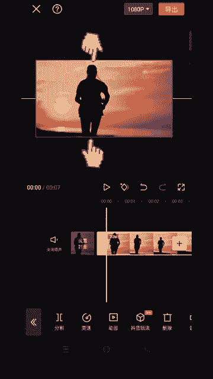
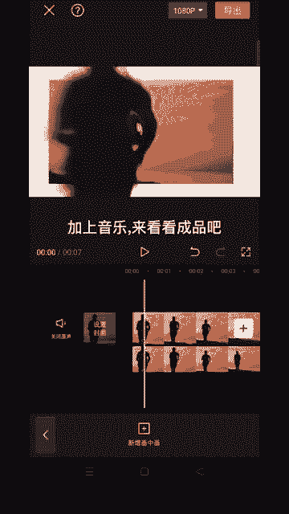

# 2024年全网最干货的小红书运营教程，小红书运营系统课(包含了剪辑／起号／小红书无货源各种玩法）小红书短视频零基础入门到精通，吊打一切付费课！ - P67：4.人物跑进画面 - 红书教程3 - BV1h1yNYXEvT

🎼这种人物跑进画里的效果是怎么做的？

🎼别怕让我来教你。首先导入一段奔跑视频，双指把视频缩小一点。

🎼点击背景，选择画布颜色，选择白色，给涂层复制一遍。🎼点击切画中画，接下来向左移动对齐主视频。🎼选择画中画图层，点击智能抠像，点击动画入场动画，选择动感缩小，时长可拉长为2。8秒。🎼这样效果就好了。

加上音乐来看看成品吧。😊。

🎼让你奔赴。

