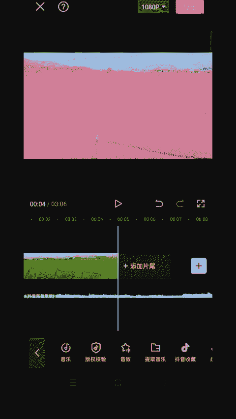

# 2024年全网最干货的小红书运营教程，小红书运营系统课(包含了剪辑／起号／小红书无货源各种玩法）小红书短视频零基础入门到精通，吊打一切付费课！ - P68：5.渐变粉色效果 - 红书教程3 - BV1h1yNYXEvT

。

🎼教你如何制作渐变樱花色的效果。🎼首先导入一段文字视频。🎼选中视频来到开始变色的地方，打上关键针，要结束变色的地方，打上关键帧，打开滤镜，选择这个滤镜。🎼点击调节对比度12，饱和度加9色温17。

🎼最后一个关键帧，点击滤镜，滤镜调为0。🎼最后添加抖音收藏的音乐。🎼分割删除多余的音乐。

🎼一起来看看效果吧。🎼。

