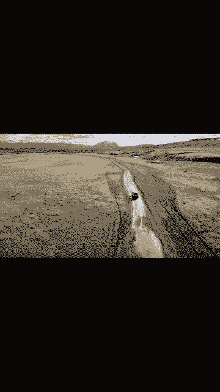
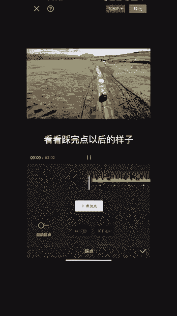
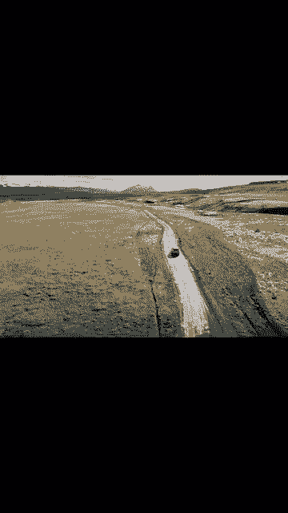

# 2024年全网最干货的小红书运营教程，小红书运营系统课(包含了剪辑／起号／小红书无货源各种玩法）小红书短视频零基础入门到精通，吊打一切付费课！ - P69：6.抽帧卡点 - 红书教程3 - BV1h1yNYXEvT

🎼想知道什么是抽帧卡点吗？抽帧卡点分为两种，一种是音乐节奏明显浅因素度，添加一段喜欢的音乐，选中音乐，点击踩点。

点击自动踩点，然后在高点除把视频分割，分割以后再下一个节奏点再分割，然后把中间删掉，再继续选择下一个节奏点，分割再选择下一个节奏点分割删除。接下来如此重复就好了。🎼第二种是音乐节奏，没有规律。

🎼The。像这种音乐，我们要手动踩点。我们可以在每一个节奏波形最高点添加点就行了。🎼看他彩完点以后的样。

🎼The。🎼。🎼然后再像之前一样分隔删除就好了，这样抽针就做好了。🎼。

🎼。