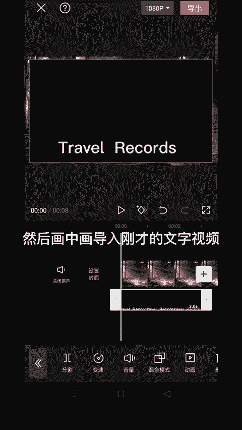
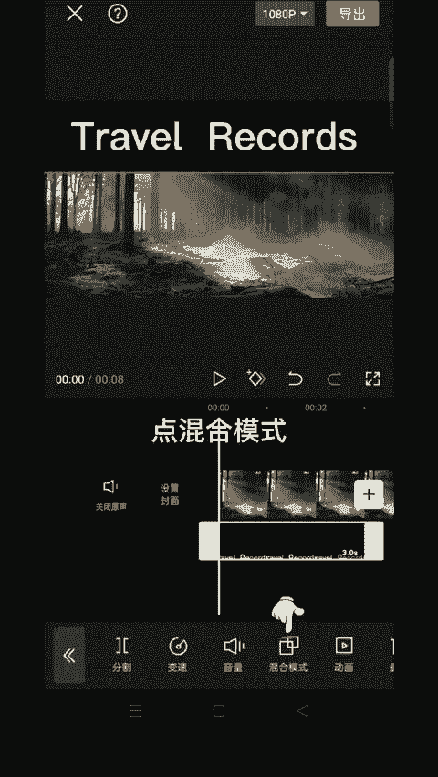
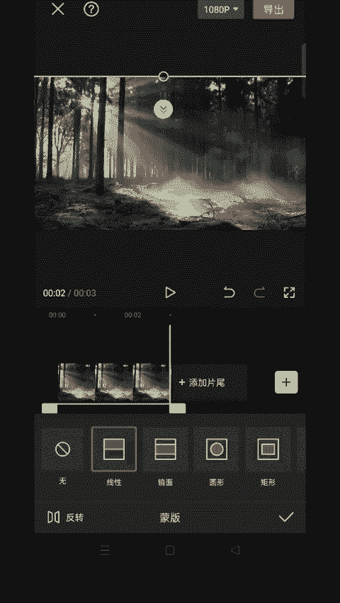
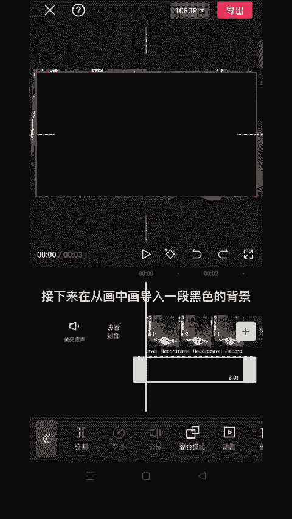
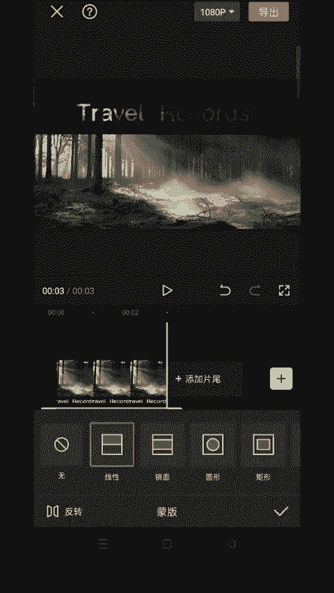
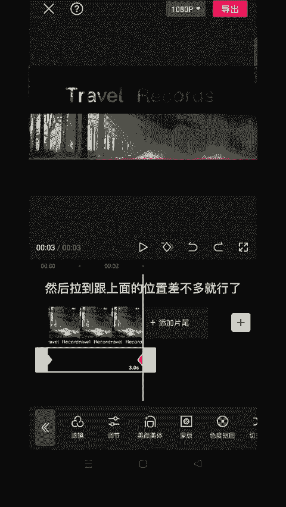

# 2024年全网最干货的小红书运营教程，小红书运营系统课(包含了剪辑／起号／小红书无货源各种玩法）小红书短视频零基础入门到精通，吊打一切付费课！ - P70：7.电影感片头文字 - 红书教程3 - BV1h1yNYXEvT

🎼教你用蒙版制作这种电影杆片头开场，首先导入一段黑色背景，然后输入文字，文字位置可以低一点。

🎼然后把视频导出。🎼然后我们新建一个项目，然后画中画导入刚才的文字视频，然后调整一下视频位置。

🎼点混合模式选择变啊。😊。

🎼分割删除多余的部分。🎼我们给画中画图层添加线性蒙版，把这条黄线拉上去对齐。🎼然后在画中画图层开始的地方打上关键针，然后时间线移到最后面，然后再打开蒙板。🎼然后移动横心往下拉，做一个从上往下的动话。

🎼这样文字出现的效果就好了，接下来再从画中画导入一段黑色的背景，放大，同样拉到下面对齐。😊。

🎼同样开头添加关键帧，时间线拉到末尾。🎼同样选择线性蒙版。

🎼然后用红线往上拉，然后拉到跟上面的位置差不多就行了。

🎼这样电影杆片头就完成了。