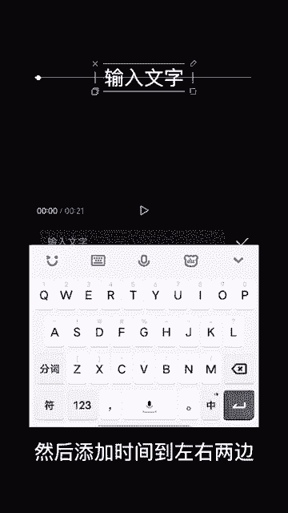

# 2024年全网最干货的小红书运营教程，小红书运营系统课(包含了剪辑／起号／小红书无货源各种玩法）小红书短视频零基础入门到精通，吊打一切付费课！ - P71：8.播放进度条 - 红书教程3 - BV1h1yNYXEvT

教你使用关键帧和蒙版制作播放进度条，首先导入一段黑色素材，时长调到20秒左右。画中画添加一段白底素材，时间轴与主轨道对齐，点击白色素材选择蒙版，选择镜面蒙版，将视频压缩成一条线，然后导出备用。

选择白色素材混合模式，选择绿色。调整绿色为50左右，导入备用的素材，点击蒙版，选择线性蒙板，旋转蒙板90度，拖动蒙板到左边，点击反转。

在视频前边点一个关键帧，拖动到最后边，将视频对齐，将蒙版拖动到右边。

添加一个白色素材的画中画，选择蒙版，选择圆形蒙版，调整蒙版大小和位置。

将画中画对齐主轨道，在画中画前端点一个关键针，拖动轨道到最后边，将圆形蒙板挪至右端。

然后添加时间到左右两边，最后再添加1到20秒到视频中调整一下文字位置就完成了。最后做出来是这样的。😊。

