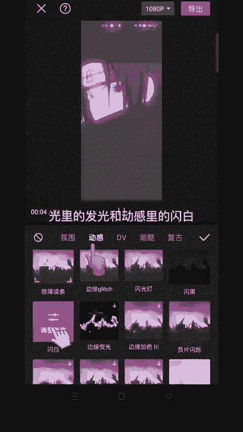

# 2024年全网最干货的小红书运营教程，小红书运营系统课(包含了剪辑／起号／小红书无货源各种玩法）小红书短视频零基础入门到精通，吊打一切付费课！ - P72：9.花瓣飘落效果 - 红书教程3 - BV1h1yNYXEvT

🎼这种炫酷的效果是怎么做的？😊，🎼让我来教会你们。

🎼首先导入一张图片，拉长至9。7秒。🎼在开头点特效。🎼画面特效选择基础里的变清晰。2，点击音频。🎼选择抖音收藏的音乐。😊。

🎼将音频多出的音乐分割删除掉，选择音乐点踩点，自动踩点选节拍2、找到4秒后的小黄点点立镜，选择黑白里的江浙沪。😊。

🎼分割滤镜删除前半段。

🎼当前位置添加两个特效，光里的发光和动感里的闪白，把闪白缩短。😊。

🎼点击画众画。🎼导入花瓣素材，放大对齐照片，点混合模式。😊，🎼选择绿色。🎼一起看看效果吧。

🎼不错。🎼为加东风。嗯。

