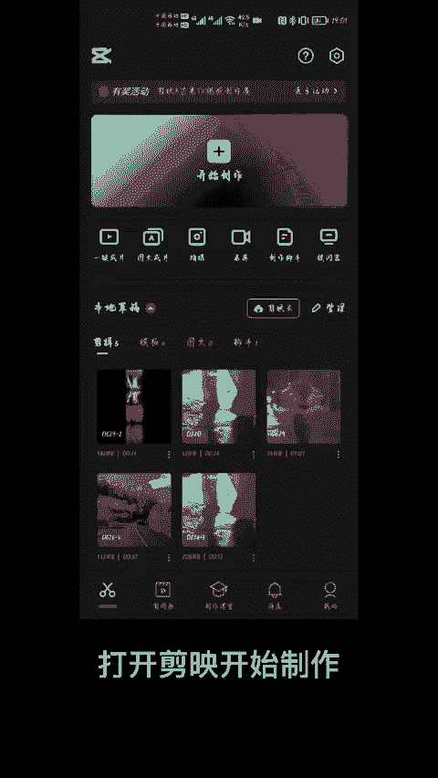
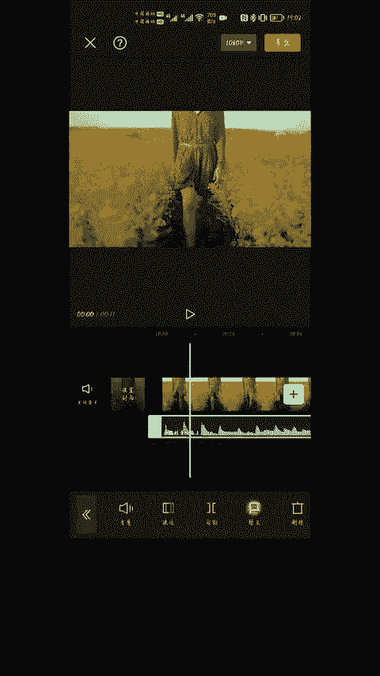
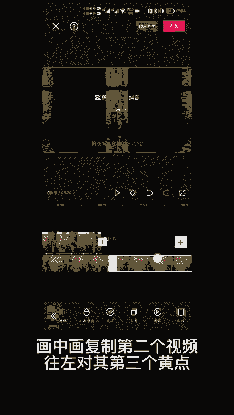
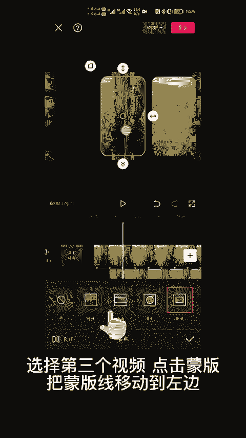
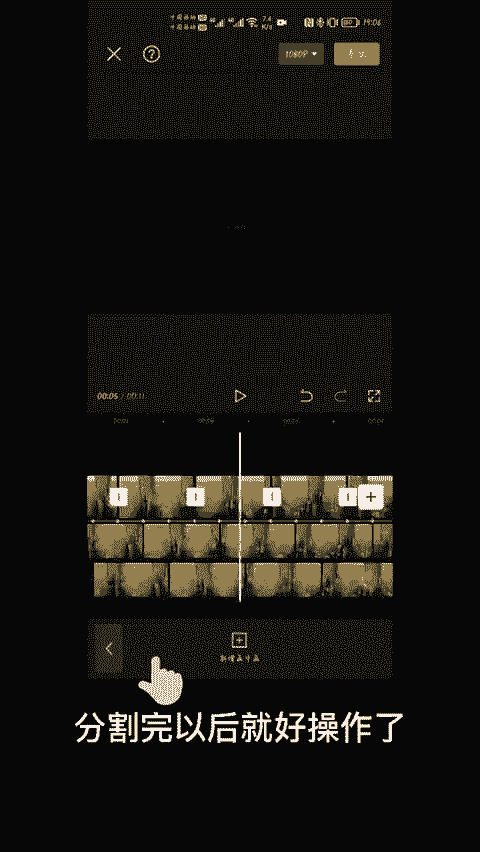
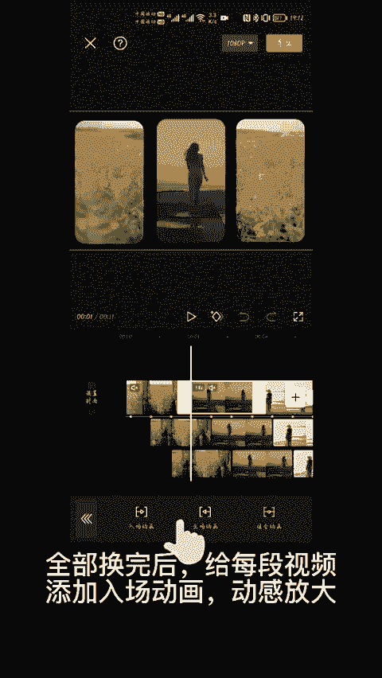
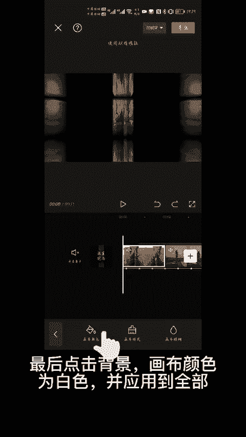
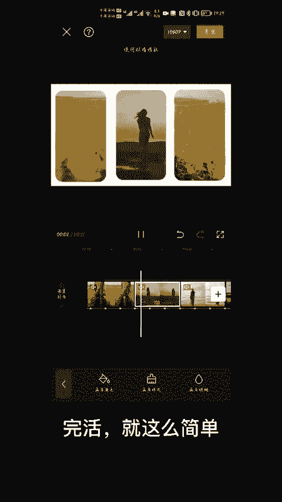

# 2024年全网最干货的小红书运营教程，小红书运营系统课(包含了剪辑／起号／小红书无货源各种玩法）小红书短视频零基础入门到精通，吊打一切付费课！ - P73：10.分屏卡点效果 - 红书教程3 - BV1h1yNYXEvT

🎼像这种酷线踩点视频怎么做？🎼今天我来教你教程详细，保证你看完一遍就能学会。

打开剪映开始制作，添加视频，选中高清，添加音频，点击音乐，添加抖音收藏音乐，选中音乐条，点击踩点，自动踩点节拍2。

点击视频选择蒙版，矩形蒙版，拉动箭头调整大小后轻拉一点圆弧，点击动画，添加入场动画里的动感放大，把主视频复制一份，切画中画，拖动视频与第二个黄点对齐，画中画复制第二个视频，往左对齐第三个黄点。

选择第二个视频，点击蒙版，把蒙版先移动到右边。选择第三个视频，点击蒙版，把蒙版先移动到左边，三段视频，每隔4个黄点，分割一次，分割完以后就好操作了。从第二组视频开始，分别选中视频后点击替换。

🎼替换成别的视频，全部换完后给每段视频添加入场动画，动感放大。

最后点击背景，画布颜色为白色，并应用到全部。

王活就这么简单。😊。