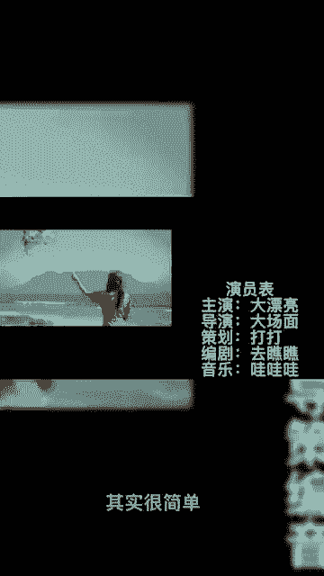
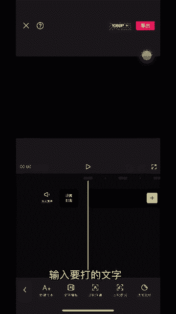
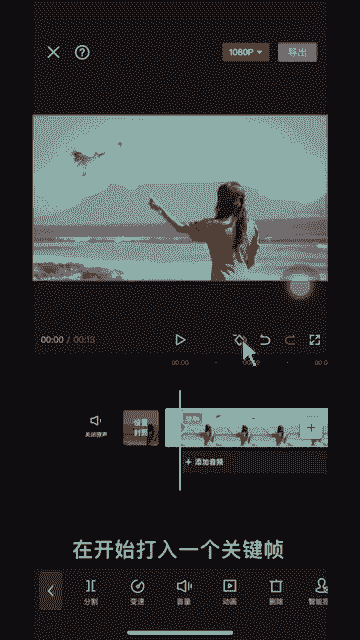
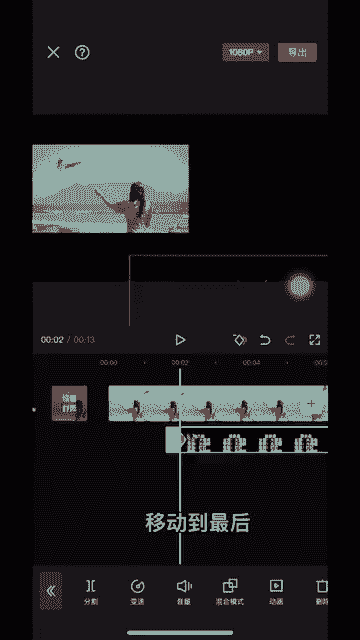
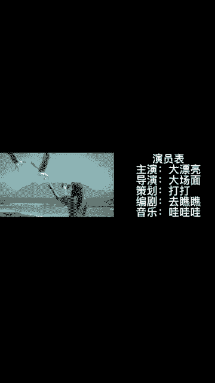

# 2024年全网最干货的小红书运营教程，小红书运营系统课(包含了剪辑／起号／小红书无货源各种玩法）小红书短视频零基础入门到精通，吊打一切付费课！ - P74：11.片尾滚动字幕 - 红书教程3 - BV1h1yNYXEvT

像电视剧这种片尾字幕滚动效果是如何制作的？其实很简单，首先添加一个黑色幕布，时长挑到8秒，选择文字编辑，输入要打的文字，导出备用，重新导入一段视频，再开始打入一个关键证，两秒处再打入一个关键证。

将视频缩小，放在左侧，在这个位置添加画中画，选择混合模式，选择绿色。😊。

在开头加入关键证，调整大小，放在最下面移动到最后添加一个关键证，移动到最上面。😊。

🎼情月未散。🎼今夜失去。😊。

🎼你在哪里？😊，🎼So。