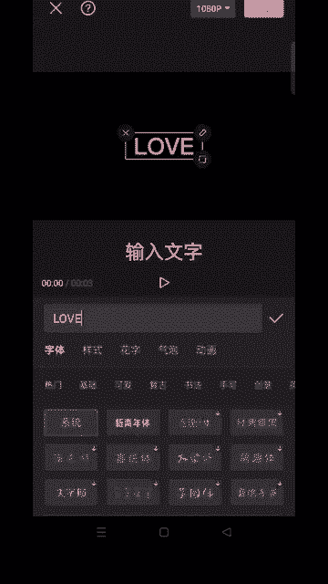
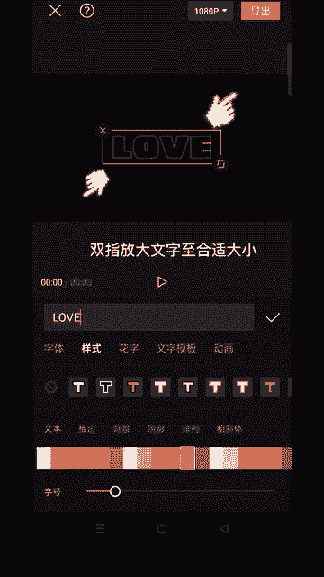
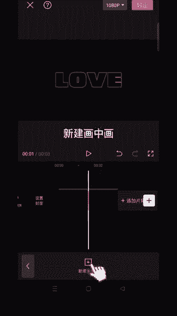
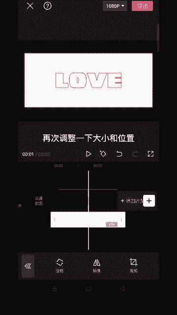
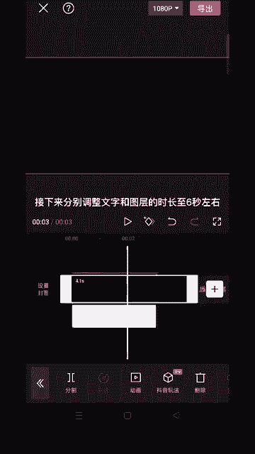
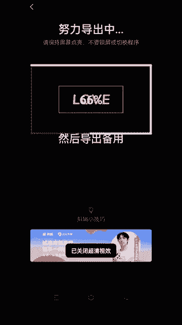
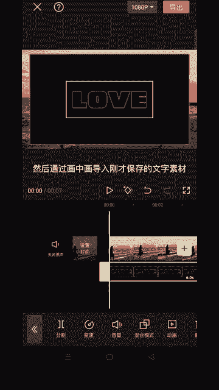
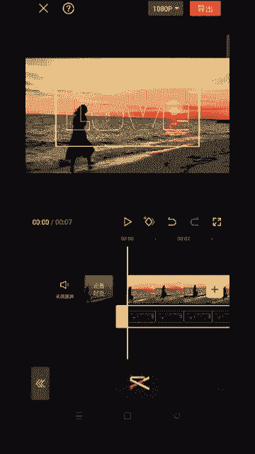

# 2024年全网最干货的小红书运营教程，小红书运营系统课(包含了剪辑／起号／小红书无货源各种玩法）小红书短视频零基础入门到精通，吊打一切付费课！ - P75：12.人物遮挡文字效果 - 红书教程3 - BV1h1yNYXEvT

🎼教你制作这种人物遮挡文字效果。

🎼首先导入一段黑色背景，点击文本新建文本。

🎼输入文字，选择这个字体，选择样式里的这个颜色，双指放大文字这合适大小。

🎼画中画新田画中画。

🎼通过画中画添加一张白底图片，找到编辑。🎼选择裁剪，裁剪出一个跟文字大小差不多的比例。🎼再次调整一下大小和位置，点击蒙版。😊。

🎼选择矩行。🎼点击反转，调整箭头，上下左右放大到边缘。🎼这样文字边框就做好了。😊，🎼接下来分别调整文字和图层的时长是6秒左右，然后导出备用，新建一个项目，然后通过画中画导入刚才保存的文字素材混合模式。

🎼选择绿色，点击动画，日常动画，选择镜行翻转，给人物图层复制一遍，点击切画中画，切下来后向左拖动图层对齐，然后点击智能抠图。

🎼最后添加一些文字贴纸装饰一下，最后导入音乐，一起看看成品吧。😊。

