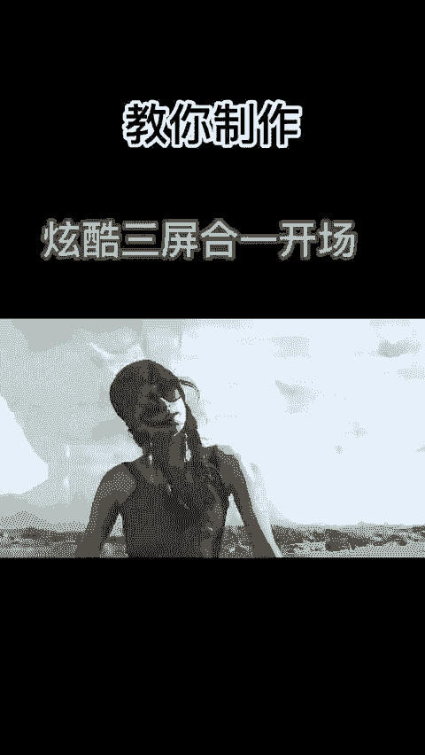
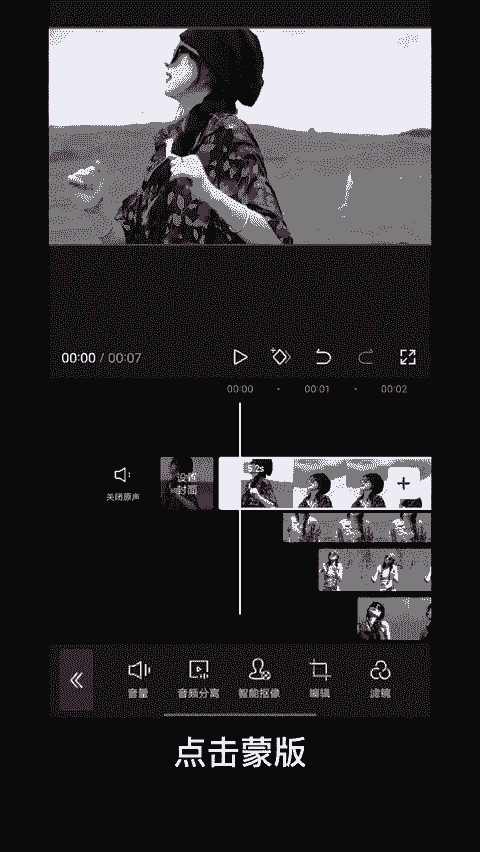
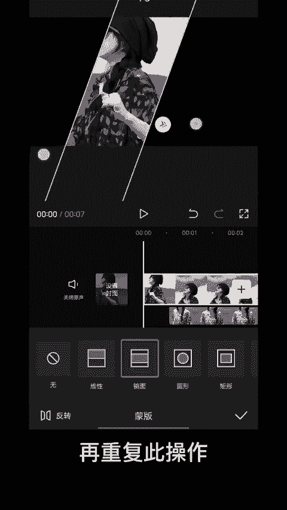
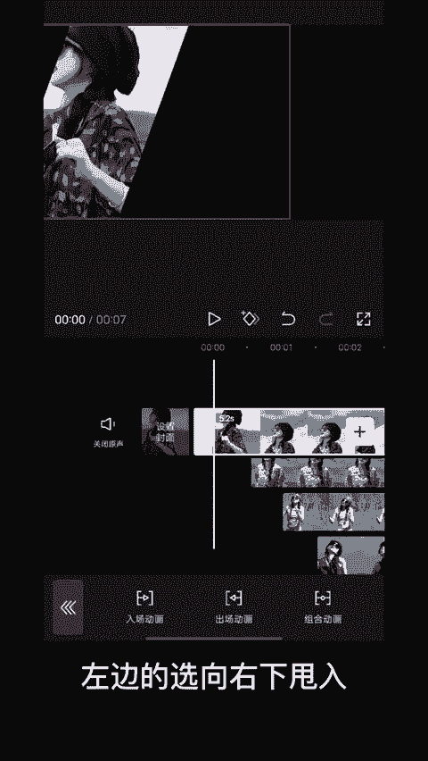
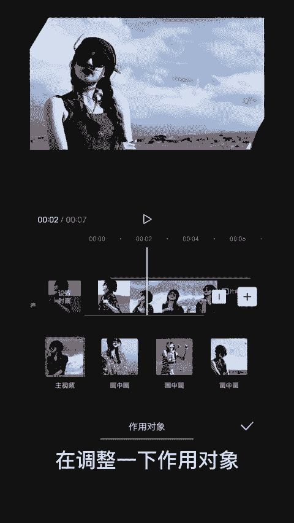

# 2024年全网最干货的小红书运营教程，小红书运营系统课(包含了剪辑／起号／小红书无货源各种玩法）小红书短视频零基础入门到精通，吊打一切付费课！ - P76：13.三屏合一开场 - 红书教程3 - BV1h1yNYXEvT

像这种动感三频合一开场怎么制作，30秒钟教会你首先导入4条视频，将后边三段切入画中画，每段视频间隔0。5秒左右，选择第一段视频，点击蒙版，选择镜面蒙版，将蒙版旋转-70度左右，再重复此操作。😊。

调整三段视频位置，选择第四段视频，给开始厨打一个关键针，然后选择镜面蒙板压缩蒙板，并调整位置，拖到5秒左右，将蒙板反方向旋转并放大。再给视频添加入场特效，左边的选项右下甩入时长一秒，中间的选择上下抖动。

右边视频选择向左下方甩入，最后再给第四段视频添加特效蹦迪光和灵魂出窍，再调整一下作用对象，看看效果吧。😊。

🎼都都。🎼都嘟。

🎼一步步。