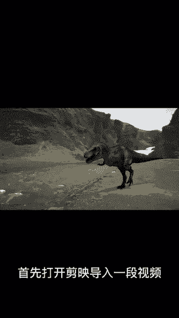
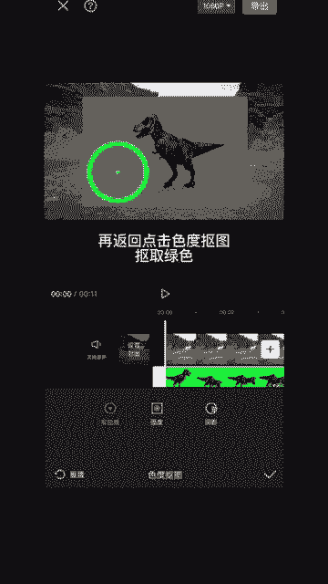
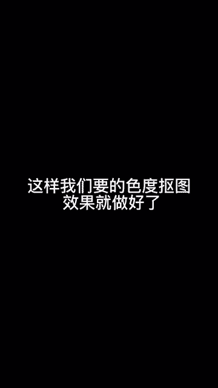

# 2024年全网最干货的小红书运营教程，小红书运营系统课(包含了剪辑／起号／小红书无货源各种玩法）小红书短视频零基础入门到精通，吊打一切付费课！ - P77：14.色度抠图去绿幕 - 红书教程3 - BV1h1yNYXEvT

🎼什么是速度抠图？今天将会你速度构图的用法。

首先打开剪映，导入一段视频，然后点开画中画，在素材库导入一段素材，点击画中画，点击分割，把多余的删掉再对齐。然后点开画中画，选择编辑，点击镜像，调整你想要的方向，返回以后点击色度抠图，移动取色器。

扣取绿色，点击强度调整数值，你会发现外轮廓有绿色边框。这时我们退出点击调节，选择HX色，再点击绿色，调整饱和度正零，再返回点击色度抠图，扣取绿色，点击强度调整数值为27，然后点击阴影，调整数值为71。

点击确定调整你想要的位置。这样我们要的色度抠图效果就做好了。

你学会了吗？😔。