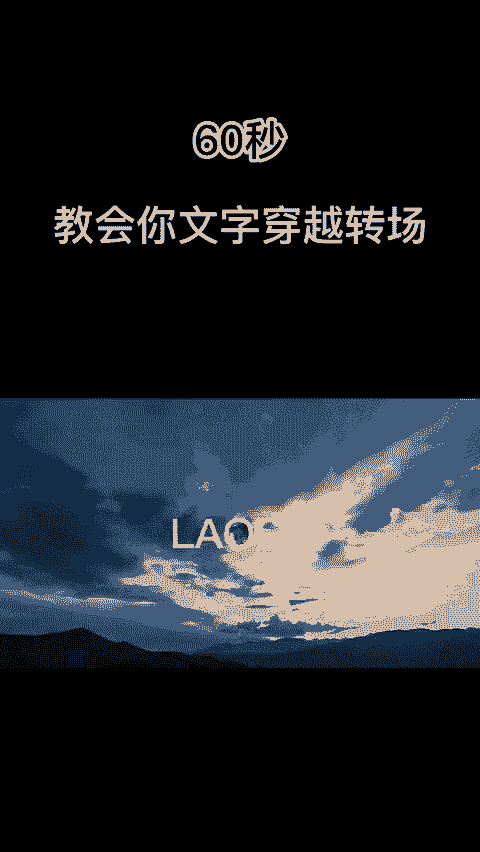
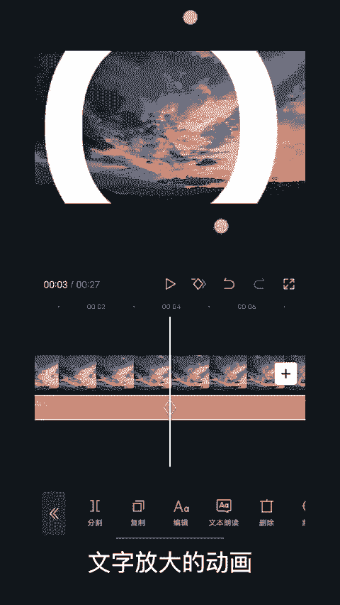
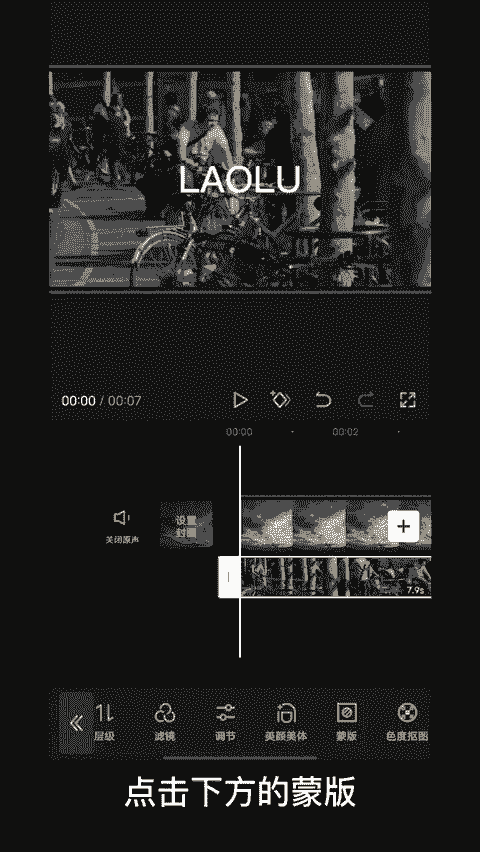
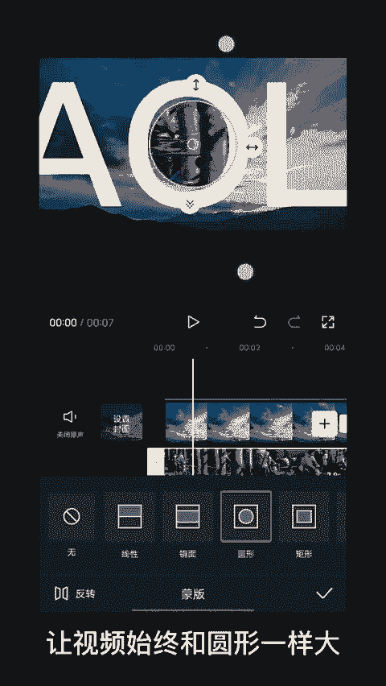

# 2024年全网最干货的小红书运营教程，小红书运营系统课(包含了剪辑／起号／小红书无货源各种玩法）小红书短视频零基础入门到精通，吊打一切付费课！ - P78：15.文字穿越转场 - 红书教程3 - BV1h1yNYXEvT

60秒教会你文字穿越转场。首先我们导入素材，输入自己喜欢的文字，在0秒处打上关键针，拖到第4秒钟放大文字。😊。

这样就做好了一个文字放大的动画。

导入一个视频，添加到画中画，调整画中画大小，与主轨道视频重合，点击下方的蒙版。

选择圆形蒙版，调整蒙版大小，在0秒处添加关键帧，往后移动时间线，再把视频放大，让视频始终和圆形一样大，放大到屏幕大小的时候，然后把蒙版放大就可以了。你学会了吗？

