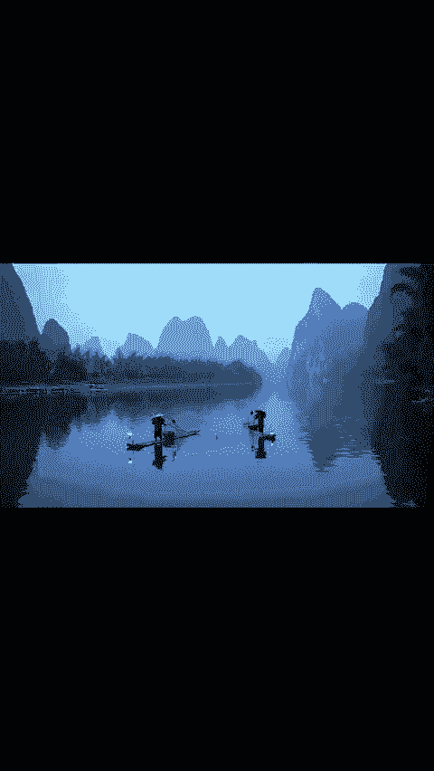
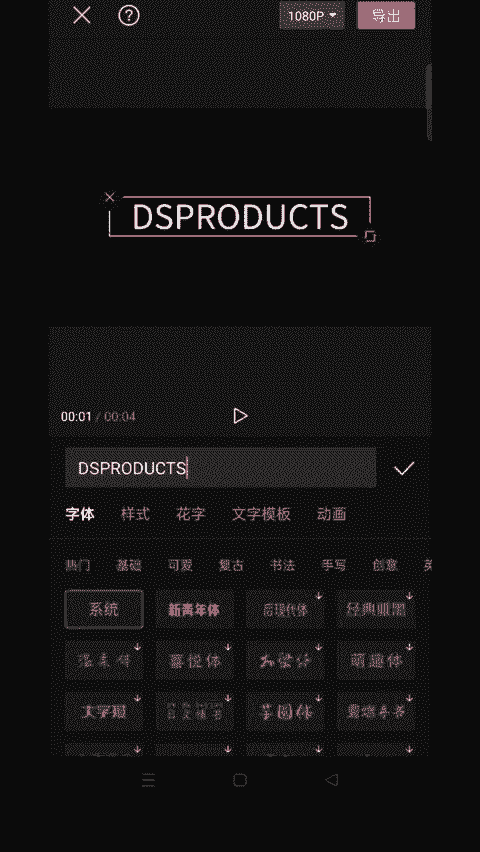
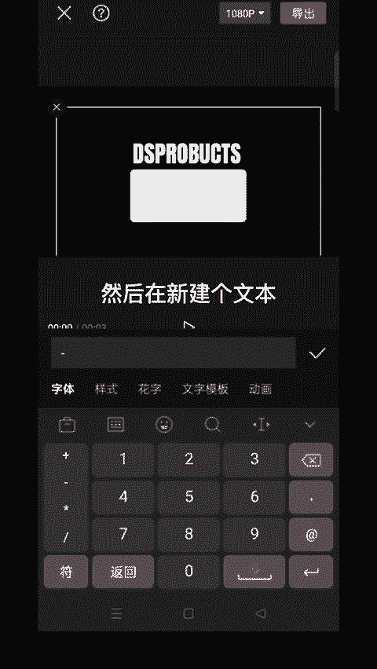
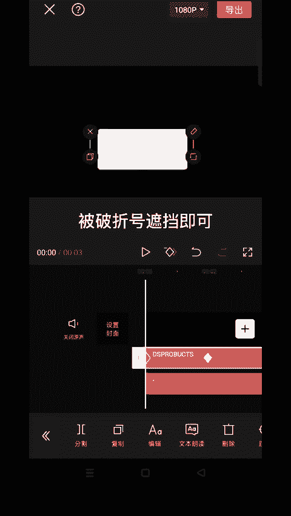
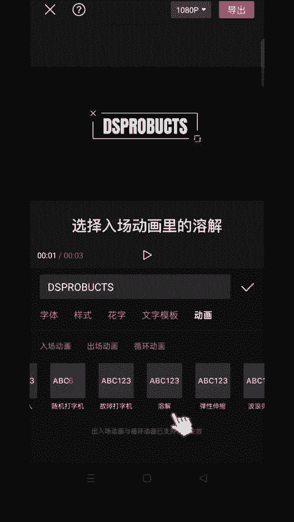
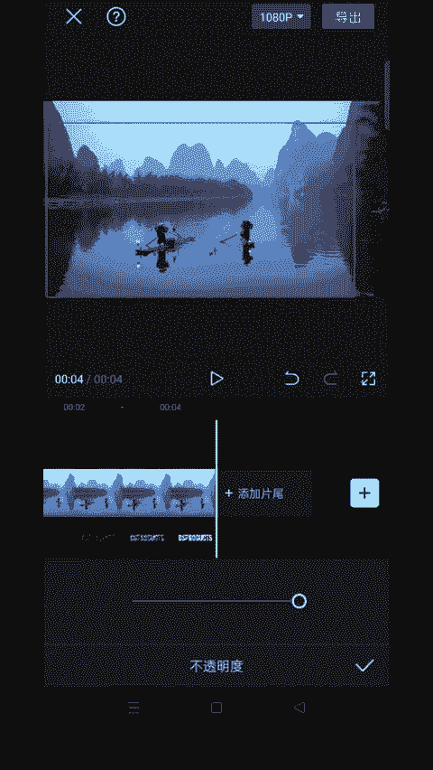

# 2024年全网最干货的小红书运营教程，小红书运营系统课(包含了剪辑／起号／小红书无货源各种玩法）小红书短视频零基础入门到精通，吊打一切付费课！ - P79：16.文字倒影开场 - 红书教程3 - BV1h1yNYXEvT

🎼教你制作文字倒演开场效果。🎼首先导入一张黑底照片。🎼时长调整4秒左右。🎼点击文本。🎼新建文本输入需要的文字，选择这个字体。

🎼调整下位置和大小。🎼然后再新建个文本，输入这个破折号。

🎼放大对齐，给两个都拉长时长对齐。🎼在文字两秒处添加关键帧，将时间轴拉至开头，然后向下移动文字被破折号遮挡即可。

🎼给破折号的钥匙里选择黑色。🎼给第一个文字添加动画。🎼选择入场动画里的溶解。

🎼时长拉满，导出备用，新建一个项目，通过画中画导入刚才的素材。🎼混合模式选择绿色。🎼分割删除多余的部分。🎼调整下位置，点击复制，拖下来向左移动对齐，找到边辑。🎼反转两次。🎼点击镜像。

然后向下移动图层对齐。🎼找到蒙版。🎼线性蒙版。🎼往上拉雨画。🎼调到不透明度。

🎼透明布拉为50，效果就做好了。🎼。

う。