# 2024年全网最干货的小红书运营教程，小红书运营系统课(包含了剪辑／起号／小红书无货源各种玩法）小红书短视频零基础入门到精通，吊打一切付费课！ - P7：05、新手小红书运营-小红书市场分析（2） - 红书教程3 - BV1h1yNYXEvT

大家好，今天给大家分享的是小红书全集系列啊。第二大课时小红书市场的第二节课啊。我们直接连着上一节课程往下面给大家进行一个分享。上一节课呢我们是讲到了达人分享内这节课呢我们接着往后面讲。

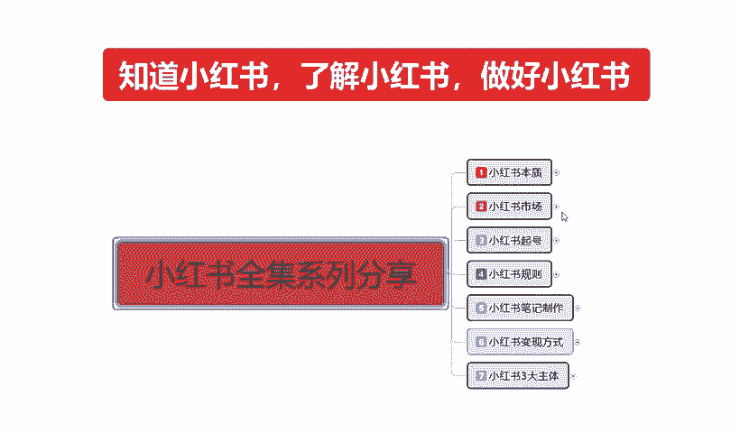

小红书热门话题里面啊第四个内容，产品测评。什么叫产品测评啊？护肤品化妆品试用的一个反馈，食品的试用反馈啊，就是我们用户亲身体验和使用这个感受的一个效果和评价。类似于这种就是。抖音上面的探店对吧？

我们只是说把它扩小，探店的话，它需要出去。我我们呢只是说把它破小了以后，把产品买过来，我们自己试。这种的话也相当于是一种反向的宣传和正向宣传的一种对比。啊。

通过这种产品的一个测评来提高我们个人的一个知名度。而且这种产品测评的话比较好做，为什么？因为它不是视频，是图案。啊，是我们通过图片的对比，我们直接在家里面就能操作的。对化妆品适用的一个反应测试就可以。

然后数码产品家居用品测试的话，科技产品、生活、小物的性能测试和线价分析比也是一样的道理。比如说我们在小红书上面去做产品测评的话，它有一定的市场潜力。只要你把类目选定了，你比方说我想做。拿个什么例子呢？

就拿化妆品来说吧，口红口红它有一个色号，有一个呃掉不掉色，对吧？它都分很多种类型。我对这一块虽然说不是很了解啊，但是所有的大字类目的话基本上都是差不多的。那么他对于一个产品测试。

你比方说网络上面比较熟悉的。什么样的一个口红，你买一两支回来做一个成本投入也不用太贵的。差不多啊，在中层阶段用的那种几10块钱几百块钱一支的都可以。然后你自己这边的话，如果说我们是本来就是卖口红的。

那么你就可以拿这两种产品做对比，把你的优点凸显出来。用两张图片去解决别人需要拍视频讲解的一些东西，而且他的特定用户的话，人群是非常精准的，你也可以拍视频。比如说拍视频的话，它流量没那么大。整体的话。

我们的一个小红书笔记里面的话。图案笔记和视频笔记里的比例最好是3比1或者5比1，也就是三篇笔记一个视频效果是最好的啊。你要是效果是距离想拉长一点，5篇笔记一个视频也可以啊。这个是做产品测评。

就看我们自己本身适不适合去做产品测评啊，有没有这方面的一个经验，对别人一个分享。当然了，你如果说本身没有产品，你也可以去做，知道吧？提升自己的一个认知。这方面的认知做好以后。

你大概有个2000粉丝到3000粉丝以后的话，你。你再去找产品，让别人帮你做推广的话，是非常容易的，知道吧？你就出他广告费，我帮你代言，你产品卖出去以后阉格多少钱啊。

在这个里面的话也是呃产品测评里面的一个变现方式啊，只是说给大家大概的介绍一下。然后是美食分享，什么叫美食分享呢？餐厅推荐的一个美食，这个就是抖音上面的美食餐厅。每次参见的话，说实话。

因为你可能对自己的颜辞不怎么。信任。那么我们在做图片处理的时候，不拍人，只拍视品。然后对这个食品进行的一些分析进行了一些话题宣传啊，就可以。这个就是美食分享。然后的话烹饪的一个教程。烹饪教程的话。

说实话这个的话做引流比较适合啊。家庭烹饪食谱，这个菜怎么做，做完以后这个菜对我们身体有什么好处等等之类的都是可以的。啊。这几个呢就是美食分享。第6个啊热门话题是什么？时尚搭配。啊，潮流追踪。

介绍最新时尚的一个趋势，提供穿搭的一个建议。品牌合作与推广品牌服饰。配饰的一个展示与合作推广啊，时尚搭配的话，说实话我之前啊前面给大家讲过，小红书上面说实话，它不适合做那个品牌的一个内容。

它比较适合做非标品的一个内容。但是如果说你要讲穿搭的话。有品牌商跟你合作是最好的，没有品牌商的话也能做啊，而且效果不差。做这个类型的一个时尚分享，或者做这个类型的一个笔记分享。你不管说是我卖产品也好。

我卖服装也好，卖装饰品也好啊，卖耳环、首饰、吊坠、戒指、项链也行，对吧？我再不行，我卖嗯。指甲油指甲刀之类的都行，知道吧？就说你看它的一个时尚搭配的一个穿。怎么去搭配啊，胖的有有胖的，有瘦的。

人有胖有瘦啊，有体重高的，有体重轻的。你通过这种方式圈定你的人群以后，就是说我们先要了解整个他1个18到35岁一个人群。你有没有他们喜欢类型的一个产品？

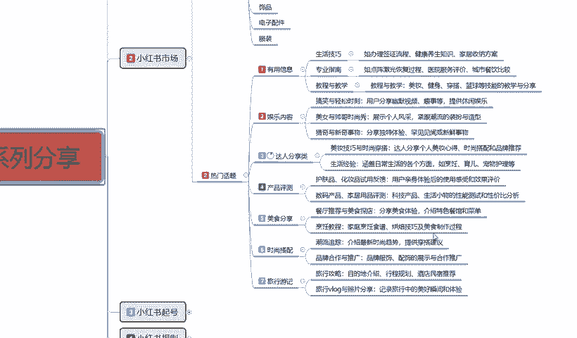

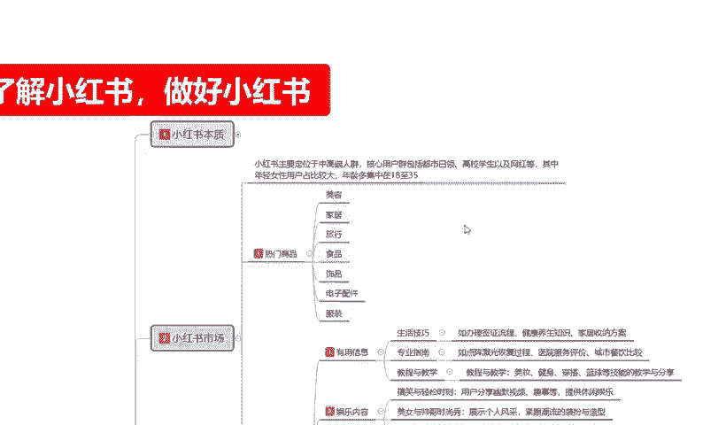

啊，你通过他们喜欢类型的产品，你把这些次品。给他就直接码名面上面进行产品的一个拍照重组。或者说是你去抖音上面也好，去淘宝也好，去拼多多也好，你把别人的图片弄过来啊。然后搭配一下怎么穿怎么弄都是可以的。

当然这个只是说小红司市场里面它的热门讨论的话题啊，因为他的人群的话就是18到35岁。18到35岁的女性的话，她喜欢的就是这些主要的这几个点。最后一个就是女性。旅行的话，说实话没有上面6个点1箱。

但是相对于旅行的话，他可以做一些情侣之类的一些攻略，目的地的一些介绍形成的一些规划酒店民宿。这种的话是比较适合。情侣的啊，你如果说往旅行这个方面靠的话，说实话你就是。奔着那种户外的。

配饰配件实用工具去操作了，你去做电也好啊，做网红也好，做博主也好，宣传你的产品，做引流也好啊，都是往这个方面去靠的。

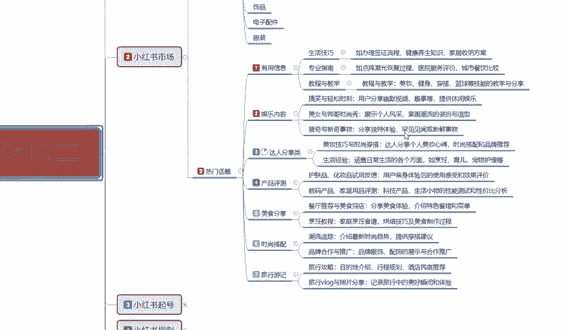

这个呢就是热门话题的整体的一个内容。

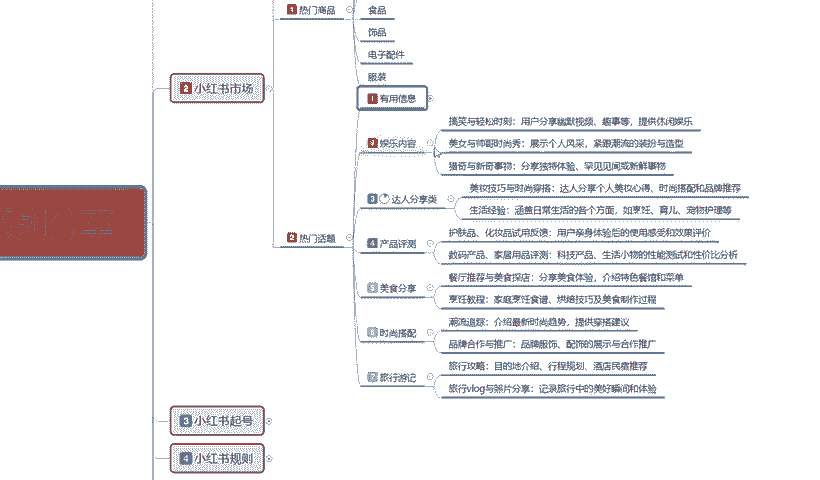

嗯，之前呢我也给大家说过了啊，我把这个几个重点给大家讲解以后的话，我就会结合整个小红书市场给大家详细讲解一下啊。热门商品和热门话题他们相结合是怎么做的？

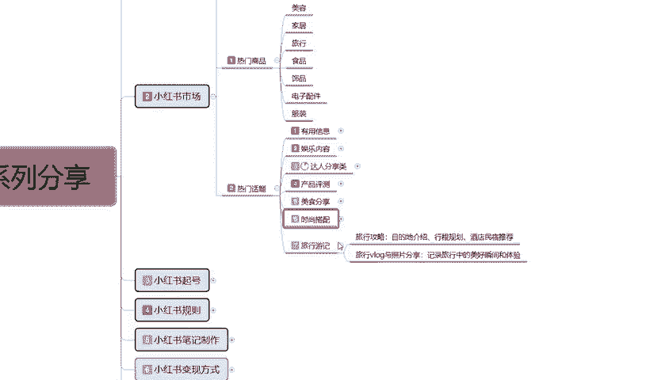

因为小红书整个市场的话，我们只有把这两个点结合起来以后，它才叫小红书的一个市场。啊，他单独把它划分以后的话，你要了解热门商品。你说实话，你这小红书上面做定的啊，不好做，你也做不起来，难度系数非常大啊。

你要是专门讲这门话题，你后面变现很难，所以说我们要把它结合起来，我们才能做电影也好啊，做博主也好，做引流也好，你变现才容易。知道吧？我们要去了解小红书，整个市场的话，你无非就是说你想做网红也好。

做博主也好，做引流也好，做商品也好，做其他等等也好。你不管怎么去操作，最后无非一个就是想赚钱。那在这个里面的话，你单独做热门商品，就是小红书上面我就想开个店，想去把这个店做起来赚钱，行不行？行。

100个人里面有2到3个人可以成功，你觉得你是2到3个人吗？你有做店的一个技术数据量吗？没有，所以说你需要进行了解。那你如果说我觉得我做商品不行的话，我做热门话题的一些内容分享行不行？也行。

但是10个人里面的话，可能只有1到2个人，或者说20个人、30个人，他才能成功1到2个。那你觉得你是幸运之子吗？啊，对吧我从来不抱留有这样的幻想，我所有的一些努力和成果和我研究分析的一些数据量。

都是通过我个人。分析了解过后啊，了解它整个平台的一些数据以后，我们再去做，你才能把自己做的包装起来。好吧，那。小红书市场这里面一个热门商品和热一个热门话题，我们怎么把它结合起来？选商品之前一定要选话题。

话题选完以后再选商品。比方说呃这里面我随便给大家。做个比方吧，双上上刀吧，好吧。😡，实上传单里面，他这个里面我们适合做的商品是什么？美容。家具不适合。服装就这两个点。你把时尚穿搭这两个点，你做美容也好。

做服装也好。你比方说你做。时合穿搭里面做服装。你自己有产品，你想把这个店做起来，那么你的所有的内容不能以。热商品来去做笔记，一定要以时尚穿搭。比就说你的产品适合在什么地方？一定不要去发商品笔记。

商品笔记少发啊，发正常的人文交流笔记去，你才有推广流量。你不发人文交流笔记的话，它是没有流量的。你商品笔记流量的话不到20%。那么点那么一点流量的话，你你想去抢那个关键字排名难度是非常大的。

所以说要先把账号做起来，我们先做热门话题。把这个话题就是通过时尚穿搭的一些方式方案，把它了解透了以后，再把我们的产品挂到我们这个时尚穿搭里内容里面去就可以。一定要了解啊，先做话题后做商品。

这就是小红书的一个市场。你要是想直接做商品，不做话题，那你还不如去做淘宝或者做拼多多，因为你商品卖不出去啊，这个大家一定要了解清楚啊。整个小乌猪市场的话，你把它相结合起来，你从下面选时尚穿搭的话。

它对应的就是服装。旅行邮寄的话，你说实话。对应的就是旅行内的一个产品帐篷。夜灯、手电筒、配饰。都可以在这个里面找到，对吧？美食分享就是食品分享里面的。你也想把食品自己的食品是通过什么方式制作宣传啊。

都都可以通过图片。优化。去进行宣传，然后给他编一个背景故事去做。这个就是整个小红书的一个市场。你小红书万变不离其空，你再怎么去操作，它都在这个里。啊，热门的一个商品局限都在这个里面。

热门的一个话题局限都在这个里面。就是说我们了解小红书的本质，了解小红书的市场以后，我们再从这个里面去选择我们想场要做的产品就可以。对吧当然我这只是说选择了一部分比较好做的内容啊，分享给大家了。

其他的也能做。只是说难度的话会比这些啊，我所给大家分享的内容会大一点，好吧，你包括家具类的家具类的话，你也。家具啊不是家居啊，家具的话大型的那种床啊，那些东西在小户上面做是能做，但是基本上做不起来。

很难的啊。家居的话，你无非就是衣家、鞋帽之类的这种。居家比较便利的东西好做一点啊，这个呢就是整体小红书的一个市场。

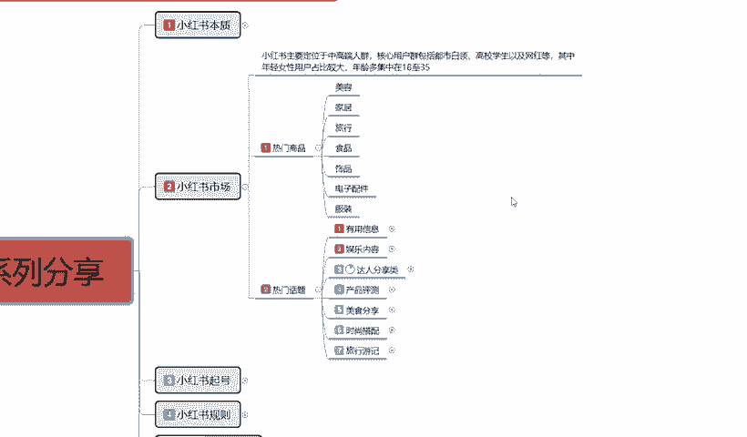

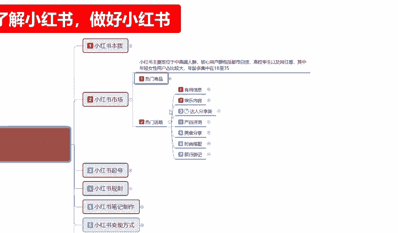

好吧，那么这一节课呢也就到这里啊，同时呢我们的。系列全集的第二个啊，小红书的一个整体市场呢也给大家讲完了。下一节课呢给大家讲解一下小红书起好啊，我们了解它的本质，了解它的市场以后。

我们就下一步叫创钱账号。

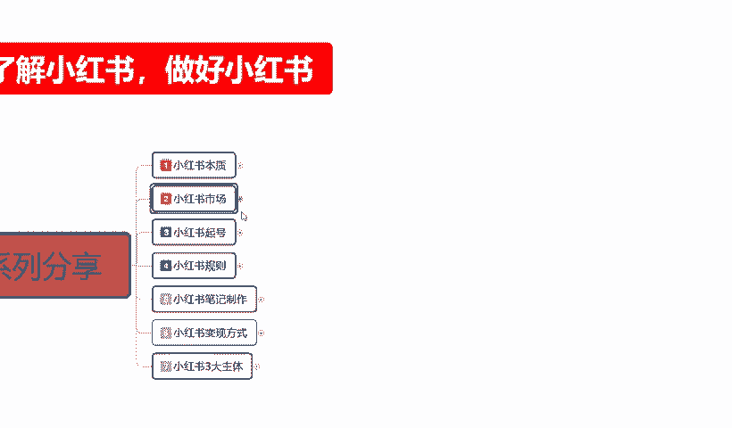

创建账号里面，它其实有很多的一个点需要我们去。

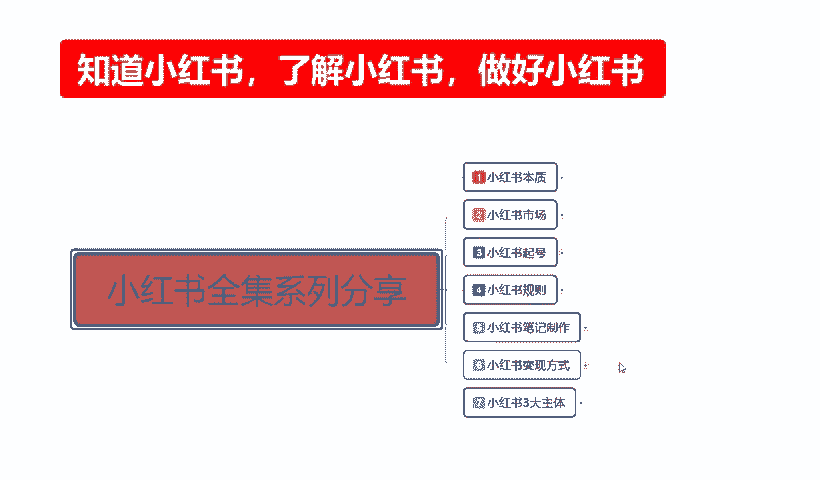

对自身的一个完善。好吧，下节课呢就给大家讲解小红熊旗好。那么这节课内容呢就到这里。

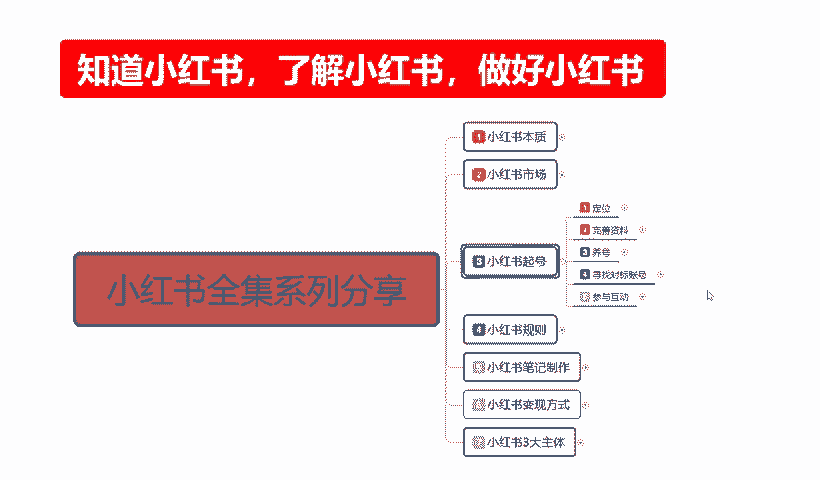