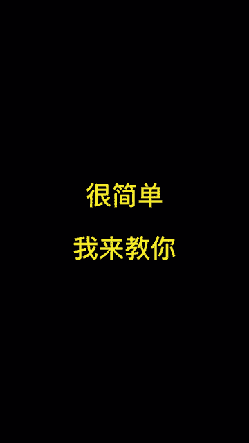
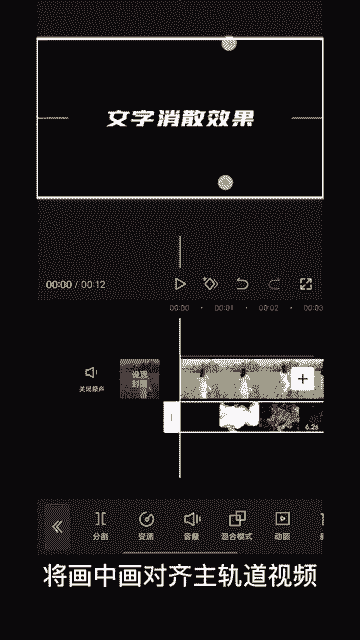
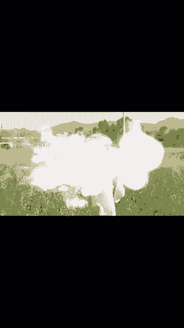

# 2024年全网最干货的小红书运营教程，小红书运营系统课(包含了剪辑／起号／小红书无货源各种玩法）小红书短视频零基础入门到精通，吊打一切付费课！ - P80：17.文字粒子消散效果 - 红书教程3 - BV1h1yNYXEvT

这种文字随粒子消散的效果是怎么做的？很简单，我来教你首先导入一段视频，输入所需要的文字，点击下方画中画，将粒子素材切入画中画，将画中画对其主轨道视频，点击下方混合模式混合模式选择绿色。

然后给文字添加出场效果，出场效果选择消散。😊。

时长改为2秒左右。将文字时长稍作调整。这样就做好了。😊。

