# 2024年全网最干货的小红书运营教程，小红书运营系统课(包含了剪辑／起号／小红书无货源各种玩法）小红书短视频零基础入门到精通，吊打一切付费课！ - P81：18文字蒙版效果 - 红书教程3 - BV1h1yNYXEvT

教你用蒙版和关键帧做这样的片头。首先在素材库添加一个黑色素材拉长到7秒左右就可以了。然后输入自己喜欢的文字，将文字放大。😊。

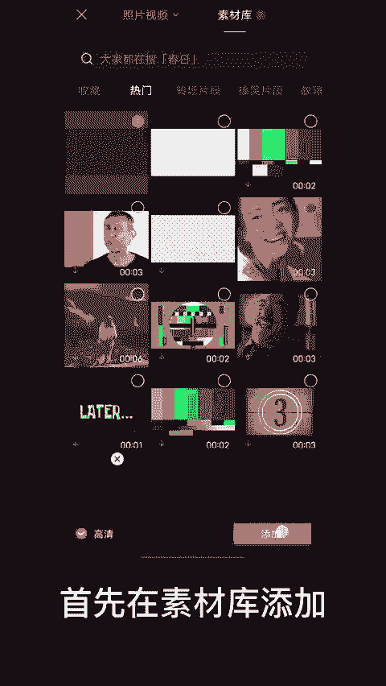

拖动文字到第一个字母，在0秒点一个关键帧，然后挪到时间轴后边。

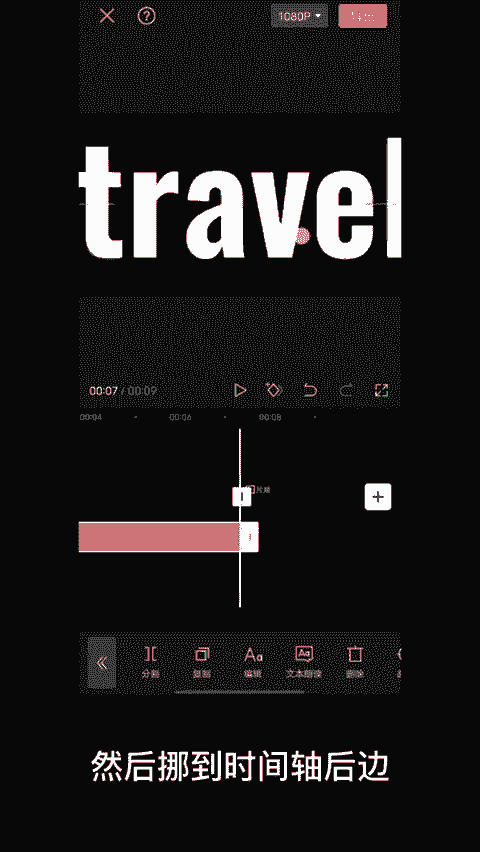

将文字拖动到最后一个字母，导出备用，添加绿色图片，在两个关键帧的位置。将文字颜色改为红色，导出备用。

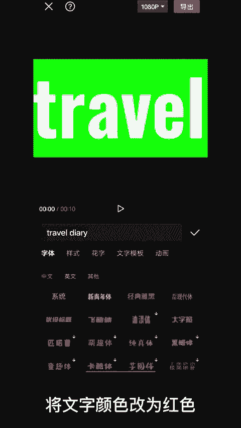

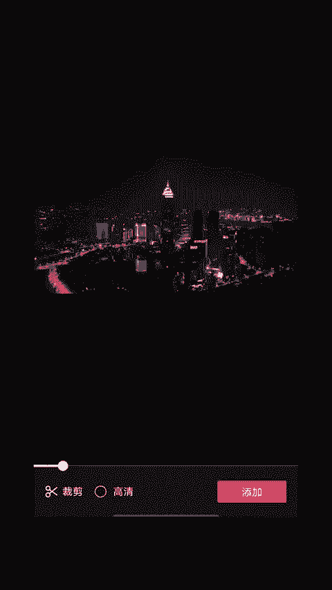

添加准备好的视频。将白色文字导入到画中画。调整字体画面与视频重合，点击下方的混合模式，选择变暗导出备用。

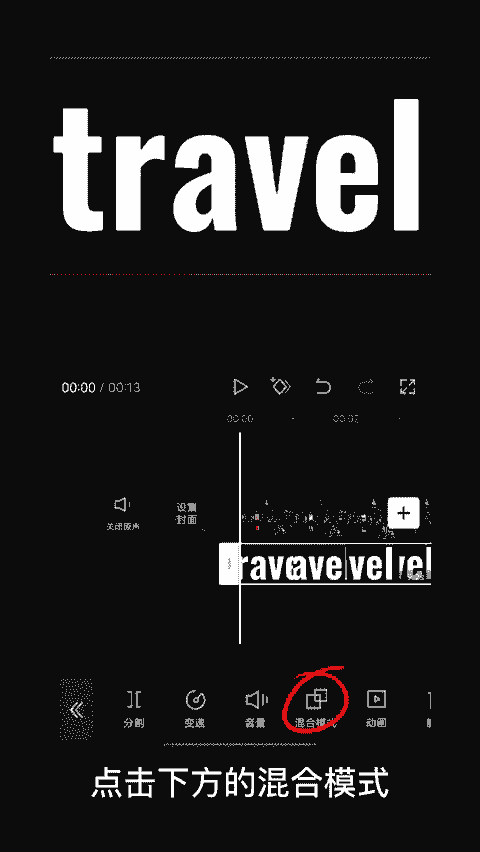

重新导入一次视频，导入备用的红色字体，调整图层与视频对齐。

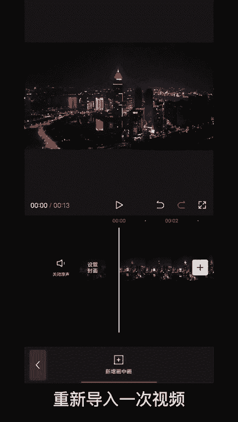

在下方选择色度抠图，去除绿色的部分。

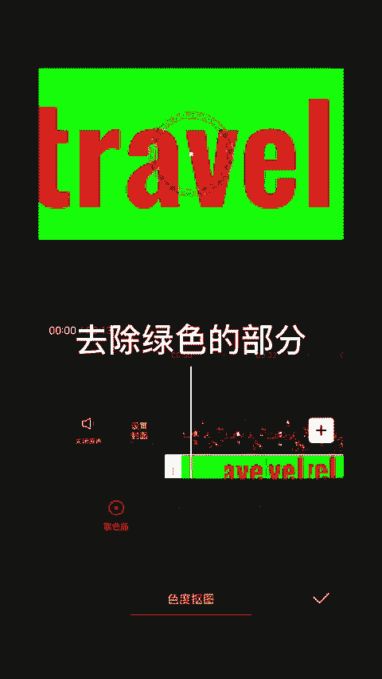

添加备用的镂空字体，对齐两个图层。在一秒钟的位置打上关键针。选择蒙版。选择镜面蒙板。

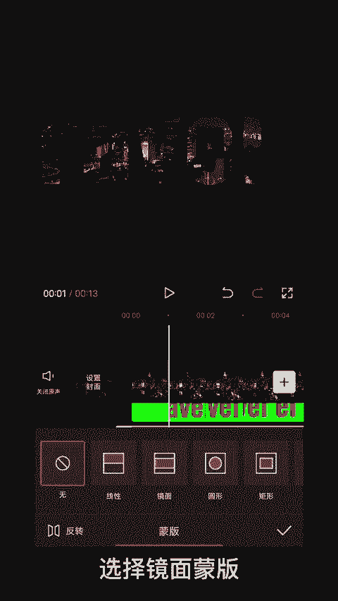

调整蒙版位置。移动到第三秒，选择镜面蒙板，蒙版位置180度，然后放大到图层外。

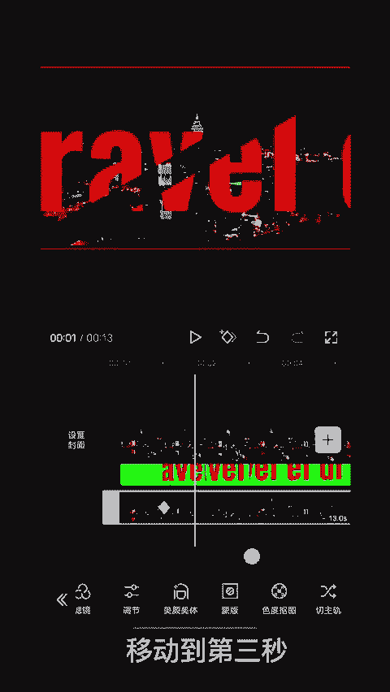

拖动到第5秒。

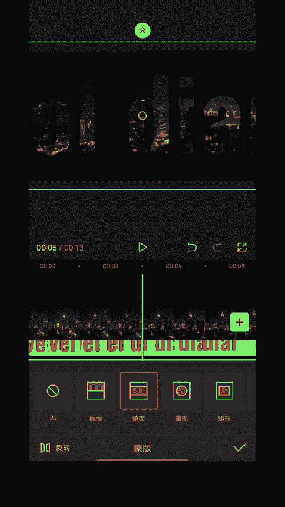

将蒙版缩小到一条线。后边多余的部分删除掉，最后我们再给镂空字体添加出厂抖动就完成了。

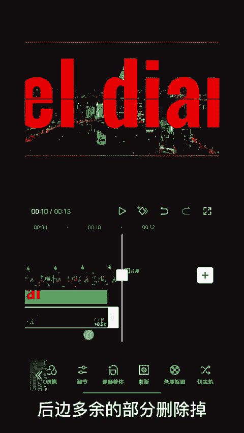

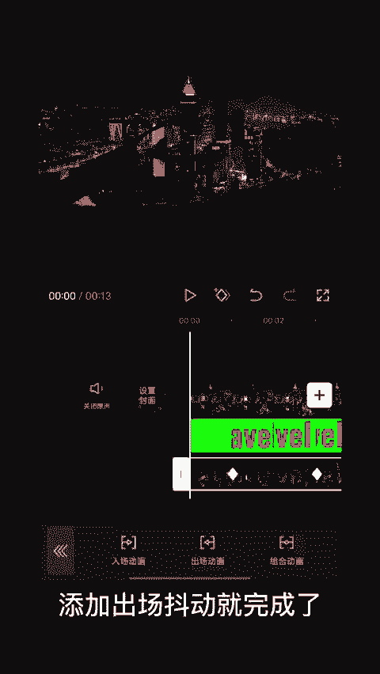

🎼怎么样？你学会了吗？😊。

🎼橘色的日落出没在。