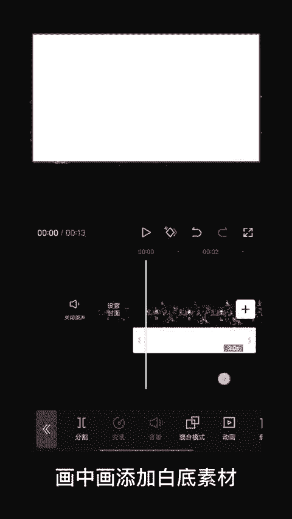
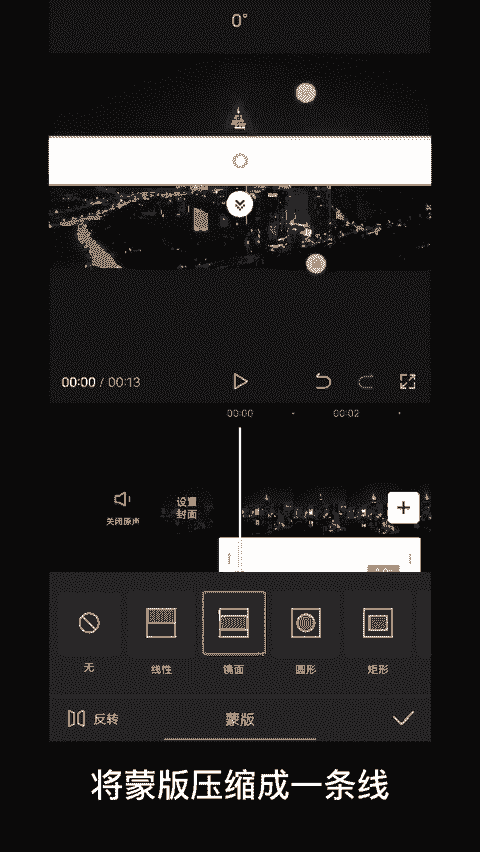
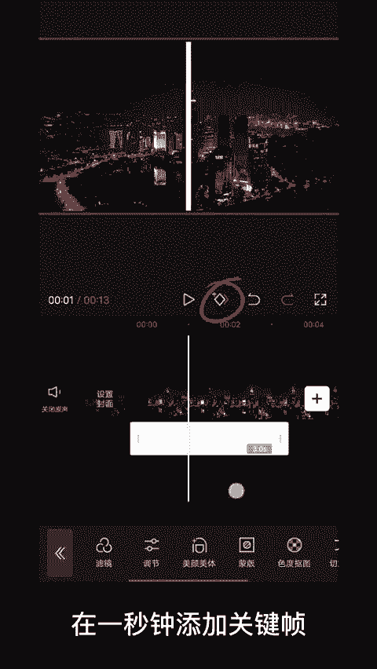
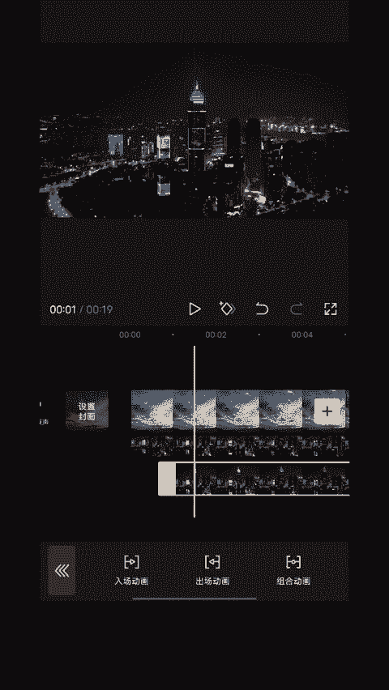

# 2024年全网最干货的小红书运营教程，小红书运营系统课(包含了剪辑／起号／小红书无货源各种玩法）小红书短视频零基础入门到精通，吊打一切付费课！ - P82：19.线条切割转场 - 红书教程3 - BV1h1yNYXEvT

像这样的线条切割转场，你还不会吗？不要着急，60秒钟教会你。首先导入我们需要的素材，画中画添加白底素材，点击下边的蒙版，选择镜面蒙板，将蒙板压缩成一条线，并旋转至90度，在一秒钟添加关键帧。

在0秒将蒙板往上拖。😊。

导出视频备用添加另一段素材，刚刚导出的视频，添加到画中画，在线条切割完成的位置，点击分割，在工作区找到蒙版，选择线性蒙版，线性蒙版旋转90度，复制一段画中画浴刚刚的切割点对齐，选择蒙版，点击反转。

最后给右边添加向右划出，即左边的视频添加，向左划出就完成了。可以将多余的地方删除。

怎么样？你学会了吗？😊。

