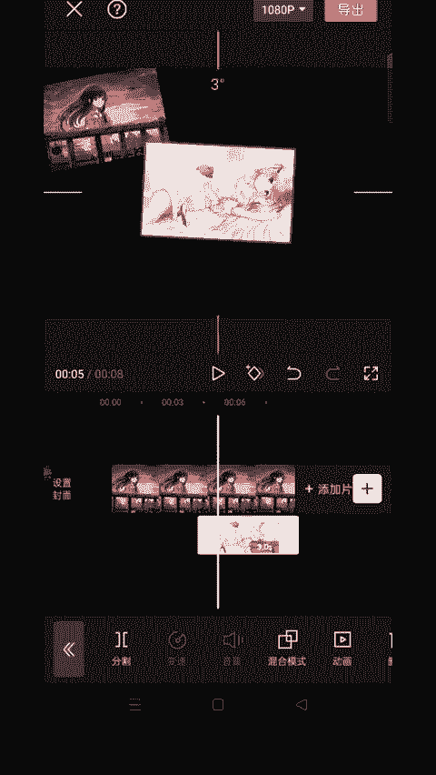
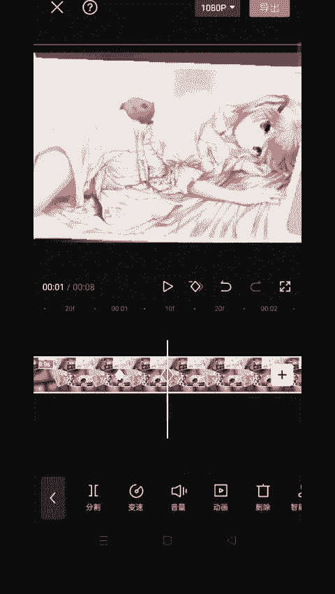
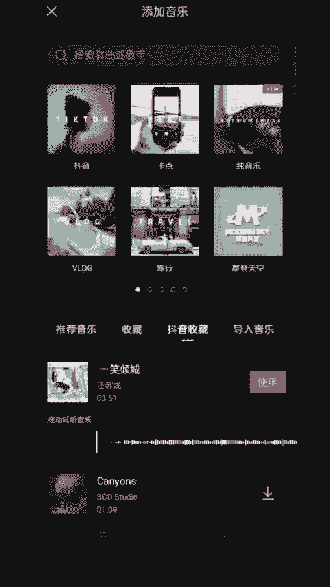

# 2024年全网最干货的小红书运营教程，小红书运营系统课(包含了剪辑／起号／小红书无货源各种玩法）小红书短视频零基础入门到精通，吊打一切付费课！ - P84：21.雨滴相册跟踪效果 - 红书教程3 - BV1h1yNYXEvT

🎼这种雨滴移动相册跟踪效果是怎么做的？让我来教你们。🎼导入图片，把图片的时长拉长，缩小，把图片放到左上角，新增画中画，导入其他图片。🎼摆在第二个位置。

🎼把时长对齐。🎼依次把图片摆好位置，然后打开背景，画布模糊，选择第4个。🎼再打开特效画面特效，选择边框里的粉黄渐变，拉长对齐。第二个，同样加入相同的特效并对齐，作用对象选择画中画的图片。

🎼全部图片都加上边框特效，导出备用。🎼最后重新导入，放那图片到左上角。🎼打上关键针，1到时针后再打上关键针。🎼来到一秒处移出第二个画面。🎼往后时针加上关键帧，后面以同样每秒处一处画面，再移动时针。

加上关键帧。

🎼来到结尾处，把全部画面录出来，加入雨滴音开特效。🎼把特效拉长归齐。🎼再加入抖音收藏的歌曲，一起来看看效果吧。🎼。

🎼。

