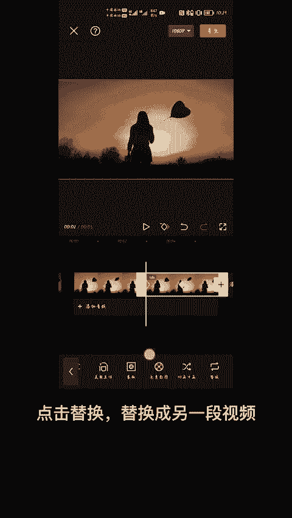
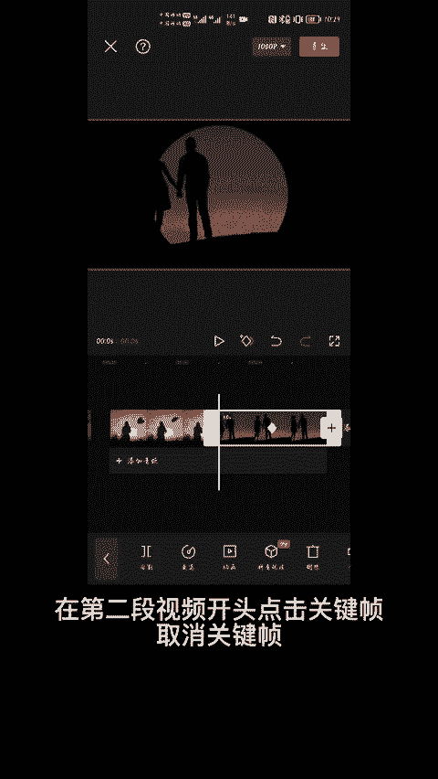
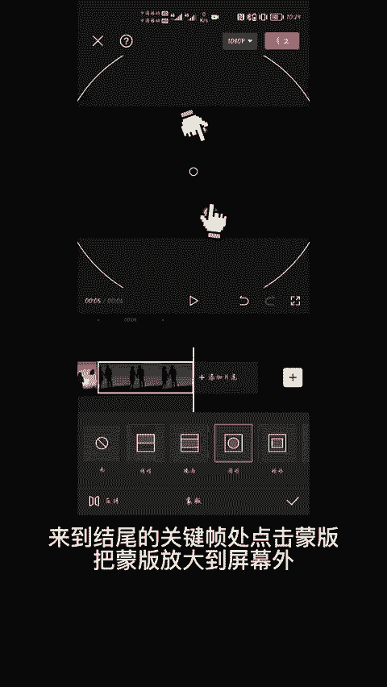
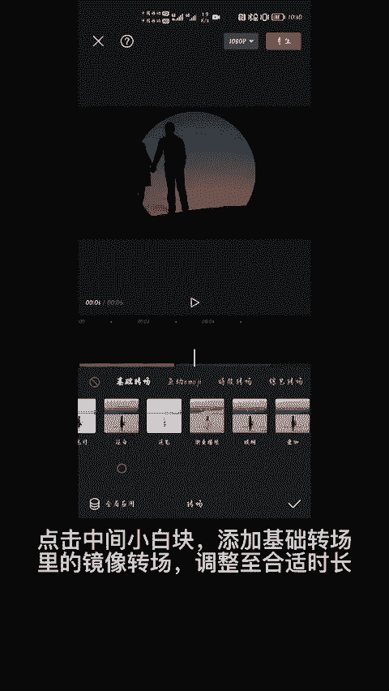
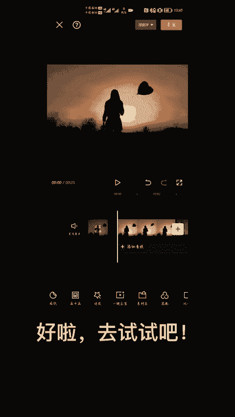

# 2024年全网最干货的小红书运营教程，小红书运营系统课(包含了剪辑／起号／小红书无货源各种玩法）小红书短视频零基础入门到精通，吊打一切付费课！ - P85：22.图像镜像转场 - 红书教程3 - BV1h1yNYXEvT

🎼教你用圆形蒙板制作镜面翻转转场，教程详细，一看就会打开剪映。

🎼导入一段视频后，选中视频，点击蒙版，圆形蒙版双指放大到合适大小，在视频中间打关键帧，来到结尾位置，再打一个关键帧，来到0秒处点击蒙版，把蒙版放大到屏幕外，此处关键帧自动生成，接着点击复制。

🎼点击替换替换成另一段视频。

🎼在第二段视频开头点击关键帧，取消关键帧。

🎼来到结尾的关键帧处，点击蒙版，把蒙版放大到屏幕外，点击中间小白块添加基础转场里的镜像转场，调整至合是时长。

🎼好了，去试试吧。