# 2024年全网最干货的新媒体运营教程，自媒体运营系统课(包含了剪辑／起号／短剧推广／今日头条各种玩法）抖音短视频零基础入门到精通，吊打一切付费课！ - P10：1如何被用户记住 - 瓷器中的一员 - BV1yB2zYVEr1

好啦，那么接着我们再往下讲下一遍啊，就是我的账户搭建出来了啊，我的商业定位，我的内容定位已经定了。哎，可是我要怎么才能让我的用户记住我呢？😊，有同学说，老师，我的这个行业竞争实在太大了。

就像刚才我们看到的那个贺鸣酒，他是一个唱歌的，他歌唱的也不错，他的作品完成的也很用心，可是他不涨粉丝啊。那我要去做的话，我怎么才能让我的用户记住我爱上我，关注我，对不对？

那这个呢就涉及到我们的超级符号了。那关于超级符号这块呢，给大家看几个案例。好了，这个木云医生呢，他是一个风湿病科感染的感染科的一个主任。然后我们可以看一下他的一个作品。

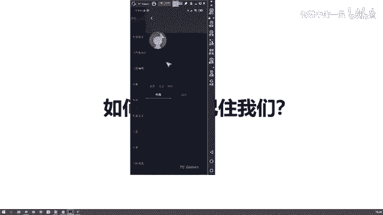

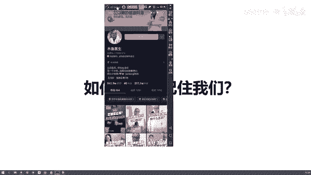

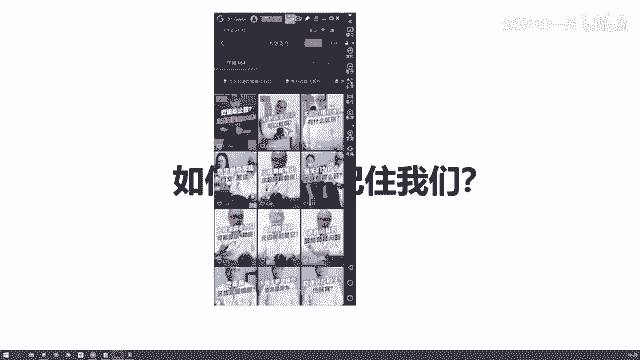

好了，大家应该能看得清楚吧。😊，🎼不可以抠肚脐眼，大部分人的肚脐都有所谓的利益不破，不要用力的用手抠啊，因为肚脐很脆弱，你抠的时候一不小心太用力了就可能抠破，导致感染，严重的会导致呼膜炎。😡。

🎼那怎么办呢？清洁肚脐的正确方法是用棉签脏一点点沐月月水的稀湿物，轻轻的擦拭。🎼用手扣过肚脐的点赞区集合。😊，好，我们再来看另一个。😊，买对。🎼还是便宜的药桶，维生素C2块钱长这样，90万块钱长这样。

🎼块钱的吃药保存只好，98块钱的是食准治好，两种厨具生素一加食物香精，这些鱼健康它能食品添加剂效果并没有差别，多出来的96万，是你的智商被受碎了。么店员推荐98块钱，至于2块钱的。那什么一论题啊。

什么时候你开始没生气？我们现在也是。🎼总，如果你的手不缺。🎼都是一种犯罪，甚至就会造成。🎼并会有求。🎼呼吸会有加大对胃的刺激，而且长期过量维吃维生素品还会导致一些疾病。がいい。

🎼我们视品中莫含维生素如猕猴桃、橙子有这闲钱去买点水果吧。买对。好了，我们就看这个木鱼医生的两个作品啊。那么我们会发现他在这个呃就是讲知识的过程中，他有一个习惯性的动作，或者是一个标志性的动作是什么？

就是他的手里有一个木鱼。😊。

你看。他的手里会有一个木鱼，然后他每次在说完一段话的时候呢，会用手敲一下木鱼，然后呢才开始说话。而且配的这个音效里面呢也有这个敲木鱼的声音，非常大声，我们都能听到，对不对？那么这个的话呢。

我们叫做啊超级符号，我们叫做木鱼医生的一个超级符号，就是敲木鱼的动作，敲木鱼的动作是什么？是一个行为，对不对？是一个行为的超级符号。也就是说他这个行为呢？只是木鱼医生标志性的动作。

而我们啊当我们看不到它的时候啊，如果说听到了这样的一个敲木鱼的声音，我们会在脑海里想，哎，我在哪看过这个事情，我在哪看过这个视频。哎，好像是一个叫做木鱼医生的，对不对。😊，他通过这样的一个行为。

让我们把它记住了。😡，甚至把这个行为跟木鱼医生就完全的结合在一起了。只要听到这样的声音，我们就会想到哎，对，这个就是木鱼医生他一个标志性的行为动作，对不对啊？那么接下来我们再看一个比较典型的案例。😊。

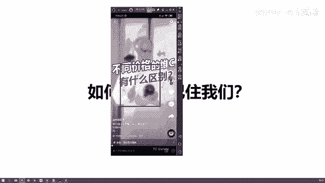

我们看李佳琪。😊。

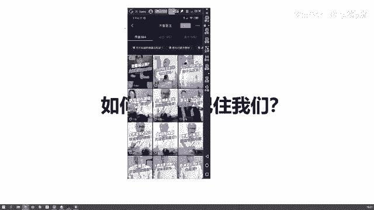

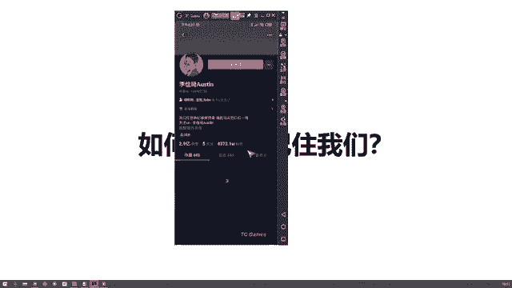

今平。

我要召唤我。😡，每晚8点15分。

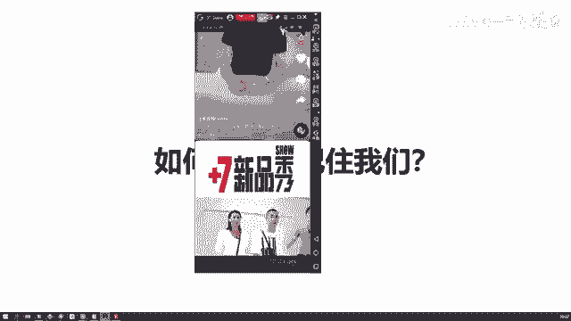

あ。找他比较典型的作品啊。哎，这个。

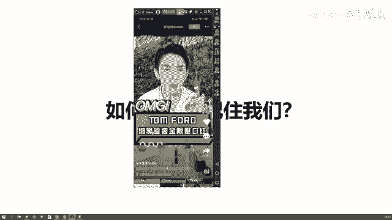

适量吧。

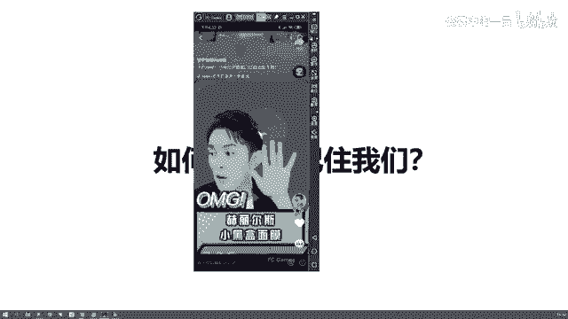

🎼美们加。就是夏天大家都很喜欢。😡。

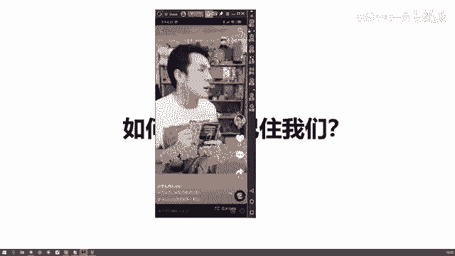

哎，李佳琪说oh my god视频去哪里了？😡。

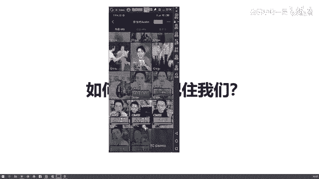

听清楚了，放。😡，🎼来所有女生oly选。😡。

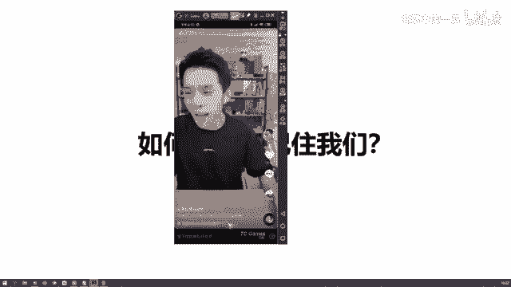

你们准备好了没有？来美眉做的是白雪。

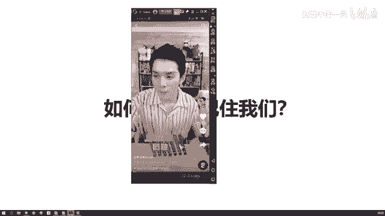

他来了他来了他来了，来，我找不到他的这个作品了哈，我找不到他的作品了。但是我们刚开始去认识李佳琦的时候，他一个标志性的话啊，不用我说，大家都知道是什么oh my god，对不对啊？oh my god。

然后什么他来了，他带着什么什么低价走来了，是不是他通过这样的一个oh my god，然后他去吸引到了这些女生。那包括说可能有些男生啊，他不太买口红，他可能不太认识李佳琪这个人。😊。

但是呢哎他可能在跟别人介绍的时候，说，哎，那个谁谁谁在直播呢？哎，到底是谁呀？就是那个经常说oh my god的那个人啊，是不是我们经常会用这种方式去想起哎，我们曾经有过印象的那个人。

包括说你在上学的时候，哎，隔壁班的那个谁下课的时候啊，呃就是碰了我一下，然后你同学问是谁呀？哎，我想不起来了，就是那个胖子对不对？那这个胖子其实也是属于一个什么呀？我们的超级符号胖嘛，对不对？

他是一个看起来视觉效果，那这个oh my god呢，他就是一个呃就是叫什么理念啊，或者说说出来的，叫做话啊，对不对？话语。😊，那刚才的木语呢叫做行为，对不对？那可能还有就是什么视觉上的啊。

比如说他经常戴帽子，对不对？啊，呃我们就是再举个例子，就是我们还是同学哎，说隔壁班那个谁谁谁，他总是戴着一个帽子。哎，他叫什么了，哎，我忘了他叫什么，他经常戴那个样子的帽子，你忘记了吗？哦，我想起来了。

好像就是那个人，但他叫什么，你其实不知道你记住的是他经常戴帽子的这个行为，对不对？记住的是你看到的那个视觉效果。😊，对吧所以我们把这些东西无论是视觉上的，我们是听觉上的。就像蔡老师这样说OK不对，好的。

不，是不是或者是宝贝，这个也是我经常会说的话。可能你们想起来啊，宝贝或者okK不，然后你就能想起来我，对吧？😊，这个是我们经常说的超级符号，而这个超级符号的存在啊，它就是为了能够让别人快速的记住我们。

比如说最开始的时候嗯，那个李李雪琴大家都知道吧啊，李雪琴经常在在录视频的时候，第一句话说的是啊，大家好，我是李雪琴啊，就是马云，你好，我是李雪琴啊，是不是王思聪，你好，我是李雪琴，这是他的一个什么呀。

就是标志性的话啊，包括说还有谁。😊。

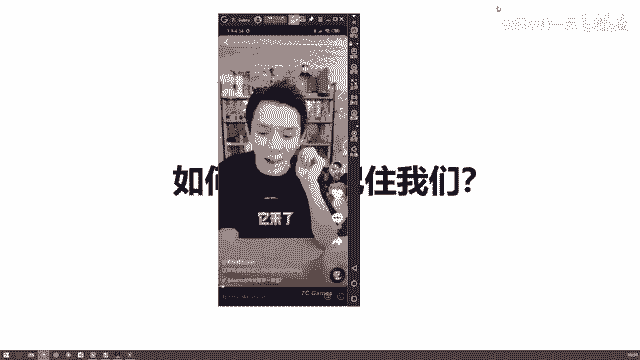

