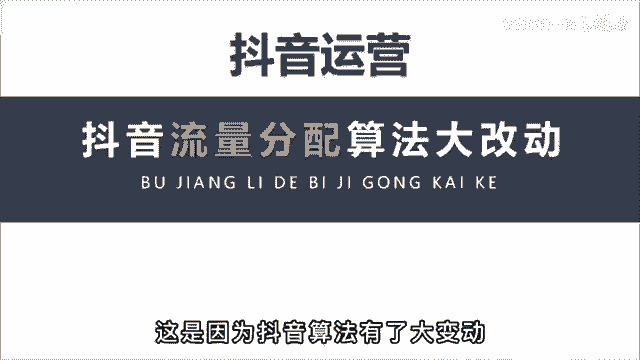
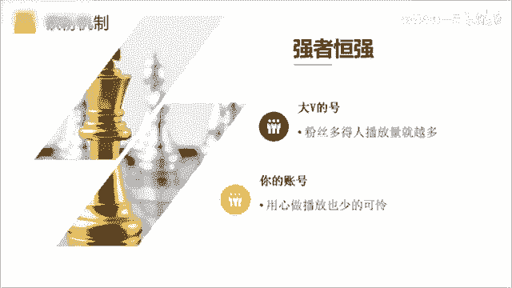
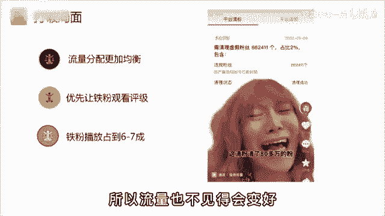

# 2024年全网最干货的新媒体运营教程，自媒体运营系统课(包含了剪辑／起号／短剧推广／今日头条各种玩法）抖音短视频零基础入门到精通，吊打一切付费课！ - P13：4抖音新的流量推送机制 - 瓷器中的一员 - BV1yB2zYVEr1

🎼最近你是不是流量不太好，这是因为啊抖音的算法有了大的变动，很多账号的流量都有严重的下滑。知名网红毛毛姐一夜掉粉80万。😡。

🎼不过呢这对小博主来说，却是一次弯道超车的好机会。看到视频最后啊，一定会对你有所帮助。🎼那造成这个现象的主要原因是因为抖音的算法形增了一个铁粉机制。🎼所谓铁粉，就是长期支持你的粉丝。

🎼债钱我们只能看到粉丝的总数，这就导致强者恒强。粉丝多的人播放量就越多，哪怕就是拍一段毫无意义的吃水果，也会被吸引走几十上百万的流量。

🎼这对普通人来说啊，就是一种不公平。🎼对平台来说你是不健康的。

🎼所以呢这个铁粉系统就会从一定程度上打破这种局面，让流量的分配更加均衡，让真心做好内容的你能获得更多的流量途径。🎼无论大号呢是有几百万的粉丝，在作品发布的初期，都会优先让他的铁粉观看评级。

🎼只有过了铁粉追关后，才会进行大范围的推荐。🎼一般呢10万播放以内啊，铁粉播放要占到6到7成的比例。🎼比如呢我是做运音教学的，我发现最近流量不太好，也去发些炫富博眼球的话题。😡，🎼老粉看到呢就会不乐意。

觉得我这个干货博主初现变了，所以流量呢也不见得会变好。😊。

🎼然后再说一下为什么对中小博主来说是次机会。🎼首先呀你要明白一个基本的概念，每一个行业赛道粉丝的体量是不一样的。你做娱乐号粉丝到1000万都有可能。🎼带你做技能培训，比如开挖掘机。

最多啊就是10万的体量。🎼原因呢有以下两点，第一是学习枯燥。🎼看短视频啊主要还是以消遣为主。第二呢是学挖掘机的人本来就少。所以呢当你看到一些。

