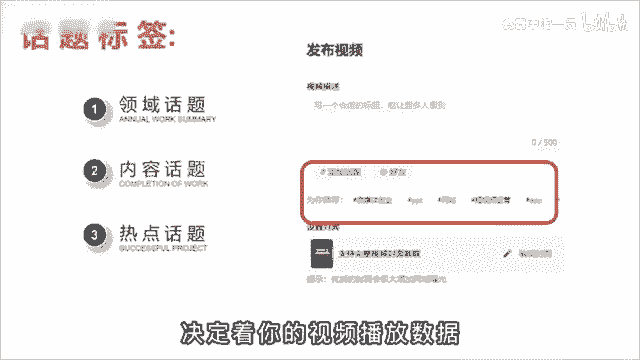
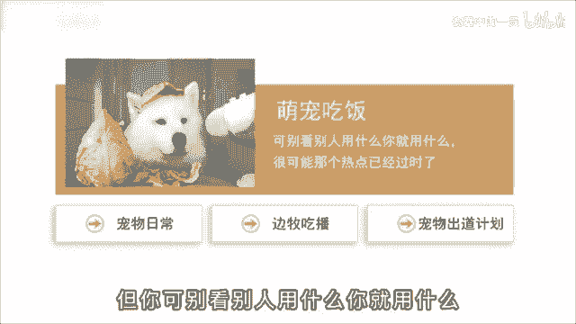
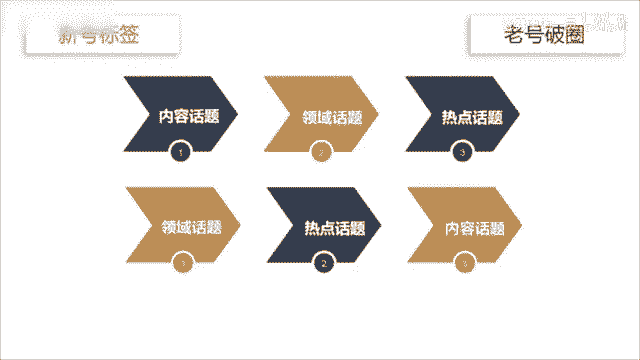

# 2024年全网最干货的新媒体运营教程，自媒体运营系统课(包含了剪辑／起号／短剧推广／今日头条各种玩法）抖音短视频零基础入门到精通，吊打一切付费课！ - P15：6话题标签引流技巧 - 瓷器中的一员 - BV1yB2zYVEr1

🎼话题选不好，流量少一半，很多人啊觉得话题这个功能鸡累没啥用，不重视。但我劝你啊，可别小看这个功能。这其中呢隐藏着大大的心机，用好了，能够帮助信号，快速完成的启动。

因为添加一个合适的话题能够帮你带来更多的曝光机会和精准流量。一般来说啊，话题分为三类。领域话题、内容话题和热点话题。😊。

🎼领域话题用来覆盖行业大类内容话题，细分识别人群热点话题就是蹭流量的。🎼话题选择的优先级与正确与否决定了你的视频播放数据。

🎼举个例子来说，你是做萌宠吃播的账号，分别对应的话题啊，就是领域、宠物日常内容、编布吃播、热点、宠物出道计划。🎼这个热点话题啊有可能是时下热点，也有可能呢是平台的流量扶持计划，需要啊你自己去找找。

但是呢你可千万别看别人用什么，你就用什么。

🎼很可能啊那个热点已经过时了。🎼具体方法呢就是登录电脑版的抖音服务中心，选择创作灵感，点击创作素材，再点击热门话题就可以看到了。这里面都是时下热门的话题标签，你可以根据自己的行业来选择。

比如刚才说的萌宠，你就可以选择动植物，排名第一的就是宠物出道计划，然后点击后边的发布视频就可以自动打上该话题。😊，🎼那关于话题标签啊，另外还有两种情况。🎼第一，你是信号题，则内容话题大于理域话题。

大于热点话题。🎼原理呢是让系统快速精准的知道你究竟是干什么的。🎼盲目的蹭热点有可能啊会影响你的标签。🎼第二是老号破圈，则领域话题大于热点话题，大于内容话题。🎼原理呢是老后的流量比较稳定。

需要通破领域的限制、破圈，获得更多的流量推荐。

🎼但是呢就算学会了这个方法，你也不要指望一定能上。

